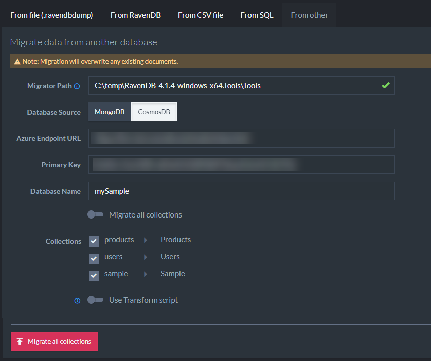

import Admonition from '@theme/Admonition';
import Tabs from '@theme/Tabs';
import TabItem from '@theme/TabItem';
import CodeBlock from '@theme/CodeBlock';
import LanguageSwitcher from "@site/src/components/LanguageSwitcher";
import LanguageContent from "@site/src/components/LanguageContent";

# Import from MongoDB/CosmosDB
<Admonition type="note" title="Note">

* You can import your existing NoSQL Databases to RavenDB.  

* Currently supported:  
   * **MongoDB**  
   * **CosmosDB**  

* You can import all collections, or select specific collections to import.  

* In this page:
  * [Import from MongoDB](../../../studio/database/settings/import-from-other.mdx#import-from-mongodb)  
  * [Import from CosmosDB](../../../studio/database/settings/import-from-other.mdx#import-from-cosmosdb)  
</Admonition>

<Admonition type="info" title="Before you start" id="before-you-start" href="#before-you-start">

To migrate data from your existing NoSQL database, you need to download an external tool called `Raven.Migrator`.  
The application is available at [ravendb.net/downloads](https://ravendb.net/downloads), in the `tools` package.  

</Admonition>
## Import from MongoDB

1. **Migrator Path**  
   * Find `Raven.Migrator.exe` in the tools package here: [ravendb.net/downloads](https://ravendb.net/downloads)  
   * Provide a path to `Raven.Migrator.exe`'s folder.  

2. **Database Source**  
   * Select `MongoDB`  
   
3. **Connection String**  
   * Provide the connection string to your MongoDB instance.  
   
4. **Migrate GridFS** 
   * Choosing this option will import GridFS attachments and save them as documents with attachments in the `@files` collection.  
   
5. **Database Name**
   * Provide the name of the source database.  
   
6. **Migrate all collections**  
   * You can either import all collections or select the collections you'd like to import.  
   * Optionally, you can rename the imported collections.  
   
7. **Use transform script**  
   * Use a JavaScript to filter / modify imported documents.  

## Import from CosmosDB

1. **Migrator Path**  
   * Find `Raven.Migrator.exe` in the tools package here: [ravendb.net/downloads](https://ravendb.net/downloads)  
   * Provide a path to `Raven.Migrator.exe`'s folder.  

2. **Database Source**  
   * Select `CosmosDB`  
   
3. **Azure Endpoint URL**  
   * Provide a URL to CosmosDB database  
   
4. **Primary Key**  
   * Provide the Primary key for CosmosDB  
   
5. **Database Name**  
   * Provide the source database name  
   
6. **Migrate all collections**  
   * You can either import all collections or select the collections you'd like to import.  
   * Optionally, you can rename the imported collections.  
   
7. **Use transform script**  
   * Use a JavaScript to filter / modify imported documents.  

