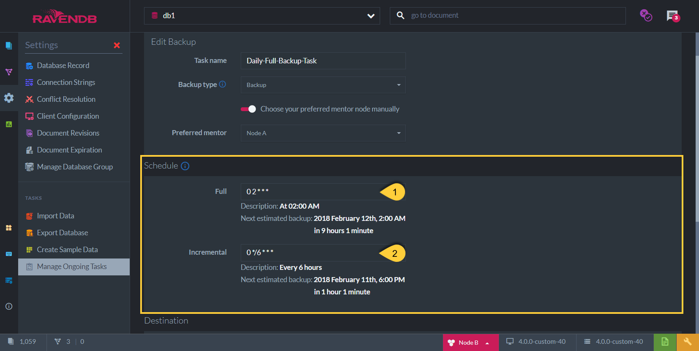
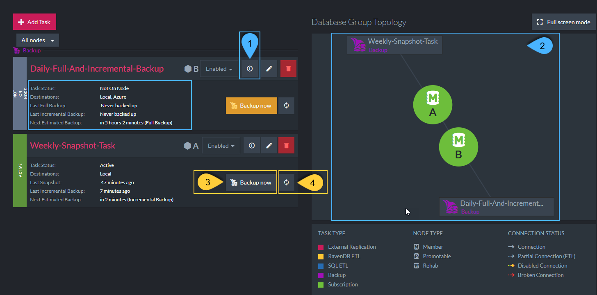

import Admonition from '@theme/Admonition';
import Tabs from '@theme/Tabs';
import TabItem from '@theme/TabItem';
import CodeBlock from '@theme/CodeBlock';
import LanguageSwitcher from "@site/src/components/LanguageSwitcher";
import LanguageContent from "@site/src/components/LanguageContent";

# Backup Task
<Admonition type="note" title="">

* Backups save your data at a specific point in time, and allow you to 
  [restore](../../../../studio/server/databases/create-new-database/from-backup.mdx#create-a-database-from-backup) 
  your database from that point. Learn more in [Backup Overview](../../../../server/ongoing-tasks/backup-overview.mdx).  

* A backup is _not_ equivalent to replicating your data, as explained below in 
  [Backup -vs- Replication](../../../../studio/database/tasks/ongoing-tasks/backup-task.mdx#backup-task--vs--replication-task)  

* Configure the following when creating a Backup Task:
  * **Backup Type** - Select Backup/Snapshot  
  * **Backup Time** - Schedule the task time  
  * **Backup Content** - Select Full/Incremental  
  * **Backup Destination** - Select the backup destination  

* In this page:  
  * [Backup Task - Definition](../../../../studio/database/tasks/ongoing-tasks/backup-task.mdx#backup-task---definition)  
  * [Backup Task - Scheduling](../../../../studio/database/tasks/ongoing-tasks/backup-task.mdx#backup-task---content--scheduling)  
  * [Backup Task - Destination](../../../../studio/database/tasks/ongoing-tasks/backup-task.mdx#backup-task---destination)  
  * [Backup Task - Details in Tasks List View](../../../../studio/database/tasks/ongoing-tasks/backup-task.mdx#backup-task---details-in-tasks-list-view)  
  * [Backup Task - When Cluster or Node are Down](../../../../studio/database/tasks/ongoing-tasks/backup-task.mdx#backup-task---when-cluster-or-node-are-down)  
  * [Backup Task -vs- Replication Task](../../../../studio/database/tasks/ongoing-tasks/backup-task.mdx#backup-task--vs--replication-task)  
</Admonition>
## Backup Task - Definition

1. **Task Name** (Optional)  
   * Choose a name of your choice  
   * If no name is given then RavenDB server will create one for you based on the defined destination  

2. **Backup Task Type**:  
   * ***Backup***  
     * Backed Up Data: The database data in a JSON format, including documents, indexes (definitions only) & [identities](../../../../server/kb/document-identifier-generation.mdx#identity)  
       (same as exported database format)  
     * Size of backup data: Smaller  
     * Backup Speed: Faster  
     * Restoring: Slower, Indexes have to be rebuilt from their definitions  
   * ***Snapshot***  
     * Backed Up Data: The raw database data including the indexes (definitions and data)
     * Size of backup data: Larger  
     * Backup Speed: Slower  
     * Restoring: Faster, Indexes do not have to be rebuilt  

3. **Preferred Node** (Optional)  
  * Select a preferred mentor node from the [Database Group](../../../../studio/database/settings/manage-database-group.mdx) to be the responsible node for this Backup Task  
  * If no node is selected, then the cluster will assign a responsible node (see [Members Duties](../../../../studio/database/settings/manage-database-group.mdx#database-group-topology---members-duties))  

## Backup Task - Content & Scheduling

* Select the content to back up. Note: Both types can be scheduled.  
  1. **Full Backup**  
     Full Backup will back up _all_ the database data every time the task is scheduled to work.  

  2. **Incremental Backup**  
     Incremental Backup will only back up the delta (changes made) of the data since the last backup that has occurred.  

* Schedule the Backup Task time using a [Cron Expression](http://www.quartz-scheduler.org/documentation/quartz-2.3.0/tutorials/crontrigger.html).  
 (eg. "0 0 12 * * ?" means "0 seconds, 0 minutes, 12pm (noon), every day, every month")  

* Notes:  
  1. If _only_ **Incremental Backup** is set, then a **Full Backup** will occur only in the _first_ time that the Task is triggered,  
     followed by Incremental Backups according to the scheduled time.  
     The Full Backup that is done the first time will be either a 'Backup' or a 'Snapshot', depending on the type selected.  

  2. Data that is backed up in **Incremental Backup** is _always_ of type 'Backup' - even if the Backup Task Type is 'Snapshot'.  
     A Snapshot can only occur when scheduling 'Full'.  

<Admonition type="note" title="Scheduling two backups" id="scheduling-two-backups" href="#scheduling-two-backups">

To **save on transfer costs** you can schedule frequent incremental backups  

To ensure that you can **recover lost data**, schedule infrequent 'full' backups.  
Infrequent backups can be useful if a mistake was made and you need access to data from a few days ago.

</Admonition>

* In the image "Backup Task Schedule & Content" above:  
  * A Full Backup is scheduled every day at 02:00 AM - and in addition to that -  
  * An Incremental Backup is scheduled every 6 hours  

## Backup Task - Destination

* Select backup destinations and enter your credentials for each  

* Note: More than one can be selected  

* Available destinations:  

  * Local - Set a folder of your choice (any directory that can be accessed from your machine)  
  * [Amazon S3](https://aws.amazon.com/s3/)  
  * [Microsoft Azure](https://azure.microsoft.com/en-us/services/storage/)  
  * [Amazon Glacier](https://aws.amazon.com/glacier/)  
  * FTP - Set your FTP protocol & server address  

<Admonition type="note" title="To achieve a robust data protection strategy" id="to-achieve-a-robust-data-protection-strategy" href="#to-achieve-a-robust-data-protection-strategy">
 
 The [3-2-1 rule](https://www.nakivo.com/blog/3-2-1-backup-rule-efficient-data-protection-strategy/) can be implemented by creating a periodic backup onto a cloud storage and another on an onsite machine.

</Admonition>

## Backup Task - Details in Tasks List View

1. **Backup Task Details**:
   *  Task Status - Active / Not Active / Not on Node  
   *  Destinations - List of all backup destinations defined  
   *  Last Full Backup - The last time a Full Backup was done 
      (Snapshot / Backup type - depending on task definition)  
   *  Last Incremental Backup - The last time an Incremental Backup was done  
   *  Next Estimated Backup - Time for next backup 
      (Full Backup / Incremental Backup / Snapshot - depending on task definition)  

2. **Graph view**:  
   View of the Backup Task responsible nodes  

3. **Backup Now**:  
   In addition to the scheduled time defined, you can backup your data now.  
   The scheduled backup will still be triggered as defined.  

4. **Refresh**:  
   Click to refresh this panel viewed details  

## Backup Task - When Cluster or Node is Down

* **When the cluster is down** (and there is no leader):  

  * Creating a _new_ Ongoing Task is a Cluster-Wide operation,  
    thus, a new Ongoing Backup Task ***cannot*** be scheduled.  

  * If a Backup Task was _already_ defined and active when the cluster went down,  
    then the Backup Task will still ***continue to execute*** on its defined schedule (on its responsible node).  
    But, it will fail to be reported to the cluster and may be run again after the cluster has recovered.  

* **When the responsible node is down**  

  * If the responsible node for the Backup Task is down during the scheduled time,  
    then another node from the Database Group will take ownership of the task so that there are no gaps in your backups.  

## Backup Task -vs- Replication Task

* RavenDB's [External Replication](../../../../studio/database/tasks/ongoing-tasks/external-replication-task.mdx) provides you with an off-site live replica/copy of the data 
  ('live' meaning that any changes in the database will be reflected in the replica once they occur).  
  If one database is down, the replica can continue its work, thus greatly improving **availability**.  
  This is also quite useful if you need to:  
    * **Shift operations** to a secondary data center  
    * **Share the workload** across more than one server.  

*  But a replica isn't a backup... It doesn't present good solutions for many **backup scenarios**. For example, backups can:  
    * Protect you from an accidental collection delete  
    * Tell you the state of the system at, say, 9:03 AM last Friday  
    * Protect you from various cyber attacks  

* A backup keeps an exact state of the database at a specific point in time and can be restored.  
  * A new database can be [created from a Backup](../../../../studio/server/databases/create-new-database/from-backup.mdx)  
  * This can be done with both 'Backup' & 'Snapshot' types  

