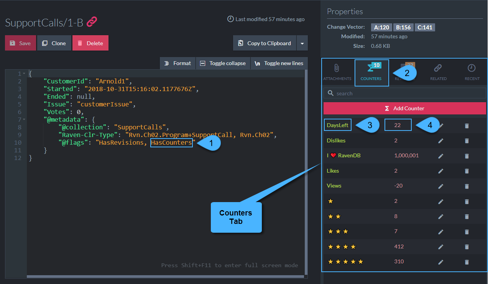

import Admonition from '@theme/Admonition';
import Tabs from '@theme/Tabs';
import TabItem from '@theme/TabItem';
import CodeBlock from '@theme/CodeBlock';
import LanguageSwitcher from "@site/src/components/LanguageSwitcher";
import LanguageContent from "@site/src/components/LanguageContent";

#Counters
<Admonition type="note" title="Note">

* Counters are numeric data variables that can be added to a document.  
  Use a Counter to count anything that needs counting, such as:
   * Products sales  
   * Voting results  
   * Any event related to the document  

* Create and manage Counters using [API methods](../../../../../client-api/session/counters/overview.mdx) or through the Studio.  

* In this page:  
  * [Viewing Counters Data](../../../../../studio/database/documents/document-view/additional-features/counters.mdx#viewing-counters-data)  
  * [Managing Counters](../../../../../studio/database/documents/document-view/additional-features/counters.mdx#managing-counters)  
  * [Counters Export and Import](../../../../../studio/database/documents/document-view/additional-features/counters.mdx#counters-export-and-import)  
</Admonition>
## Viewing Counters Data

**To view counters data, open the document they belong to.**

**1.** Choose a database from the databases list:  
<Admonition type="note" title="Note">

</Admonition>

**2.** The Counters Flag indicates which documents currently have counters.  
<Admonition type="note" title="Note">

</Admonition>

**3.** Open a document.  
<Admonition type="note" title="Note">

</Admonition>

**4.** Counters' details are located in the Counters Tab.  
<Admonition type="note" title="Note">
####    

1. `HasCounters` **Flag**  
    This flag in the document's metadata, is **automatically** set or removed by the server,  
    indicating whether a document has Counters.  
2. **Counters-Tab Header**  
   Click the header to open the Counters tab.  
   The current number of Counters is stated on the header.  
3. **Counter Name**  
   You can use whatever characters you choose, including Unicode symbols.  
4. **Counter Value**  
</Admonition>

## Managing Counters

<Admonition type="note" title="Note">

**Add, Modify or Remove Counters from the Counters Tab.**

</Admonition>

<Admonition type="note" title="1. Click Add Counter to create a new Counter." id="1-click-add-counter-to-create-a-new-counter" href="#1-click-add-counter-to-create-a-new-counter">

  
</Admonition>

<Admonition type="note" title="2. Click the Edit icon to modify a Counter's value." id="2-click-the-edit-icon-to-modify-a-counter-s-value" href="#2-click-the-edit-icon-to-modify-a-counter-s-value">

  

* 
  **A.** Counter's name - Note: Once set, the name cannot be modified.  
  **B.** Current value - The **accumulated value from all nodes**.  
  **C.** Enter a new value here. This value is the acculated value, see note below.  
  **D.** Confirm to carry out the update or Cancel.  
  **E.** The Counter's value **per cluster node**.  
  **F.** The node's e-tag.  

* **Note**:  
  Modifying a Counter's value sets its **accumulated value**.  
  For example, in the above image, the Counter's value is 348 in Node A, 310 in node B, and (-25) in node C,  
  making its accumulated value **633**.  
  Setting the new value to 700 from node A, will change its **accumulated value** to 700 by setting its value in node A to **415**.  

* A Counter value can be negative.  

</Admonition>

<Admonition type="note" title="3. Click the Delete icon to remove a counter." id="3-click-the-delete-icon-to-remove-a-counter" href="#3-click-the-delete-icon-to-remove-a-counter">

</Admonition>

## Counters Export and Import

You can **Export** selected components, including Counters, into a file, 
and **Import** them into your database when required.  

<Admonition type="note" title="Note">

**Export Database with Counters.**

* 
  **1.** Click the Settings gear.  
  **2.** Click Export Database.  
  **3.** Use the default name or enter your own.  
  **4.** Select the components you wish to export. Make sure Counters are included.  
  **5.** Click to export the database.  

</Admonition>

<Admonition type="note" title="Note">

**Import Database with Counters.**

* 
  **1.** Click the Settings gear.  
  **2.** Click Import Data.  
  **3.** Select a file you wish to import from, or another source.  
  **4.** Select the components you wish to import. Make sure Counters are included.  
  **5.** Click to import the database.  

&gt; Remember that Counters are **not** independent entities. You can import a Counter with its document, or into an existing document.  
&gt; 
&gt; E.g. to import the Counters of a document named "products/1-C":  
&gt;  
&gt;* Check "Include Documents" **and** "Include Counters".  
&gt;  This will import documents along with their Counters.  
&gt;* Check "Include Counters" but **not** "Include Documents".  
&gt;  Verify that a document named **products/1-C** already exists in your database.  
&gt;  The Counters will be imported into products/1-C.  

</Admonition>

