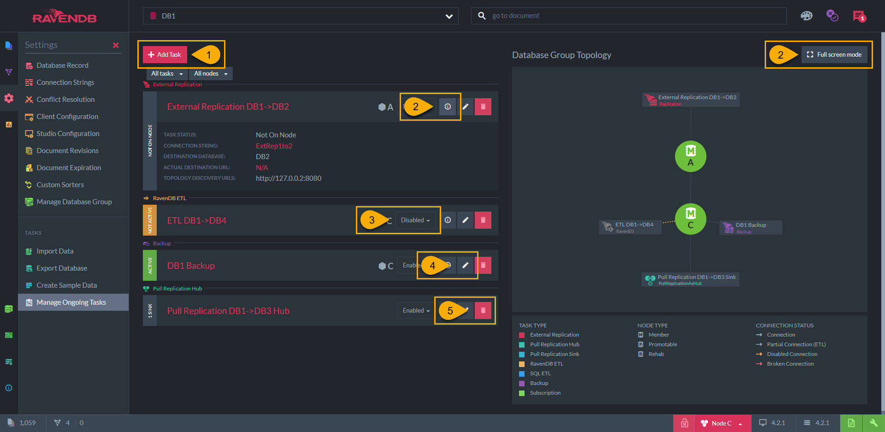

import Admonition from '@theme/Admonition';
import Tabs from '@theme/Tabs';
import TabItem from '@theme/TabItem';
import CodeBlock from '@theme/CodeBlock';
import LanguageSwitcher from "@site/src/components/LanguageSwitcher";
import LanguageContent from "@site/src/components/LanguageContent";

# Ongoing Tasks - General Info
<Admonition type="note" title="Note">

* Ongoing tasks are ***work tasks*** defined for the database.  
* Once defined, these tasks are ***ongoing***, meaning that they will do the defined work for any data change in the database.  
* Each task has a responsible node from the Database Group nodes, this node will actually perform the defined task work.  
* The available ongoing tasks are:  
  * [External Replication](../../../../studio/database/tasks/ongoing-tasks/external-replication-task.mdx)  
      * Create a live copy of one database in another RavenDB database
      * This replication is initiated by a node in the *source* database group
  * [Pull Replication](../../../../studio/database/tasks/ongoing-tasks/pull-replication.mdx)
      * Create a live copy of one database in another RavenDB database
      * This replication is initiated by a node in the *destination* database group
  * [RavenDB ETL](../../../../studio/database/tasks/ongoing-tasks/ravendb-etl-task.mdx)  
      * Write all database documents, or just part of it, to another RavenDB database  
      * Data can be filtered and modified with transformation scripts  
  * [SQL ETL](../../../../server/ongoing-tasks/etl/sql.mdx)  
      * Write the database data to a relational database  
      * Data can be mutated with transformation scripts  
  * [Backup](../../../../studio/database/tasks/ongoing-tasks/backup-task.mdx)  
      * Schedule a backup or a snapshot of the database at a specified point in time  
  * [Subscription](../../../../client-api/data-subscriptions/what-are-data-subscriptions.mdx)  
      * Sending batches of documents that match a pre-defined query for processing on a client  
      * Data can be mutated with transformation scripts  

* In this page:  
  * [Ongoing Tasks - View](../../../../studio/database/tasks/ongoing-tasks/general-info.mdx#ongoing-tasks---view)  
  * [Ongoing Tasks - Actions](../../../../studio/database/tasks/ongoing-tasks/general-info.mdx#ongoing-tasks---actions)  
  * [Ongoing Tasks - Add New Task](../../../../studio/database/tasks/ongoing-tasks/general-info.mdx#ongoing-tasks---add-new-task)  
</Admonition>
## Ongoing Tasks - View

1. The list of the current tasks on the database  

2. Task name & state:  
   * _Active_ - Task is active and will do its job when there is a change to the database  
   * _Not-Active_ - Task is defined but has been disabled  
   * _Not on Node_ - The node in the currently viewed tab is not responsible for performing the task  
   * _Reconnect_ - Destination is unavailable, the task is active and trying to reconnect  

3. The node that is currently responsible for doing the task  
  * If not specified by the user, the cluster decides which node will actually be responsible for the task
  * If a node is down, the cluster will reassign the work to another node for the duration  

4. Tasks graph view  

## Ongoing Tasks - Actions

1. **Add Task** - Create a new task for the database - see below  
2. **Details** - Click for a short task details summary in this view  
3. **Enable / Disable** the task  
4. **Edit** - Click to edit the task  
5. **Delete** the task  
6. **Full screen** - Click to see the graph in a full-screen mode  

## Ongoing Tasks - Add New Task

* Select the preferred task to add  
  1. Adding an [Extrenal Replication](../../../../studio/database/tasks/ongoing-tasks/external-replication-task.mdx) task  
  2. Adding a [Pull Replication](../../../../studio/database/tasks/ongoing-tasks/pull-replication.mdx) task  
  3. Adding a [RavenDB ETL](../../../../studio/database/tasks/ongoing-tasks/ravendb-etl-task.mdx) task  
  4. Adding an [SQL ETL](../../../../server/ongoing-tasks/etl/sql.mdx) task  
  5. Adding a [Backup](../../../../studio/database/tasks/ongoing-tasks/backup-task.mdx) task  
  6. Adding a Subscription task  

* Once the task is defined and saved, it will be written to the [Database Record](../../../../studio/database/settings/database-record.mdx)  

* The cluster will decide which node will actually be responsible for doing the task - see [Members Duties](../../../../studio/database/settings/manage-database-group.mdx#database-group-topology---members-duties)  

