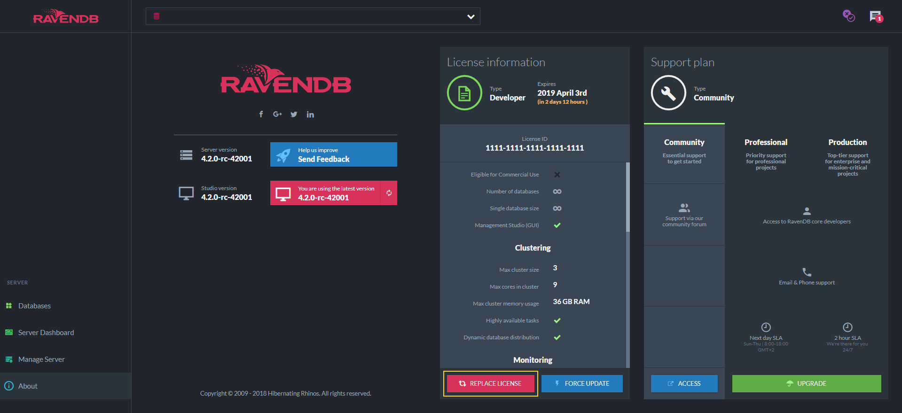

import Admonition from '@theme/Admonition';
import Tabs from '@theme/Tabs';
import TabItem from '@theme/TabItem';
import CodeBlock from '@theme/CodeBlock';
import LanguageSwitcher from "@site/src/components/LanguageSwitcher";
import LanguageContent from "@site/src/components/LanguageContent";

# License Management
## Register License 
In order to register an instance of RavenDB with a license, you can: 

- Navigate to _About_ page in studio, click _Replace License_ button, copy your license and click submit.
- Use the following [configuration](../../server/configuration/license-configuration.mdx) options:
    * **License**  
      The full license string for RavenDB. If License is specified, it overrides the `License.Path` configuration.

    * **License.Path**  
      Path (either **full** or **relative to the server folder**) to the license file.  
      Default: `license.json` in the **server** folder.  
      E.g. - "License.Path": "D:\\RavenDB\\Server\\license.json"  
      E.g. - "License.Path": "License\\license.json"  

<Admonition type="note" title="">

* Each instance of RavenDB has to be registered with a license.  
* A development license isn't applicable for commercial use.  

</Admonition>

## Replace License 

To replace license, same as before ,click _REPLACE LICENSE_ and submit a new one.

## Force Update 

In order to fetch the latest license information, click _FORCE UPDATE_.

<Admonition type="note" title="">
License information being update automatically.  _FORCE UPDATE_ does not stop this operation.
</Admonition>

