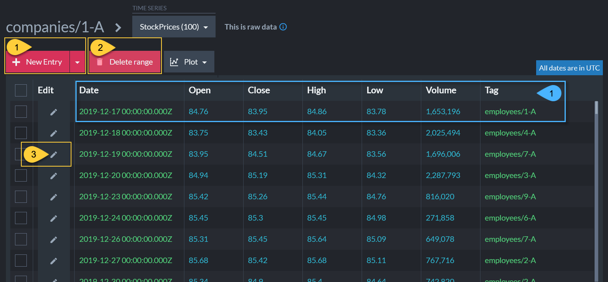
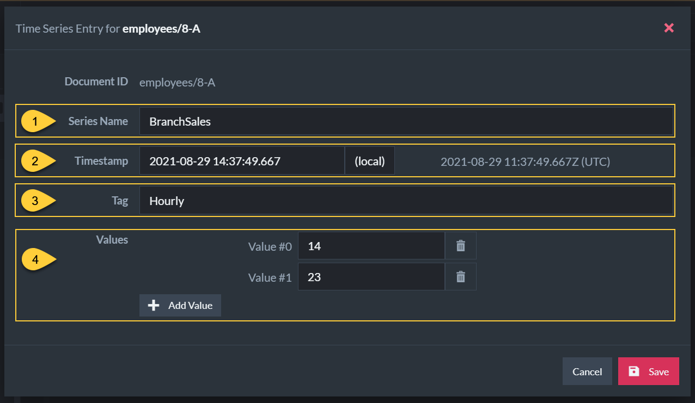

import Admonition from '@theme/Admonition';
import Tabs from '@theme/Tabs';
import TabItem from '@theme/TabItem';
import CodeBlock from '@theme/CodeBlock';
import LanguageSwitcher from "@site/src/components/LanguageSwitcher";
import LanguageContent from "@site/src/components/LanguageContent";

# Time Series
<Admonition type="note" title="">

* Time series are sets of numeric data, associated with timestamps and ordered by time.  
* The studio interface allows you to edit, query and index time series data, as well as 
  view it as a list of entries or as a graph.  

* In this page:
  * [Document View](../../../studio/database/document-extensions/time-series.mdx#document-view)
  * [Time Series View](../../../studio/database/document-extensions/time-series.mdx#time-series-view)
     * [Create new Time Series (by Creating the First Entry)](../../../studio/database/document-extensions/time-series.mdx#create-new-time-series-by-creating-the-first-entry)
     * [Editing an Entry](../../../studio/database/document-extensions/time-series.mdx#editing-an-entry)
     * [Deleting a Range of Entries](../../../studio/database/document-extensions/time-series.mdx#deleting-a-range-of-entries)
  * [Querying Time Series](../../../studio/database/document-extensions/time-series.mdx#querying-time-series)
     * [Results in Graph View](../../../studio/database/document-extensions/time-series.mdx#results-in-graph-view)

</Admonition>
## Document View

<Admonition type="warning" title="Actions" id="actions" href="#actions">

1. To view a document's time series, open its [document view](../../../studio/database/documents/document-view.mdx) 
   and click the time series tab on the right.  
2. Click to create a new time series, [see more below](../../../studio/database/document-extensions/time-series.mdx#create-new-time-series-by-creating-the-first-entry).  
3. Click to view and modify time series data.  

</Admonition>

<Admonition type="info" title="Info" id="info" href="#info">

1. Displays the time series':  
   * Name  
   * The number of entries it contains  
   * The range of time from the first to the last entry in the time series

</Admonition>  

## Time Series View

<Admonition type="warning" title="Actions" id="actions" href="#actions">

1. Click to add a new entry to this time series (StockPrices), or click the dropdown to create a [new time series](../../../studio/database/document-extensions/time-series.mdx#create-new-time-series-by-creating-the-first-entry).  
2. Delete all entries from a specified time range.  
3. Edit entry.

</Admonition>

<Admonition type="info" title="Info" id="info" href="#info">

1. Displays time series entries' data, including -  
    * Timestamp  
    * Numerical data (1-32 `double` values)  
    * Optional tag `string`  

</Admonition>  
### Create new Time Series (by Creating the First Entry)

* A time series is created upon the creation of its first entry (and deleted 
  once all entries have been deleted).  

* Click the **Add Time Series** button from the 
  [Document View](../../../studio/database/document-extensions/time-series.mdx#document-view) 
  to create the time series' first entry.  

<Admonition type="warning" title="">

1. Enter time series' name.  
2. Select a [timestamp](../../../document-extensions/timeseries/overview.mdx#timestamps) for the new entry.  
3. Create an optional [tag](../../../document-extensions/timeseries/overview.mdx#tags).  
4. Add one or more numerical [values](../../../document-extensions/timeseries/overview.mdx#values) (up to 32 values).  
   
   Time series entry values can be given meaningful names rather than labels like Value #0 and Value #1.  
   To set entry values' names, use Studio's [Time Series Settings View](../../../studio/database/settings/time-series-settings.mdx#add-or-edit-time-series-configuration).  

</Admonition>
### Editing an Entry

* Click the **Edit Item** button from the 
  [Time Series View](../../../studio/database/document-extensions/time-series.mdx#time-series-view) 
  to edit a time series' entry.  

<Admonition type="warning" title="">

1. Edit the optional tag.  
2. Edit a numerical value.  
3. Delete value.  
4. Add an additional value (up to 32 values).  

</Admonition>
### Deleting a Range of Entries

* Click the **Delete Range** button from the 
  [Time Series View](../../../studio/database/document-extensions/time-series.mdx#time-series-view) 
  to delete a range of time series entries.  

<Admonition type="warning" title="">

To specify a range of time series entries:  

1. **Start Date**  
   Check **Use minimum** to use the first entry's timestamp as the start of the range,  
2. **End Date**  
   Check **Use maximum** to use the last entry's timestamp as the end of the range.  
* For either option, you can click the input bar and specify some other date in the 
  date & time dialog shown below.  

</Admonition>

## Querying Time Series

<Admonition type="warning" title="Actions" id="actions" href="#actions">

1. Enter your RQL query in the query box.  
   Depicted here is a query to get all the **StockPrices** time series values from documents in the Companies collection.  
   Learn more about time series queries [here](../../../document-extensions/timeseries/querying/overview-and-syntax.mdx).  

2. Click to run the query.  

</Admonition>

<Admonition type="info" title="Info" id="info" href="#info">

1. Query Results - A list of time series that satisfy the query, with:  
    * The ID of the associated document.  
    * Number of entries and time range.  

</Admonition>  

<Admonition type="warning" title="">

1. Click to open a tab with the time series query results shown in a table.  
   
2. Click to open a tab with the time series query results shown in a graph (see below).  
3. Multiple documents selection  
   
    * a. Select multiple documents to plot their time series.  
    * b. Click to view the selected documents' time series results in a unified graph.  
      

</Admonition>
### Results in Graph View

<Admonition type="info" title="">

1. A graph of time series results in a selected time frame.  
2. A graph showing all the time series results over time.  
3. The selected time frame.  
4. A legend of time series entries' values.  
   The entry values names are set in Studio's **Settings &gt; Time Series** view.  

</Admonition>

<Admonition type="warning" title="">

1. Click to go back to the query results tab.  
2. Display tabs with graph or table results.  
3. Drag or resize the selected time frame to view the corresponding results.  
4. Hover your mouse over the graph to view the data of one particular entry.  
5. Toggle viewing points or a continuous line.  
6. Check/Uncheck to plot or hide time series entries' values on the graph.  

</Admonition>  

