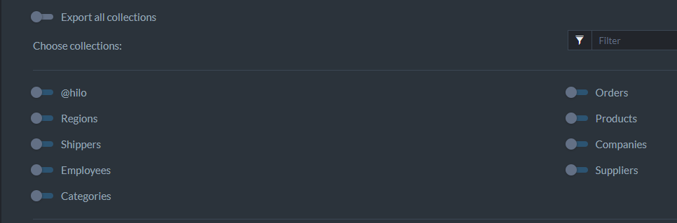
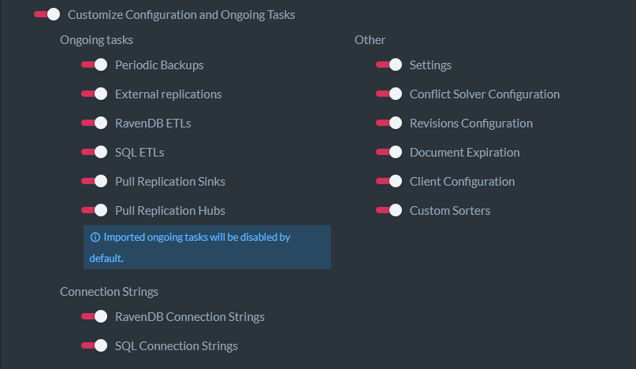

import Admonition from '@theme/Admonition';
import Tabs from '@theme/Tabs';
import TabItem from '@theme/TabItem';
import CodeBlock from '@theme/CodeBlock';
import LanguageSwitcher from "@site/src/components/LanguageSwitcher";
import LanguageContent from "@site/src/components/LanguageContent";

# Export Database to a .ravendbdump file

A `.ravendbdump` file is RavenDB's format for exporting/importing a database, with backward compatibility between RavenDB versions.  
To export a `.ravendbdump` file, we need an existing database. Let's select a database and navigate to `Settings`.  

Select `Export Data` under the `Tasks` submenu.  

## Export options 

Here you can filter the data you want to export, add encryption, select collections and configurations, and apply a transform script on your documents.  

* **Include Documents**:  
  Determines whether to export documents contained in the database.  
  Disabling it automatically disables the exportation of **Attachments** and **Counters** as well.  
    - **Include Attachments**:  
      Determines whether to export attachments contained in the database.  
    - **Include Counters**:  
      Determines whether to export Counters contained in the database.  
    - **Include Revisions**:  
      Determines whether to export Revisions contained in the database.  
    - **Include Conflicts**:  
      Determines whether to export Conflicts contained in the database.  
* **Include Indexes**:  
  Determines whether to export Indexes contained in the database.  
    - **Remove Analyzers**:  
      Determines whether to strip Analyzers used by indexes contained in the file.  
* **Include Identities**:  
  Determines whether to export Identities contained in the database.  
* **Include Compare Exchange**:  
  Determines whether to export Compare Exchange values contained in the database.  
* **Include Subscriptions**:  
  Determines whether to export Subscriptions contained in the database.  
* **Include Configuration and Ongoing Tasks**:  
  Determines whether to export the server's 
  [configuration and ongoing tasks](../../../studio/database/tasks/export-database.mdx#customize-configuration-and-ongoing-tasks).  

#### Encrypt exported file

Used to add an ecryption key when exporting the database to an encrypted file.  

## Advanced export options

### Export all collections

- **Export all collections**:  
  Determines whether to export All database collections.  
    - If _Export all collections_ is disabled, a list of all database collections will be displayed with an option to filter collections by name.  
### Transform Script

- **Use Transform Script**:  
  Enabling it allows you to provide a transform javascript, that would operate on each document contained by the file.  

<TabItem value="javascript" label="javascript">
<CodeBlock language="javascript">
{`var id = doc['@metadata']['@id'];
if (id === 'orders/999')
    throw 'skip'; // filter-out
`}
</CodeBlock>
</TabItem>
### Customize Configuration and Ongoing Tasks

**Ongoing tasks**:  

- **Periodic Backups**:  
  Determines whether to export Periodic Backup tasks configuration.  
- **External replications**:  
  Determines whether to export External replications tasks configuration.  
- **RavenDB ETLs**:  
  Determines whether to export RavenDB ETLs tasks configuration.  
- **SQL ETLs**:  
  Determines whether to export SQL ETLs tasks configuration.  
- **Pull Replication Sinks**:  
  Determines whether to export Pull Replication Sink tasks configuration.  
- **Pull Replication Hubs**:  
  Determines whether to export Pull Replication Hub tasks configuration.  

**Other:**

- **Settings**:  
  Determines whether to export Settings.  
- **Conflict Solver Configuration**:  
  Determines whether to export Conflict Solver Configuration.  
- **Revisions Configuration**:  
  Determines whether to export Revisions Configuration.  
- **Document Expiration**:  
  Determines whether to export Document Expiration settings.  
- **Client Configuration**:  
  Determines whether to export Client Configuration.  
- **Custom Sorters**:  
  Determines whether to include Custom Sorters.  
- **Connection Strings**:  
   - **RavenDB Connection Strings** - Determines whether to export RavenDB Connection Strings.  
   - **SQL Connection Strings:** Determines whether to export SQL Connection String values.  
### Copy command as PowerShell

- Generates the commands to run the exporting logic from PowerShell.  
