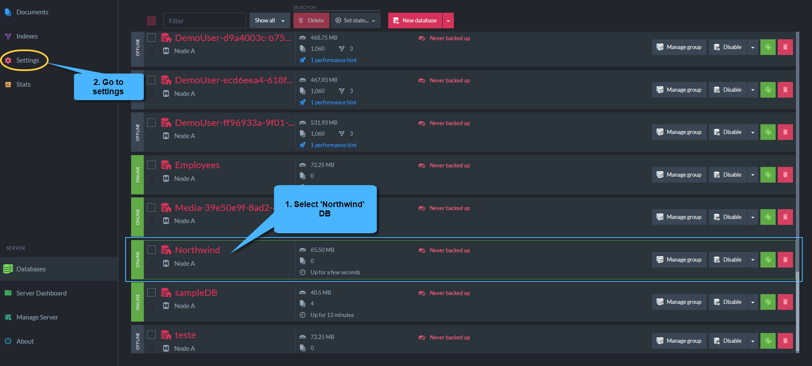
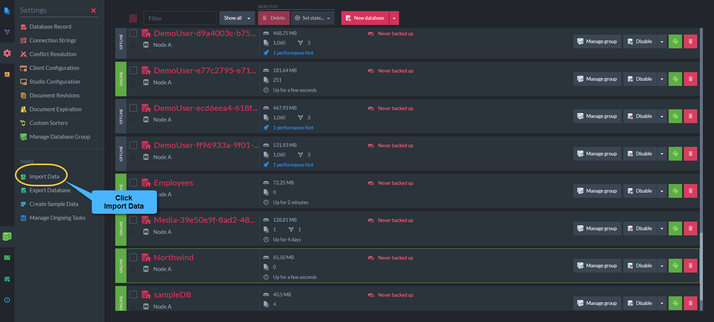
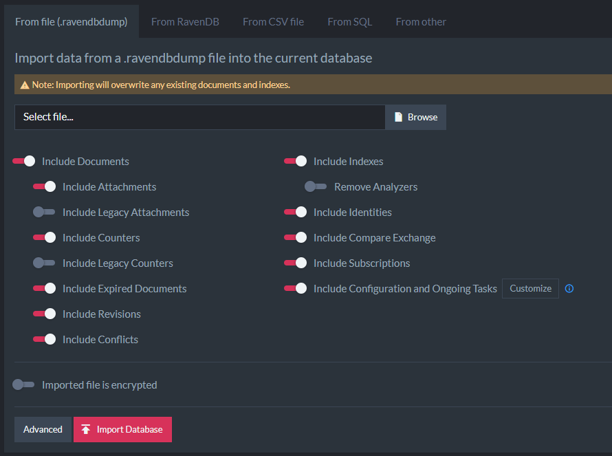
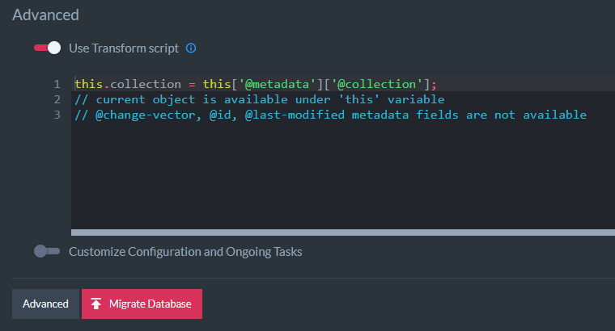

import Admonition from '@theme/Admonition';
import Tabs from '@theme/Tabs';
import TabItem from '@theme/TabItem';
import CodeBlock from '@theme/CodeBlock';
import LanguageSwitcher from "@site/src/components/LanguageSwitcher";
import LanguageContent from "@site/src/components/LanguageContent";

# Import data from .ravendbdump file

A .ravendbdump file is RavenDB format for exporting a database and it is backward compatible between RavenDB versions.  
In order to import a `.ravendbdump` we need an existing database, lets create `Northwind` database and select `Setting`.

Select `Import Data` under `Tasks` submenu.

## Import options 

Here you can filter the data you want to import, select configuration and apply a transform script on your documents.

- **Include Documents:** Determines whether or not documents contained in the file should be imported or not, if disabled attachments and counters will automatically be disabled too. 
    - **Include Attachments:** Determines whether or not attachments contained in the file should be imported. 
    - **Include Legacy Attachments:** Determines whether or not legacy attachments contained in the file should be imported where legacy attachments refers to v2.x and v3.x attachments. 
    - **Include Counters:** Determines whether or not Counters contained in the file should be imported. 
    - **Include Legacy Counters:** Determines whether or not Legacy Counters contained in the file should be imported. 
    - **Include Expired Documents:** Determines whether or not Expired Documents contained in the file should be imported. 
    - **Include Revisions:** Determines whether or not Revisions contained in the file should be imported.
    - **Include Conflicts:** Determines whether or not Conflicts contained in the file should be imported.
- **Include Indexes:** Determines whether or not Indexes contained in the file should be imported. 
    - **Remove Analyzers:** Determines whether or not Analyzers used by indexes contained in the file should be stripted or not. 
- **Include Identities:** Determines whether or not Identities contained in the file should be imported.
- **Include Compare Exchange:** Determines whether or not Compare Exchange values contained in the file should be imported.
- **Include Subscriptions:** Determines whether or not Subscriptions contained in the file should be imported.
- **Include Configuration and OngoingTasks:** Determines whether or not 
  [server configurations and ongoing tasks](../../../../studio/database/tasks/import-data/import-data-file.mdx#customize-configuration-and-ongoing-tasks) 
  should be imported.  
<Admonition type="note" title="Importing item that doesn't exist" id="importing-item-that-doesn-t-exist" href="#importing-item-that-doesn-t-exist">
If any of the options is set but the other database doesn't contain any items of that type, the type will be skipped.
</Admonition>
#### Imported file is encrypted

Used to add a decryption key when importing data from encrypted file.

## Advanced import options

### Transform Script

- Use Transform Script: when enabled will allow to supply a transform javascript script to be operated on each document contained by the file

<TabItem value="javascript" label="javascript">
<CodeBlock language="javascript">
{`delete this['@metadata']['@change-vector']
// The script above will delete the change-vector from imported documents
// and will generate new change vectors during import. 
// This is very helpfull if the data is imported from a diffrent database group
// and you want to avoid adding old change vector entries to a new environment. 
`}
</CodeBlock>
</TabItem>
### Customize Configuration and Ongoing Tasks

**Ongoing tasks:**

- **Periodic Backups:** Determines whether or not Periodic Backups tasks configuration should be imported or not. 
- **External replications:** Determines whether or not External replications tasks configuration should be imported. 
- **RavenDB ETLs:** Determines whether or not RavenDB ETLs tasks configuration should be imported.
- **SQL ETLs:** Determines whether or not SQL ETLs tasks configuration should be imported.
- **Pull Replication Sinks:** Determines whether or not Pull Replication Sinks tasks configuration should be imported. 
- **Pull Replication Hubs:** Determines whether or not Pull Replication Hubs tasks configuration used by indexes should be stripted or not. 

**Other:**

- **Settings:** Determines whether or not Settings should be imported.
- **Conflict Solver Configuration:** Determines whether or not Conflict Solver Configuration should be imported.
- **Revisions Configuration:** Determines whether or not Revisions Configuration should be imported.
- **Document Expiration:** Determines whether or not Document Expiration settings should be imported.
- **Client Configuration:** Determines whether or not Client Configuration should be imported. 
- **Custom Sorters:** Determines whether or not Custom Sorters should be stripted or not. 

**Connection Strings:**

- **RavenDB Connection Strings:** Determines whether or not RavenDB Connection Strings should be imported.
- **SQL Connection Strings:** Determines whether or not SQL Connection Strings values should be imported.
### Copy command as PowerShell

- Generates the commands to run the importing logic from PowerShell.
