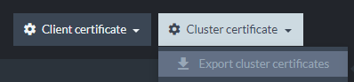
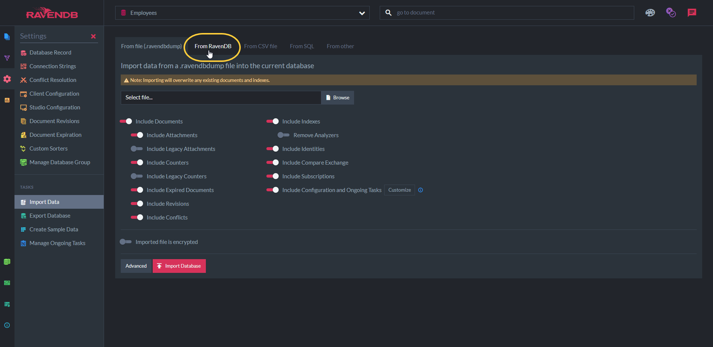
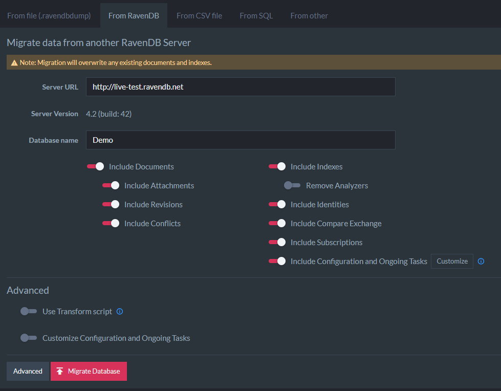

import Admonition from '@theme/Admonition';
import Tabs from '@theme/Tabs';
import TabItem from '@theme/TabItem';
import CodeBlock from '@theme/CodeBlock';
import LanguageSwitcher from "@site/src/components/LanguageSwitcher";
import LanguageContent from "@site/src/components/LanguageContent";

# Import Data from a Live RavenDB Server
<Admonition type="note" title="">

* In addition to importing data from a [.ravendbdump](../../../../studio/database/tasks/import-data/import-data-file.mdx) file,  
  data can also be imported directly from an existing database on a **live RavenDB server**.  

* Backward compatibility is supported.  
  You can import a database from a previous RavenDB version into your current server.  

* The process consists of the following:  
  1. [Prepare Servers for the Import Process](../../../../studio/database/tasks/import-data/import-from-ravendb.mdx#step-#1:-prepare-servers-for-the-import-process-(secure-4x-servers-only)) (only when importing from a _secure 4.x server_)  
  2. [Access the Import View](../../../../studio/database/tasks/import-data/import-from-ravendb.mdx#step-#2:-access-the-import-view)  
  3. [Set the Source Server URL and database](../../../../studio/database/tasks/import-data/import-from-ravendb.mdx#step-#3:-set-the-source-server-url-and-database)
  4. [Set Import Options](../../../../studio/database/tasks/import-data/import-from-ravendb.mdx#step-#4:-set-import-options)
  5. [Advanced Import Options](../../../../studio/database/tasks/import-data/import-from-ravendb.mdx#step-#5:-advanced-import-options)
</Admonition>
## Step #1: Prepare Servers for the Import Process (Secure 4.x Servers Only)

* Perform this step only if your source RavenDB server is a secure 4.x server that is running on HTTPS.  For other servers, skip this step and continue to [Step 2](../../../../studio/database/tasks/import-data/import-from-ravendb.mdx#step-#2:-access-the-import-view).

* Data from a secure 4.x RavenDB server (running on HTTPS) can only be imported to a destination server that is also secure.

* For the import to take place, the destination server needs to access the existing source database and fetch data from it.  
  To grant such access, you must first register the destination server certificate as a client certificate on your source server.  

* To accomplish this, follow these steps:

<Admonition type="note" title="">

* 1.  **Export the destination RavenDB certificate**  
  Go to `Manage Server -> Certificates` view on the destination RavenDB Studio. (See [Certificates Management](../../../../server/security/authentication/certificate-management.mdx)).  
  Choose `Export Cluster Certificates` option from the `Cluster Certificate` dropdown.  
   
  

* 2.  **Register this certificate on the source RavenDB server**  
   Go to `Manage Server -> Certificates` view on the source RavenDB Studio.  
   Choose `Upload client certificate` to upload the exported certificate as the client certificate.  
   
   

* 3.  **Set the certificate details**  
   **Certificate Name** - Provide a meaningful name for this certificate.  
   **Security Clearance** - Security clearance `User` will provide the necessary access for the data migration purposes.  
   **Database Permissions** - Remember to add `Read/Write` permission to the database you want to import.  
   
   

* 4.  Click `Upload` to complete the upload process.  
</Admonition>

## Step #2: Access the Import View

* 1. On the destination RavenDB server, select a `database` into which the data will be imported.  
  **Note**: Verify this database is empty as the importing will overwrite any existing content.  
   
  

* 2. Select `Settings` and then `Import Data` under the `Tasks` submenu.  
   
  

* 3. Select `From RavenDB`.  
   
  

## Step #3: Set the Source Server URL and database

* Specify the source server URL and select the database to import the data from.  

1. **Server URL** - URL to server you want to import from. You can specify URL to either 4.x server or 3.x server.  
2. **Server Version** - The version of the server that you want to import from will show here once you enter the URL.  
3. **Database Name** - The name of the Database that you want to migrate your data from.  

## Step #4: Set Import Options

* Filter the data you want to import.  
* Customize advanced configuration and apply a transform script under the [Advanced Import Options](../../../../studio/database/tasks/import-data/import-from-ravendb.mdx#step-#5:-advanced-import-options).

- **Include Documents:** Determines whether or not documents should be imported. If disabled, attachments and counters will automatically be disabled too. 
    - **Include Attachments:** Determines whether or not attachments should be imported. 
    - **Include Revisions:** Determines whether or not Revisions should be imported.
    - **Include Conflicts:** Determines whether or not Conflicts should be imported.
- **Include Indexes:** Determines whether or not Indexes should be imported. 
    - **Remove Analyzers:** Determines whether or not Analyzers used by indexes should be imported. 
- **Include Identities:** Determines whether or not Identities should be imported.
- **Include Compare Exchange:** Determines whether or not Compare Exchange values should be imported.
- **Include Subscriptions:** Determines whether or not Subscriptions should be imported.
- **Include Configuration and OngoingTasks:** Determines whether or not 
  [server configurations and ongoing tasks](../../../../studio/database/tasks/import-data/import-from-ravendb.mdx#customize-configuration-and-ongoing-tasks) 
  should be imported.  

<Admonition type="note" title="Importing an item that doesn't exist" id="importing-an-item-that-doesn-t-exist" href="#importing-an-item-that-doesn-t-exist">
If any of the options is set but the source database doesn't contain any items of that type, the type will be skipped.  
</Admonition>

## Step #5: Advanced Import Options

<Admonition type="note" title="">

### Transform Script

* **Use Transform Script**:  
  When enabled, the supplied javascript will be executed on each document before importing the document.  

<TabItem value="javascript" label="javascript">
<CodeBlock language="javascript">
{`// Example 1
delete this['@metadata']['@change-vector']
// The script above will delete the existing change-vector from imported documents,
// New change vectors will be generated during the import.
// This is very helpful if the data is imported from a different database-group
// and you want to avoid adding old change-vector entries to a new environment.

// Example 2
this.collection = this['@metadata']['@collection'];
// This script will create a new 'collection' property in each imported document.
`}
</CodeBlock>
</TabItem>
</Admonition>

<Admonition type="note" title="">

### Customize Configuration and Ongoing Tasks

**Ongoing tasks:**

- **Periodic Backups:** Determines whether or not Periodic Backups tasks configuration should be imported. 
- **External replications:** Determines whether or not External replications tasks configuration should be imported. 
- **RavenDB ETLs:** Determines whether or not RavenDB ETLs tasks configuration should be imported.
- **SQL ETLs:** Determines whether or not SQL ETLs tasks configuration should be imported.
- **Pull Replication Sinks:** Determines whether or not Pull Replication Sinks tasks configuration should be imported. 
- **Pull Replication Hubs:** Determines whether or not Pull Replication Hubs tasks configuration used by indexes should be imported. 

**Other:**

- **Settings:** Determines whether or not Settings should be imported.
- **Conflict Solver Configuration:** Determines whether or not Conflict Solver Configuration should be imported.
- **Revisions Configuration:** Determines whether or not Revisions Configuration should be imported.
- **Document Expiration:** Determines whether or not Document Expiration settings should be imported.
- **Client Configuration:** Determines whether or not Client Configuration should be imported. 
- **Custom Sorters:** Determines whether or not Custom Sorters should imported. 

**Connection Strings:**

- **RavenDB Connection Strings:** Determines whether or not RavenDB Connection Strings should be imported.
- **SQL Connection Strings:** Determines whether or not SQL Connection Strings values should be imported.
</Admonition>

