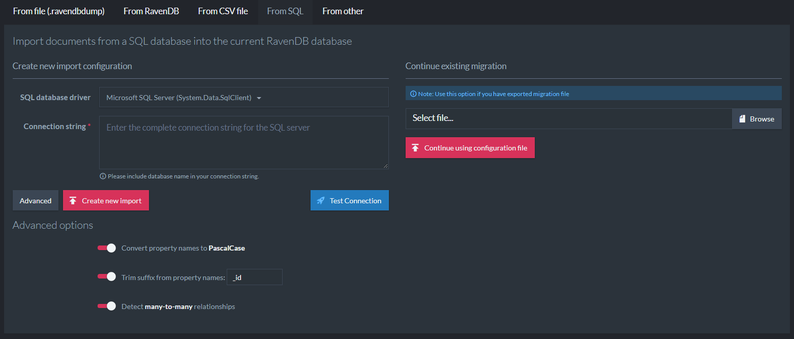

import Admonition from '@theme/Admonition';
import Tabs from '@theme/Tabs';
import TabItem from '@theme/TabItem';
import CodeBlock from '@theme/CodeBlock';
import LanguageSwitcher from "@site/src/components/LanguageSwitcher";
import LanguageContent from "@site/src/components/LanguageContent";

# Import from SQL
<Admonition type="note" title="">

* SQL Migration allows you to import your existing SQL Database into RavenDB.  

* Currently supported:  
   * **MySQL**  
   * **SQL Server**  
   * **Oracle**  
   * **PostgresSQL**  

* The import process is semi-automatic. It needs to take into account SQL 
  relations, represented by links between foreign keys and primary keys.  
  Identifying one-to-one, one-to-many and many-to-one relations to perform 
  a successful import, requires clear resolving of the original business model.  

* The NoSQL data model allows nested arrays/objects. In SQL such relations 
  are rendered as additional tables, often unrelated to the natural data form. 
  They are created to satisfy *Third normal form (3NF)*, e.g. by embedding 
  `OrderLines` within an `Order` object to solve a potential *select n+1* problem.  

* Another case in which artificial tables are used is the creation of *many-to-many* 
  relationships. In NoSQL, this can be modeled as a list of foreign object ids and 
  require no extra table/collection.  

* The SQL Migrator tries to detect and automatically suggest the best data model.  

* Every change made during data model preparations, maintains data integrity and cohesion.  

* Primary/Foreign keys must be defined in the source SQL database, so the migrator 
  would be able to perform correctly.  

* In this page:
  * [Pointing to source database](../../../../studio/database/tasks/import-data/import-from-sql.mdx#pointing-to-source-database)  
  * [Sql Migration - View Properties](../../../../studio/database/tasks/import-data/import-from-sql.mdx#sql-migration---view-properties)  
  * [Sql Migration - Handling relationships](../../../../studio/database/tasks/import-data/import-from-sql.mdx#sql-migration---handling-relationships)  
  * [Filtering / Transforming documents](../../../../studio/database/tasks/import-data/import-from-sql.mdx#filtering-/-transforming-documents)  
  * [Test 'filter / transform' scripts](../../../../studio/database/tasks/import-data/import-from-sql.mdx#test-)  
  * [Data integrity helpers](../../../../studio/database/tasks/import-data/import-from-sql.mdx#data-integrity-helpers)  
</Admonition>
## Pointing to source database

Welcome screen is divided to 2 columns. Left hand side is used when you start import from scratch. 
Right hand side is used when you want to continue import started in the past.

**Creating new import configuration**

Start with selecting database driver and provide connection string. **Test Connection** can be used to validate connection string and to verify connectivity to data source. 

Few advanced options are available:

* You can convert property name to PascalCase. Ex. `ZIP_CODE` is converted to `ZipCode`.

* Remove suffix from property name. Ex. `ADDRESS_ID` becomes `Address`.
 
* Detect many-to-many relationship. If all table columns are defined as foreign keys it is detected as *many-to-many* relationship. Such table is not imported and both sides of relationship are linked. This allows efficient modelling of 2-way relationship. 

**Continue existing configuration**

If you previously exported migration configuration, you can upload file to continue process. 
  




After providing valid connection RavenDB obtains information about tables, primary keys and foreign keys.

At this point user have many options to alter target document structure.

-- 

## Sql Migration - View Properties


1. **Toggle all tables** - Select none/all tables for sql migration.

2. **Migrate button** - Starts actual migration

3. **Filter input** - Allows to filter tables by its name.

4. **Export configuration** - Exports SQL configuration to file, so it can be finished later, by using *Continue existing migration option*. 

5. **Fullscreen mode** - Toggles fullscreen mode. 

6. **Settings menu** - Contains few settings options. 

7. **Batch size** - Allows to change batch size of document insertion

8. **Convert binary columns to attachments** - If this option is checked, then binary columns are added to document as attachment, in other case binary content is inserted as base64 string to target document. 

9. **Partial migration** - Allows to limit number of items being imported per each table. Please notice this option can introduce broken links, between documents. 


1. **SQL Table Name** - Table name from source SQL database

2. **Collection Name** - Target collection name, this name can be changed by clicking on it.

3. **Incoming relationships counter**. Shows count of incoming relationships to this collection. Details can be obtain by click on this button. 

4. **Document Identifier preview.** 
   Ex. If table contains column OrderID which is primary key. Rows contain values: 1, 2, 3. Then generated document identifiers are:
   `Orders/1`, `Orders/2`, `Orders/3`.
   
5. **SQL Column Name** - Column name from source SQL database

6. **Document Property** - Property name and type to use for corresponding column value. 
   Property name can be changed by clicking on it.
   
7. **Relationships area** - Shows information about incoming and outgoing references.   
Relationship information can be read as in following picture:


## Sql Migration - Handling relationships


Let's assume SQL database contains following tables:


Database contains 2 relationships. Those relationships can be represented as additional document properties. 


We can see that inside *OrderLines* document *OrderId* property will be created (with value: *Orders/&#123;ID&#125;*). It is called **linking** property. 

On reverse side of relationship, we have **skip** mode. It means this document property will be skipped. 

With such settings we end up with documents with following structure:

OrderLine:

```
{
    "Quantity": 10,
    "OrderId": "Orders/1",
    "ProductId": "Products/2"
}
```

Order:

```
{
    "Date": "2018-05-05",
    "Username": "accountName",
    "ExtraInfo": "Please call before delivery"
}

```

Product:

```
{
    "Name": "Phone",
    "UnitsInStock": 4
}
```


If we embed *OrderLines* inside *Orders*, and uncheck *OrderLines* table (as we don't need this artificial collection), 
we end up with following structure:


Order:

```
{
    "Date": "2018-05-05",
    "Username": "accountName",
    "ExtraInfo": "Please call before delivery",
    "OrderLines: [
        {
            "Quantity": 10,
            "ProductId": "Products/2"
        } 
    ]
}

```

Product:

```
{
    "Name": "Phone",
    "UnitsInStock": 4
}
```

Target document structure depends on side of relationship and chosen mode:

* **One-to-many** relationship: Source table contains *primary key*, target table contains *foreign key*

  * Mode set to **skip** - Property is skipped 

  * Mode set to **link** - Property value contains array of document identifiers
  
  * Mode set to **embed** - Property value contains array of nested documents
  
* **Many-to-one** relationship: Source table contains *foreign key*, target table contains *primary key*.

  * Mode set to **skip** - Property is skipped

  * Mode set to **link** - Property value contains single document identifier or null
  
  * Mode set to **embed** - Property value contains single nested document 

<Admonition type="note" title="">
Embedded documents don't contain identifier as it is redundant.
</Admonition>


## Filtering / Transforming documents

Sql Migration allows to filter and/or transform rows being imported. Click on 'Filter/Transform' button to access those settings. 

Flow goes like this:

1. Rows are read from source SQL database by executing query defined in filter section. This query can contain **where** which gives the ability to filter out as SQL statement level. 

2. Initial transformation is applied: embedded properties are calculated, foreign key columns are filled in based on user choice. 

3. Document is passed though transformation script (if any). Please notice that document passed to transformation contains embedded properties, which allows to calculate values, etc. 

4. Document is inserted to RavenDB database. 

 


<Admonition type="note" title="">
You can write **throw 'skip'** in transformation script to skip given document
</Admonition>


## Test 'filter / transform' scripts

Test option can be used for simulate transformation scripts. 

Let's say we want to compute and store amount of ordered products per order. 


We have 2 test modes available:

- **Use first record matching query** - it runs the query defined in filter section and gets first result. 
- **Specify primary key values to use** - user is presented with extra fields to provide value for each primary key column. 


## Data integrity helpers

Sql Migrator tries to maintain model integrity during entire process. It contains following checks:

1. Table can not be deselected when at least on incoming relationship is defined:
   
   
   
2. Embedded table can be deselected. If table was embedded and it is not used by any other relationship, migrator suggest to deselect root collection. 
   Ex. *OrderLines* was embedded inside *Orders*. *OrderLines* collection won't be needed, as it was embedded inside *Orders*.
   
   
   
3. Target table for linking is not selected. This could create broken link, so migrator suggest to select target table first. 

   
   
4. Deselecting all tables

   Before deselecting all tables, migration asks if user wants to set all relationships to *skip*. 
   
   
  


