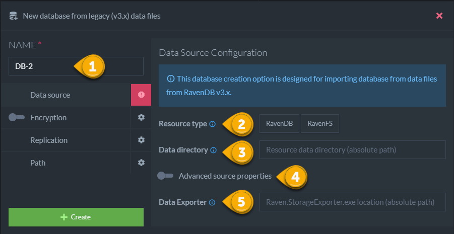

import Admonition from '@theme/Admonition';
import Tabs from '@theme/Tabs';
import TabItem from '@theme/TabItem';
import CodeBlock from '@theme/CodeBlock';
import LanguageSwitcher from "@site/src/components/LanguageSwitcher";
import LanguageContent from "@site/src/components/LanguageContent";

# Create a Database: From Legacy Files
<Admonition type="note" title="">

This database creation option is designed for importing database from data files from RavenDB v3.x.

* In this page:  
  * [1. New Database From Backup](../../../../studio/server/databases/create-new-database/from-legacy-files.mdx#1-new-database)  
  * [2. Data Source Configuration](../../../../studio/server/databases/create-new-database/from-legacy-files.mdx#2-source-configuration)  
 
 </Admonition>
## 1. Creating New Database From Legacy Files

<Admonition type="note" title="">
Open the down arrow and click `New database from legacy files`.
</Admonition>

## 2. Data Source Configuration

1. [Database Name](../../../../studio/server/databases/create-new-database/general-flow.mdx#2-database-name)

2. **Resource type**
    * RavenFS files will be saved as documents with attachments in @files collection.

3. **Data directory**
    * Absolute path to data directory. 
    * Depending on used storage in 3.x version, this folder should contain the file:
        * Esent: Data / Data.ravenfs
        * Voron: Raven.voron

4. **Advanced source properties**
    
    

    * Journals directory: Use if custom path to journals / transaction logs was specified (value of 'Raven/TransactionJournalsPath' or 'Raven/Esent/LogsPath' 3.x setting)

    * Batch size: Size of documents / files batch when exporting from 3.x data (default: 1024)

    * Source bundles: 
    
        * Compression: needs to be enabled if compression bundle was turned on

        * Encryption: 
        
            You need to insert values of the following settings from 3.x resource:

            * Encryption key : 'Raven/Encryption/Key'
            
            * Encryption algorithm : 'Raven/Encryption/Algorithm'

            * Encryption key size : 'Raven/Encryption/KeyBitsPreference'   
           
            

5. **Data Exporter**
    * RavenDB 3.5 tool that can be found on [ravendb.net](https://ravendb.net/download) as a part of the tools package.
    

<Admonition type="note" title="">
 Note: The legacy database / file system will be migrated only to the current node, this database can be added to other nodes using the 'Manage group' button.
 Learn more about **Manage group** in : [Manage group](../../../database/settings/manage-database-group.mdx)  
</Admonition>

