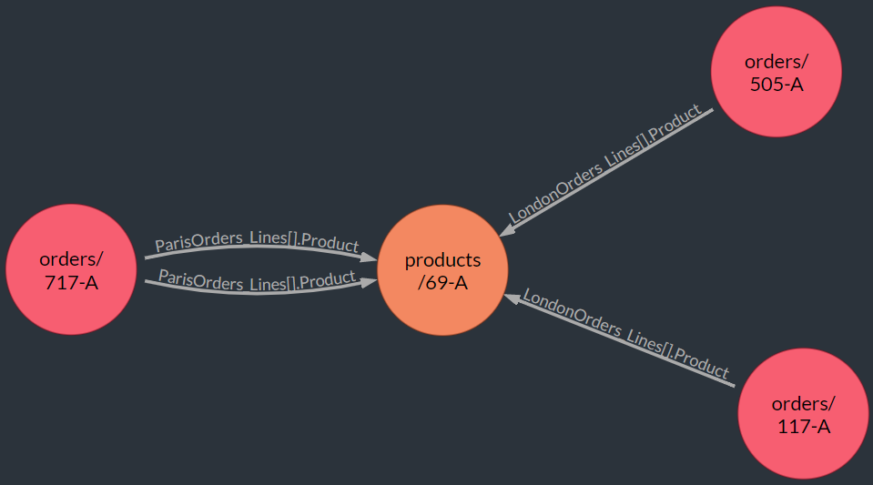

import Admonition from '@theme/Admonition';
import Tabs from '@theme/Tabs';
import TabItem from '@theme/TabItem';
import CodeBlock from '@theme/CodeBlock';
import LanguageSwitcher from "@site/src/components/LanguageSwitcher";
import LanguageContent from "@site/src/components/LanguageContent";

# Graph Queries Multi-Section Search Patterns  
<Admonition type="note" title="">

You can create an advanced graph query, whose search pattern groups **multiple sections**.  
Each section is an autonomous search pattern that may include data nodes and edges.  

* The different sections are unified into a single search pattern using **operators** 
  like `and` and `or`.  
* By using the correct operator, you can determine how documents or paths located 
  by a section would be used: they can be **excluded** from the overall results, 
  **included** in them unconditionally, or included in case they **intersect** with 
  results of other searches.  

<Admonition type="info" title="">
Sample queries included in this article use only data that is available in the 
[Northwind sample database](../../../studio/database/tasks/create-sample-data.mdx#creating-sample-data), 
so you may easily try them out.  
</Admonition>

* In this page:  
   * [Graph Intersection, Inclusion and Exclusion](../../../indexes/querying/graph/graph-queries-multi-section.mdx#graph-intersection,-inclusion-and-exclusion)  
   * [The Flow of Multi-Section Queries](../../../indexes/querying/graph/graph-queries-multi-section.mdx#the-flow-of-multi-section-queries)  
   * [Exclusion](../../../indexes/querying/graph/graph-queries-multi-section.mdx#exclusion)  
   * [Intersection](../../../indexes/querying/graph/graph-queries-multi-section.mdx#intersection)  
   * [Using Multiple Destination Clauses](../../../indexes/querying/graph/graph-queries-multi-section.mdx#using-multiple-destination-clauses)  
</Admonition>
## Graph Intersection, Inclusion and Exclusion

Here is a **two-sections query**, that discovers paths leading from **orders** to **products**.  
It is an **inclusive** query, that includes in the final results **paths found by both sections**.  

<TabItem value="plain" label="plain">
<CodeBlock language="plain">
{`//destination node
with 
   \{from Products 
      where Supplier ='suppliers/15-A'\} as prod

//search pattern
match 
   //first section
   (Orders as LondonOrders 
      where ShipTo.City = 'London') -
   [Lines[].Product] ->
   (prod)
or   
   //second section
   (Orders as ParisOrders 
      where ShipTo.City = 'Paris') -
   [Lines[].Product] ->
   (prod)
`}
</CodeBlock>
</TabItem>

* The **first section** finds paths from **orders shipped to London** to the **products they order**.  
  The **second section** finds paths from **orders shipped to Paris** to the **products they order**.  
  The `or` operator determines that paths found by both sections would be included in the query results.  

* Query results:  
  
    
#### The Flow of Multi-Section Queries

A multi-section query is executed in two main phases.  

1. Each autonomous section produces its own results dataset, i/e/ a series of paths.  
2. The operators between the sections determine which data would remain in the final results.  
<Admonition type="note" title="Operators you may use:" id="operators-you-may-use" href="#operators-you-may-use">
   
   * `or` - **Inclusion**  
     Use `or` to **include** in the results data found by **either section**.  
   * `and` - [Intersection](../../../client-api/session/querying/how-to-use-intersect.mdx#session-querying-how-to-use-intersect)  
     Use `and` to include in the results data found **by both sections**.  
   * `and not` - **Exclusion**  
     Use `and not` to **exclude** a dataset from the results.  

</Admonition>
#### Exclusion  

To exclude from the results a dataset located by a section, use `and not`.  
The following query is identical to the previous example in everything except for its usage of 
`and not` instead of `or`, **excluding** from the results paths of orders shipped to Paris.  
<TabItem value="plain" label="plain">
<CodeBlock language="plain">
{`with 
   \{from Products 
      where Supplier ='suppliers/15-A'\} as prod

match 
   (Orders as LondonOrders 
      where ShipTo.City = 'London') -
   [Lines[].Product] ->
   (prod)
and not   
   (Orders as ParisOrders 
      where ShipTo.City = 'Paris') -
   [Lines[].Product] ->
   (prod)
`}
</CodeBlock>
</TabItem>
  

* Comparing the results with those of 
  [the previous example](../../../indexes/querying/graph/graph-queries-multi-section.mdx#graph-intersection,-inclusion-and-exclusion) 
  reveals that products/69-A and orders connected to it are now missing.  
  They are missing because products/69-A is destination for orders shipped to both London and 
  Paris, the kind of paths the current query leaves out.  
#### Intersection

To include in the results only paths common to both compared datasets, aka **intersection**, 
use `and`.  

The following query is identical to the previous two, except that here we place `and` between 
the two sections to leave in the results only paths discovered **by both sections**.  
<TabItem value="plain" label="plain">
<CodeBlock language="plain">
{`with 
   \{from Products 
      where Supplier ='suppliers/15-A'\} as prod

match 
   (Orders as LondonOrders 
      where ShipTo.City = 'London') -
   [Lines[].Product] ->
   (prod)
and   
   (Orders as ParisOrders 
      where ShipTo.City = 'Paris') -
   [Lines[].Product] ->
   (prod)
`}
</CodeBlock>
</TabItem>
  

* Comparing the results with those of previous examples reveals that only products/69-A and 
  orders connected to it remain, an exact mirror image of the previous (
  [Exclusion](../../../indexes/querying/graph/graph-queries-multi-section.mdx#exclusion)
  ) example.  
  products/69-A remains because it is destination for orders shipped to both London **and** Paris, 
  the intersecting paths the current query looks for.  
#### Using Multiple Destination Clauses

Previous examples have shown us how to approach the same destination from different sections.  
It is sometimes useful, however, to create a query that approaches **multiple destinations**.  
To accomplish this, we need to give each destination a unique alias.  
<TabItem value="plain" label="plain">
<CodeBlock language="plain">
{`//Destination 1
with 
   \{from Orders 
      where ShipTo.City = 'London' \} as LondonOrders

//Destination 2
with 
   \{from Orders 
      where ShipTo.City = 'Paris' \} as ParisOrders
`}
</CodeBlock>
</TabItem> 

Here is a query that uses multiple destinations, to find products that ship to London **and** Paris for **different prices**.  

<TabItem value="plain" label="plain">
<CodeBlock language="plain">
{`with 
   \{from Orders 
      where ShipTo.City = 'London' \} as LondonOrders

with 
   \{from Orders 
      where ShipTo.City = 'Paris' \} as ParisOrders

match 
   (LondonOrders) -
   [Lines as LondonLine select Product] ->
   (Products as p)
   <- [Lines as ParisLine select Product]
   - (ParisOrders)

//Compare prices to the different destinations
where 
   LondonLine.PricePerUnit != ParisLine.PricePerUnit
   
select
   id(p) as ProductID,
   LondonLine.PricePerUnit as LondonPricePerUnit,
   LondonLine.ProductName as LondonProductName,
   ParisLine.PricePerUnit as ParisPricePerUnit,
   ParisLine.ProductName as ParisProductName
  
`}
</CodeBlock>
</TabItem> 

