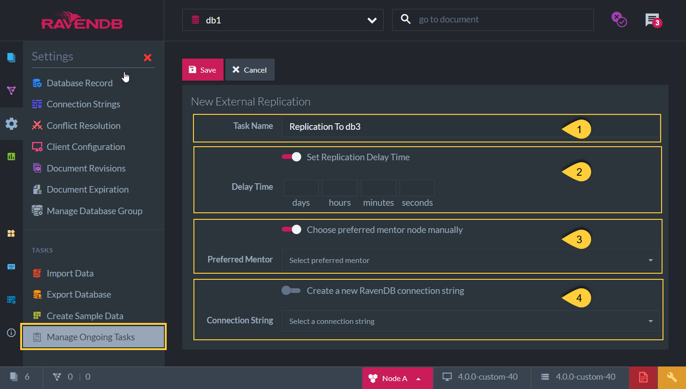

import Admonition from '@theme/Admonition';
import Tabs from '@theme/Tabs';
import TabItem from '@theme/TabItem';
import CodeBlock from '@theme/CodeBlock';
import LanguageSwitcher from "@site/src/components/LanguageSwitcher";
import LanguageContent from "@site/src/components/LanguageContent";

# External Replication Task
<Admonition type="note" title="">

* Schedule an **External Replication Task** in order to have a _live_ replica of your data in another database, 
  in a separate RavenDB [cluster](../../../../studio/server/cluster/cluster-view.mdx). 
  The replica is up to date at all times, any changes in the database will be reflected in the replica once they occur.  
  The External Replication task is _not_ creating a backup of your data, see more in [Backup -vs- Replication](../../../../studio/database/tasks/backup-task.mdx#backup-task--vs--replication-task)  

* Note: External Replication _can_ be defined to another database within the _same_ cluster.  
  That can come into use for example when you want a copy of the data that wouldn't be a client failover target.  

* The target database is _not_ considered part of the [Database Group](../../../../studio/database/settings/manage-database-group.mdx).  

* What is being replicated:  
  * All database documents  
  * Attachments  
  * Revisions  
  * Counters  

* What is _not_ being replicated:  
  Any cluster level behaviours such as:  
  *  Conflict resolver definition  
  *  Indexes & indexes definitions  

* Conflicts:  
  * Two databases that have an External Replication task defined between them will detect and resolve document conflicts according to each database conflict resolution policy.  
  * It is recommended to have the same policy configuration on both the source and the target databases.  

* In this page:  
  * [External Replication Task - Definition](../../../../studio/database/tasks/ongoing-tasks/external-replication-task.mdx#external-replication-task---definition)  
  * [External Replication Task - Details in Tasks List View](../../../../studio/database/tasks/ongoing-tasks/external-replication-task.mdx#external-replication---details-in-tasks-list-view)  
  * [External Replication Task - Offline Behaviour](../../../../studio/database/tasks/ongoing-tasks/external-replication-task.mdx#external-replication---offline-behaviour)
</Admonition>
## External Replication Task - Definition

1. **Task Name** (Optional)  
   * Choose a name of your choice  
   * If no name is given then RavenDB server will create one for you based on the defined connection string  

2. **Task Delay Time** (Optional)  
   * If a delay time is set then data will be replicated only after this time period has passed for each data change.  

3. **Preferred Node** (Optional)  
  * Select a preferred mentor node from the [Database Group](../../../../studio/database/settings/manage-database-group.mdx) to be the responsible node for this External Replication Task  
  * If not selected, then the cluster will assign a responsible node (see [Members Duties](../../../../studio/database/settings/manage-database-group.mdx#database-group-topology---members-duties))  

4. **Connection String**  
  * Select a connection string from the pre-defined list -or- create a new connection string to be used.  
  * The connection string defines the external database and its server URLs to replicate to.  

## External Replication - Details in Tasks List View

1. **External Replication Task Details**:
   *  Task Status - Active / Not Active / Not on Node / Reconnect  
   *  Connection String - The connection string used  
   *  Destination Database - The external database to which the data is being replicated  
   *  Actual Destination URL - The server URL to which the data is actually being replicated,  
      the one that is currently used out of the available _Topology Discovery URLs_  
   *  Topology Discovery URLs - List of the available destination Database Group servers URLs  

2. **Graph view**:  
   Graph view of the responsible node for the External Replication Task  

## External Replication - Offline Behaviour

* **When the source cluster is down** (and there is no leader):  

  * Creating a _new_ Ongoing Task is a Cluster-Wide operation,  
    thus, a new Ongoing External Replication Task ***cannot*** be scheduled.  

  * If an External Replication Task was _already_ defined and active when the cluster went down,  
    then the task will _not_ be active, no replication will take place.

* **When the node responsible for the external replication task is down**  

  * If the responsible node for the External Replication Task is down,  
    then another node from the Database Group will take ownership of the task so that the external replica is up to date.  

* **When the destination node is down:**  

  * The external replication will wait until the destination is reachable again and proceed from where it left off.  

  * If there is a cluster on the other side, and the URL addresses of the destination database group nodes are listed in the connection string, 
    then when the destination node is down, the replication task will simply start transferring data to one of the other nodes specified.  

