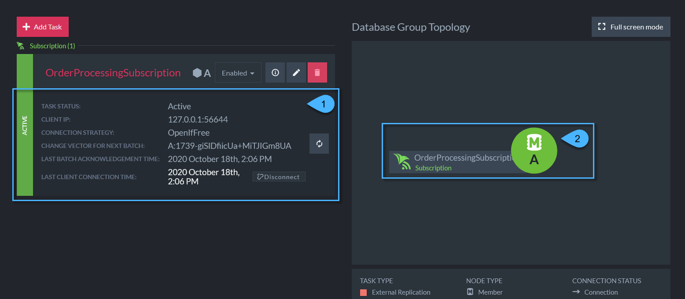

import Admonition from '@theme/Admonition';
import Tabs from '@theme/Tabs';
import TabItem from '@theme/TabItem';
import CodeBlock from '@theme/CodeBlock';
import LanguageSwitcher from "@site/src/components/LanguageSwitcher";
import LanguageContent from "@site/src/components/LanguageContent";

# Subscription Task
<Admonition type="note" title="">

* Data subscriptions are task that automatically send certain documents to a subscribed 
client, called the "subscription worker".  

* This page explains how to create a subscription on the server side using the Studio.  

* In this page:
  * [Subscription Task Definition](../../../../studio/database/tasks/ongoing-tasks/subscription-task.mdx#subscription-task-definition)
  * [Testing Subscriptions](../../../../studio/database/tasks/ongoing-tasks/subscription-task.mdx#testing)
  * [Details in Task List View](../../../../studio/database/tasks/ongoing-tasks/subscription-task.mdx#details-in-task-list-view)

</Admonition>
## Subscription Task Definition

1. The RQL query which selects which documents the subscription sends 
   to the client.  

2. Limit the age of the documents that will be retrieved. Default: "the 
   beginning of time" - meaning all documents are retrieved regardless of 
   age. The other options are:  
   * Latest document - of the documents that existed before the subscription 
     task began, retrieve only the newest one.  
   * Change vector - specify a starting point for the subscription by a 
     document change vector.  

3. Choose which node will perform this task by default.  

4. Test the subscription query.  

## Testing

Testing the subscription shows which documents are retrieved by the 
specified query.  

1. Limit the number of results to retrieve for this test.  

2. Limit how long - in seconds - the test should continue before 
stopping automatically.  

3. Run the test.  

## Details in Task List View

Press the info button on a task in the task list view to see 
more detailed information.  

1. Task status - will be "active" while a client is subscribed to 
   this task, and "not active" when there is not.

2. Client IP - the IP address of the subscription worker 
   subscribed to this task.  

3. Connection strategy - determines the automatic behavior of 
   communication between server and worker.  

4. Change vector for next batch - the change vector of the last 
   document in the batch that will be sent next.  

5. Last batch acknowledgement time - the last time a worker 
   responded that it has recieved a batch.  

6. Last client connection time - the last time a worker communicated 
   with or pinged the server.  

