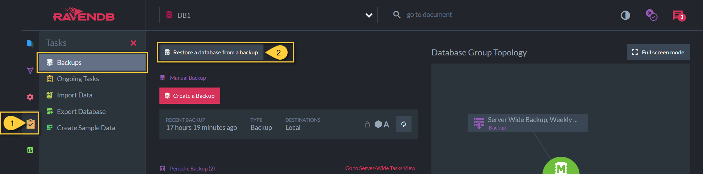
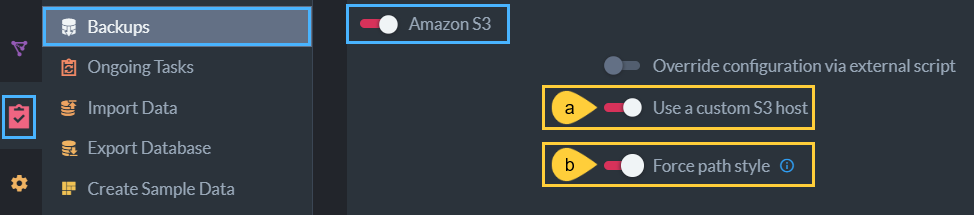

import Admonition from '@theme/Admonition';
import Tabs from '@theme/Tabs';
import TabItem from '@theme/TabItem';
import CodeBlock from '@theme/CodeBlock';
import LanguageSwitcher from "@site/src/components/LanguageSwitcher";
import LanguageContent from "@site/src/components/LanguageContent";

# Create a Database: From Backup

<Admonition type="note" title="">

Restoring a database is done easily via the RavenDB Studio. 

* In this page:  
  * [New Database From Backup - Studio Databases View](../../../../studio/server/databases/create-new-database/from-backup.mdx#new-database-from-backup---studio-databases-view)  
  * [New Database From Backup - Studio Backups View](../../../../studio/server/databases/create-new-database/from-backup.mdx#new-database-from-backup---studio-backups-view)  
  * [Backup Source Configuration](../../../../studio/server/databases/create-new-database/from-backup.mdx#backup-source-configuration)  

</Admonition>
## New Database From Backup - Studio Databases View

 1. Click on the **Databases** tab in the Studio.  
 2. Click the down arrow on the **New database** button.  
 3. Select **New database from backup**  

## New Database From Backup - Studio Backups View
Another way to access the New Database From Backup interface is via the Studio Backups view.

1. Click the **Tasks** tab and select **Backups**.
2. Click the **Restore a database from a backup** button.

## Backup Source Configuration

1. [**Name** your new database](../../../../studio/server/databases/create-new-database/general-flow.mdx#2-database-name).  

2. **Source**  
   Select the source server type to see the fields necessary to access the backup
   * If you use an [Amazon S3](https://aws.amazon.com/s3/) custom host:
     
      * a- **Use a custom S3 host**  
        Toggle to provide a custom server URL.  
      * b- **Force path style**  
        Toggle to change the default S3 bucket [path convention](https://aws.amazon.com/blogs/aws/amazon-s3-path-deprecation-plan-the-rest-of-the-story/) on your custom Amazon S3 host.  

3. **Backup Directory**  
   Select the file location that you set when you [created your backup](../../../../studio/database/tasks/backup-task.mdx).  
    * If your source is a cloud-based database, you will likely need to enter credentials and passwords as well as location.  

4. **Disable ongoing tasks after restore**  
   Disabling will likely require [ongoing tasks](../../../database/tasks/ongoing-tasks/general-info.mdx) to be created again.  

5. **Skip indexes**  
   Skipping [indexes](../../../../indexes/what-are-indexes.mdx) will require your indexes to be built anew.  

6. **Restore Point** 
   Choose the backup version which will populate your new, restored database.  
   * **Snapshot** backup type includes fully built indexes which makes restoring the database faster.  
   * **Full** or **Incremental** types include index definitions from which the new indexes will be built.  
   
<Admonition type="note" title="">
 Note: The backup will be restored only to the current node after restore. This database can be added to other nodes using the "Add node" button in the [Manage group](../../../database/settings/manage-database-group.mdx) Studio view.

</Admonition>

