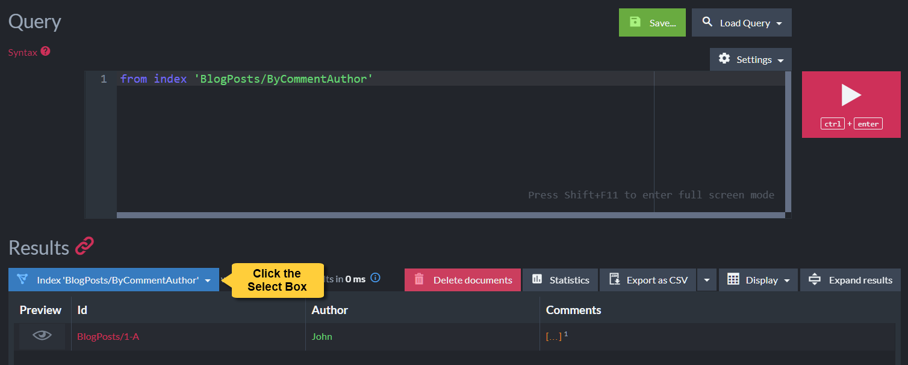
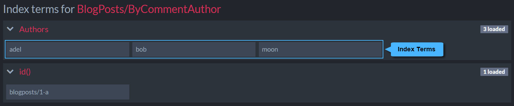

import Admonition from '@theme/Admonition';
import Tabs from '@theme/Tabs';
import TabItem from '@theme/TabItem';
import CodeBlock from '@theme/CodeBlock';

<Admonition type="note" title="">

Use the indexing `Recurse` method to recurse through the layers of a hierarchical document 
and index its elements.  

* In this Page:  
   * [Hierarchical Data](../../indexes/indexing-hierarchical-data.mdx#hierarchical-data)  
   * [Indexing Hierarchical Data](../../indexes/indexing-hierarchical-data.mdx#indexing-hierarchical-data)  

</Admonition>
## Hierarchical Data

One of the significant advantages offered by document databases is their tendency not to force 
limits upon data structuring. **Hierarchical data structures** demonstrate this quality beautifully: 
take, for example, the commonly-used **Comment thread**, implemented using objects such as:  
<TabItem value="indexes_1" label="indexes_1">
<CodeBlock language="csharp">
{`private class BlogPost
\{
    public string Author \{ get; set; \}
    public string Title \{ get; set; \}
    public string Text \{ get; set; \}

    // Blog post readers can leave comments
    public List<BlogPostComment> Comments \{ get; set; \}
\}

public class BlogPostComment
\{
    public string Author \{ get; set; \}
    public string Text \{ get; set; \}

    // Comments can be left recursively
    public List<BlogPostComment> Comments \{ get; set; \}
\}
`}
</CodeBlock>
</TabItem>

Readers of a post created using the above `BlogPost` structure, can add `BlogPostComment` comments 
to its Comments field. And readers of these comments can reply with comments of their own, creating 
a recursive hierarchical structure.  

`BlogPosts/1-A`, for example, is a blog entry posted by John, that contains several layers of 
comments left by various authors.  

`BlogPosts/1-A`:
<TabItem value="json" label="json">
<CodeBlock language="json">
{`\{
    "Author ": "John",
    "Comments": [
        \{
            "Author": "Moon",
            "Comments": [
                \{
                    "Author": "Bob"
                \},
                \{
                    "Author": "Adel",
                    "Comments": \{
                        "Author": "Moon"
                    \}
                \}
            ]
        \}
    ],
    "@metadata": \{
        "@collection": "BlogPosts"
    \}
\}
`}
</CodeBlock>
</TabItem>

## Indexing Hierarchical Data

To index the elements of a hierarchical structure like the one demonstrated above, 
use RavenDB's `Recurse` method.  

In the sample below, we use `Recurse` to go through comments in the post thread 
and index them by their authors.  
<Tabs groupId='languageSyntax'>
<TabItem value="AbstractIndexCreationTask" label="AbstractIndexCreationTask">
<CodeBlock language="csharp">
{`private class BlogPosts_ByCommentAuthor : 
    AbstractIndexCreationTask<BlogPost, BlogPosts_ByCommentAuthor.Result>
{
    public class Result
    {
        public IEnumerable<string> Authors { get; set; }
    }

    public BlogPosts_ByCommentAuthor()
    {
        Map = blogposts => from blogpost in blogposts
                           let authors = Recurse(blogpost, x => x.Comments)
                           select new Result
                           {
                               Authors = authors.Select(x => x.Author)
                           };
    }
}
`}
</CodeBlock>
</TabItem>
<TabItem value="Operation" label="Operation">
<CodeBlock language="csharp">
{`store.Maintenance.Send(new PutIndexesOperation(
    new IndexDefinition
    {
        Name = "BlogPosts/ByCommentAuthor",
        Maps =
        {
            @"from blogpost in docs.BlogPosts
              from comment in Recurse(blogpost, (Func<dynamic, dynamic>)(x => x.Comments))
              select new
              {
                  Author = comment.Author
              }"
        }
    }));
`}
</CodeBlock>
</TabItem>
<TabItem value="JavaScript" label="JavaScript">
<CodeBlock language="csharp">
{`public class BlogPosts_ByCommentAuthor_JS : AbstractJavaScriptIndexCreationTask
{
    public class Result
    {
        public string[] Authors { get; set; }
    }

    public BlogPosts_ByCommentAuthor_JS()
    {
        Maps = new HashSet<string>
        {
            @"map('BlogPosts', function (blogpost) {
                return recurse(blogpost, x => x.Comments).map(function (comment) {
                    if (comment.Author != null) {
                        return {
                            Authors: comment.Author
                        };
                    }
                });
            });"
        };
    }
}
`}
</CodeBlock>
</TabItem>
</Tabs>
### Querying the created index

* The index we created can be queried using code.  
<Tabs groupId='languageSyntax'>
<TabItem value="Query" label="Query">
<CodeBlock language="csharp">
{`IList<BlogPost> results = session
    .Query<BlogPosts_ByCommentAuthor.Result, BlogPosts_ByCommentAuthor>()
    .Where(x => x.Authors.Any(a => a == "John"))
    .OfType<BlogPost>()
    .ToList();
`}
</CodeBlock>
</TabItem>
<TabItem value="DocumentQuery" label="DocumentQuery">
<CodeBlock language="csharp">
{`IList<BlogPost> results = session
    .Advanced
    .DocumentQuery<BlogPost, BlogPosts_ByCommentAuthor>()
    .WhereEquals("Authors", "John")
    .ToList();
`}
</CodeBlock>
</TabItem>
  </Tabs>

* The index can also be queried using Studio.  

   * Use Studio's [List of Indexes](../../studio/database/indexes/indexes-list-view.mdx#indexes-list-view) 
     view to define and query the index.  
     
         

   * Use the **Query** view to see the results and the list of [terms](../../studio/database/indexes/indexes-list-view.mdx#indexes-list-view---actions) 
     indexed by the `Recurse` method.  
     
         

         

         

