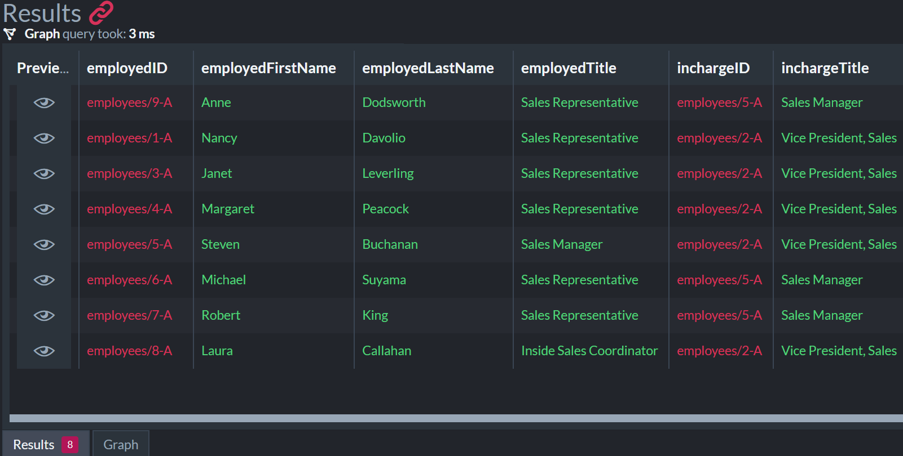

import Admonition from '@theme/Admonition';
import Tabs from '@theme/Tabs';
import TabItem from '@theme/TabItem';
import CodeBlock from '@theme/CodeBlock';
import LanguageSwitcher from "@site/src/components/LanguageSwitcher";
import LanguageContent from "@site/src/components/LanguageContent";

# Graph Querying: Overview  

<Admonition type="warning" title="Warning">
The graph queries feature is available in RavenDB versions `4.2` to `5.x`.  
The feature is not available in higher (`6.0` and on) versions.  
</Admonition>
<Admonition type="note" title="Note">

RavenDB's [experimental](../../../indexes/querying/graph/graph-queries-overview.mdx#enabling-graph-querying) graph support 
allows you to query your database as if it has been pre-arranged in graph format, gaining extreme efficiency and speed 
in recognizing relations between data elements and organizing them into searchable patterns. Intricate relationships 
that would render standard queries useless, become the asset they are meant to be.  

* **No need for preliminary preparations.**  
  You do not need to alter your database's structure or contents in order to start using graph queries. 
  Existing collections and documents are used as graph elements, 
  and their relations are inferred from existing document properties.  

* **Simple and effective syntax.**  
  We've integrated graph support into [RQL](../../../client-api/session/querying/what-is-rql.mdx) to make its learning 
  and usage accessible and intuitive for any user, especially those already familiar with our query language.  

* **Comprehensive support.**  
  Queries can be constructed either by clients using API methods or manually using the Studio, and are 
  executed by your distributed database. Results can be retrieved by your clients, or shown textually and 
  graphically using the Studio.  

<Admonition type="info" title="Info">
Sample queries included in this article use only data that is available in the 
[Northwind sample database](../../../studio/database/tasks/create-sample-data.mdx#creating-sample-data), 
so you may easily try them out.  
</Admonition>

* In this page:  
   * [Introduction To Graph Modeling](../../../indexes/querying/graph/graph-queries-overview.mdx#introduction-to-graph-modeling)  
     * [Enabling Graph Querying](../../../indexes/querying/graph/graph-queries-overview.mdx#enabling-graph-querying)  
   * [Creating Graph Queries](../../../indexes/querying/graph/graph-queries-overview.mdx#creating-graph-queries)  
   * [The Structure of a Basic Query](../../../indexes/querying/graph/graph-queries-overview.mdx#the-structure-of-a-basic-query)  
   * [Results Structure](../../../indexes/querying/graph/graph-queries-overview.mdx#results-structure)  
   * [Projecting Graph Results](../../../indexes/querying/graph/graph-queries-overview.mdx#projecting-graph-results)  
   
</Admonition>
## Introduction To Graph Modeling  

* **In The Beginning..**  
  One of the best known founding moments of graph theory is [Leonhard Euler](https://en.wikipedia.org/wiki/Leonhard_Euler)'s 
  attempt at solving the [Königsberg Bridges](https://en.wikipedia.org/wiki/Seven_Bridges_of_K%C3%B6nigsberg) riddle, 
  eventually tackling the problem by representing the scenery and its elements in a graph.  
  Euler's search for an optimal path is a great referral to the practicality of graph theory, 
  leading all the way to its present-day effectiveness in managing complex data volumes.  
* **Graph modeling and complex data volumes**   
  As non-graphical data models are inefficient in (and often incapable of) searching and managing large and 
  complex data sets with intricate relations, various applications take part in complementing or replacing them.  
  Databases capable of running graph queries are a major contribution in this regard.  
* **Graph modeling in a multi-model database**  
  People often fulfill their graph modeling needs using dedicated graph databases. While this does offer 
  a solid solution, it also produces additional issues that need to be resolved - like the need to integrate 
  source data and graph results.  
  Using the graph capabilities of a multimodel database is a native solution that you can use directly 
  without creating additional issues.  
  RavenDB is a multimodel database whose graph capabilities are founded upon superb document store 
  and indexing engine. Data already deposited in database documents and indexes can participate in graph 
  querying with no preceding arrangements, easing user administration and improving internal logic 
  and data management.  

<Admonition type="note" title="Note">

### Enabling Graph Querying

Graph support is an experimental feature and is disabled by default.  
To activate it you need to edit RavenDB's [configuration file](../../../server/configuration/configuration-options.mdx#settingsjson) 
and enable [experimental features](../../../server/configuration/core-configuration.mdx#featuresavailability).  

</Admonition>

## Creating Graph Queries  

Graph querying is an expansion of RavenDB's [RQL](../../../client-api/session/querying/what-is-rql.mdx); 
you can build and test graph queries using the Studio, exactly as you would with non-graph RQL.  

The Studio will identify graph queries by their syntax, execute them as such and automatically 
show their results both graphically and textually.

## The Structure of a Basic Query  

The vocabulary and syntax of graph queries are simple and straightforward. Take for example 
the following basic query, that maps an organization's "chain of command" by finding who each 
employee reports to.  
<TabItem value="json" label="json">
<CodeBlock language="json">
{`match 
    (Employees as employed) - 
    [ReportsTo as reportsTo]-> 
    (Employees as incharge)
`}
</CodeBlock>
</TabItem>

1. **Alias**: `employed`  
  Aliases are given to nodes and edges for two main reasons: making queries easier to read and manage, and 
  allowing the [filtering and projection of results](../../../indexes/querying/graph/graph-queries-the-search-pattern.mdx#what-are-aliases-for).  

    **_In this sample query_**, understanding the search pattern would have been difficult without aliases 
    because origin and destination data nodes are retrieved from the same collection, **Employees**. 
    The `employed` and `incharge` aliases distinguish between this collection's different roles in the 
    origin and destination clauses.  

2. **Alias**: `reportsTo`  

3. **Alias**: `incharge`  

4. **Origin Data-Node Clause**: `(Employees as employed)`  
  This clause indicates where the origin data nodes are looked for.  

    **_In this sample query_**, this clause simply retrieves all documents of the Employees collection.  

5. **Edge Origin Delimiter**: `-`  
  The hyphen connects the edge clause with the origin data-nodes clause.  

    **_In this sample query_** the "-" indicates that edges will be fetched from data nodes of the Employees collection.  

6. **Edge Clause**: `[ReportsTo as reportsTo]`  
  The edge clause indicates which data nodes' properties are used as edges.  

    **_In this sample query_** edges are a field named **ReportsTo** in each data node retrieved from the origin collection.  

7. **Edge Destination Delimiter**: `->`  
  Edges contain the IDs of destination nodes.  
  The arrow indicates in which data set we should be looking for the documents whose IDs the edges hold.

    **_In this sample query_** the arrow indicates that destination nodes' IDs are stored in a field 
    named ReportsTo and the documents are in the Employees collection.  

8. **Destination Data-Node Clause**: `(Employees as incharge)`  

    **_In this sample query_** edges hold the IDs of documents of the Employees collection.  

## Results Structure  

The **graphical view** lets you quickly evaluate query results, however complex they may be.  
Clicking data nodes in the graphical view displays their contents.  

When your query retrieves a whole document, the **textual view** presents it as `{...}`.  
You can hover above such results to reveal the document's contents.  

<Admonition type="info" title="Info">
You can use [projection](../../../indexes/querying/graph/graph-queries-overview.mdx#projecting-graph-results) 
to retrieve and display precisely the details you're interested in.  
</Admonition>

## Projecting Graph Results  

To [project](../../../indexes/querying/projections.mdx#querying-projections) selected 
query details, follow your query with a `select` clause. Select elements and properties 
you're interested in by their aliases.  

Here, for example, is the same basic query we 
[demonstrated above](../../../indexes/querying/graph/graph-queries-overview.mdx#the-structure-of-a-basic-query), 
with a projection this time to make its textual view much more helpful.  
<TabItem value="json" label="json">
<CodeBlock language="json">
{`match 
    (Employees as employed) - 
    [ReportsTo as reportsTo]-> 
    (Employees as incharge)

select
   id(employed) as employedID, 
   employed.FirstName as employedFirstName, 
   employed.LastName as employedLastName, 
   employed.Title as employedTitle, 
   id(incharge) as inchargeID, 
   incharge.Title as inchargeTitle 
`}
</CodeBlock>
</TabItem>

