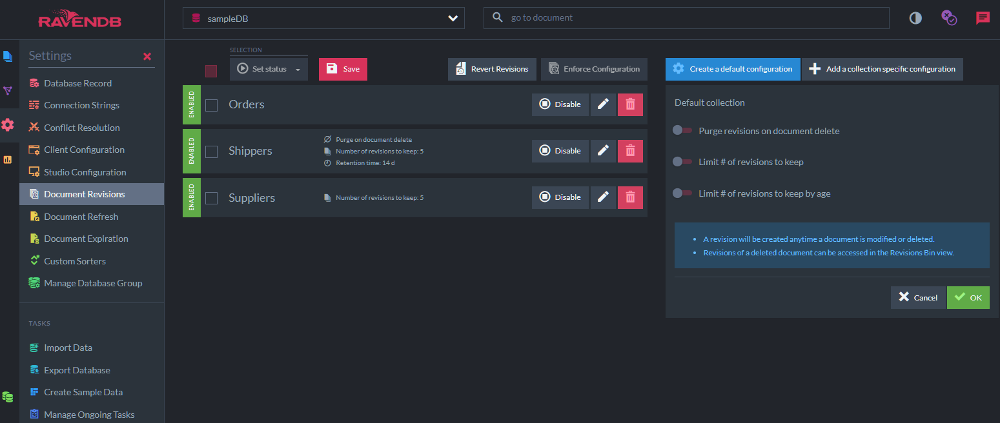

import Admonition from '@theme/Admonition';
import Tabs from '@theme/Tabs';
import TabItem from '@theme/TabItem';
import CodeBlock from '@theme/CodeBlock';
import LanguageSwitcher from "@site/src/components/LanguageSwitcher";
import LanguageContent from "@site/src/components/LanguageContent";

# Revisions
<Admonition type="note" title="">

* The **Revisions** feature will create a revision (snapshot) for a document 
  every time the document is updated and upon its deletion.  
  The trail of revisions created for the document can then be browsed, and 
  the currently live document can be reverted to any of its past revisions.  
* Revisions can be enabled for documents of all collections, or for specific collections.  
* Tracking document revisions allows you, for example, to check how an employee's 
  contract has changed over time, revert a single corrupted document without restoring 
  a backup, or to conduct a full-scale audit.  
* Revisions can be configured using API methods or via Studio.

* In this page:  
  * [Configuration](../../server/extensions/revisions.mdx#configuration)  
     * [Configuration Options](../../server/extensions/revisions.mdx#configuration-options)
  * [How it Works](../../server/extensions/revisions.mdx#how-it-works)  
  * [Enabling or Disabling on an Existing Database](../../server/extensions/revisions.mdx#enabling-or-disabling-on-an-existing-database)  
  * [Storage Concerns](../../server/extensions/revisions.mdx#storage-concerns)  
  * [Force Revision Creation](../../server/extensions/revisions.mdx#force-revision-creation)  

</Admonition>
## Configuration

You can configure the revisions feature using the studio:

By default, the revisions feature will track history for all the documents and never purge old revisions. 
You can configure this for all collections (using the default configuration) and you can have a configuration for a specific collection.
#### Configuration Options:

| Configuration option | Description |
| - | - |
| **PurgeOnDelete** | Configure whether to delete the revisions upon document delete or create a delete marker instead. Default: false. |
| **MinimumRevisionsToKeep** | Configure the minimum number of revisions to keep. Default: none. |
| **MinimumRevisionAgeToKeep** | Configure a minimum retention time before the revisions can be expired. Default: none. |
| **Disabled** | If true, disable the revisions feature for this configuration (default or specific collection). Default: false. |

You can also configure the revisions feature using the client:

<TabItem value="configuration" label="configuration">
<CodeBlock language="csharp">
{`await store.Maintenance.SendAsync(new ConfigureRevisionsOperation(new RevisionsConfiguration
\{
    Default = new RevisionsCollectionConfiguration
    \{
        Disabled = false,
        PurgeOnDelete = false,
        MinimumRevisionsToKeep = 5,
        MinimumRevisionAgeToKeep = TimeSpan.FromDays(14),
    \},
    Collections = new Dictionary<string, RevisionsCollectionConfiguration>
    \{
        \{"Users", new RevisionsCollectionConfiguration \{Disabled = true\}\},
        \{"Orders", new RevisionsCollectionConfiguration \{Disabled = false\}\}
    \}
\}));
`}
</CodeBlock>
</TabItem>

It is possible to have a default configuration telling the revisions feature to revision all documents. 
Set `Disabled=false`, which is the default, on the default configuration, and only keep up to 5 revisions, purging older ones (`MinimumRevisionsToKeep=5`).
Then override the behavior of the revisions feature by specifying a configuration specifically to a collection. 

Conversely, we can disable the default configuration (`Disabled = true`) but enable revisions for a specific collection.

## How it Works

With the revisions feature enabled, let's execute this code:

<TabItem value="store" label="store">
<CodeBlock language="csharp">
{`using (var session = store.OpenAsyncSession())
\{
    await session.StoreAsync(new User
    \{
        Name = "Ayende Rahien"
    \});

    await session.SaveChangesAsync();
\}
`}
</CodeBlock>
</TabItem>

If we inspect the document we will see that the following revision were created:

This is a revision of the document (you can navigate to the document by clicking on `See the current document`) which is stored on the revisions storage.
Now, let's modify the original document. This would create another revision:

As you can see, we have a full audit record of all the changes that were made to the document.

You can access the revisions of a specific document by the document's ID ("users/1").
Or you can access a specific revision by its change vector or by a specific date.
Accessing a revision by a change vector would return a specific revision, 
while accessing a revision by a date would return the revision on this specific date if exists,
and if not it would return the revision right before this date.

<TabItem value="get_revisions" label="get_revisions">
<CodeBlock language="csharp">
{`List<User> revisions = await session
    .Advanced
    .Revisions
    .GetForAsync<User>("users/1", start: 0, pageSize: 25);

List<MetadataAsDictionary> revisionsMetadata = await session
    .Advanced
    .Revisions
    .GetMetadataForAsync("users/1", start: 0, pageSize: 25);

User revison = await session
    .Advanced
    .Revisions
    .GetAsync<User>(revisionsMetadata[0].GetString(Constants.Documents.Metadata.ChangeVector));

User revisonAtYearAgo = await session
    .Advanced
    .Revisions
    .GetAsync<User>("users/1", DateTime.Now.AddYears(-1));
`}
</CodeBlock>
</TabItem>

Now, let's delete the document. 
The document would be removed but a revision will be created, so you aren't going to lose the audit trail if the document is deleted.

In order to see orphaned revisions (revisions of deleted documents), you can go to the `Documents > Revisions Bin` section in the studio, 
which would list all revisions without existing document:

If you'll go and create another document with this ID (users/1), then the revision won't be shown anymore in the Revision Bin section, 
but you can navigate to the document and see it's revisions, including the deleted ones.

Clicking on the revision we can also navigate to the other revisions of this document:

The revisions feature attempts to make things as simple as possible. Once it is enabled, you'll automatically get the appropriate audit trail.

## Enabling or Disabling on an Existing Database

The revisions feature can be enabled on a existing database with (or without) data with some restrictions. 
You need to bear in mind that new revision will be created for any new save or delete operation, but this will not affect any existing data that was created prior turning that feature on.
If you create a document, then turn on revisions, and then overwrite the document, there won't be a revision for the original document. However, you would have a revision of the put operation after the revisions feature was enabled.

It's possible also to disable the revisions feature on an existing database.
In this case all existing revisions would still be stored and not deleted but we won't create any new revisions on any put or delete operations.

## Storage Concerns

Enabling the revisions will affect the usage of storage space. Each revision of a document is stored in full. The revisions of documents use the same blittable JSON format as regular 
documents so the compression of individual fields is enabled (any text field that is greater than 128 bytes will be compressed).

## Force Revision Creation

So far we've discussed the automatic creation of revisions when the feature is enabled. 
But you can also **force the creation** of a document revision, whether the feature is 
enabled or not.  
This is useful when, for example, you choose to disable Revisions but 
still want to create a revision for a specific document, e.g. to take a snapshot of the 
document as a precaution before editing it.  

* You can force the creation of a revision via Studio or using the `ForceRevisionCreationFor` API method.  
* A revision will be created Even If the Revisions feature is disabled for the document's collection.  
* A revision will be created Even If The document was not modified.  
#### Force Revision Creation via Studio

To create a revision manually via Studio, use the **Create Revision** button in the 
document view's Revisions tab.  

#### Force Revision Creation via API

To create a revision manually via the API, use the session `ForceRevisionCreationFor` method.  

`ForceRevisionCreationFor` overloads:  
<TabItem value="csharp" label="csharp">
<CodeBlock language="csharp">
{`// Force revision creation by entity.
// Can be used with tracked entities only.
void ForceRevisionCreationFor<T>(T entity, 
              ForceRevisionStrategy strategy = ForceRevisionStrategy.Before);

// Force revision creation by document ID.
void ForceRevisionCreationFor(string id, 
              ForceRevisionStrategy strategy = ForceRevisionStrategy.Before);
`}
</CodeBlock>
</TabItem>

* **Parameters**:

    | Parameter | Type | Description |
    | - | - | - |
    | **entity** | `T` | The tracked entity you want to create a revision for |
    | **id** | string | ID of the document you want to create a revision for |
    | **strategy** | `ForceRevisionStrategy` | Defines the revision creation strategy (see below).   Default: `ForceRevisionStrategy.Before` |

    `ForceRevisionStrategy`:
<TabItem value="csharp" label="csharp">
<CodeBlock language="csharp">
{`public enum ForceRevisionStrategy
\{
    // Do not force a revision
    None,
        
    // Create a forced revision from the document that is currently in store, 
    // BEFORE applying any changes made by the user.  
    // The only exception is a new document, for which a revision will be 
    // created AFTER the update.
    Before
\}
`}
</CodeBlock>
</TabItem>

* **Sample**:
<Tabs groupId='languageSyntax'>
<TabItem value="By_ID" label="By_ID">
<CodeBlock language="csharp">
{`// Force revision creation by ID
session.Advanced.Revisions.ForceRevisionCreationFor(companyId);
session.SaveChanges();
`}
</CodeBlock>
</TabItem>
<TabItem value="By_Entity" label="By_Entity">
<CodeBlock language="csharp">
{`// Force revision creation by entity
var company = new Company { 
        Name = "CompanyProfile" 
    };
session.Store(company);
companyId = company.Id;
session.SaveChanges();

// Forcing the creation of a revision by entity can be performed 
// only when the entity is tracked, after the document is stored.
session.Advanced.Revisions.ForceRevisionCreationFor<Company>(company);
`}
</CodeBlock>
</TabItem>
    </Tabs>

