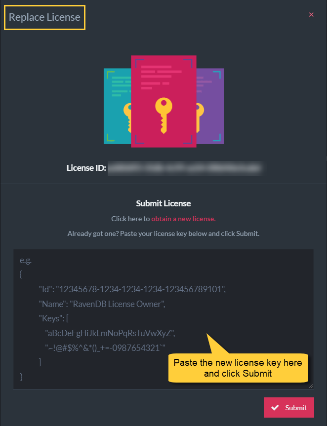

import Admonition from '@theme/Admonition';
import Tabs from '@theme/Tabs';
import TabItem from '@theme/TabItem';
import CodeBlock from '@theme/CodeBlock';
import LanguageSwitcher from "@site/src/components/LanguageSwitcher";
import LanguageContent from "@site/src/components/LanguageContent";

# Replace License
<Admonition type="note" title="">

* Upon [upgrading your license](https://ravendb.net/buy),  
  RavenDB will send the **new license key** to the email provided when obtaining the license.  

* You need to replace the existing license with the new one from the Studio, see below.

* In this page:
    * [Replace license from Studio](../../start/licensing/replace-license.mdx#replace-license-from-studio)
    * [Maintain auto-renewal of Let's Encrypt certificates](../../start/licensing/replace-license.mdx#maintain-auto-renewal-of-let)

</Admonition>
## Replace license from Studio

Replace the existing license with the new one from the Studio:

1. **About**  
   Navigate to the _About_ page in Studio

2. **Replace**  
   Click the _REPLACE LICENSE_ button

## Maintain auto-renewal of Let's Encrypt certificates 

* If you have set up with the [Setup Wizard](../../start/installation/setup-wizard.mdx) and used a Let's Encrypt certificate,  
  contact [customer support](https://ravendb.net/contact) when changing your license to maintain auto-renewals of certificates.
* Otherwise, changing your license ID will cause a mismatch between the new license ID  
  and the ID that Let's Encrypt expects when renewing the certificate.

