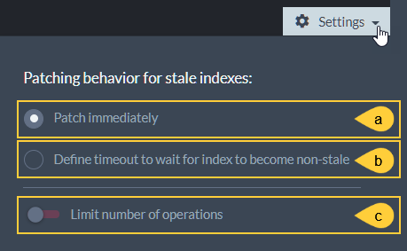
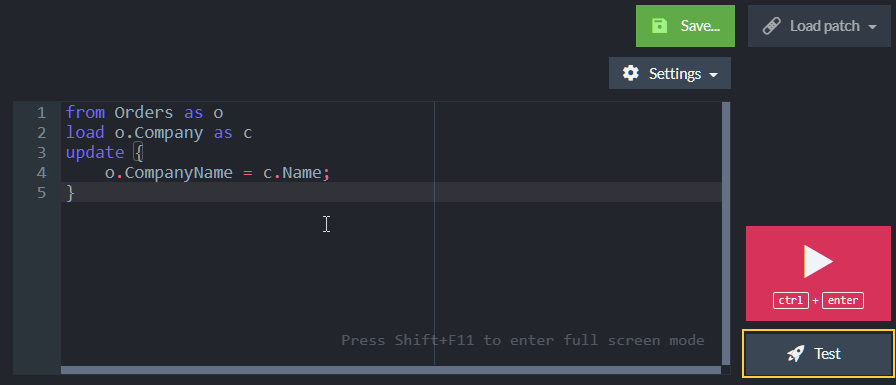

import Admonition from '@theme/Admonition';
import Tabs from '@theme/Tabs';
import TabItem from '@theme/TabItem';
import CodeBlock from '@theme/CodeBlock';
import LanguageSwitcher from "@site/src/components/LanguageSwitcher";
import LanguageContent from "@site/src/components/LanguageContent";

# Documents: Patch View
<Admonition type="note" title="">

* Use the **Patch View** to apply an update on your documents in a single operation.  
* A patch includes a **query** that finds the documents you want to update, and an **update operation**.  
* Read more about patching [here](../../../client-api/operations/patching/set-based.mdx).  

* In this page:  
  * [Patch View](../../../studio/database/documents/patch-view.mdx#patch-view)  
  * [Patch Configuration](../../../studio/database/documents/patch-view.mdx#patch-configuration)  
  * [Apply Patch](../../../studio/database/documents/patch-view.mdx#apply-patch)  
  * [Test Patch](../../../studio/database/documents/patch-view.mdx#test-patch)  

</Admonition>
## Patch View

1. **Patch View**  
   Click to open the patch view.  
2. **Database**  
   Click to select the database you want to patch.  
3. **Syntax Samples**  
   Click to display patching [syntax samples](../../../client-api/operations/patching/set-based.mdx#examples).  
4. **Patch Box**  
   Enter your patch script in the patch box.  
5. **Apply Patch**  
   Click to apply the patch to your documents (see [Apply Patch](../../../studio/database/documents/patch-view.mdx#apply-patch) below).  
6. **Test Patch**  
   Click to test your patch without actually applying it to your documents (see [Test Patch](../../../studio/database/documents/patch-view.mdx#test-patch) below).  

## Patch Configuration

1. **Save Patch**  
   Click to save the currently displayed patch in the local browser storage.  
     
   Enter a name and click the Save button again to save the patch.  
2. **Load Patch**  
   Click to load a stored patch.  
   Recent (unsaved) patches will also be shown/listed here.  
     
   Hover over a patch name to display its preview.  
   Click the patch name or the preview **Load** button to load the patch.  
3. **Patch Settings**  
     

    * a. **Patch immediately**  
         When this option is selected, clicking the **Apply Patch** button applies 
         the patch immediately.  

    * b. **Define timeout to wait for index to become non-stale**  
         When this option is selected, clicking the **Apply Patch** button 
         applies the patch only after the index used by the patch has become 
         [non-stale](../../../indexes/indexing-basics.mdx#stale-indexes).  
         If the index remains stale for the duration of the set timeout, 
         the operation is canceled and an exception is thrown.  
           

    * c. **Limit number of operations**  
         Toggle this option ON to set the max number of patch operations per second.  
           

## Apply Patch

  

While the patch is executed, a runtime dialog presents -  

1. **Time Elapsed**  
   Time since the operation began  
2. **Index**  
   Either the index that was explicitly used by the patch, or the internal RavenDB 
   index that is used [for collection queries](../../../client-api/faq/what-is-a-collection.mdx#collection-usages).  
3. **Processed**  
   Number of documents already processed / Number of documents yet to be processed  
4. **Processing Speed**  
   Number of documents processed per sec  
5. **Estimated time left**  
6. **Query**  
   Patch's query and update operation  
7. **Progress Bar**  
8. **Close**  
   Click to **close this dialog**.  
   The operation will proceed in the background.  
   The dialog can be re-opened from Studio's Notification Center.  
9. **Abort**  
   Click to **abort the patch operation**.  
   The operation will be reverted.  

## Test Patch

  
Click **Test** to open the patch test dialog.
  

1. **Document**  
   Enter a document ID on which to run the patch in the test mode and click Load Document.  
   The document preview will show in the 'Before' area on the left side.  
2. **Test**  
   Click 'Test' to apply the patch to the selected document.  
   A copy of the document will be patched, leaving the original document unchanged.  
   A preview of the document after the patch will show in the 'After' area on the right.  
3. **Before**  
   Browse the document before the patch has been applied to it.  
   Click Shift+F11 to expand or collapse an enlarged view of the document.  
4. **After**  
   Browse the document After the patch has been applied to it.  
   See line 198 in the "After" view depicted above for an example of a text modified by the patch.  
   Click Shift+F11 to expand or collapse an enlarged view of the document.  
5. **Done**  
   Click 'Done' to close the test view and return to the patch view.  

