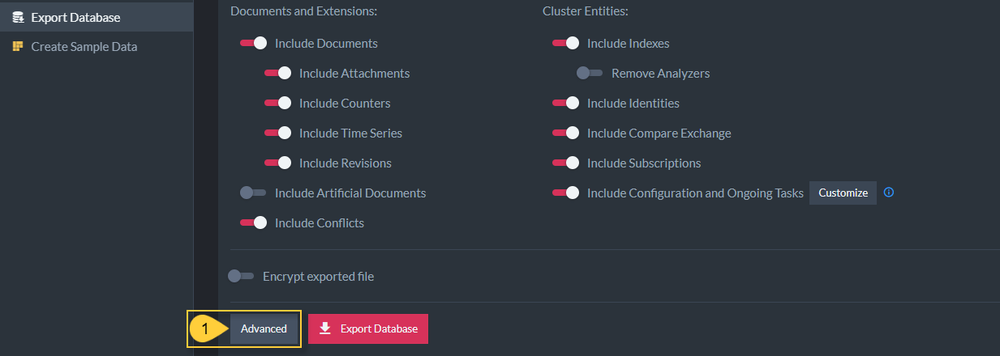

import Admonition from '@theme/Admonition';
import Tabs from '@theme/Tabs';
import TabItem from '@theme/TabItem';
import CodeBlock from '@theme/CodeBlock';
import LanguageSwitcher from "@site/src/components/LanguageSwitcher";
import LanguageContent from "@site/src/components/LanguageContent";

# Export Database to a .ravendbdump file

* A `.ravendbdump` file is RavenDB's format for exporting/importing a database, with backward compatibility between RavenDB versions.  

* To export a `.ravendbdump` file, we need an **existing source** database which you can export to file, then import into an **empty destination** database.  

In this page:

  * [Export Database to a .ravendbdump file](../../../studio/database/tasks/export-database.mdx#export-database-to-a-ravendbdump-file)  
  * [Export options](../../../studio/database/tasks/export-database.mdx#export-options)  
    
  * [Advanced Export Options](../../../studio/database/tasks/export-database.mdx#advanced-export-options)  
    * [Export all collections](../../../studio/database/tasks/export-database.mdx#export-all-collections)  
    * [Transform Script](../../../studio/database/tasks/export-database.mdx#transform-script)  
    * [Customize Configuration and Ongoing Tasks](../../../studio/database/tasks/export-database.mdx#customize-configuration-and-ongoing-tasks)  
    * [Export Command via PowerShell](../../../studio/database/tasks/export-database.mdx#export-command-via-powershell)  

  

1. **Select database**  
   Select the database to be exported.  
   It can be selected at the top of the Studio or by choosing from the detailed list of databases.  
2. **Tasks**  
   Click the Tasks tab.  
3. **Export Database**  
   Select Export Database to open the export options view.  
  

## Export options 

Here you can filter the data you want to export, include encryption key, select collections and configurations, and apply a transform script on your documents.  

1. [Include Documents](../../../studio/database/documents/document-view.mdx)  
   Toggle to include documents and to enable inclusion of the following document related items:  
    - [Include Attachments](../../../document-extensions/attachments/what-are-attachments.mdx)  
      Determines whether or not legacy attachments contained in the file should be imported where legacy attachments refers to v2.x and v3.x attachments.  
    - [Include Counters](../../../document-extensions/counters/overview.mdx)  
    - [Include Artificial Documents](../../../studio/database/indexes/create-map-reduce-index.mdx#artificial-documents--vs--regular-documents)  
    - [Include Revisions](../../../server/extensions/revisions.mdx)  
    - [Include Conflicts](../../../client-api/cluster/document-conflicts-in-client-side.mdx)  

2. Other Features
  - [Include Indexes](../../../indexes/what-are-indexes.mdx)  
    - [Remove Analyzers](../../../indexes/using-analyzers.mdx)  
  - [Include Identities](../../../client-api/document-identifiers/working-with-document-identifiers.mdx)  
  - [Include Compare Exchange](../../../client-api/operations/compare-exchange/overview.mdx)  
  - [Include Subscriptions](../../../client-api/data-subscriptions/what-are-data-subscriptions.mdx)  
  - [Include Configuration and OngoingTasks](../../../studio/database/tasks/import-data/import-from-ravendb.mdx#customize-configuration-and-ongoing-tasks)  

3. [Imported file is encrypted](../../../server/security/overview.mdx#encryption)  
   Toggle to include the decryption key when importing data from encrypted file.  

 <Admonition type="note" title="Import settings for items that don't exist in source database" id="import-settings-for-items-that-don-t-exist-in-source-database" href="#import-settings-for-items-that-don-t-exist-in-source-database">
If any of the options is set but the source database doesn't contain items of that type, the item will be skipped.
</Admonition>

## Advanced export options

 1. **Advanced**  
    Click the Advanced button to access the advanced export options.  
     * [Export all collections](../../../studio/database/tasks/export-database.mdx#export-all-collections)  
     * [Transform Script](../../../studio/database/tasks/export-database.mdx#transform-script)  
     * [Customize Configuration and Ongoing Tasks](../../../studio/database/tasks/export-database.mdx#customize-configuration-and-ongoing-tasks)  

### Export all collections

In the Studio, select **database** &gt; click **Task** tab &gt; select **Export Database** &gt; click the **Advanced** button at the bottom &gt; toggle "Export all collections".  

- **Export all collections**:  
  Determines whether to export All database collections.  
    - This is on by default which means that all of the collections the database will be exported.  
    - If **Export all collections** is disabled, a list of all database collections will be displayed with an option to filter collections by name.  
      - Toggle "On" (switch becomes red and white) to include specific collections in the export.  
### Transform Script

In the Studio, select **database** &gt; click **Task** tab &gt; select **Export Database** &gt; click the **Advanced** button at the bottom &gt; toggle "Use Transform Script".  

- **Use Transform Script**:  
  Enabling it allows you to provide a [transform javascript](../../../server/ongoing-tasks/etl/basics.mdx#transform), that would operate on each document contained by the file.  

Sample transform javascript: 

<TabItem value="javascript" label="javascript">
<CodeBlock language="javascript">
{`var id = doc['@metadata']['@id'];
if (id === 'orders/999')
    throw 'skip'; // filter-out
`}
</CodeBlock>
</TabItem>
### Customize Configuration and Ongoing Tasks

In the Studio, select **database** &gt; click **Task** tab &gt; select **Export Database** &gt; click the **Advanced** button at the bottom &gt; toggle "Customize Configuration and Ongoing Tasks".  

**Ongoing tasks**:  

- [Periodic Backups](../../../studio/database/tasks/backup-task.mdx)  
- [External replications](../../../studio/database/tasks/ongoing-tasks/external-replication-task.mdx)  
- [ETL Tasks - Extract, Transform, Load](../../../server/ongoing-tasks/etl/basics.mdx)  
- [Pull Replication Sinks](../../../studio/database/tasks/ongoing-tasks/hub-sink-replication/overview.mdx)  
- [Pull Replication Hubs](../../../studio/database/tasks/ongoing-tasks/hub-sink-replication/overview.mdx)  

**Other:**

- [Settings](../../../studio/database/settings/database-settings.mdx)  
- [Conflict Solver Configuration](../../../client-api/operations/server-wide/modify-conflict-solver.mdx)  
- [Revisions Configuration](../../../client-api/operations/revisions/configure-revisions.mdx)  
- [Document Expiration](../../../server/extensions/expiration.mdx)  
- [Client Configuration](../../../studio/server/client-configuration.mdx)  
- [Custom Sorters](../../../indexes/querying/sorting.mdx#creating-a-custom-sorter)  

**Connection Strings**

- [Connection Strings](../../../client-api/operations/maintenance/connection-strings/add-connection-string.mdx) used by ETL tasks to authenticate and connect to external databases will be exported.
### Export Command via PowerShell

In the Studio, select **database** &gt; click **Task** tab &gt; select **Export Database** &gt; click the **Advanced** button at the bottom.  

- Generates the commands to run the exporting logic that you configure in this studio view from PowerShell.  

