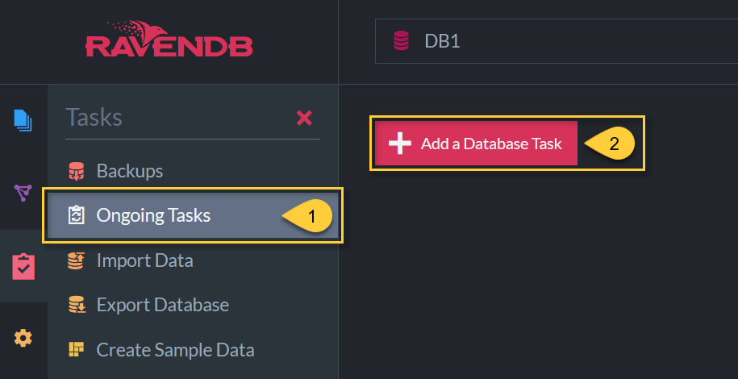
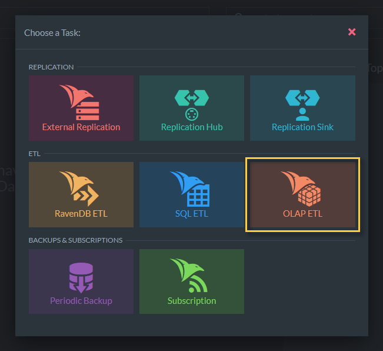
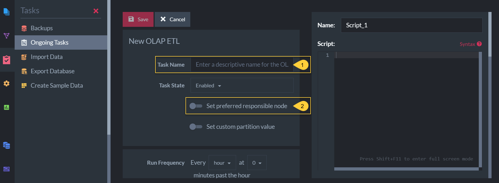
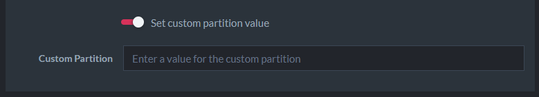
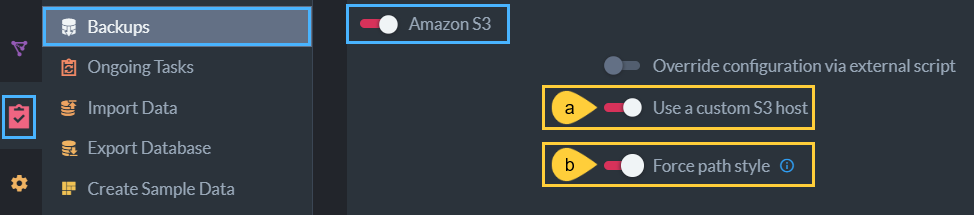
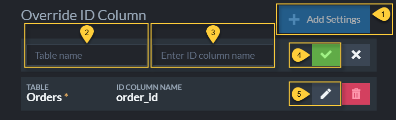

import Admonition from '@theme/Admonition';
import Tabs from '@theme/Tabs';
import TabItem from '@theme/TabItem';
import CodeBlock from '@theme/CodeBlock';
import LanguageSwitcher from "@site/src/components/LanguageSwitcher";
import LanguageContent from "@site/src/components/LanguageContent";

# OLAP ETL Task
<Admonition type="note" title="Note">

* The **OLAP ETL task** is an [ETL](../../../../server/ongoing-tasks/etl/basics.mdx) process that converts RavenDB data to the 
[_Apache Parquet_](https://parquet.apache.org/docs) file format, and sends 
it to one or more of these destinations:  
  * [Amazon S3](https://aws.amazon.com/s3/)
  * [Amazon Glacier](https://aws.amazon.com/glacier/)
  * [Microsoft Azure](https://azure.microsoft.com/)
  * [Google Cloud Platform](https://cloud.google.com/)
  * File Transfer Protocol
  * Local storage

* This page explains how to create an OLAP ETL task using the studio. To 
learn more about OLAP ETL tasks, and how to create one using the client API, 
see [Ongoing Tasks: OLAP ETL](../../../../server/ongoing-tasks/etl/olap.mdx).

* In this page:  
  * [Navigate to the OLAP ETL View](../../../../studio/database/tasks/ongoing-tasks/olap-etl-task.mdx#navigate-to-the-olap-etl-view)
  * [Define an OLAP ETL Task](../../../../studio/database/tasks/ongoing-tasks/olap-etl-task.mdx#define-an-olap-etl-task)
      * [Custom Partition Value](../../../../studio/database/tasks/ongoing-tasks/olap-etl-task.mdx#custom-partition-value)
      * [Run Frequency](../../../../studio/database/tasks/ongoing-tasks/olap-etl-task.mdx#run-frequency)
      * [OLAP Connection String](../../../../studio/database/tasks/ongoing-tasks/olap-etl-task.mdx#olap-connection-string)
      * [OLAP ETL Destinations](../../../../studio/database/tasks/ongoing-tasks/olap-etl-task.mdx#olap-etl-destinations)
      * [Transform Scripts](../../../../studio/database/tasks/ongoing-tasks/olap-etl-task.mdx#transform-scripts)
      * [Override ID column](../../../../studio/database/tasks/ongoing-tasks/olap-etl-task.mdx#override-id-column)

</Admonition>
## Navigate to the OLAP ETL View

To begin creating your OLAP ETL task:  

1. Navigate to **Tasks** &gt; **Ongoing Tasks**  
2. Click on "Add a Database Task"  

Select "OLAP ETL"  

## Define an OLAP ETL Task

1. The name of this ETL task (optional).  
2. Choose which of the cluster nodes will run this task (optional).  

### Custom Partition Value

Set a custom partition value that can be referenced in the transform script.  

* A custom partition can be defined to differentiate parquet file locations when 
using the same connection string in multiple OLAP ETL tasks.  
* The custom partition **name** is defined inside the [transformation scripts](../../../../studio/database/tasks/ongoing-tasks/olap-etl-task.mdx#transform-scripts).  
* The custom partition **value** is defined in the input box above.  
* The custom partition value is referenced in the transform script as 
`$customPartitionValue`.  
* A parquet file path with custom partition will have the following format:  
    `{RemoteFolderName}/{CollectionName}/{customPartitionName=$customPartitionValue}`  
* Learn more in [Ongoing Tasks: OLAP ETL](../../../../server/ongoing-tasks/etl/olap.mdx#the-custom-partition-value).  

### Run Frequency

1. **Run Frequency**  
   Select the exact timing and frequency at which this task should run from the dropdown menu.  
    * The maximum frequency is once every minute.  
2. **Custom**  
   Select 'custom' from the dropdown menu to schedule the task using your own customized 
[cron expression](https://docs.oracle.com/cd/E12058_01/doc/doc.1014/e12030/cron_expressions.htm).  

### OLAP Connection String

* Select an existing connection string from the available dropdown or 

* **Create a new OLAP connection string**  
  Toggle on to create and define a new OLAP connection string for this ETL task  
  * If you choose to create a new connection string you can enter its name and destination here.  
  * Multiple destinations can be defined.  

### OLAP ETL Destinations

Select one or more destinations from this list. Clicking each toggle reveals further 
fields and configuration options for each destination.  

 1. Local machine storage  
   - Set a folder of your choice (any directory that can be accessed from your machine)  
 2. Cloud storage options  
   * If you use an [Amazon S3](https://aws.amazon.com/s3/) custom host:
    
     * a- **Use a custom S3 host**  
       Toggle to provide a custom server URL.  
     * b- **Force path style**  
       Toggle to change the default S3 bucket [path convention](https://aws.amazon.com/blogs/aws/amazon-s3-path-deprecation-plan-the-rest-of-the-story/) on your custom Amazon S3 host.  

### Transform Scripts

You can edit, delete or add to the list of existing transform scripts.

1. Add a new transform script.  
2. Edit an existing transform script.  

Create and edit transform Javascripts on the right side of the OLAP ETL Studio view.

1. **Name**  
   The script name is generated once the 'Add' button is clicked. The name of a script 
   is always in the format: "Script #[order of script creation]".  
2. **The transform script**  
   Learn more about [transformation scripts](../../../../server/ongoing-tasks/etl/raven.mdx#transformation-script-options).  
3. **Select a collection**  
   (or enter a new collection name) on which this script will operate.  
4. **Collections Selected**  
   The selected collection names on which the script operates.  
5. **Apply script to documents from beginning of time (Reset)**  
   * If selected, this script will operate on all existing documents in the 
   specified collections the first time the task runs.  
   * When not selected, this script operates only on new documents.  

<Admonition type="info" title="Info">

Every parquet table that is created by a transform script includes two columns that 
aren't specified in the script:  

* `_id`  
  Contains the source document ID. The default name used for this column is `_id`.  
  You can override this name in the task definition - see more 
  [below](../../../../studio/database/tasks/ongoing-tasks/olap-etl-task.mdx#override-id-column).  
* `_lastModifiedTime`  
  The value of the `last-modified` field in a document's metadata. Represented in unix time.  

</Admonition>

### Override ID Column

These settings allow you to specify a different column name for the document ID column 
in a parquet file. The default ID column name is `_id`.  

1. Add a new setting.  
2. Select the name of the parquet table for which you want to override the ID column.  
3. Select the name for the table's ID column that overrides the default `_id` name.  
4. Click to add this setting.  
5. Click to edit this setting.  

