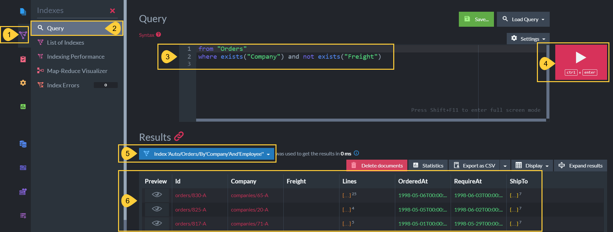

import Admonition from '@theme/Admonition';
import Tabs from '@theme/Tabs';
import TabItem from '@theme/TabItem';
import CodeBlock from '@theme/CodeBlock';
import LanguageSwitcher from "@site/src/components/LanguageSwitcher";
import LanguageContent from "@site/src/components/LanguageContent";

export const supportedLanguages = ["csharp", "nodejs"];

# Filter by Non-Existing Field  
<LanguageSwitcher supportedLanguages={supportedLanguages} />
<LanguageContent language="csharp">

<Admonition type="note" title="">

* There are situations where new fields are added to some documents in a collection over time.  

* To find the documents that are missing the newly added fields you can either:  
    * [Query the collection (dynamic query)](../../../client-api/session/querying/how-to-filter-by-non-existing-field.mdx#query-the-collection-(dynamic-query))  
    * [Query a static index](../../../client-api/session/querying/how-to-filter-by-non-existing-field.mdx#query-a-static-index)  
    * [Query by RQL in Studio](../../../client-api/session/querying/how-to-filter-by-non-existing-field.mdx#query-by-rql-in-studio)  

----

</Admonition>
## Query the collection (dynamic query)

* You can make a dynamic query on a collection to find which documents are missing the specified field.

* Use extension methods `Not` & `WhereExists` that are accessible from [DocumentQuery](../../../client-api/session/querying/document-query/what-is-document-query.mdx).

* This will either create a new auto-index or add the queried field to an existing auto-index.  
  Learn more about the dynamic query flow [here](../../../client-api/session/querying/how-to-query.mdx#dynamicquery).

<Admonition type="note" title="">

__Example__

<Tabs groupId='languageSyntax'>
<TabItem value="DocumentQuery" label="DocumentQuery">
<CodeBlock language="csharp">
{`List<Order> ordersWithoutFreightField = session
    .Advanced
     // Define a DocumentQuery on 'Orders' collection
    .DocumentQuery<Order>()
     // Search for documents that do Not contain field 'Freight'
    .Not.WhereExists("Freight")
     // Execute the query
    .ToList();

// Results will be only the documents that do Not contain the 'Freight' field in 'Orders' collection
`}
</CodeBlock>
</TabItem>
<TabItem value="DocumentQuery_async" label="DocumentQuery_async">
<CodeBlock language="csharp">
{`List<Order> ordersWithoutFreightField = await asyncSession
    .Advanced
     // Define a DocumentQuery on 'Orders' collection
    .AsyncDocumentQuery<Order>()
     // Search for documents that do Not contain field 'Freight'
    .Not.WhereExists("Freight")
     // Execute the query
    .ToListAsync();

// Results will be only the documents that do Not contain the 'Freight' field in 'Orders' collection
`}
</CodeBlock>
</TabItem>
<TabItem value="RQL" label="RQL">
<CodeBlock language="sql">
{`from "Orders"
where true and not exists("Freight")
// \`not\` cannot be used immediately after \`where\`, thus we use \`where true\`.
`}
</CodeBlock>
</TabItem>
</Tabs>

</Admonition>

## Query a static index

* You can search for documents with missing fields by querying a static index.  

* The index definition must have the following document-fields indexed:

    1. The field that is suspected to be __missing in some documents__.  
  
    2. A document-field that __exists in all documents__ in the collection,  
       (i.e. the _Id_ field, or any other field that is common to all).  
       Indexing such a field is mandatory so that all documents in the collection will be indexed.

<Admonition type="note" title="">

__Example__

<TabItem value="the_index" label="the_index">
<CodeBlock language="csharp">
{`// Define a static index on the 'Orders' collection
// ================================================

public class Orders_ByFreight : AbstractIndexCreationTask<Order, Orders_ByFreight.IndexEntry>
\{
    public class IndexEntry
    \{
        // Define the index-fields
        public decimal Freight \{ get; set; \}
        public string Id \{ get; set; \}
    \}
    
    public Orders_ByFreight()
    \{
        // Define the index Map function
        Map = orders => from doc in orders
            select new IndexEntry
            \{
                // Index a field that might be missing in SOME documents
                Freight = doc.Freight,
                // Index a field that exists in ALL documents in the collection
                Id = doc.Id
            \};
    \}
\}
`}
</CodeBlock>
</TabItem>

<Tabs groupId='languageSyntax'>
<TabItem value="DocumentQuery" label="DocumentQuery">
<CodeBlock language="csharp">
{`// Query the index
// ===============

List<Order> ordersWithoutFreightField = session
    .Advanced
     // Define a DocumentQuery on the index
    .DocumentQuery<Order, Orders_ByFreight>()
     // Verify the index is not stale (optional)
    .WaitForNonStaleResults()
     // Search for documents that do Not contain field 'Freight'
    .Not.WhereExists(x => x.Freight)
     // Execute the query
    .ToList();

// Results will be only the documents that do Not contain the 'Freight' field in 'Orders' collection
`}
</CodeBlock>
</TabItem>
<TabItem value="DocumentQuery_async" label="DocumentQuery_async">
<CodeBlock language="csharp">
{`// Query the index
// ===============

List<Order> ordersWithoutFreightField = await asyncSession
    .Advanced
     // Define a DocumentQuery on the index
    .AsyncDocumentQuery<Order, Orders_ByFreight>()
     // Verify the index is not stale (optional)
    .WaitForNonStaleResults()
     // Search for documents that do Not contain field 'Freight'
    .Not.WhereExists(x => x.Freight)
     // Execute the query
    .ToListAsync();

// Results will be only the documents that do Not contain the 'Freight' field in 'Orders' collection
`}
</CodeBlock>
</TabItem>
<TabItem value="RQL" label="RQL">
<CodeBlock language="sql">
{`from index "Orders/ByFreight"
where true and not exists("Freight")
// \`not\` cannot come immediately after \`where\`, thus we use \`where true\`.
`}
</CodeBlock>
</TabItem>
</Tabs>

</Admonition>

## Query by RQL in Studio

* You can query for documents with missing fields in the Studio's [Query view](../../../studio/database/queries/query-view.mdx).

* Use an [RQL](../../../client-api/session/querying/what-is-rql.mdx) expression such as:

<TabItem value="sql" label="sql">
<CodeBlock language="sql">
{`from "Orders"    
where exists("Company") and not exists("Freight")
`}
</CodeBlock>
</TabItem>

* In the `where` clause,  
  first search for a field that __exists__ in every document in the collection,  
  and then search for the field that __may not exist__ in some of document.

1. **Indexes**  
   Click to see the Indexes menu.
2. **Query**  
   Select to open the Query view.
3. **Query editor**  
   Write the RQL query.
4. **Run Query**  
   Click or press ctrl+enter to run the query.
5. **Index used**  
   This is the name of the auto-index created to serve this query.  
   You can click it to see the available Studio options for this index.  
6. **Results**  
   This is the list of documents that do not contain the specified 'Freight' field.  
   (Field "Freight" was explicitly removed from these Northwind documents for this example.)

</LanguageContent>
<LanguageContent language="nodejs">

<Admonition type="note" title="">

* There are situations where new fields are added to some documents in a collection over time.  

* To find the documents that are missing the newly added fields you can either:  
    * [Query the collection (dynamic query)](../../../client-api/session/querying/how-to-filter-by-non-existing-field.mdx#query-the-collection-(dynamic-query))  
    * [Query a static index](../../../client-api/session/querying/how-to-filter-by-non-existing-field.mdx#query-a-static-index)  
    * [Query by RQL in Studio](../../../client-api/session/querying/how-to-filter-by-non-existing-field.mdx#query-by-rql-in-studio)  

----

</Admonition>
## Query the collection (dynamic query)

* You can make a dynamic query on a collection to find which documents are missing the specified field.

* Use extension methods `not` & `whereExists` that are accessible from the [query](../../../client-api/session/querying/how-to-query.mdx) API.

* This will either create a new auto-index or add the queried field to an existing auto-index.  
  Learn more about the dynamic query flow [here](../../../client-api/session/querying/how-to-query.mdx#dynamicquery).

<Admonition type="note" title="">

__Example__

<Tabs groupId='languageSyntax'>
<TabItem value="DocumentQuery" label="DocumentQuery">
<CodeBlock language="js">
{`const ordersWithoutFreightField = await session
     // Define a query on 'orders' collection
    .query({ collection: "orders" })
     // Search for documents that do Not contain field 'freight'
    .not()
    .whereExists("freight")
     // Execute the query
    .all();

// Results will be only the documents that do Not contain the 'freight' field in 'orders' collection
`}
</CodeBlock>
</TabItem>
<TabItem value="RQL" label="RQL">
<CodeBlock language="sql">
{`from "orders"
where true and not exists("freight")
// \`not\` cannot be used immediately after \`where\`, thus we use \`where true\`.
`}
</CodeBlock>
</TabItem>
</Tabs>

</Admonition>

## Query a static index

* You can search for documents with missing fields by querying a static index.  

* The index definition must have the following document-fields indexed:

    1. The field that is suspected to be __missing in some documents__.  
  
    2. A document-field that __exists in all documents__ in the collection,  
       (i.e. the _id_ field, or any other field that is common to all).  
       Indexing such a field is mandatory so that all documents in the collection will be indexed.

<Admonition type="note" title="">

__Example__

<TabItem value="the_index" label="the_index">
<CodeBlock language="js">
{`// Define a static index on the 'orders' collection
// ================================================

class Orders_ByFreight extends AbstractJavaScriptIndexCreationTask<Order> \{

    constructor() \{
        super();

        // Define the index-fields 
        this.map("orders", o => (\{
            // Index a field that might be missing in SOME documents
            freight: o.firstName,
            // Index a field that exists in ALL documents in the collection
            id: o.lastName
        \}));
    \}
\}
`}
</CodeBlock>
</TabItem>

<Tabs groupId='languageSyntax'>
<TabItem value="DocumentQuery" label="DocumentQuery">
<CodeBlock language="js">
{`// Query the index
// ===============

const employees = await session
     // Define a query on the index
    .query({ indexName: "Orders/ByFreight" })
     // Search for documents that do Not contain field 'freight'
    .not()
    .whereExists("freight")
     // Execute the query
    .all();

// Results will be only the documents that do Not contain the 'freight' field in 'orders' collection
`}
</CodeBlock>
</TabItem>
<TabItem value="RQL" label="RQL">
<CodeBlock language="sql">
{`from index "Orders/ByFreight"
where true and not exists("freight")
// \`not\` cannot come immediately after \`where\`, thus we use \`where true\`.
`}
</CodeBlock>
</TabItem>
</Tabs>

</Admonition>

## Query by RQL in Studio

* You can query for documents with missing fields in the Studio's [Query view](../../../studio/database/queries/query-view.mdx).

* Use an [RQL](../../../client-api/session/querying/what-is-rql.mdx) expression such as:

<TabItem value="sql" label="sql">
<CodeBlock language="sql">
{`from "orders"    
where exists("company") and not exists("freight")
`}
</CodeBlock>
</TabItem>

* In the `where` clause,  
  first search for a field that __exists__ in every document in the collection,  
  and then search for the field that __may not exist__ in some of document.

1. **Indexes**  
   Click to see the Indexes menu.
2. **Query**  
   Select to open the Query view.
3. **Query editor**  
   Write the RQL query.
4. **Run Query**  
   Click or press ctrl+enter to run the query.
5. **Index used**  
   This is the name of the auto-index created to serve this query.  
   You can click it to see the available Studio options for this index.  
6. **Results**  
   This is the list of documents that do not contain the specified 'Freight' field.  
   (Field "Freight" was explicitly removed from these Northwind documents for this example.)

</LanguageContent>

<!---
### Client API
- [What is a Document Query](../../../client-api/session/querying/document-query/what-is-document-query)
- [How to Filter by Field Presence](../../../client-api/session/querying/how-to-filter-by-field)

### Querying
- [Querying: Filtering](../../../indexes/querying/filtering)
- [Query vs DocumentQuery](../../../client-api/session/querying/document-query/query-vs-document-query)
- [RQL - Raven Query Language](../../../client-api/session/querying/what-is-rql)

### Code Walkthrough
- [Queries - Filtering Results - Basics](https://demo.ravendb.net/demos/csharp/queries/filtering-results-basics)
- [Queries - Filtering with Multiple Conditions](https://demo.ravendb.net/demos/csharp/queries/filtering-results-multiple-conditions)

-->