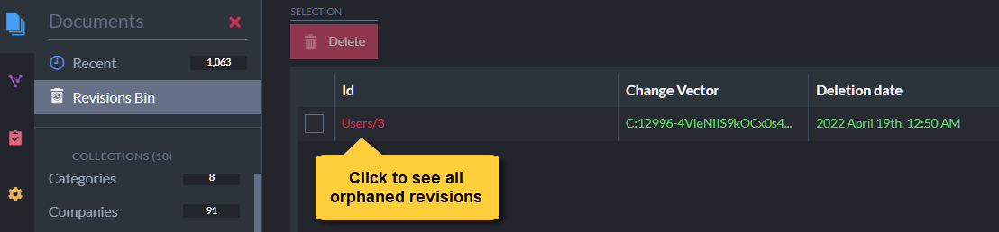

import Admonition from '@theme/Admonition';
import Tabs from '@theme/Tabs';
import TabItem from '@theme/TabItem';
import CodeBlock from '@theme/CodeBlock';
import LanguageSwitcher from "@site/src/components/LanguageSwitcher";
import LanguageContent from "@site/src/components/LanguageContent";

# Document Revisions Overview
<Admonition type="note" title="Note">

* **Document Revisions** are snapshots of documents and their extensions.  
   * Revisions can be created for documents **automatically** when the documents 
     are created, modified, or deleted.  
   * Revisions can also be created for documents [manually](../../document-extensions/revisions/overview.mdx#force-revision-creation).  

* Revisions will be automatically **created** and **purged** for a document 
  only if the Revisions feature is enabled for the document's collection.  
  To enable or disable the Revisions feature for collections, and to set 
  limits for the number of revisions that can be kept per document, 
  apply a [Revisions configuration](../../document-extensions/revisions/overview.mdx#revisions-configuration) 
  to all and/or specific collections.  

* The trail of revisions created for a document can be inspected to track the changes 
  made in the document over time, and the document's live version can be reverted to any 
  of its recorded revisions.  

    <Admonition type="info" title="Info">
    Tracking document revisions allows you, for example, to check how an employee's 
    contract has changed over time, restore a single corrupted document without requiring 
    a backup file, or conduct a full-scale audit of your data.  
    </Admonition>

* Revisions and their configuration can be managed via Client API methods or using Studio.  

* In this page:  
  * [Revisions Configuration](../../document-extensions/revisions/overview.mdx#revisions-configuration)  
     * [Default Settings and Collection-Specific Configurations](../../document-extensions/revisions/overview.mdx#default-settings-and-collection-specific-configurations)  
     * [Defining a Revisions Configuration](../../document-extensions/revisions/overview.mdx#defining-a-revisions-configuration)  
     * [Revisions Configuration Options](../../document-extensions/revisions/overview.mdx#revisions-configuration-options)  
     * [Revisions Configuration Execution](../../document-extensions/revisions/overview.mdx#revisions-configuration-execution)  
     * [Enabling and Disabling Revisions for Existing Documents](../../document-extensions/revisions/overview.mdx#enabling-and-disabling-revisions-for-existing-documents)  
  * [How it Works](../../document-extensions/revisions/overview.mdx#how-it-works)  
  * [Revisions Storage](../../document-extensions/revisions/overview.mdx#revisions-storage)  
  * [Force Revision Creation](../../document-extensions/revisions/overview.mdx#force-revision-creation)  

</Admonition>
## Revisions Configuration

By default, the Revisions feature is **Disabled** for all collections: no revisions 
are created or purged for any document.  
You can change this behavior, and other Revisions settings, by applying 
a Revisions Configuration to the database.  

The Revisions configuration enables or disables the creation and purging 
of revisions for documents, and optionally limits the number of revisions 
kept per document.  

The revision configurations are stored in the database record.  

<Admonition type="note" title="Conflict Revisions" id="conflict-revisions" href="#conflict-revisions">
Revisions created for **conflicting documents** are a special case, that is 
not covered in this article.  

* Conflict revisions are **Enabled** by default.  
* Read about the conflict revisions API here: 
  [Conflict Revisions Configuration](../../document-extensions/revisions/client-api/operations/conflict-revisions-configuration.mdx)  
* Read about managing conflict revisions via Studio here: 
  [Editing the Conflicting Document Defaults](../../studio/database/settings/document-revisions.mdx#editing-the-conflicting-document-defaults)  

</Admonition>
#### Default Settings and Collection-Specific Configurations

The Revisions configuration is comprised of **Default Settings** and/or 
**Collection-specific configurations**.  

* The **default settings** apply to all the documents that a collection-specific 
  configuration is not defined for.  
* **Collection-specific** configurations apply only to documents of the collections they are defined for,  
  overriding the default settings for these collections.  
  <Admonition type="note" title="Note">
  If you apply no default settings, Revisions will be **disabled** for any 
  collection that a collection-specific configuration is not defined for.  
  </Admonition>
#### Defining a Revisions Configuration

You can apply a Revisions configuration using Studio or the Client API.  

* Via Studio:  
   * Manage the Revisions configuration via Studio using the Studio Settings 
     [Document Revisions](../../studio/database/settings/document-revisions.mdx) 
     page.  
   * Inspect and manage the revisions created for each document using Studio's 
     Document View [Revisions tab](../../studio/database/document-extensions/revisions.mdx#revisions-tab).  
* Via Client API:  
  [Read here](../../document-extensions/revisions/client-api/operations/configure-revisions.mdx) 
  how to define and apply a Revisions configuration using the `ConfigureRevisionsOperation`
  Store operation.  
#### Revisions Configuration Options

A Revisions configuration defines -  

* _Whether to Enable or Disable Revisions_.  
   * If the Revisions feature is **Enabled** for a collection,  
     creating, modifying, or deleting any document from this collection will trigger the automatic creation  
     of a new document revision and optionally the Purging of existing revisions for 
     the document.  
   * If the Revisions feature is **Disabled** for a collection,  
     RavenDB will **not** automatically Create or Purge revisions for documents of this collection.  
* _Whether to Limit the number of revisions that can be kept per document_.  
  RavenDB will only purge revisions if they exceed the limits you set.
* [Learn more here](../../document-extensions/revisions/client-api/operations/configure-revisions.mdx#section-2) 
  about the available configuration options.  
#### Revisions Configuration Execution

Creating a Revisions configuration does **not** immediately trigger its execution.  
Default and collection-specific configurations are executed when -  

1. **Documents are Created, Modified, or Deleted**.  
  When a document is created, modified, or deleted, the configuration (either 
  default or collection-specific) that applies to its collection is examined.  
  If the Revisions feature is enabled for this collection:  
   * A revision of the document will be created.  
   * Revisions will optionally be purged according to limits set in the configuration.  

2. **[Enforce Configuration](../../studio/database/settings/document-revisions.mdx#enforce-configuration) is applied**.  
  Enforcing Configuration applies the Revisions configuration immediately 
  throughout the database, **purging** all the revisions that pend purging 
  by default settings or collection-specific configurations and **deleting** 
  all the revisions that no configuration applies to.  
  <Admonition type="warning" title="Warning">
  
  * Large databases and collections may contain numerous revisions pending 
    purging that Enforcing Configuration will purge all at once.  
    Be aware that this operation may require substantial server resources, 
    and time it accordingly.  
  * Revisions that were created over time that no configuration currently 
    applies to will be deleted. Make sure your configuration includes the 
    default settings and collection-specific configurations that will 
    keep the revisions you want to keep intact.  
  </Admonition>
#### Enabling and Disabling Revisions for Existing Documents

* When the Revisions feature is **Enabled** for a populated collection:  
  The first revision will be created for an existing document the next 
  time the document is modified (recording the document **after** its 
  modification), or when the document is deleted.  

* **Disabling Revisions** for a collection after revisions were created:  
   * The creation of new revisions and the purging of existing revisions will stop.  
   * Existing revisions will remain intact.  

## How it Works

Let's play with revisions a little to get a taste of its advantages.  

1. **Enable Revisions** so we can experiment with the feature.  
   The Revisions feature can be enabled using [Studio](../../studio/database/settings/document-revisions.mdx) 
   or the [ConfigureRevisionsOperation](../../document-extensions/revisions/client-api/operations/configure-revisions.mdx) 
   Store operation.  
   
     

2. **Create a new document in the `Users` collection**.  
   We will follow the automatic creation of revisions for this document.  
   You can create the document using [Studio](../../studio/database/documents/create-new-document.mdx#create-new-document) 
   or the [session.Store](../../client-api/session/storing-entities.mdx#example) method.  
   
     

3. **Use Studio to inspect the new document's [Revisions tab](../../studio/database/document-extensions/revisions.mdx#revisions-tab)**.  
   Creating the document also created its first revision.  
   
     
   
     (Click the _See the current document_ button to return to the parent document view.)  

4. **Modify and Save the document**.  
   This will create a second revision.  
   
     
   
5. **Delete the document**.  
   Though you deleted the document, its **audit trail** is **not lost**: 
   all revisions were moved to the [Revisions Bin](../../studio/database/document-extensions/revisions.mdx#revisions-bin),  
   including a new revision (called "Delete-Revision"), created to indicate 
   that the document was deleted.  

      To see the "orphaned" revisions (whose parent document was deleted):  
       * Open the Studio `Documents > Revisions Bin` section  
       * Click the deleted document's ID 
    
      

6. **Restore the document**.  
   To restore the document after deleting it from one of its revisions,  
   create a document with the same ID as the document you deleted.  
   The revisions of the deleted document will be **restored** from the 
   revisions bin and added to the new document. Opening the document's 
   Revisions tab will display the whole audit trail, including the 
   delete-revision created when the old document was deleted and the 
   revision created when the new document was created.  
   
     

## Revisions Storage

### Revisions Documents Storage  

* The creation of a document revision stores a full version of the modified document in the revisions storage,  
  in the same **blittable JSON document** format as that of regular documents.  

* **Revisions Compression**  
   * individual fields are compressed as they are compressed in regular documents:  
     any text field of more than 128 bytes is compressed.  
   * Revisions are compressed by default.  
     Learn [here](../../server/configuration/database-configuration.mdx#databasescompressioncompressrevisionsdefault) 
     how to toggle this database option on and off.  
   * Learn [here](../../server/storage/documents-compression.mdx) how to apply Document Compression to revisions.  
### Revisions Document Extensions Storage

Read [here](../../document-extensions/revisions/revisions-and-other-features.mdx#revisions-and-time-series) about revisions and **time series**.  
Read [here](../../document-extensions/revisions/revisions-and-other-features.mdx#revisions-and-counters) about revisions and **counters**.  
Read [here](../../document-extensions/revisions/revisions-and-other-features.mdx#revisions-and-attachments) about revisions and **attachments**.  

## Force Revision Creation

So far we've discussed the automatic creation of revisions when the feature is enabled.  
But you can also **force the creation** of a document revision, whether the feature is enabled or not.  
This is useful when you choose to disable Revisions but still want to create a revision for a specific document,  
e.g. to take a snapshot of the document as a precaution before editing it.  

* You can force the creation of a revision via Studio or using the 
  [ForceRevisionCreationFor](../../document-extensions/revisions/overview.mdx#force-revision-creation-via-api) 
  API method.  
* A revision **will** be created even if the Revisions feature is disabled for the document's collection.  
* A revision **will** be created even if the document was not modified  
  (unless the document has revisions and the latest revision contains the current document contents).  
#### Force Revision Creation via Studio

To create a revision manually via Studio, use the **Create Revision** button in the 
document view's Revisions tab.  

#### Force Revision Creation via API

To create a revision manually via the API, use the session `ForceRevisionCreationFor` method.  

`ForceRevisionCreationFor` overloads:  
<TabItem value="csharp" label="csharp">
<CodeBlock language="csharp">
{`// Force revision creation by entity.
// Can be used with tracked entities only.
void ForceRevisionCreationFor<T>(T entity, 
              ForceRevisionStrategy strategy = ForceRevisionStrategy.Before);

// Force revision creation by document ID.
void ForceRevisionCreationFor(string id, 
              ForceRevisionStrategy strategy = ForceRevisionStrategy.Before);
`}
</CodeBlock>
</TabItem>

* **Parameters**:

    | Parameter | Type | Description |
    | - | - | - |
    | **entity** | `T` | The tracked entity you want to create a revision for |
    | **id** | string | ID of the document you want to create a revision for |
    | **strategy** | `ForceRevisionStrategy` | Defines the revision creation strategy (see below).   Default: `ForceRevisionStrategy.Before` |

    `ForceRevisionStrategy`:
<TabItem value="csharp" label="csharp">
<CodeBlock language="csharp">
{`public enum ForceRevisionStrategy
\{
    // Do not force a revision
    None,
        
    // Create a forced revision from the document that is currently in store, 
    // BEFORE applying any changes made by the user.  
    // The only exception is a new document, for which a revision will be 
    // created AFTER the update.
    Before
\}
`}
</CodeBlock>
</TabItem>

* **Sample**:
<Tabs groupId='languageSyntax'>
<TabItem value="By_ID" label="By_ID">
<CodeBlock language="csharp">
{`// Force revision creation by ID
session.Advanced.Revisions.ForceRevisionCreationFor(companyId);
session.SaveChanges();
`}
</CodeBlock>
</TabItem>
<TabItem value="By_Entity" label="By_Entity">
<CodeBlock language="csharp">
{`// Force revision creation by entity
var company = new Company { 
        Name = "CompanyProfile" 
    };
session.Store(company);
companyId = company.Id;
session.SaveChanges();

// Forcing the creation of a revision by entity can be performed 
// only when the entity is tracked, after the document is stored.
session.Advanced.Revisions.ForceRevisionCreationFor<Company>(company);
`}
</CodeBlock>
</TabItem>
    </Tabs>

<Admonition type="note" title="When the Revisions feature is disabled:" id="when-the-revisions-feature-is-disabled" href="#when-the-revisions-feature-is-disabled">

Deleting a document that owns a manually-created revision 
will not move the revision to the revisions bin.  

* A `delete revision` will Not be created.  
* Manual revisions will not be kept in the revisions bin.  

</Admonition>

