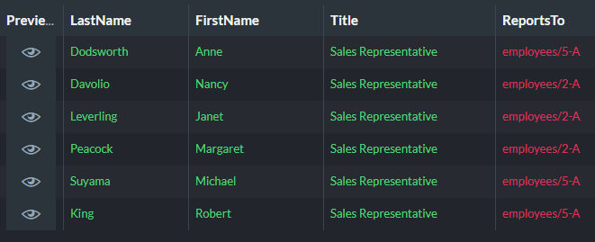
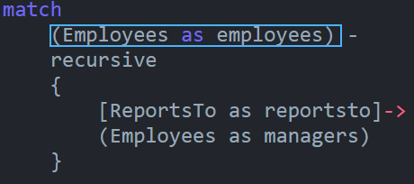
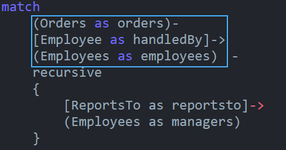
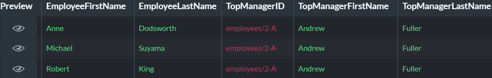

import Admonition from '@theme/Admonition';
import Tabs from '@theme/Tabs';
import TabItem from '@theme/TabItem';
import CodeBlock from '@theme/CodeBlock';
import LanguageSwitcher from "@site/src/components/LanguageSwitcher";
import LanguageContent from "@site/src/components/LanguageContent";

# Recursive Graph Queries  

* A recursive graph query repeatedly queries its own results.  
  You can use recursive queries to explore the hierarchy of an organization or a product, locate 
  a system's smallest component, map a path through a structure, or for many other uses.

* Where a basic graph query would yield a wide dataset, a recursion may provide you with more accurate results.  
  Querying the _chain of command_ in a specific department of a large organization for example may be easier 
  using recursion, while mapping the entire organizational structure is a natural non-recursive graph-query task. 
  Find an example here: [Selective Querying](../../../indexes/querying/graph/graph-queries-recursive.mdx#selective-querying)  

* You can include recursive blocks in 
  [expanded search patterns](../../../indexes/querying/graph/graph-queries-recursive.mdx#recursion-block-in-an-expanded-search-pattern).  

<Admonition type="info" title="">
Sample queries included in this article use only data that is available in the 
[Northwind sample database](../../../studio/database/tasks/create-sample-data.mdx#creating-sample-data), 
so you may easily try them out.  
</Admonition>
<Admonition type="note" title="">

* In this page:  
   * [Syntax and Parameters](../../../indexes/querying/graph/graph-queries-recursive.mdx#syntax-and-parameters)  
       * [Syntax](../../../indexes/querying/graph/graph-queries-recursive.mdx#syntax)  
       * [Parameters](../../../indexes/querying/graph/graph-queries-recursive.mdx#parameters)  
   * [Recursive Queries](../../../indexes/querying/graph/graph-queries-recursive.mdx#recursive-queries)  
       * [Selective Querying](../../../indexes/querying/graph/graph-queries-recursive.mdx#selective-querying)  
       * [Paths](../../../indexes/querying/graph/graph-queries-recursive.mdx#paths)  
   * [Recursion Block In an Expanded Search Pattern](../../../indexes/querying/graph/graph-queries-recursive.mdx#recursion-block-in-an-expanded-search-pattern)  
       * [Narrow Down The Results and Recurse on What's Left](../../../indexes/querying/graph/graph-queries-recursive.mdx#narrowing-down-the-results-and-recurse-on-whats-left)  
       * [Query Recursion Results](../../../indexes/querying/graph/graph-queries-recursive.mdx#query-recursion-results)  

</Admonition>
## Syntax and Parameters

Like other graph queries, a recursive query uses an origin data-node clause that indicates where 
the search is to start, followed by a recursive clause that defines edges and destination data-nodes.  
The recursive query is then executed repeatedly, instating the results of each run as the origin 
of the next round until the search is concluded.  

## Syntax

This is the basic structure of a recursive graph query:  
  

*  
    **1** - Origin data-node clause  
            The initial value of this clause is where the entire recursive query begins.  
            When the query is executed, the results of each recursive loop will be instated as the next round's starting line.  
    
    **2**, **3** - The recursion is declared using the `recursive` keyword, optionally accompanied by 
            an alias and [parameters](../../../indexes/querying/graph/graph-queries-recursive.mdx#parameters).  
  
    **4** - The rest of the query is defined in a curly-brackets **edge** and **data-node** clause.  
            Edges and data nodes retrieved by this clause would be added to the results dataset and 
            instated as the origin for the next recursive loop.  

* This specific query starts with `employees/9-A`.  
  The ReportsTo field of `employees/9-A` is read, and the document whose ID it contains, is retrieved: 
  `employees/5-A`.  
  `employees/5-A` is instated as the new data node to be checked, and the recursive loop runs on.  
    

## Parameters

You can provide a recursive query with **limit** and **path** parameters to adjust its behavior.  
Parameters can be attached to the `recursive` keyword or its alias, within parenthesis.  
E.g. `- recursive(param)` or `- recursive as RecursionAlias(param)`  

* **Limit parameters** 
  Restrict retrieved paths to ones with minimal/maximal number of hops.  

    | Param | Type | Description | Example |
    | ------------- | ------------- | ----- |
    | **Min** | int | **Set a minimum limit for the number of hops between data nodes**.  If the minimum is not reached, the results are discarded. | `- recursive as chainOfManagers(1)` |
    | **Max** | int | **Set a maximum limit for the number of hops between data nodes**.  If the maximum is reached, the search stops. | `- recursive as chainOfManagers(1,2)` <br/> First number is the minimum, <br/> Second is the maximum. |

* **[Path parameters](../../../indexes/querying/graph/graph-queries-recursive.mdx#paths)**
  Determine whether to retrieve **all** matching paths, or a chosen one.  

    | Param | Type | Description | Example |
    | ------------- | ------------- | ----- |
    | **all** | string | query for all the paths that match the search pattern | `- recursive as chainOfManagers(all)` |
    | **longest** | string | Query for the longest matching path | `- recursive as chainOfManagers(longest)` |
    | **shortest** | string | Query for the shortest matching path | `- recursive as chainOfManagers(shortest)` |
    | **lazy** | string | Query for the first matching path. <br/> **`lazy` is the default value.** | `- recursive as chainOfManagers(lazy)` |

<Admonition type="info" title="Combining parameters" id="combining-parameters" href="#combining-parameters">
  You can adjust a recursive query using multiple parameters.
<TabItem value="plain" label="plain">
<CodeBlock language="plain">
{`recursive (int min)
recursive (int min, int max)
recursive (string pattern)
recursive (min, max, pattern)
`}
</CodeBlock>
</TabItem>
   
  E.g. `- recursive as chainOfManagers(2, 4, all)`  
  
  * **Min = 2** - Retrieve only paths at least 2-hops long  
  * **Max = 4** - Retrieve only paths 4-hops long or shorter  
  * **all** - Retrieve all the paths that match the search pattern.  

</Admonition>


## Recursive Queries

## Selective Querying  

A simple non-recursive graph query can easily map chosen relations of a whole collection.  
Here is, for example, a query that maps the chain of command in an organization by retrieving 
employee profiles from the Employees collection and checking who reports to whom.  

<TabItem value="json" label="json">
<CodeBlock language="json">
{`match
    (Employees as employed)-
    [ReportsTo as reportsto]->
    (Employees as employs)
`}
</CodeBlock>
</TabItem>
  

In some cases, i.e. when there are thousands of employees in the queried organization, queries 
like this may be too broad.  
Other non-recursive queries, may be too narrow. In the following query for example, we provide the name 
of an employee whose position in the organization we'd like to explore, and succeed to learn only who their 
direct manager is.  

<TabItem value="json" label="json">
<CodeBlock language="json">
{`match
    (Employees as employed 
        where LastName = "Dodsworth")-
    [ReportsTo as reportsto]->
    (Employees as employs)
`}
</CodeBlock>
</TabItem>
  

A recursive query that is given the same starting point, can provide us with a whole segment of employees, 
starting with the one we selected and ending at the top.  

|    |    |
|----|----|
|
```
match
    (Employees as employed 
       where LastName = "Dodsworth")-
    recursive as chainOfCommand(longest)
    \{
        [ReportsTo as reportsto]->
        (Employees as employs)
    \}
```
|  |  

Note, however, that a recursive query may give as obscure results as a non-recursive one. The following query 
for example is given a whole collection as its starting point, and yields results that resemble the ones we've 
received from the first, non-recursive, query.  

|    |    |
|----|----|
|
```
{`match
    (Employees as employed)-
    recursive as chainOfCommand
    \{
        [ReportsTo as reportsto]->
        (Employees as employs)
    \}
```
|  |  

Here's another example, with **sales representatives** as the data nodes the recursion starts with.  
<TabItem value="json" label="json">
<CodeBlock language="json">
{`match
    (Employees as employed 
       where Title = "Sales Representative")-
    recursive as chainOfCommand
    \{
        [ReportsTo as reportsto]->
        (Employees as employs)
    \}

select 
    employed.LastName, 
    employed.FirstName, 
    employed.Title, 
    employed.ReportsTo
`}
</CodeBlock>
</TabItem>
  
  

## Paths  

Depending on your [settings](../../../indexes/querying/graph/graph-queries-recursive.mdx#parameters), your 
recursion may stop after locating a single [path](../../../indexes/querying/graph/graph-queries-faq.mdx#q-what-are-hops-and-paths), 
or run continuously and locate all available paths.  

* **lazy**: Retrieving the first matching path  

    `lazy` is the default path setting.  
    `-recursive recursionAlias` for example is the same as `recursive recursionAlias(lazy)`.  
  
    Retrieving employee profiles by who they report to for example, would yield a 1-hop path to the employee's direct manager.  
<TabItem value="json" label="json">
<CodeBlock language="json">
{`match
    (Employees as employed where LastName= "Dodsworth")-
    recursive as chainOfCommand(lazy)
    \{
        [ReportsTo as reportsto]->
        (Employees as employs)
    \}

select 
\{
    LastName : employed.LastName, 
    FirstName : employed.FirstName, 
    Title : employed.Title, 
    Reports : employed.ReportsTo
\}
`}
</CodeBlock>
</TabItem>

    

    

* **shortest**: Retrieving a path with the smallest number of hops  
  
    Though results of the current and previous (`lazy`) queries look identical, 
  please note an important difference between the two:  
  While the recursion using the `lazy` setting **stopped after acquiring the first 
  matching path**, the current recursion **continues running and finding paths** in 
  order to be able to conclude which of them is the shortest.  

    |    |    |
    |----|----|
    |
```
{`recursive as chainOfCommand(shortest)
```
|  |  

* **longest**: Retrieving a path with the largest number of hops  
  
    The longest paths may be queried for in various situations, e.g. finding the longest route 
  from an employee to the top of the chain, in an attempt to improve the corporate efficiency.  
  In our example, additional links would be revealed in Mrs. Dodsworth's way to the top.  
<TabItem value="json" label="json">
<CodeBlock language="json">
{`recursive as chainOfCommand(longest)
`}
</CodeBlock>
</TabItem>
  

* **all**: Retrieving all matching paths  
  
    In the graphical view, multiple paths are represented as multiple arrows between nodes.  
  In our case, we see two: a 1-hop path from 9-A to 5-A, and a 2-hops path from 9-A to 2-A.  
<TabItem value="json" label="json">
<CodeBlock language="json">
{`recursive as chainOfCommand(all)
`}
</CodeBlock>
</TabItem>

    

    

    <Admonition type="note" title="You can use projection to organize the paths your recursion retrieves." id="you-can-use-projection-to-organize-the-paths-your-recursion-retrieves" href="#you-can-use-projection-to-organize-the-paths-your-recursion-retrieves">  
See for example how the following query presents retrieved paths.  
<TabItem value="json" label="json">
<CodeBlock language="json">
{`match
    (Employees as employed where LastName= "Dodsworth")-
    recursive as chainOfCommand(all)
    \{
        [ReportsTo as reportsto]->
        (Employees as employs)
    \}

select 
\{
    PathStartID : id(employed),
    LastName : employed.LastName, 
    IDsFullPath : chainOfCommand.map(x => x.reportsto).join(' >> '),
    NamesFullPath : chainOfCommand.map(x => x.employs.LastName).join(' >> ')
\}
`}
</CodeBlock>
</TabItem>

    

</Admonition>

## Recursion Block In an Expanded Search Pattern  

You can recurse through the nodes found by a simple `match` statement, as well as through those found 
by a more complex search pattern.  

Here, the recursive block relates to the data-node clause that initiates the query, 
looking who each employee reports to.  



While here, the data nodes that the recursion relates to are produced by the third clause, 
so in the beginning this query finds orders and the employees that handle them,  
and only then it finds who these employees reports to.  



There can be many good uses to expanded queries with recursive blocks.  
In the following query for example, the first part is **not** recursive.  
It retrieves employee profiles from the Employees collection, 
and shows which orders have been handled by each employee.  
<TabItem value="json" label="json">
<CodeBlock language="json">
{`match
    (Orders as orders)-
    [Employee as employee]->
    (Employees as employees)
`}
</CodeBlock>
</TabItem>


Only then, the query is **expanded by a recursive block** that shows who each employee 
reports to, letting you detect in a single glance whose responsibility each order is 
throughout the ranks.  
<TabItem value="json" label="json">
<CodeBlock language="json">
{`match
    (Orders as orders)-
    [Employee as handledBy]->
    (Employees as employees)-
    recursive as chainOfCommand (lazy)
    \{
        [ReportsTo as reportsto]->
        (Employees as managers)
    \}
`}
</CodeBlock>
</TabItem>


#### Narrowing Down The Results and Recurse on What's Left

Here is another example for narrowing down the results before executing a recursion 
on the remaining data.  
First we locate orders handled by Seatle sales representatives, and then we see who 
they all report to.  

<TabItem value="json" label="json">
<CodeBlock language="json">
{`match
    (Orders as orders)-
    [Employee as handledBy]->
    (Employees as employees where Address.City = "Seattle")-
    recursive as chainOfCommand (longest)
    \{
        [ReportsTo as reportsto]->
        (Employees as managers)
    \}
`}
</CodeBlock>
</TabItem>


#### Query Recursion Results

Examples we've used so far have all placed the recursive block last in the query.  
But a recursive block is a query section like others, and can be followed by edge 
and node clauses.  

* In the following query, the employees located by the recursive block are handled 
  by an additional section that follows it, finding who is top management for each 
  employee.  
<TabItem value="json" label="json">
<CodeBlock language="json">
{`match
    (Orders as orders)-
    [Employee as handledBy]->
    (Employees as employees)-
    recursive as chainOfCommand (lazy)
    \{
        [ReportsTo as reportsto]->
        (Employees as managers)
    \}-
    [ReportsTo as reportsToTop]-> 
    (Employees as top)

select 
    employees.FirstName as EmployeeFirstName, 
    employees.LastName as EmployeeLastName, 
    reportsToTop as TopManagerID,
    top.FirstName as TopManagerFirstName,
    top.LastName as TopManagerLastName
`}
</CodeBlock>
</TabItem>

* With these results:  

    

  

