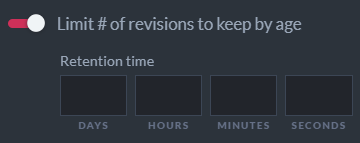
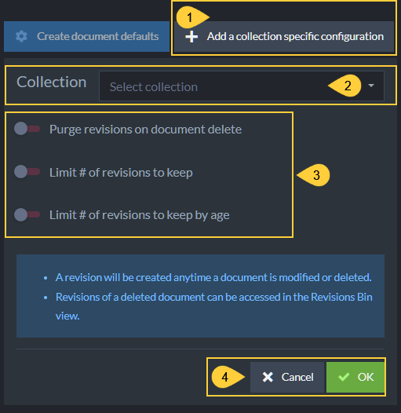
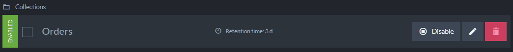
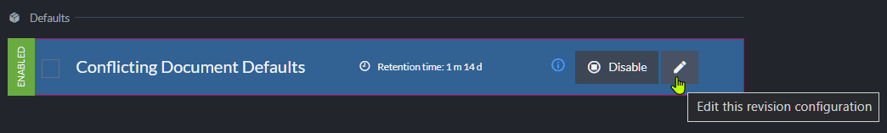
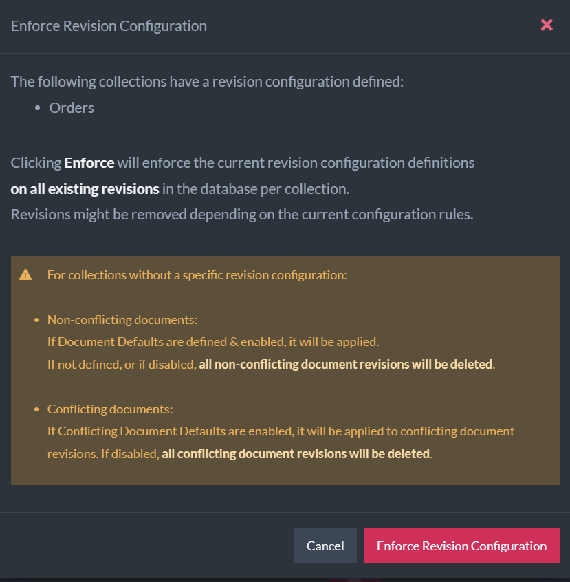

import Admonition from '@theme/Admonition';
import Tabs from '@theme/Tabs';
import TabItem from '@theme/TabItem';
import CodeBlock from '@theme/CodeBlock';
import LanguageSwitcher from "@site/src/components/LanguageSwitcher";
import LanguageContent from "@site/src/components/LanguageContent";

# Settings: Document Revisions
<Admonition type="note" title="">

* Use the **Document Revisions** Settings view to create and manage the 
  Revisions configuration.  
* Learn more about revisions [here](../../../document-extensions/revisions/overview.mdx) 
  and about the Revisions configuration 
  [here](../../../document-extensions/revisions/overview.mdx#revisions-configuration).  

* In this page:
  * [Document Revisions View](../../../studio/database/settings/document-revisions.mdx#document-revisions-view)  
  * [The Revisions Configuration](../../../studio/database/settings/document-revisions.mdx#the-revisions-configuration)  
  * [Defining the Default Settings](../../../studio/database/settings/document-revisions.mdx#defining-default-settings)  
  * [Defining a Collection-Specific Configuration](../../../studio/database/settings/document-revisions.mdx#defining-a-collection-specific-configuration)  
  * [Editing the Conflicting Document Defaults](../../../studio/database/settings/document-revisions.mdx#editing-the-conflicting-document-defaults)  
     * [Example](../../../studio/database/settings/document-revisions.mdx#here-is-an-example-showing-how-revisions-for-conflicting-documents-work)  
  * [Enforce Configuration](../../../studio/database/settings/document-revisions.mdx#enforce-configuration)  

</Admonition>
## Document Revisions View

1. **Document Revisions View**  
   Click to open the **Document Revisions** Settings view.  
2. **Set Status**  
   Check the selection box to select all configurations.  
   Click the _Set Status_ dropdown list to Enable or Disable selected configurations.  
   
3. **Save**  
   Click after modifying the configuration to apply your changes.  
4. **Revert Revisions**  
   Click to [revert the database](../../../document-extensions/revisions/revert-revisions.mdx) 
   to its state at a specified point in time  
    * Documents created **before** the point in time will be **kept**.  
      If a document owns revisions, the document will be **reverted** to the revision created 
      at the specified point in time or to the nearest revision preceding this time.
    * Documents created **after** the specified point in time will be **deleted**.  
    * Only documents will be reverted. Other entities (like ongoing tasks, for example) 
      will not be modified by this process.  
5. **Enforce Configuration**  
   Click to [Enforce the Revisions configuration](../../../studio/database/settings/document-revisions.mdx#enforce-configuration).  
   <Admonition type="warning" title="">
   This operation may delete many revisions irrevocably and require substantial 
   server resources.  
   Please read carefully the section dedicated to it.  
   </Admonition>
6. **Create document defaults**  
   Click to define default settings that will apply to documents of all 
   the collections that a collection-specific configuration isn't defined for.  
7. **Add a collection-specific configuration**  
   Click to create a configuration for a specific collection.  
   If default settings were defined, a collection-specific configuration 
   will override them for this collection.  
8. **The defined Revisions configuration**  
   Read more [below](../../../studio/database/settings/document-revisions.mdx#the-revisions-configuration).  

## The Revisions Configuration

The Revisions configuration can include default settings that apply to all 
document collections, and/or configurations that apply only to specific collections 
and override the default settings for these collections.  

As long as no default settings or collection-specific configurations are defined 
and enabled, the Revisions feature will remain disabled and no revisions will be 
created for any document collection.  

1. **Document Defaults**  
   These are optional Default Settings that apply to all the collections that 
   a collection-specific configuration is not defined for.  
2. **Conflicting Document Defaults**  
   This pre-defined conflict-revisions configuration can help you keep track of 
   document conflicts, by enabling the creation of revisions when conflicts occur 
   and when they are resolved.  
    * The Conflicting Document Defaults configuration cannot be removed.  
    * You can [modify](../../../studio/database/settings/document-revisions.mdx#editing-the-conflicting-document-defaults) 
      this configuration, or, if you are certain you're not interested in tracking 
      document conflicts using revisions, you can disable it.  
3. **Collections**  
   These are optional collection-specific Configurations whose settings override 
   the Document Defaults settings and the Conflicting Document Defaults settings 
   for the collections they are defined for.  
4. **Selection Box**  
   Click to select this configuration.  
   Selected configurations can be enabled or disabled using the **set Status** button.  
5. **Configuration Settings**  
   Read more about the available settings in the sections dedicated to defining them below.  
6. **Controls**  
    * **Disable/Enable** - Click to Enable or Disable the configuration.  
    * **Edit** - Click to modify the configuration.  
    * **Remove** - Click to remove the configuration.  

## Defining Default Settings

1. **Create document defaults**  
   Click to define default settings that will apply to all the collections 
   that a collection-specific configuration is not defined for.  
2. **Purge revisions on document delete**  
   Enable if you want document revisions to be deleted when their 
   parent document is deleted.  
3. **Limit # of revisions to keep**  
     
   Enable to set a limit to the number of revisions that can be kept in the revisions 
   storage per document.  
   If this limit is set and the number of revisions exceeds it, revisions will be 
   purged (starting from the oldest revision) when their parent document is modified.  
    * **Set # of revisions to delete upon document update**  
      Enabling **Limit # of revisions to keep** will display this setting as well:
        
      Enable to set a limit to the number of revisions that RavenDB is allowed 
      to purge per document modification.  
      <Admonition type="info" title="">
      RavenDB will refrain from purging more revisions than this limit allows 
      it to purge, even if the number of revisions that pend purging exceeds it.  
      Setting this limit can reserve server resources if many revisions pend 
      purging, by dividing the purging between multiple document modifications.  
      </Admonition>
4. **Limit # of revisions to keep By Age**  
     
   Enable to set a Revisions age limit.  
   If this limit is set, revisions older than the defined age will be purged 
   when their parent document is modified.  
    * Enabling this setting will also display the **Set # of revisions to delete upon document update** 
      setting (read about it above).  
5. Click **OK** to keep these default settings, or **Cancel**.  
   Confirming will add the new settings to the Revisions configuration **Default** section:  
   
   <Admonition type="info" title="">
   Remember to also [Save the configuration](../../../studio/database/settings/document-revisions.mdx#the-revisions-configuration) 
   to apply the new settings.  
   </Admonition>

## Defining a Collection-Specific Configuration

1. **Add a collection-specific configuration**  
   Click to define a configuration that applies to a specific collection 
   and overrides the default settings for this collection.  
2. **Collection**  
   Click to select a collection to define a configuration for.  
   
3. **Configuration options**  
   These options are similar to those explained above regarding the 
   [default configuration settings](../../../studio/database/settings/document-revisions.mdx#defining-default-settings), 
   the only difference is in the scope of both configurations.  
4. Click **OK** to keep the configuration, or **Cancel**.  
   Confirming will add the new configuration to the **Collections** section:  
   
   <Admonition type="info" title="">
   Remember to also [Save the configuration](../../../studio/database/settings/document-revisions.mdx#the-revisions-configuration) 
   to apply the new settings.  
   </Admonition>

## Editing the Conflicting Document Defaults

* Click the **Edit** button to edit the conflict revisions configuration.  

* The settings are similar to those of the
  [default settings](../../../studio/database/settings/document-revisions.mdx#defining-default-settings) 
  and the collection-specific configuration.  
* Note that the **Limit # of revisions to keep by age** value is set to `45 Days` by default.  
  This means that revisions created for conflicting documents will start to be purged 
  after 45 days, whenever their parent documents are modified.  
#### Here is an Example, showing how revisions for conflicting documents work.

* For this example, we created a conflict by replicating into the database 
  a document with an ID similar to that of a local document.  

    Remember that revisions will be created when documents **enter a conflict** 
    and when the conflict is **resolved**.  
    In this case, **three** revisions were created:  
     1. when the replicated document arrived and entered a conflict state  
     2. when the local document entered a conflict state on the arrival of the replicated document  
     3. when the conflict was resolved by replacing the local document with the replicated one  
        <Admonition type="info" title="">
        In this exmaple, the conflict was resolved by placing the replicated version as the current document.  
        Learn more about conflict resolution [here](../../../studio/database/settings/conflict-resolution.mdx#conflict-resolution).  
        </Admonition>

* To see these revisions, we open the document's 
  [Revisions tab](../../../studio/database/document-extensions/revisions.mdx#revisions-tab).  
  The conflict state is indicated -  
   * by each revision's **title** (i.e. "conflict revision" or "resolved revision")  
   * by a **graphic symbol** next to the revision's change vector  
   * in the revision's **metadata** (i.e. "Conflicted" or "Resolved")  

    

    

    

## Enforce Configuration

* Executing **Enforce Configuration** will:  
   * **Enforce the Revisions configuration's default settings 
     and collection-specific configurations.**  
     All the revisions that pend purging will be **purged**.  
     <Admonition type="info" title="">
     Revisions that pend purging are revisions that should be purged 
     according to the default settings or the collection-specific 
     configuration that applies to them.  
     </Admonition>
   * **Delete all the revisions that no configuration applies to.**  
     If the Revisions configuration has no default settings (or the 
     default settings are disabled), Revisions that no collection-specific 
     configuration applies to will be **deleted**.  
* **Note**:  
      <Admonition type="warning" title="">

      * Large databases and collections may contain numerous revisions 
        pending purging that Enforcing Configuration will purge all at once.  
        Be aware that this operation may require substantial server resources, 
        and time it accordingly.  
      * Revisions that were created over time that no configuration currently 
        applies to will be deleted.  
        Make sure your configuration includes the default settings and 
        collection-specific configurations that will keep the revisions 
        you want to keep intact.  

    </Admonition>

* Clicking 'Enforce Configuration' will present the confirmation dialog 
  shown below, that will list the collections that configurations are defined 
  for, explain the process, and allow you to proceed or cancel the operation.  

    

