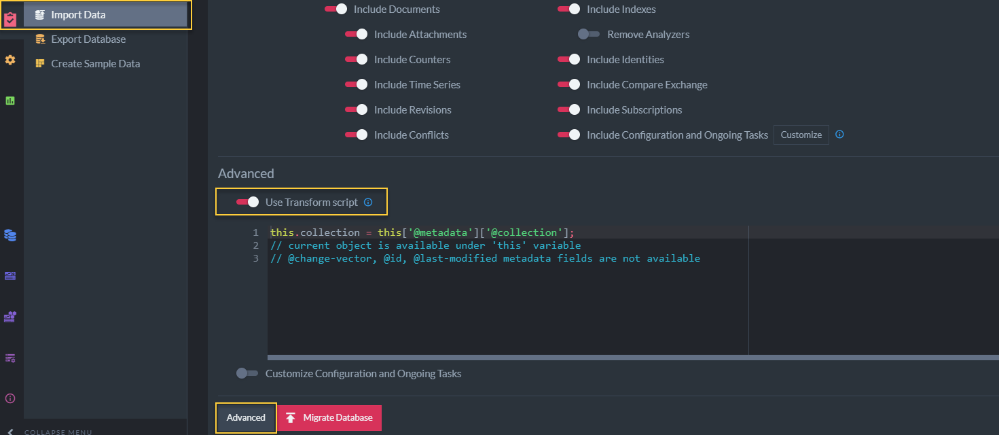

import Admonition from '@theme/Admonition';
import Tabs from '@theme/Tabs';
import TabItem from '@theme/TabItem';
import CodeBlock from '@theme/CodeBlock';
import LanguageSwitcher from "@site/src/components/LanguageSwitcher";
import LanguageContent from "@site/src/components/LanguageContent";

# Import data from .ravendbdump file

A `.ravendbdump` file is RavenDB format for [exporting a database](../export-database.mdx) to file in order to change versions. It is backward compatible between RavenDB versions.  
  
In this page:

* [Import data to destination server from file](../../../../studio/database/tasks/import-data/import-data-file.mdx#import-data-to-destination-server-from-file)  
* [Import options](../../../../studio/database/tasks/import-data/import-data-file.mdx#import-options)  
* [Advanced import options](../../../../studio/database/tasks/import-data/import-data-file.mdx#advanced-import-options)  
    * [Transform Script](../../../../studio/database/tasks/import-data/import-data-file.mdx#transform-script)  
    * [Customize Configuration and Ongoing Tasks](../../../../studio/database/tasks/import-data/import-data-file.mdx#customize-configuration-and-ongoing-tasks)  
    * [Copy command as PowerShell](../../../../studio/database/tasks/import-data/import-data-file.mdx#copy-command-as-powershell)  

## Import data to destination server from file
  
If you have already [exported a database](../export-database.mdx), follow these steps in the studio when you're ready to import from file.  

1. **Tasks**  
   In the destination server, click Tasks tab.  
2. **Import Data**.  
   Click to see various impoprt options.  
3. **From file (.ravendbdump)**  
   Seclect to import from a source database which has previously been [exported](../export-database.mdx).  
4. **Warning**  
   *Make sure that you are not writing over data that you want to keep*.  
   One option is [to start a new database with the studio](https://ravendb.net/docs/article-page/5.2/csharp/studio/database/create-new-database/general-flow).  
5. **Select file**  
   Select the `.ravendbdump` file that you previously exported from the source server.  
6. **Documents and Extensions**  
  Select desired [options](../../tasks/import-data/import-data-file.mdx#import-options).  
  *If you encrypted while exporting* make sure to select **imported file is encrypted**.  
  You will need to paste the encryption key that you saved when creating the encrypted database.  
7. **Advanced**  
   Click to configure [advanced import options]  
8. **Import Database**  
   Click after configuring the new database to finalize the import task.  

## Import options 

Here you can filter the data you want to import, select configuration and apply a transform script on your documents.

1. [Include Documents](../../../../studio/database/documents/document-view.mdx)  
   Toggle to include documents and to enable inclusion of the following document related items:  
    - [Include Attachments](../../../../document-extensions/attachments/what-are-attachments.mdx)  
    - [Include Legacy Attachments](../../../../studio/database/create-new-database/from-legacy-files.mdx)  
     Determines whether or not legacy attachments contained in the file should be imported where legacy attachments refers to v2.x and v3.x attachments.  
    - [Include Counters](../../../../document-extensions/counters/overview.mdx)  
    - [Include Legacy Files](../../../../studio/database/create-new-database/from-legacy-files.mdx)  
    - [Include Artificial Documents](../../../../studio/database/indexes/create-map-reduce-index.mdx#artificial-documents--vs--regular-documents)  
    - [Include Expired Documents](../../../../server/extensions/expiration.mdx)  
    - [Include Revisions](../../../../document-extensions/revisions/overview.mdx)  
    - [Include Conflicts](../../../../client-api/cluster/document-conflicts-in-client-side.mdx)  
       
2. [Include Indexes](../../../../indexes/what-are-indexes.mdx)  
    - [Remove Analyzers](../../../../indexes/using-analyzers.mdx)  
    - [Include Identities](../../../../client-api/document-identifiers/working-with-document-identifiers.mdx)  
    - [Include Compare Exchange](../../../../client-api/operations/compare-exchange/overview.mdx)  
    - [Include Subscriptions](../../../../client-api/data-subscriptions/what-are-data-subscriptions.mdx)  
    - [Include Configuration and OngoingTasks](../../../../studio/database/tasks/import-data/import-from-ravendb.mdx#customize-configuration-and-ongoing-tasks) 
  
  
3. [Imported file is encrypted](../../../../server/security/overview.mdx#encryption)  
 Toggle to include the decryption key when importing data from encrypted file.  
 Make sure that **Encrypt exported file** option was selected when exporting from source database so that the encryption key is included.

 <Admonition type="note" title="Import settings for items that don't exist in source database" id="import-settings-for-items-that-don-t-exist-in-source-database" href="#import-settings-for-items-that-don-t-exist-in-source-database">
If any of the options is set but the source database doesn't contain any items of that type, the item will be skipped.
</Admonition>

## Advanced import options

Click the **Advanced** button at the bottom of the options view for the following import features.

### Transform Script

In the Studio, select **database** &gt; click **Task** tab &gt; select **Import** &gt; select **From file (.ravendbdump)** &gt; click the **Advanced** button at the bottom &gt; toggle **Use Transform script**.  

- **Use Transform Script**  
  Enabling this **advanced** option allows you to provide a transform javascript, that would operate on each document imported from the file.  

  Sample transform javascript:  

<TabItem value="javascript" label="javascript">
<CodeBlock language="javascript">
{`delete this['@metadata']['@change-vector']
// The script above will delete the change-vector from imported documents
// and will generate new change vectors during import. 
// This is very helpfull if the data is imported from a diffrent database group
// and you want to avoid adding old change vector entries to a new environment. 
`}
</CodeBlock>
</TabItem>
### Customize Configuration and Ongoing Tasks

This **advanced** option enables you to choose whether to import various ongoing tasks, connection strings and advanced configurations.

In the Studio, select **database** &gt; click **Task** tab &gt; select **Import** &gt; select **From file (.ravendbdump)** &gt; click the **Advanced** button at the bottom &gt; toggle **Customize configuration and Ongoing Tasks**.  

Toggle to include the following configurations and ongoing tasks.  
If a task is included but doesn't exist in your source database, it will be skipped.  

**Ongoing tasks:**

- [Periodic Backups](../../../../studio/database/tasks/backup-task.mdx)  
- [External replications](../../../../studio/database/tasks/ongoing-tasks/external-replication-task.mdx)  
- [ETL Tasks - Extract, Transform, Load](../../../../server/ongoing-tasks/etl/basics.mdx)  
- [Pull Replication Sinks](../../../../studio/database/tasks/ongoing-tasks/hub-sink-replication/overview.mdx)  
- [Pull Replication Hubs](../../../../studio/database/tasks/ongoing-tasks/hub-sink-replication/overview.mdx)  

**Other:**

- [Settings](../../../../studio/database/settings/database-settings.mdx)  
- [Conflict Solver Configuration](../../../../client-api/operations/server-wide/modify-conflict-solver.mdx)  
- [Revisions Configuration](../../../../document-extensions/revisions/client-api/operations/configure-revisions.mdx)  
- [Document Expiration](../../../../server/extensions/expiration.mdx)  
- [Client Configuration](../../../../studio/server/client-configuration.mdx)  
- [Custom Sorters](../../../../indexes/querying/sorting.mdx#creating-a-custom-sorter)  

**Connection Strings:**

- [Connection Strings](../../../../client-api/operations/maintenance/connection-strings/add-connection-string.mdx) used by ETL tasks to authenticate and connect to external databases will be imported.
### Copy command as PowerShell

In the Studio, select **database** &gt; click **Task** tab &gt; select **Import** &gt; select **From file (.ravendbdump)** &gt; click the **Advanced** button at the bottom.  

- Generates the commands to run the importing logic from PowerShell based on your configurations above.  

