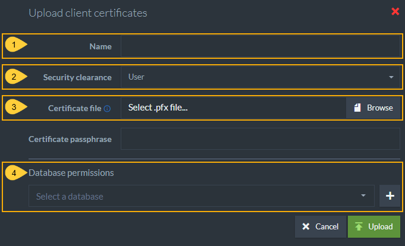

import Admonition from '@theme/Admonition';
import Tabs from '@theme/Tabs';
import TabItem from '@theme/TabItem';
import CodeBlock from '@theme/CodeBlock';
import LanguageSwitcher from "@site/src/components/LanguageSwitcher";
import LanguageContent from "@site/src/components/LanguageContent";

# Certificates Management View5

* The built-in RavenDB Studio enables full customization of client certificates as well as importing and exporting of certificates.  

* This article gives brief guidance about the Studio certificate management GUI.  
  For detailed explanations including [the RavenDB Security Authorization Approach](../../../server/security/authentication/certificate-management.mdx#the-ravendb-security-authorization-approach), see the article [Certificate Management](../../../server/security/authentication/certificate-management.mdx).  

In this page:

* [Certificates Management Studio View](../../../studio/server/certificates/server-management-certificates-view.mdx#studio-certificates-management-view)  
* [Configuring Certificates: Database and Access Permissions](../../../studio/server/certificates/server-management-certificates-view.mdx#configuring-certificates-database-and-access-permissions)  
* [Enabling Communication Between Servers: Importing and Exporting Certificates](../../../studio/server/certificates/server-management-certificates-view.mdx#enabling-communication-between-servers:-importing-and-exporting-certificates)  

## Studio Certificates Management View

1. Click **Manage Server** tab.
2. Select **Certificates**.
3. **Client certificate**  
   * [Generate and configure](../../../server/security/authentication/certificate-management.mdx#generate-client-certificate) a new client certificate  
   * [Upload a client certificate](../../../server/security/authentication/certificate-management.mdx#upload-an-existing-certificate) that was exported from another server so that they can communicate.  
4. **Server certificates**  
   * [Export server certificates](../../../server/security/authentication/certificate-management.mdx#export-server-certificates) so that you can import them into another server.  
   * [Replace server certificates](../../../server/security/authentication/certificate-renewal-and-rotation.mdx) by uploading another `.pfx` certificate.  
5. Status of current server certificate. You can click [Renew now](../../../server/security/authentication/certificate-renewal-and-rotation.mdx) here.  
6. Status of current client certificates active in this server. You can remove or [edit client certificates](../../../server/security/authentication/certificate-management.mdx#edit-certificate), including configuring databases permissions and [authorization (security clearance) levels](../../../server/security/authorization/security-clearance-and-permissions.mdx#authorization-security-clearance-and-permissions) here. 

Client certificates are managed by RavenDB directly and not through any PKI infrastructure. If you want to remove
or reduce the permissions on a certificate handed to a client, you can edit the permissions or remove them entirely in this Studio screen.

## Configuring Certificates: Database and Access Permissions

In the image below, the client certificates (HR, localcluster.client.certificate, Project Managers) have different **security clearance** and **database permissions** configurations.  
This is done to give admins the ability to protect the contents of their databases by **customizing permissions**.  

For example, if an application user should have read/write but not admin access over the HR database, while project managers should have operator permissions on all databases, 
you can grant different [access levels](../../../server/security/authorization/security-clearance-and-permissions.mdx#authorization-security-clearance-and-permissions) by using different client certificates, each with its own set of permissions.  

Each client certificate contains the following:

1. **Name**  
   Client certificate name.  
2. **Thumbprint**  
   Unique key for each certificate.  
3. **Security Clearance**  
   [Authorization level](../../../server/security/authorization/security-clearance-and-permissions.mdx#authorization-security-clearance-and-permissions) that determines types of actions that can be done with this certificate.  
4. **Expiration date**  
   Client certificates are given 5 year expiration periods by default.  
5. **Allowed Databases**  
   The databases in this cluster that this client certificate has access to.  
6. **Edit Certificate**  
   Configure which databases it can access (applicable for User level) and its authorization clearance level.  
7. **Delete Certificate**  

## Generate Client Certificate 

Using this view, you can generate client certificates directly via RavenDB.  
Newly generated certificates will be added to the list of registered certificates.  

When generating a certificate, you must complete the following fields:

1. Name
2. [Security Clearance](../../../server/security/authorization/security-clearance-and-permissions.mdx#authorization-security-clearance-and-permissions) level
3. Allowed databases and access level for each database.  
   * If you choose *User* security clearance, you can give access to specific databases on the server and configure [User](../../../server/security/authorization/security-clearance-and-permissions.mdx#user) authorization levels for this certificate.  

<Admonition type="note" title="">

This information is used by RavenDB internally and is not stored in the certificate itself.

</Admonition>

<Admonition type="note" title="">

Expiration for client certificates is set to 5 years by default.

</Admonition>

## Edit Certificate 

Every certificate in the list can be edited. The editable fields are:

1. Name
2. [Security Clearance](../../../server/security/authorization/security-clearance-and-permissions.mdx#authorization-security-clearance-and-permissions) level
3. Allowed databases and access level for each database
   * If you choose *User* security clearance, you can give access to specific databases on the server and configure [User](../../../server/security/authorization/security-clearance-and-permissions.mdx#user) authorization levels for this certificate.  

<Admonition type="note" title="">

This information is used by RavenDB internally and is not stored in the certificate itself.

</Admonition>

## Enabling Communication Between Servers: Importing and Exporting Certificates

## Upload an Existing Certificate 

Using this view you can upload existing client certificates.  
Uploaded certificates will be added to the list of registered certificates.  

To connect two secure databases, you must

a. **Export** ([download](../../../server/security/authentication/certificate-management.mdx#export-server-certificates)) the `.pfx` certificate from the destination cluster.  
b. **Upload** (import) the downloaded certificate into the source server.  

When uploading an existing certificate file, you must complete the following fields:

1. Name
2. [Security Clearance](../../../server/security/authorization/security-clearance-and-permissions.mdx#authorization-security-clearance-and-permissions) level
3. Upload the `.pfx` certificate file from the destination server installation folder.
4. Select databases and permission levels
   * If you choose *User* security clearance, you can give access to specific databases on the server and configure [User](../../../server/security/authorization/security-clearance-and-permissions.mdx#user) authorization levels for this certificate.  

<Admonition type="note" title="">

This information is used by RavenDB internally and is not stored in the certificate itself.

</Admonition>

## Export Server Certificates 

This option allows you to export the server certificate as a .pfx file. In the case of a cluster which contains several different server certificates, a .pfx [collection](../../../server/security/authentication/certificate-management.mdx#certificate-collections) will be exported.

## Certificate Collections 

Pfx files may contain a single certificate or a collection of certificates.

When uploading a `.pfx` file with multiple certificates, RavenDB will add all of the certificates to the list of registered certificates as one entry and will allow access to all these certificates explicitly by their thumbprint.

