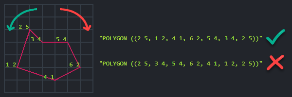

import Admonition from '@theme/Admonition';
import Tabs from '@theme/Tabs';
import TabItem from '@theme/TabItem';
import CodeBlock from '@theme/CodeBlock';
import LanguageSwitcher from "@site/src/components/LanguageSwitcher";
import LanguageContent from "@site/src/components/LanguageContent";

export const supportedLanguages = ["csharp", "java", "python", "nodejs"];

# Make a Spatial Query
<LanguageSwitcher supportedLanguages={supportedLanguages} />
<LanguageContent language="csharp">

<Admonition type="note" title="">

* Documents that contain spatial data can be queried by spatial queries that employ geographical criteria.  
  You can use either _Dynamic spatial query_ or _Spatial index query_.  
  
    * **Dynamic spatial query**  
      Make a dynamic spatial query on a collection (described below).  
      An auto-index will be created by the server.  

    * **Spatial index query**  
      Index your documents' spatial data in a static-index (see [indexing spatial data](../../../indexes/indexing-spatial-data.mdx)) 
      and then make a spatial query on this index (see [query a spatial index](../../../indexes/querying/spatial.mdx)).  

* To perform a spatial search,  
  use the `Spatial` method, which provides a wide range of spatial functionalities.

* When making a dynamic spatial query from Studio,  
  results are also displayed on the global map. See [spatial queries map view](../../../studio/database/queries/spatial-queries-map-view.mdx).
* In this page:

  * [Search by radius](../../../client-api/session/querying/how-to-make-a-spatial-query.mdx#search-by-radius)  
  * [Search by shape](../../../client-api/session/querying/how-to-make-a-spatial-query.mdx#search-by-shape)
      * [Circle](../../../client-api/session/querying/how-to-make-a-spatial-query.mdx#circle)
      * [Polygon](../../../client-api/session/querying/how-to-make-a-spatial-query.mdx#polygon)    
  * [Spatial sorting](../../../client-api/session/querying/how-to-make-a-spatial-query.mdx#spatial-sorting)
      * [Order by distance](../../../client-api/session/querying/how-to-make-a-spatial-query.mdx#order-by-distance)
      * [Order by distance descending](../../../client-api/session/querying/how-to-make-a-spatial-query.mdx#order-by-distance-descending)
      * [Sort results by rounded distance](../../../client-api/session/querying/how-to-make-a-spatial-query.mdx#sort-results-by-rounded-distance)
      * [Get resulting distance](../../../client-api/session/querying/how-to-make-a-spatial-query.mdx#get-resulting-distance)
  * [Spatial API](../../../client-api/session/querying/how-to-make-a-spatial-query.mdx#spatial-api)
      * [`Spatial`](../../../client-api/session/querying/how-to-make-a-spatial-query.mdx#section)
      * [`DynamicSpatialFieldFactory`](../../../client-api/session/querying/how-to-make-a-spatial-query.mdx#section-1)
      * [`SpatialCriteriaFactory`](../../../client-api/session/querying/how-to-make-a-spatial-query.mdx#section-2)
      * [`OrderByDistance`](../../../client-api/session/querying/how-to-make-a-spatial-query.mdx#section-3)
      * [`OrderByDistanceDescending`](../../../client-api/session/querying/how-to-make-a-spatial-query.mdx#section-4)

</Admonition>
## Search by radius

Use the `WithinRadius` method to search for all documents containing spatial data that is located  
within the specified distance from the given center point.

<Tabs groupId='languageSyntax'>
<TabItem value="Query" label="Query">
<CodeBlock language="csharp">
{`// This query will return all matching employee entities
// that are located within 20 kilometers radius
// from point (47.623473 latitude, -122.3060097 longitude).

// Define a dynamic query on Employees collection
List<Employee> employeesWithinRadius = session
    .Query<Employee>()
     // Call 'Spatial' method
    .Spatial(
        // Call 'Point'
        // Pass the path to the document fields containing the spatial data
        pointField => pointField.Point(
            x => x.Address.Location.Latitude, 
            x => x.Address.Location.Longitude),
        // Set the geographical area in which to search for matching documents
        // Call 'WithinRadius', pass the radius and the center points coordinates  
        criteria => criteria.WithinRadius(20, 47.623473, -122.3060097))
    .ToList();
`}
</CodeBlock>
</TabItem>
<TabItem value="Query_async" label="Query_async">
<CodeBlock language="csharp">
{`// This query will return all matching employee entities
// that are located within 20 kilometers radius
// from point (47.623473 latitude, -122.3060097 longitude).

// Define a dynamic query on Employees collection
List<Employee> employeesWithinRadius = await asyncSession
    .Query<Employee>()
     // Call 'Spatial' method
    .Spatial(
        // Call 'Point'
        // Pass the path to the document fields containing the spatial data
        pointField => pointField.Point(
            x => x.Address.Location.Latitude, 
            x => x.Address.Location.Longitude),
        // Set the geographical area in which to search for matching documents
        // Call 'WithinRadius', pass the radius and the center points coordinates  
        criteria => criteria.WithinRadius(20, 47.623473, -122.3060097))
    .ToListAsync();
`}
</CodeBlock>
</TabItem>
<TabItem value="DocumentQuery" label="DocumentQuery">
<CodeBlock language="csharp">
{`// This query will return all matching employee entities
// that are located within 20 kilometers radius
// from point (47.623473 latitude, -122.3060097 longitude).

// Define a dynamic query on Employees collection
List<Employee> employeesWithinRadius = session.Advanced
    .DocumentQuery<Employee>()
    // Call 'Spatial' method
    .Spatial(
        // Call 'Point'
        // Pass the path to the document fields containing the spatial data
        pointField => pointField.Point(
            x => x.Address.Location.Latitude, 
            x => x.Address.Location.Longitude),
        // Set the geographical area in which to search for matching documents
        // Call 'WithinRadius', pass the radius and the center points coordinates  
        criteria => criteria.WithinRadius(20, 47.623473, -122.3060097))
    .ToList();
`}
</CodeBlock>
</TabItem>
<TabItem value="RQL" label="RQL">
<CodeBlock language="sql">
{`// This query will return all matching employee entities
// that are located within 20 kilometers radius
// from point (47.623473 latitude, -122.3060097 longitude).

from Employees
where spatial.within(
    spatial.point(Address.Location.Latitude, Address.Location.Longitude),
    spatial.circle(20, 47.623473, -122.3060097)
)
`}
</CodeBlock>
</TabItem>
</Tabs>

## Search by shape

* Use the `RelatesToShape` method to search for all documents containing spatial data that is located  
  in the specified relation to the given shape.

* The shape is specified as either a **circle** or a **polygon** in a [WKT](https://en.wikipedia.org/wiki/Well-known_text_representation_of_geometry) format.

* The relation to the shape can be one of: `Within`, `Contains`, `Disjoint`, `Intersects`.
#### Circle

<Tabs groupId='languageSyntax'>
<TabItem value="Query" label="Query">
<CodeBlock language="csharp">
{`// This query will return all matching employee entities
// that are located within 20 kilometers radius
// from point (47.623473 latitude, -122.3060097 longitude).

// Define a dynamic query on Employees collection
List<Employee> employeesWithinShape = session
    .Query<Employee>()
     // Call 'Spatial' method
    .Spatial(
        // Call 'Point'
        // Pass the path to the document fields containing the spatial data
        factory => factory.Point(
            x => x.Address.Location.Latitude,
            x => x.Address.Location.Longitude),
        // Set the geographical search criteria, call 'RelatesToShape'
        criteria => criteria.RelatesToShape(
            // Specify the WKT string. Note: longitude is written FIRST
            shapeWkt: "CIRCLE(-122.3060097 47.623473 d=20)",
            // Specify the relation between the WKT shape and the documents spatial data
            relation: SpatialRelation.Within,
            // Optional: customize radius units (default is Kilometers)
            units: SpatialUnits.Miles))  
    .ToList();
`}
</CodeBlock>
</TabItem>
<TabItem value="Query_async" label="Query_async">
<CodeBlock language="csharp">
{`// This query will return all matching employee entities
// that are located within 20 kilometers radius
// from point (47.623473 latitude, -122.3060097 longitude).

// Define a dynamic query on Employees collection
List<Employee> employeesWithinShape = await asyncSession
    .Query<Employee>()
     // Call 'Spatial' method
    .Spatial(
        // Call 'Point'
        // Pass the path to the document fields containing the spatial data
        factory => factory.Point(
            x => x.Address.Location.Latitude,
            x => x.Address.Location.Longitude),
        // Set the geographical search criteria, call 'RelatesToShape'
        criteria => criteria.RelatesToShape(
            // Specify the WKT string. Note: longitude is written FIRST
            shapeWkt: "CIRCLE(-122.3060097 47.623473 d=20)",
            // Specify the relation between the WKT shape and the documents spatial data
            relation: SpatialRelation.Within,
            // Optional: customize radius units (default is Kilometers)
            units: SpatialUnits.Miles))  
    .ToListAsync();
`}
</CodeBlock>
</TabItem>
<TabItem value="DocumentQuery" label="DocumentQuery">
<CodeBlock language="csharp">
{`// This query will return all matching employee entities
// that are located within 20 kilometers radius
// from point (47.623473 latitude, -122.3060097 longitude).

// Define a dynamic query on Employees collection
List<Employee> employeesWithinShape = session.Advanced
    .DocumentQuery<Employee>()
     // Call 'Spatial' method
    .Spatial(
        // Call 'Point'
        // Pass the path to the document fields containing the spatial data
        factory => factory.Point(
            x => x.Address.Location.Latitude,
            x => x.Address.Location.Longitude),
        // Set the geographical search criteria, call 'RelatesToShape'
        criteria => criteria.RelatesToShape(
            // Specify the WKT string. Note: longitude is written FIRST
            shapeWkt: "CIRCLE(-122.3060097 47.623473 d=20)",
            // Specify the relation between the WKT shape and the documents spatial data
            relation: SpatialRelation.Within,
            // Optional: customize radius units (default is Kilometers)
            units: SpatialUnits.Miles))  
    .ToList();
`}
</CodeBlock>
</TabItem>
<TabItem value="RQL" label="RQL">
<CodeBlock language="sql">
{`// This query will return all matching employee entities
// that are located within 20 kilometers radius
// from point (47.623473 latitude, -122.3060097 longitude).

from Employees
where spatial.within(
    spatial.point(Address.Location.Latitude, Address.Location.Longitude),
    spatial.wkt("CIRCLE(-122.3060097 47.623473 d=20)", "miles")
)
`}
</CodeBlock>
</TabItem>
</Tabs>
#### Polygon

<Tabs groupId='languageSyntax'>
<TabItem value="Query" label="Query">
<CodeBlock language="csharp">
{`// This query will return all matching company entities
// that are located within the specified polygon.

// Define a dynamic query on Companies collection
List<Company> companiesWithinShape = session
    .Query<Company>()
     // Call 'Spatial' method
    .Spatial(
        // Call 'Point'
        // Pass the path to the document fields containing the spatial data
        factory => factory.Point(
            x => x.Address.Location.Latitude,
            x => x.Address.Location.Longitude),
        // Set the geographical search criteria, call 'RelatesToShape'
        criteria => criteria.RelatesToShape(
            // Specify the WKT string
            shapeWkt: @"POLYGON ((
                           -118.6527948 32.7114894,
                           -95.8040242 37.5929338,
                           -102.8344151 53.3349629,
                           -127.5286633 48.3485664,
                           -129.4620208 38.0786067,
                           -118.7406746 32.7853769,
                           -118.6527948 32.7114894
                      ))",
            // Specify the relation between the WKT shape and the documents spatial data
            relation: SpatialRelation.Within))  
    .ToList();
`}
</CodeBlock>
</TabItem>
<TabItem value="Query_async" label="Query_async">
<CodeBlock language="csharp">
{`// This query will return all matching company entities
// that are located within the specified polygon.

// Define a dynamic query on Companies collection
List<Company> companiesWithinShape = await asyncSession
    .Query<Company>()
     // Call 'Spatial' method
    .Spatial(
        // Call 'Point'
        // Pass the path to the document fields containing the spatial data
        factory => factory.Point(
            x => x.Address.Location.Latitude,
            x => x.Address.Location.Longitude),
        // Set the geographical search criteria, call 'RelatesToShape'
        criteria => criteria.RelatesToShape(
            // Specify the WKT string
            shapeWkt: @"POLYGON ((
                           -118.6527948 32.7114894,
                           -95.8040242 37.5929338,
                           -102.8344151 53.3349629,
                           -127.5286633 48.3485664,
                           -129.4620208 38.0786067,
                           -118.7406746 32.7853769,
                           -118.6527948 32.7114894
                      ))",
            // Specify the relation between the WKT shape and the documents spatial data
            relation: SpatialRelation.Within))  
    .ToListAsync();
`}
</CodeBlock>
</TabItem>
<TabItem value="DocumentQuery" label="DocumentQuery">
<CodeBlock language="csharp">
{`// This query will return all matching company entities
// that are located within the specified polygon.

// Define a dynamic query on Companies collection
List<Company> companiesWithinShape = session.Advanced
    .DocumentQuery<Company>()
    // Call 'Spatial' method
    .Spatial(
        // Call 'Point'
        // Pass the path to the document fields containing the spatial data
        factory => factory.Point(
            x => x.Address.Location.Latitude,
            x => x.Address.Location.Longitude),
        // Set the geographical search criteria, call 'RelatesToShape'
        criteria => criteria.RelatesToShape(
            // Specify the WKT string
            shapeWkt: @"POLYGON ((
                           -118.6527948 32.7114894,
                           -95.8040242 37.5929338,
                           -102.8344151 53.3349629,
                           -127.5286633 48.3485664,
                           -129.4620208 38.0786067,
                           -118.7406746 32.7853769,
                           -118.6527948 32.7114894
                      ))",
            // Specify the relation between the WKT shape and the documents spatial data
            relation: SpatialRelation.Within))  
    .ToList();
`}
</CodeBlock>
</TabItem>
<TabItem value="RQL" label="RQL">
<CodeBlock language="sql">
{`// This query will return all matching company entities
// that are located within the specified polygon.

from companies
where spatial.within(
    spatial.point(Address.Location.Latitude, Address.Location.Longitude),
    spatial.wkt("POLYGON ((
        -118.6527948 32.7114894,
        -95.8040242 37.5929338,
        -102.8344151 53.3349629,
        -127.5286633 48.3485664,
        -129.4620208 38.0786067,
        -118.7406746 32.7853769,
        -118.6527948 32.7114894))")
)
`}
</CodeBlock>
</TabItem>
</Tabs>

<Admonition type="info" title="Polygon rules" id="polygon-rules" href="#polygon-rules">

* The polygon's coordinates must be provided in counterclockwise order.

* The first and last coordinates must mark the same location to form a closed region.

</Admonition>

## Spatial sorting

* Use `OrderByDistance` or `OrderByDistanceDescending` to sort the results by distance from a given point.

* By default, distance is measured by RavenDB in **kilometers**.  
  The distance can be rounded to a specific range.  
#### Order by distance

<Tabs groupId='languageSyntax'>
<TabItem value="Query" label="Query">
<CodeBlock language="csharp">
{`// Return all matching employee entities located within 20 kilometers radius
// from point (47.623473 latitude, -122.3060097 longitude).

// Sort the results by their distance from a specified point,
// the closest results will be listed first.

List<Employee> employeesSortedByDistance = session
    .Query<Employee>()
     // Provide the query criteria:
    .Spatial(
        pointField => pointField.Point(
            x => x.Address.Location.Latitude,
            x => x.Address.Location.Longitude
        ),
        criteria => criteria.WithinRadius(20, 47.623473, -122.3060097))
     // Call 'OrderByDistance'
    .OrderByDistance(
        factory => factory.Point(
            // Pass the path to the document fields containing the spatial data
            x => x.Address.Location.Latitude,
            x => x.Address.Location.Longitude
        ),
        // Sort the results by their distance from this point: 
        47.623473, -122.3060097)
    .ToList();
`}
</CodeBlock>
</TabItem>
<TabItem value="Query_async" label="Query_async">
<CodeBlock language="csharp">
{`// Return all matching employee entities located within 20 kilometers radius
// from point (47.623473 latitude, -122.3060097 longitude).

// Sort the results by their distance from a specified point,
// the closest results will be listed first.

List<Employee> employeesSortedByDistance = await asyncSession
    .Query<Employee>()
     // Provide the query criteria:
    .Spatial(
        pointField => pointField.Point(
            x => x.Address.Location.Latitude,
            x => x.Address.Location.Longitude
        ),
        criteria => criteria.WithinRadius(20, 47.623473, -122.3060097))
     // Call 'OrderByDistance'
    .OrderByDistance(
        factory => factory.Point(
            // Pass the path to the document fields containing the spatial data
            x => x.Address.Location.Latitude,
            x => x.Address.Location.Longitude
        ),
        // Sort the results by their distance from this point: 
        47.623473, -122.3060097)
    .ToListAsync();
`}
</CodeBlock>
</TabItem>
<TabItem value="DocumentQuery" label="DocumentQuery">
<CodeBlock language="csharp">
{`// Return all matching employee entities located within 20 kilometers radius
// from point (47.623473 latitude, -122.3060097 longitude).

// Sort the results by their distance from a specified point,
// the closest results will be listed first.

List<Employee> employeesSortedByDistance = session.Advanced
    .DocumentQuery<Employee>()
     // Provide the query criteria:
    .Spatial(
        pointField => pointField.Point(
            x => x.Address.Location.Latitude,
            x => x.Address.Location.Longitude
        ),
        criteria => criteria.WithinRadius(20, 47.623473, -122.3060097))
     // Call 'OrderByDistance'
    .OrderByDistance(
        factory => factory.Point(
            // Pass the path to the document fields containing the spatial data
            x => x.Address.Location.Latitude,
            x => x.Address.Location.Longitude
        ),
        // Sort the results by their distance from this point: 
        47.623473, -122.3060097)
    .ToList();
`}
</CodeBlock>
</TabItem>
<TabItem value="RQL" label="RQL">
<CodeBlock language="sql">
{`// Return all matching employee entities located within 20 kilometers radius
// from point (47.623473 latitude, -122.3060097 longitude).

// Sort the results by their distance from a specified point,
// the closest results will be listed first.       

from Employees
where spatial.within(
    spatial.point(Address.Location.Latitude, Address.Location.Longitude),
    spatial.circle(20, 47.623473, -122.3060097)
)
order by spatial.distance(
    spatial.point(Address.Location.Latitude, Address.Location.Longitude),
    spatial.point(47.623473, -122.3060097)
)
`}
</CodeBlock>
</TabItem>
</Tabs>
#### Order by distance descending

<Tabs groupId='languageSyntax'>
<TabItem value="Query" label="Query">
<CodeBlock language="csharp">
{`// Return all employee entities sorted by their distance from a specified point.
// The farthest results will be listed first.

List<Employee> employeesSortedByDistanceDesc = session
    .Query<Employee>()
     // Call 'OrderByDistanceDescending'
    .OrderByDistanceDescending(
        factory => factory.Point(
            // Pass the path to the document fields containing the spatial data
            x => x.Address.Location.Latitude,
            x => x.Address.Location.Longitude
        ),
        // Sort the results by their distance (descending) from this point: 
        47.623473, -122.3060097)
    .ToList();
`}
</CodeBlock>
</TabItem>
<TabItem value="Query_async" label="Query_async">
<CodeBlock language="csharp">
{`// Return all employee entities sorted by their distance from a specified point.
// The farthest results will be listed first.

List<Employee> employeesSortedByDistanceDesc = await asyncSession
    .Query<Employee>()
     // Call 'OrderByDistanceDescending'
    .OrderByDistanceDescending(
        factory => factory.Point(
            // Pass the path to the document fields containing the spatial data
            x => x.Address.Location.Latitude,
            x => x.Address.Location.Longitude
        ),
        // Sort the results by their distance (descending) from this point: 
        47.623473, -122.3060097)
    .ToListAsync();
`}
</CodeBlock>
</TabItem>
<TabItem value="DocumentQuery" label="DocumentQuery">
<CodeBlock language="csharp">
{`// Return all employee entities sorted by their distance from a specified point.
// The farthest results will be listed first.

List<Employee> employeesSortedByDistanceDesc = session.Advanced
    .DocumentQuery<Employee>()
     // Call 'OrderByDistanceDescending'
    .OrderByDistanceDescending(
        factory => factory.Point(
            // Pass the path to the document fields containing the spatial data
            x => x.Address.Location.Latitude,
            x => x.Address.Location.Longitude
        ),
        // Sort the results by their distance (descending) from this point: 
        47.623473, -122.3060097)
    .ToList();
`}
</CodeBlock>
</TabItem>
<TabItem value="RQL" label="RQL">
<CodeBlock language="sql">
{`// Return all employee entities sorted by their distance from a specified point.
// The farthest results will be listed first.

from Employees
order by spatial.distance(
    spatial.point(Address.Location.Latitude, Address.Location.Longitude),
    spatial.point(47.623473, -122.3060097)
) desc
`}
</CodeBlock>
</TabItem>
</Tabs>
#### Sort results by rounded distance

<Tabs groupId='languageSyntax'>
<TabItem value="Query" label="Query">
<CodeBlock language="csharp">
{`// Return all employee entities.
// Results are sorted by their distance to a specified point rounded to the nearest 100 km interval.
// A secondary sort can be applied within the 100 km range, e.g. by field LastName.

List<Employee> employeesSortedByRoundedDistance = session
    .Query<Employee>()
     // Call 'OrderByDistance'
    .OrderByDistance(
        factory => factory.Point(
                // Pass the path to the document fields containing the spatial data
                x => x.Address.Location.Latitude,
                x => x.Address.Location.Longitude)
             // Round up distance to 100 km 
            .RoundTo(100),
        // Sort the results by their distance from this point: 
        47.623473, -122.3060097)
     // A secondary sort can be applied
    .ThenBy(x => x.LastName)
    .ToList();
`}
</CodeBlock>
</TabItem>
<TabItem value="Query_async" label="Query_async">
<CodeBlock language="csharp">
{`// Return all employee entities.
// Results are sorted by their distance to a specified point rounded to the nearest 100 km interval.
// A secondary sort can be applied within the 100 km range, e.g. by field LastName.

List<Employee> employeesSortedByRoundedDistance = await asyncSession
    .Query<Employee>()
     // Call 'OrderByDistance'
    .OrderByDistance(
        factory => factory.Point(
                // Pass the path to the document fields containing the spatial data
                x => x.Address.Location.Latitude,
                x => x.Address.Location.Longitude)
             // Round up distance to 100 km 
            .RoundTo(100),
        // Sort the results by their distance from this point: 
        47.623473, -122.3060097)
     // A secondary sort can be applied
    .ThenBy(x => x.LastName)
    .ToListAsync();
`}
</CodeBlock>
</TabItem>
<TabItem value="DocumentQuery" label="DocumentQuery">
<CodeBlock language="csharp">
{`// Return all employee entities.
// Results are sorted by their distance to a specified point rounded to the nearest 100 km interval.
// A secondary sort can be applied within the 100 km range, e.g. by field LastName.

List<Employee> employeesSortedByRoundedDistance = session.Advanced
    .DocumentQuery<Employee>()
     // Call 'OrderByDistance'
    .OrderByDistance(
        factory => factory.Point(
                // Pass the path to the document fields containing the spatial data
                x => x.Address.Location.Latitude,
                x => x.Address.Location.Longitude)
             // Round up distance to 100 km 
            .RoundTo(100),
        // Sort the results by their distance from this point: 
        47.623473, -122.3060097)
     // A secondary sort can be applied
    .OrderBy(x => x.LastName)
    .ToList();
`}
</CodeBlock>
</TabItem>
<TabItem value="RQL" label="RQL">
<CodeBlock language="sql">
{`// Return all employee entities.
// Results are sorted by their distance to a specified point rounded to the nearest 100 km interval.
// A secondary sort can be applied within the 100 km range, e.g. by field LastName.

from Employees
order by spatial.distance(
    spatial.point(Address.Location.Latitude, Address.Location.Longitude),
    spatial.point(47.623473, -122.3060097),
    100
), LastName
`}
</CodeBlock>
</TabItem>
</Tabs>
#### Get resulting distance

The distance is available in the `@spatial` metadata property within each result.

<TabItem value="spatial_4_getDistance" label="spatial_4_getDistance">
<CodeBlock language="csharp">
{`// Get the distance of the results:
// ================================

// Call 'GetMetadataFor', pass an entity from the resulting employees list
var metadata = session.Advanced.GetMetadataFor(employeesSortedByDistance[0]);

// The distance is available in the '@spatial' metadata property
var spatialResults = (IDictionary<string, object>)metadata[Constants.Documents.Metadata.SpatialResult];

var distance = spatialResults["Distance"];   // The distance of the entity from the queried location
var latitude = spatialResults["Latitude"];   // The entity's longitude value
var longitude = spatialResults["Longitude"]; // The entity's longitude value
`}
</CodeBlock>
</TabItem>

## Spatial API

#### `Spatial`

<TabItem value="spatial_7" label="spatial_7">
<CodeBlock language="csharp">
{`IRavenQueryable<T> Spatial<T>(
    Expression<Func<T, object>> path,
    Func<SpatialCriteriaFactory, SpatialCriteria> clause);

IRavenQueryable<T> Spatial<T>(
    string fieldName,
    Func<SpatialCriteriaFactory, SpatialCriteria> clause);

IRavenQueryable<T> Spatial<T>(
    Func<DynamicSpatialFieldFactory<T>, DynamicSpatialField> field,
    Func<SpatialCriteriaFactory, SpatialCriteria> clause);

IRavenQueryable<T> Spatial<T>(
    DynamicSpatialField field,
    Func<SpatialCriteriaFactory, SpatialCriteria> clause);
`}
</CodeBlock>
</TabItem>

| Parameters    | Type                                                                                      | Description                                                                                                              |
|---------------|-------------------------------------------------------------------------------------------|--------------------------------------------------------------------------------------------------------------------------|
| **path**      | `Expression<Func<T, object>>`                                                             | Path to spatial field in an index (when querying an index)                                                            |
| **fieldName** | `string`                                                                                  | Path to spatial field in an index (when querying an index)                                                            |
| **field**     | `Func<DynamicSpatialFieldFactory<T>, DynamicSpatialField>` or `DynamicSpatialField` | Factory or field that points to a document field (when making a dynamic query). Either `PointField` or `WktField`. |
| **clause**    | `Func<SpatialCriteriaFactory, SpatialCriteria>`                                           | Spatial criteria that will be executed on a given spatial field                                                          |
#### `DynamicSpatialFieldFactory`

<TabItem value="spatial_8" label="spatial_8">
<CodeBlock language="csharp">
{`PointField Point(
    Expression<Func<T, object>> latitudePath,
    Expression<Func<T, object>> longitudePath);

WktField Wkt(Expression<Func<T, object>> wktPath);
`}
</CodeBlock>
</TabItem>

| Parameters                                         | Type                          | Description                                                                  |
|----------------------------------------------------|-------------------------------|------------------------------------------------------------------------------|
| **latitudePath** / **longitudePath** / **wktPath** | `Expression<Func<T, object>>` | Path to the field in a document containing either longitude, latitude or WKT |
#### `SpatialCriteriaFactory`

<TabItem value="spatial_9" label="spatial_9">
<CodeBlock language="csharp">
{`SpatialCriteria RelatesToShape(
    string shapeWkt,
    SpatialRelation relation,
    double distErrorPercent = Constants.Documents.Indexing.Spatial.DefaultDistanceErrorPct);

SpatialCriteria RelatesToShape(
    string shapeWkt,
    SpatialRelation relation,
    SpatialUnits units,
    double distErrorPercent = Constants.Documents.Indexing.Spatial.DefaultDistanceErrorPct);

SpatialCriteria Intersects(
    string shapeWkt,
    double distErrorPercent = Constants.Documents.Indexing.Spatial.DefaultDistanceErrorPct);

SpatialCriteria Intersects(
    string shapeWkt,
    SpatialUnits units,
    double distErrorPercent = Constants.Documents.Indexing.Spatial.DefaultDistanceErrorPct);

SpatialCriteria Contains(
    string shapeWkt,
    double distErrorPercent = Constants.Documents.Indexing.Spatial.DefaultDistanceErrorPct);

SpatialCriteria Contains(
    string shapeWkt,
    SpatialUnits units,
    double distErrorPercent = Constants.Documents.Indexing.Spatial.DefaultDistanceErrorPct);

SpatialCriteria Disjoint(
    string shapeWkt,
    double distErrorPercent = Constants.Documents.Indexing.Spatial.DefaultDistanceErrorPct);

SpatialCriteria Disjoint(
    string shapeWkt,
    SpatialUnits units,
    double distErrorPercent = Constants.Documents.Indexing.Spatial.DefaultDistanceErrorPct);

SpatialCriteria Within(
    string shapeWkt,
    double distErrorPercent = Constants.Documents.Indexing.Spatial.DefaultDistanceErrorPct);

SpatialCriteria Within(
    string shapeWkt,
    SpatialUnits units,
    double distErrorPercent = Constants.Documents.Indexing.Spatial.DefaultDistanceErrorPct);

SpatialCriteria WithinRadius(
    double radius,
    double latitude,
    double longitude,
    SpatialUnits? radiusUnits = null,
    double distErrorPercent = Constants.Documents.Indexing.Spatial.DefaultDistanceErrorPct);
`}
</CodeBlock>
</TabItem>

| Parameter                                 | Type              | Description                                                                                                                         |
|-------------------------------------------|-------------------|-------------------------------------------------------------------------------------------------------------------------------------|
| **shapeWkt**                              | `string`          | [WKT](https://en.wikipedia.org/wiki/Well-known_text_representation_of_geometry)-based shape used in query criteria                  |
| **relation**                              | `SpatialRelation` | Relation of the shape to the spatial data in the document/index. Can be `Within`, `Contains`, `Disjoint`, `Intersects`.          |
| **distErrorPercent**                      | `double`          | Maximum distance error tolerance in percents. Default: 0.025                                                                        |
| **radius** / **latitude** / **longitude** | `double`          | Used to define a radius of a circle                                                                                                 |
| **radiusUnits** / **units**               | `SpatialUnits`    | Determines if circle or shape should be calculated in `Kilometers` or `Miles`. By default, distances are measured in kilometers. |
#### `OrderByDistance`

<TabItem value="spatial_10" label="spatial_10">
<CodeBlock language="csharp">
{`// From point
IOrderedQueryable<T> OrderByDistance<T>(
    Func<DynamicSpatialFieldFactory<T>, DynamicSpatialField> field,
    double latitude,
    double longitude);

IOrderedQueryable<T> OrderByDistance<T>(
    DynamicSpatialField field,
    double latitude,
    double longitude);

IOrderedQueryable<T> OrderByDistance<T>(
    Expression<Func<T, object>> path,
    double latitude,
    double longitude);

IOrderedQueryable<T> OrderByDistance<T>(
    string fieldName,
    double latitude,
    double longitude);

// From center of WKT shape
IOrderedQueryable<T> OrderByDistance<T>(
    Func<DynamicSpatialFieldFactory<T>, DynamicSpatialField> field,
    string shapeWkt);

IOrderedQueryable<T> OrderByDistance<T>(
    DynamicSpatialField field,
    string shapeWkt);

IOrderedQueryable<T> OrderByDistance<T>(
    Expression<Func<T, object>> path,
    string shapeWkt);

IOrderedQueryable<T> OrderByDistance<T>(
    string fieldName,
    string shapeWkt);

// Rounding
IOrderedQueryable<T> OrderByDistance<T>(
    Expression<Func<T, object>> path,
    double latitude,
    double longitude,
    double roundFactor);

IOrderedQueryable<T> OrderByDistance<T>(
    string fieldName,
    double latitude,
    double longitude,
    double roundFactor);

IOrderedQueryable<T> OrderByDistance<T>(
    Expression<Func<T, object>> path,
    string shapeWkt,
    double roundFactor);

IOrderedQueryable<T> OrderByDistance<T>(
    string fieldName,
    string shapeWkt,
    double roundFactor);
`}
</CodeBlock>
</TabItem>
#### `OrderByDistanceDescending`

<TabItem value="spatial_11" label="spatial_11">
<CodeBlock language="csharp">
{`// From point
IOrderedQueryable<T> OrderByDistanceDescending<T>(
    Func<DynamicSpatialFieldFactory<T>, DynamicSpatialField> field,
    double latitude,
    double longitude);

IOrderedQueryable<T> OrderByDistanceDescending<T>(
    DynamicSpatialField field,
    double latitude,
    double longitude);

IOrderedQueryable<T> OrderByDistanceDescending<T>(
    Expression<Func<T, object>> path,
    double latitude,
    double longitude);

IOrderedQueryable<T> OrderByDistanceDescending<T>(
    string fieldName,
    double latitude,
    double longitude);

// From center of WKT shape
IOrderedQueryable<T> OrderByDistanceDescending<T>(
    Func<DynamicSpatialFieldFactory<T>, DynamicSpatialField> field,
    string shapeWkt);

IOrderedQueryable<T> OrderByDistanceDescending<T>(
    DynamicSpatialField field,
    string shapeWkt);

IOrderedQueryable<T> OrderByDistanceDescending<T>(
    Expression<Func<T, object>> path,
    string shapeWkt);

IOrderedQueryable<T> OrderByDistanceDescending<T>(
    string fieldName,
    string shapeWkt);

// Rounding
IOrderedQueryable<T> OrderByDistanceDescending<T>(
    Expression<Func<T, object>> path,
    double latitude,
    double longitude,
    double roundFactor);

IOrderedQueryable<T> OrderByDistanceDescending<T>(
    string fieldName,
    double latitude,
    double longitude,
    double roundFactor);

IOrderedQueryable<T> OrderByDistanceDescending<T>(
    Expression<Func<T, object>> path,
    string shapeWkt,
    double roundFactor);

IOrderedQueryable<T> OrderByDistanceDescending<T>(
    string fieldName,
    string shapeWkt,
    double roundFactor);
`}
</CodeBlock>
</TabItem>

| Parameter                    | Type                                                                                       | Description                                                                                                                                                                                                                                                      |
|------------------------------|--------------------------------------------------------------------------------------------|------------------------------------------------------------------------------------------------------------------------------------------------------------------------------------------------------------------------------------------------------------------|
| **path**                     | `Expression<Func<T, object>>`                                                              | Path to spatial field in index (when querying an index)                                                                                                                                                                                                       |
| **fieldName**                | `string`                                                                                   | Path to spatial field in index (when querying an index)                                                                                                                                                                                                       |
| **field**                    | `Func<DynamicSpatialFieldFactory<T>, DynamicSpatialField>` or `DynamicSpatialField`  | Factory or field that points to a document field (when making a dynamic query). Either `PointField` or `WktField`.                                                                                                                                         |
| **shapeWkt**                 | `string`                                                                                   | [WKT](https://en.wikipedia.org/wiki/Well-known_text_representation_of_geometry)-based shape to be used as a point from which distance will be measured. If the shape is not a single point, then the center of the shape will be used as a reference.            |
| **latitude** / **longitude** | `double`                                                                                   | Used to define a point from which distance will be measured                                                                                                                                                                                                      |
| **roundFactor**              | `double`                                                                                   | A distance interval in kilometers. The distance from the point is rounded up to the nearest interval. The results within the same interval can be sorted by a secondary order. If no other order was specified, then by ascending order of document Id. |

</LanguageContent>
<LanguageContent language="java">

Spatial indexes can be queried using the `spatial` method which contains a full spectrum of spatial methods. The following article will cover these methods:

- [Spatial](../../../client-api/session/querying/how-to-make-a-spatial-query.mdx#spatial)
- [OrderByDistance](../../../client-api/session/querying/how-to-make-a-spatial-query.mdx#orderbydistance)
- [OrderByDistanceDescending](../../../client-api/session/querying/how-to-make-a-spatial-query.mdx#orderbydistancedescending)

## Spatial

<TabItem value="spatial_1" label="spatial_1">
<CodeBlock language="java">
{`IDocumentQuery<T> spatial(String fieldName, Function<SpatialCriteriaFactory, SpatialCriteria> clause);

IDocumentQuery<T> spatial(DynamicSpatialField field, Function<SpatialCriteriaFactory, SpatialCriteria> clause);
`}
</CodeBlock>
</TabItem>

| Parameters | | |
| ------------- | ------------- | ----- |
| **fieldName** | String | Path to spatial field in an index |
| **field** | DynamicSpatialField  | Field that points to a dynamic field (used with auto-indexes). Either `PointField` or `WktField` |
| **clause** | Function&lt;SpatialCriteriaFactory, SpatialCriteria&gt; | Spatial criteria |

### DynamicSpatialField  

<TabItem value="spatial_2" label="spatial_2">
<CodeBlock language="java">
{`public PointField(String latitude, String longitude)

public WktField(String wkt)
`}
</CodeBlock>
</TabItem>

| Parameters | | |
| ------------- | ------------- | ----- |
| **latitude** or **longitude** or **wkt** | String | Path to the field in a document containing either longitude, latitude or WKT |

### SpatialCriteriaFactory

<TabItem value="spatial_3" label="spatial_3">
<CodeBlock language="java">
{`SpatialCriteria relatesToShape(String shapeWkt, SpatialRelation relation);

SpatialCriteria relatesToShape(String shapeWkt, SpatialRelation relation, double distErrorPercent);

SpatialCriteria intersects(String shapeWkt);

SpatialCriteria intersects(String shapeWkt, double distErrorPercent) ;

SpatialCriteria contains(String shapeWkt);

SpatialCriteria contains(String shapeWkt, double distErrorPercent);

SpatialCriteria disjoint(String shapeWkt);

SpatialCriteria disjoint(String shapeWkt, double distErrorPercent);

SpatialCriteria within(String shapeWkt);

SpatialCriteria within(String shapeWkt, double distErrorPercent);

SpatialCriteria withinRadius(double radius, double latitude, double longitude);

SpatialCriteria withinRadius(double radius, double latitude, double longitude, SpatialUnits radiusUnits);

SpatialCriteria withinRadius(double radius, double latitude, double longitude, SpatialUnits radiusUnits, double distErrorPercent);
`}
</CodeBlock>
</TabItem>

| Parameters | | |
| ------------- | ------------- | ----- |
| **shapeWkt** | String | [WKT](https://en.wikipedia.org/wiki/Well-known_text_representation_of_geometry)-based shape to be used in operation |
| **relation** | SpatialRelation | Shape relation. Can be `WITHIN`, `CONTAINS`, `DISJOINT`, `INTERSECTS` |
| **distErrorPercent** | double | Maximum distance error tolerance in percents. Default: 0.025 |
| **radius** or **latitude** or **longitude** | double | Used to define a radius circle |
| **radiusUnits** | SpatialUnits | Determines if circle should be calculated in `KILOMETERS` or `MILES` units |

<Admonition type="info" title="Polygons" id="polygons" href="#polygons">
When using `spatial.wkt()` to define a **polygon**, the vertices (points that form the corners of the polygon) must be listed 
in a counter-clockwise order:  

</Admonition>

### Example I

<Tabs groupId='languageSyntax'>
<TabItem value="Java" label="Java">
<CodeBlock language="java">
{`// return all matching entities
// within 10 kilometers radius
// from 32.1234 latitude and 23.4321 longitude coordinates
List<House> results = session
    .query(House.class)
    .spatial(
        new PointField("latitude", "longitude"),
        f -> f.withinRadius(10, 32.1234, 23.4321))
    .toList();
`}
</CodeBlock>
</TabItem>
<TabItem value="RQL" label="RQL">
<CodeBlock language="sql">
{`from Houses
where spatial.within(spatial.point(Latitude, Longitude), spatial.circle(10, 32.1234. 23.4321))
`}
</CodeBlock>
</TabItem>
</Tabs>

### Example II

<Tabs groupId='languageSyntax'>
<TabItem value="Java" label="Java">
<CodeBlock language="java">
{`// return all matching entities
// within 10 kilometers radius
// from 32.1234 latitude and 23.4321 longitude coordinates
// this equals to WithinRadius(10, 32.1234, 23.4321)
List<House> results = session
    .query(House.class)
    .spatial(
        new PointField("latitude", "longitude"),
        f -> f.relatesToShape("Circle(32.1234 23.4321 d=10.0000)", SpatialRelation.WITHIN)
    )
    .toList();
`}
</CodeBlock>
</TabItem>
<TabItem value="RQL" label="RQL">
<CodeBlock language="sql">
{`from Houses
where spatial.within(spatial.point(Latitude, Longitude), spatial.wkt('Circle(32.1234 23.4321 d=10.0000)'))
`}
</CodeBlock>
</TabItem>
</Tabs>

## OrderByDistance

To sort by distance from given point use the `orderByDistance` method. The closest results will come first.

<TabItem value="spatial_6" label="spatial_6">
<CodeBlock language="java">
{`IDocumentQuery<T> orderByDistance(DynamicSpatialField field, double latitude, double longitude);

IDocumentQuery<T> orderByDistance(DynamicSpatialField field, String shapeWkt);

IDocumentQuery<T> orderByDistance(String fieldName, double latitude, double longitude);

IDocumentQuery<T> orderByDistance(String fieldName, String shapeWkt);
`}
</CodeBlock>
</TabItem>

| Parameters | | |
| ------------- | ------------- | ----- |
| **fieldName** | String | Path to spatial field in index |
| **field** | DynamicSpatialField | Field that points to a dynamic field (used with auto-indexes). Either `PointField` or `WktField` |
| **shapeWkt** | String | [WKT](https://en.wikipedia.org/wiki/Well-known_text_representation_of_geometry)-based shape to be used as a point from which distance will be measured. If the shape is not a single point, then the center of the shape will be used as a reference. |
| **latitude** or **longitude** | double | Used to define a point from which distance will be measured |

### Example

<Tabs groupId='languageSyntax'>
<TabItem value="Java" label="Java">
<CodeBlock language="java">
{`// return all matching entities
// within 10 kilometers radius
// from 32.1234 latitude and 23.4321 longitude coordinates
// sort results by distance from 32.1234 latitude and 23.4321 longitude point
List<House> results = session
    .query(House.class)
    .spatial(
        new PointField("latitude", "longitude"),
        f -> f.withinRadius(10, 32.1234, 23.4321)
    )
    .orderByDistance(
        new PointField("latitude", "longtude"),
        32.12324, 23.4321)
    .toList();
`}
</CodeBlock>
</TabItem>
<TabItem value="RQL" label="RQL">
<CodeBlock language="sql">
{`from Houses
where spatial.within(spatial.point(Latitude, Longitude), spatial.circle(10, 32.1234. 23.4321))
order by spatial.distance(spatial.point(Latitude, Longitude), spatial.point(32.1234, 23.4321))
`}
</CodeBlock>
</TabItem>
</Tabs>

## OrderByDistanceDescending

To sort by distance from given point use the `OrderByDistanceDescending` method. The farthest results will come first.

<TabItem value="spatial_8" label="spatial_8">
<CodeBlock language="java">
{`IDocumentQuery<T> orderByDistanceDescending(DynamicSpatialField field, double latitude, double longitude);

IDocumentQuery<T> orderByDistanceDescending(DynamicSpatialField field, String shapeWkt);

IDocumentQuery<T> orderByDistanceDescending(String fieldName, double latitude, double longitude);

IDocumentQuery<T> orderByDistanceDescending(String fieldName, String shapeWkt);
`}
</CodeBlock>
</TabItem>

| Parameters | | |
| ------------- | ------------- | ----- |
| **fieldName** | String | Path to spatial field in index |
| **field** | DynamicSpatialField | Field that points to a dynamic field (used with auto-indexes). Either `PointField` or `WktField` |
| **shapeWkt** | String | WKT-based shape to be used as a point from which distance will be measured. If the shape is not a single point, then the center of the shape will be used as a reference. |
| **latitude** or **longitude** | double | Used to define a point from which distance will be measured |

### Example

<Tabs groupId='languageSyntax'>
<TabItem value="Java" label="Java">
<CodeBlock language="java">
{`// return all matching entities
// within 10 kilometers radius
// from 32.1234 latitude and 23.4321 longitude coordinates
// sort results by distance from 32.1234 latitude and 23.4321 longitude point
List<House> results = session
    .query(House.class)
    .spatial(
        new PointField("latitude", "longitude"),
        f -> f.withinRadius(10, 32.1234, 23.4321)
    )
    .orderByDistanceDescending(
        new PointField("latitude", "longtude"),
        32.12324, 23.4321)
    .toList();
`}
</CodeBlock>
</TabItem>
<TabItem value="RQL" label="RQL">
<CodeBlock language="sql">
{`from Houses
where spatial.within(spatial.point(Latitude, Longitude), spatial.circle(10, 32.1234. 23.4321))
order by spatial.distance(spatial.point(Latitude, Longitude), spatial.point(32.1234, 23.4321)) desc
`}
</CodeBlock>
</TabItem>
</Tabs>

## Remarks

<Admonition type="note" title="">
By default, distances are measured in **kilometers**.
</Admonition>

</LanguageContent>
<LanguageContent language="python">

<Admonition type="note" title="">

* Documents that contain spatial data can be queried by spatial queries that employ geographical criteria.  
  You can use either _Dynamic spatial query_ or _Spatial index query_.  
  
    * **Dynamic spatial query**  
      Make a dynamic spatial query on a collection (described below).  
      An auto-index will be created by the server.  

    * **Spatial index query**  
      Index your documents' spatial data in a static-index (see [indexing spatial data](../../../indexes/indexing-spatial-data.mdx)) 
      and then make a spatial query on this index (see [query a spatial index](../../../indexes/querying/spatial.mdx)).  

* To perform a spatial search,  
  use the `spatial` method, which provides a wide range of spatial functionalities.

* When making a dynamic spatial query from Studio,  
  results are also displayed on the global map. See [spatial queries map view](../../../studio/database/queries/spatial-queries-map-view.mdx).
* In this page:

  * [Search by radius](../../../client-api/session/querying/how-to-make-a-spatial-query.mdx#search-by-radius)  
  * [Search by shape](../../../client-api/session/querying/how-to-make-a-spatial-query.mdx#search-by-shape)
      * [Circle](../../../client-api/session/querying/how-to-make-a-spatial-query.mdx#circle)
      * [Polygon](../../../client-api/session/querying/how-to-make-a-spatial-query.mdx#polygon)    
  * [Spatial sorting](../../../client-api/session/querying/how-to-make-a-spatial-query.mdx#spatial-sorting)
      * [Order by distance](../../../client-api/session/querying/how-to-make-a-spatial-query.mdx#order-by-distance)
      * [Order by distance descending](../../../client-api/session/querying/how-to-make-a-spatial-query.mdx#order-by-distance-descending)
      * [Sort results by rounded distance](../../../client-api/session/querying/how-to-make-a-spatial-query.mdx#sort-results-by-rounded-distance)
      * [Get resulting distance](../../../client-api/session/querying/how-to-make-a-spatial-query.mdx#get-resulting-distance)
  * [Spatial API](../../../client-api/session/querying/how-to-make-a-spatial-query.mdx#spatial-api)
      * [`spatial`](../../../client-api/session/querying/how-to-make-a-spatial-query.mdx#section)
      * [`DynamicSpatialField`](../../../client-api/session/querying/how-to-make-a-spatial-query.mdx#section-1)
      * [`SpatialCriteria`](../../../client-api/session/querying/how-to-make-a-spatial-query.mdx#section-2)
      * [`order_by_distance`, `order_by_distance_wkt`](../../../client-api/session/querying/how-to-make-a-spatial-query.mdx#section-3)
      * [`order_by_distance_descending`, `order_by_distance_descending_wkt`](../../../client-api/session/querying/how-to-make-a-spatial-query.mdx#section-4)

</Admonition>
## Search by radius

Use the `within_radius` method to search for all documents containing spatial data that is located  
within the specified distance from the given center point.

<Tabs groupId='languageSyntax'>
<TabItem value="Query" label="Query">
<CodeBlock language="python">
{`# This query will return all matching employee entities
# that are located within 20 kilometers radius
# from point (47.623473 latitude, -122.3060097 longitude).

# Define a query on Employees collection
employees_within_radius = list(
    session.query(object_type=Employee)
    # Call 'spatial' method
    .spatial(
        # Create 'PointField'
        # Pass the path to document fields containing the spatial data
        PointField("Address.Location.Latitude", "Address.Location.Longitude"),
        # Set the geographical area in which to search for matching documents
        # Call 'within_radius', pass the radius and the center points coordinates
        lambda criteria: criteria.within_radius(20, 47.623473, -122.3060097),
    )
)
`}
</CodeBlock>
</TabItem>
<TabItem value="RQL" label="RQL">
<CodeBlock language="sql">
{`// This query will return all matching employee entities
// that are located within 20 kilometers radius
// from point (47.623473 latitude, -122.3060097 longitude).

from Employees
where spatial.within(
    spatial.point(Address.Location.Latitude, Address.Location.Longitude),
    spatial.circle(20, 47.623473, -122.3060097)
)
`}
</CodeBlock>
</TabItem>
</Tabs>

## Search by shape

* Use the `relates_to_shape` method to search for all documents containing spatial data that is located  
  in the specified relation to the given shape.

* The shape is specified as either a **circle** or a **polygon** in a [WKT](https://en.wikipedia.org/wiki/Well-known_text_representation_of_geometry) format.

* The relation to the shape can be one of: `WITHIN`, `CONTAINS`, `DISJOINT`, `INTERSECTS`.
#### Circle

<Tabs groupId='languageSyntax'>
<TabItem value="Query" label="Query">
<CodeBlock language="python">
{`# This query will return all matching employee entities
# that are located within 20 kilometers radius
# from point (47.623473 latitude, -122.3060097 longitude).

# Define a query on Employees collection
employees_within_shape = list(
    session.query(object_type=Employee)
    # Call 'spatial' method
    .spatial(
        # Create 'PointField'
        # Pass the path to document fields containing the spatial data
        PointField("Address.Location.Latitude", "Address.Location.Longitude"),
        # Set the geographical search criteria, call 'relates_to_shape'
        lambda criteria: criteria.relates_to_shape(
            # Specify the WKT string. Note: longitude is written FIRST
            shape_wkt="CIRCLE(-122.3060097 47.623473 d=20)",
            # Specify the relation between the WKT shape and the documents spatial data
            relation=SpatialRelation.WITHIN,
            # Optional: customize radius units (default is Kilometers)
            units=SpatialUnits.MILES,
        ),
    )
)
`}
</CodeBlock>
</TabItem>
<TabItem value="RQL" label="RQL">
<CodeBlock language="sql">
{`// This query will return all matching employee entities
// that are located within 20 kilometers radius
// from point (47.623473 latitude, -122.3060097 longitude).

from Employees
where spatial.within(
    spatial.point(Address.Location.Latitude, Address.Location.Longitude),
    spatial.wkt("CIRCLE(-122.3060097 47.623473 d=20)", "miles")
)
`}
</CodeBlock>
</TabItem>
</Tabs>
#### Polygon

<Tabs groupId='languageSyntax'>
<TabItem value="Query" label="Query">
<CodeBlock language="python">
{`# This query will return all matching company entities
# that are located within the specified polygon.

# Define a query on Companies collection
companies_within_shape = list(
    session.query(object_type=Company)
    # Call 'spatial' method
    .spatial(
        # Create 'PointField'
        # Pass the path to document fields containing the spatial data
        PointField("Address.Location.Latitude", "Address.Location.Longitude"),
        # Set the geographical search criteria, call 'relates_to_shape'
        lambda criteria: criteria.relates_to_shape(
            # Specify the WKT string. Note: longitude is written FIRST
            shape_wkt="""POLYGON ((
                       -118.6527948 32.7114894,
                       -95.8040242 37.5929338,
                       -102.8344151 53.3349629,
                       -127.5286633 48.3485664,
                       -129.4620208 38.0786067,
                       -118.7406746 32.7853769,
                       -118.6527948 32.7114894
                    ))""",
            # Specify the relation between the WKT shape and the documents spatial data
            relation=SpatialRelation.WITHIN,
        ),
    )
)
`}
</CodeBlock>
</TabItem>
<TabItem value="RQL" label="RQL">
<CodeBlock language="sql">
{`// This query will return all matching company entities
// that are located within the specified polygon.

from companies
where spatial.within(
    spatial.point(Address.Location.Latitude, Address.Location.Longitude),
    spatial.wkt("POLYGON ((
        -118.6527948 32.7114894,
        -95.8040242 37.5929338,
        -102.8344151 53.3349629,
        -127.5286633 48.3485664,
        -129.4620208 38.0786067,
        -118.7406746 32.7853769,
        -118.6527948 32.7114894))")
)
`}
</CodeBlock>
</TabItem>
</Tabs>

<Admonition type="info" title="Polygon rules" id="polygon-rules" href="#polygon-rules">

* The polygon's coordinates must be provided in counterclockwise order.

* The first and last coordinates must mark the same location to form a closed region.

</Admonition>

## Spatial sorting

* Use `order_by_distance` or `order_by_distance_descending` to sort the results by distance from a given point.

* By default, distance is measured by RavenDB in **kilometers**.  
  The distance can be rounded to a specific range.  
#### Order by distance

<Tabs groupId='languageSyntax'>
<TabItem value="Query" label="Query">
<CodeBlock language="python">
{`# Return all matching employee entities located within 20 kilometers radius
# from point (47.623473 latitude, -122.3060097 longitude)

# Sort the results by their distance from a specified point,
# the closest results will be listed first.

employees_sorted_by_distance = list(
    session.query(object_type=Employee)
    # Provide the query criteria:
    .spatial(
        PointField("Address.Location.Latitude", "Address.Location.Longitude"),
        lambda criteria: criteria.within_radius(20, 47.623473, -122.3060097),
    )
    # Call 'order_by_distance'
    .order_by_distance(
        PointField("Address.Location.Latitude", "Address.Location.Longitude"), 47.623473, -122.3060097
    )
)
`}
</CodeBlock>
</TabItem>
<TabItem value="RQL" label="RQL">
<CodeBlock language="sql">
{`// Return all matching employee entities located within 20 kilometers radius
// from point (47.623473 latitude, -122.3060097 longitude).

// Sort the results by their distance from a specified point,
// the closest results will be listed first.       

from Employees
where spatial.within(
    spatial.point(Address.Location.Latitude, Address.Location.Longitude),
    spatial.circle(20, 47.623473, -122.3060097)
)
order by spatial.distance(
    spatial.point(Address.Location.Latitude, Address.Location.Longitude),
    spatial.point(47.623473, -122.3060097)
)
`}
</CodeBlock>
</TabItem>
</Tabs>
#### Order by distance descending

<Tabs groupId='languageSyntax'>
<TabItem value="Query" label="Query">
<CodeBlock language="python">
{`# Return all employee entities sorted by their distance from a specified point.
# The farthest results will be listed first.

employees_sorted_by_distance_desc = list(
    session.query(object_type=Employee)
    # Call 'order_by_distance_descending'
    .order_by_distance_descending(
        # Pass the path to document fields containing the spatial data
        PointField("Address.Location.Latitude", "Address.Location.Longitude"),
        # Sort the results by their distance (descending) from this point:
        47.623473,
        -122.3060097,
    )
)
`}
</CodeBlock>
</TabItem>
<TabItem value="RQL" label="RQL">
<CodeBlock language="sql">
{`// Return all employee entities sorted by their distance from a specified point.
// The farthest results will be listed first.

from Employees
order by spatial.distance(
    spatial.point(Address.Location.Latitude, Address.Location.Longitude),
    spatial.point(47.623473, -122.3060097)
) desc
`}
</CodeBlock>
</TabItem>
</Tabs>
#### Sort results by rounded distance

<Tabs groupId='languageSyntax'>
<TabItem value="Query" label="Query">
<CodeBlock language="python">
{`# Return all employee entities.
# Results are sorted by their distance to a specified point rounded to the nearest 100 km interval.
# A secondary sort can be applied within the 100 km range, e.g. by field LastName.

employees_sorted_by_rounded_distance = list(
    session.query(object_type=Employee)
    # Call 'order_by_distance'
    .order_by_distance(
        # Pass the path to the document fields containing the spatial data
        PointField("Address.Location.Latitude", "Address.Location.Longitude")
        # Round up distance to 100 km
        .round_to(100),
        # Sort the results by their distance from this point:
        47.623473,
        -122.3060097,
    ).order_by(
        "LastName"
    )  # todo gracjan: check if its possible to order by again without then_by
    # todo reeb: skip this example for now, we'll get back to it later on
    # A secondary sort can be applied
)

pass

o:
gion spatial_7
spatial(
self,
field_name_or_field: Union[str, DynamicSpatialField],
clause: Callable[[SpatialCriteriaFactory], SpatialCriteria],
..
`}
</CodeBlock>
</TabItem>
<TabItem value="RQL" label="RQL">
<CodeBlock language="sql">
{`// Return all employee entities.
// Results are sorted by their distance to a specified point rounded to the nearest 100 km interval.
// A secondary sort can be applied within the 100 km range, e.g. by field LastName.

from Employees
order by spatial.distance(
    spatial.point(Address.Location.Latitude, Address.Location.Longitude),
    spatial.point(47.623473, -122.3060097),
    100
), LastName
`}
</CodeBlock>
</TabItem>
</Tabs>
#### Get resulting distance

The distance is available in the `@spatial` metadata property within each result.

<TabItem value="spatial_4_getDistance" label="spatial_4_getDistance">
<CodeBlock language="python">
{`# Get the distance of the results:
# ================================

# Call 'get_metadata_for', pass an entity from the resulting employees list
metadata = session.advanced.get_metadata_for(employees_sorted_by_distance[0])

# The distance is available in the '@spatial' metadata property
spatial_results = metadata["@spatial"]

distance = spatial_results["Distance"]  # The distance of the entity from the queried location
latitude = spatial_results["Latitude"]  # The entity's latitude value
longitude = spatial_results["Longitude"]  # The entity's longitude value
`}
</CodeBlock>
</TabItem>

## Spatial API

#### `spatial`

<TabItem value="spatial_7" label="spatial_7">
<CodeBlock language="python">
{`def spatial(
    self,
    field_name_or_field: Union[str, DynamicSpatialField],
    clause: Callable[[SpatialCriteriaFactory], SpatialCriteria],
): ...
`}
</CodeBlock>
</TabItem>

| Parameters    | Type                                                                                       | Description                                                                                                                |
|---------------|--------------------------------------------------------------------------------------------|----------------------------------------------------------------------------------------------------------------------------|
| **field_name_or_field** | `Union[str, DynamicSpatialField]` | `Str` - Path to spatial field in an index (when querying an index)  **-or-**  `DynamicSpatialField` - Object that contains the document's spatial fields, either `PointField` or `WktField`(when making a dynamic query). |
| **clause**    | `Callable[[SpatialCriteriaFactory], SpatialCriteria]` | Callback taking leverage of SpatialCriteriaFactory that comes as an argument, allowing to build SpatialCriteria. |
#### `DynamicSpatialField`

<TabItem value="spatial_8" label="spatial_8">
<CodeBlock language="python">
{`class PointField(DynamicSpatialField):
    def __init__(self, latitude: str, longitude: str): ...

class WktField(DynamicSpatialField):
    def __init__(self, wkt: str): ...
`}
</CodeBlock>
</TabItem>

| Parameters    | Type  | Description                                               |
|---------------|-------|-----------------------------------------------------------|
| **latitude**  | `str` | Path to a document point field that contains the latitude |
| **longitude** | `str` | Path to a document point field that contains the longitude |
| **wkt** | `str` | Path to a document wkt field that contains the WKT string |
#### `SpatialCriteria`

<TabItem value="spatial_9" label="spatial_9">
<CodeBlock language="python">
{`def relates_to_shape(
    self,
    shape_wkt: str,
    relation: SpatialRelation,
    units: SpatialUnits = None,
    dist_error_percent: Optional[float] = constants.Documents.Indexing.Spatial.DEFAULT_DISTANCE_ERROR_PCT,
) -> SpatialCriteria: ...

def intersects(
    self,
    shape_wkt: str,
    units: Optional[SpatialUnits] = None,
    dist_error_percent: Optional[float] = constants.Documents.Indexing.Spatial.DEFAULT_DISTANCE_ERROR_PCT,
) -> SpatialCriteria: ...

def contains(
    self,
    shape_wkt: str,
    units: Optional[SpatialUnits] = None,
    dist_error_percent: Optional[float] = constants.Documents.Indexing.Spatial.DEFAULT_DISTANCE_ERROR_PCT,
) -> SpatialCriteria: ...

def disjoint(
    self,
    shape_wkt: str,
    units: Optional[SpatialUnits] = None,
    dist_error_percent: Optional[float] = constants.Documents.Indexing.Spatial.DEFAULT_DISTANCE_ERROR_PCT,
) -> SpatialCriteria: ...

def within(
    self,
    shape_wkt: str,
    units: Optional[SpatialUnits] = None,
    dist_error_percent: Optional[float] = constants.Documents.Indexing.Spatial.DEFAULT_DISTANCE_ERROR_PCT,
) -> SpatialCriteria: ...

def within_radius(
    self,
    radius: float,
    latitude: float,
    longitude: float,
    radius_units: Optional[SpatialUnits] = None,
    dist_error_percent: Optional[float] = constants.Documents.Indexing.Spatial.DEFAULT_DISTANCE_ERROR_PCT,
) -> SpatialCriteria: ...
`}
</CodeBlock>
</TabItem>

| Parameter     | Type  | Description        |
|---------------|-------|--------------------|
| **shape_wkt** | `str` | [WKT](https://en.wikipedia.org/wiki/Well-known_text_representation_of_geometry)-based shape used in query criteria |
| **relation** | `SpatialRelation` | Relation of the shape to the spatial data in the document/index. Can be `WITHIN`, `CONTAINS`, `DISJOINT`, `INTERSECTS` |
| **units** / **radius_units** | `SpatialUnits` | Determines if circle or shape should be calculated in `KILOMETERS` or `MILES`. By default, distances are measured in kilometers. |
| **dist_error_percent** (Optional) | `float` | Maximum distance error tolerance in percents. **Default: 0.025** |
| **radius** / **latitude** / **longitude** | `float` | Used to define a radius of a circle |
#### `order_by_distance`, `order_by_distance_wkt`

<TabItem value="spatial_10" label="spatial_10">
<CodeBlock language="python">
{`# From point & rounding

def order_by_distance(
    self,
    field_or_field_name: Union[str, DynamicSpatialField],
    latitude: float,
    longitude: float,
    round_factor: Optional[float] = 0.0,
) -> DocumentQuery[_T]: ...

# From center of WKT shape

def order_by_distance_wkt(
    self, field_or_field_name: Union[str, DynamicSpatialField], shape_wkt: str
) -> DocumentQuery[_T]: ...
`}
</CodeBlock>
</TabItem>
#### `order_by_distance_descending`, `order_by_distance_descending_wkt`

<TabItem value="spatial_11" label="spatial_11">
<CodeBlock language="python">
{`# From point & rounding

def order_by_distance_descending(
    self,
    field_or_field_name: Union[str, DynamicSpatialField],
    latitude: float,
    longitude: float,
    round_factor: Optional[float] = 0.0,
) -> DocumentQuery[_T]: ...

# From center of WKT shape

def order_by_distance_descending_wkt(
    self, field_or_field_name: Union[str, DynamicSpatialField], shape_wkt: str
) -> DocumentQuery[_T]: ...
`}
</CodeBlock>
</TabItem>

| Parameter                    | Type                                                                                       | Description                                                                                                                                                                                                                                                      |
|------------------------------|--------------------------------------------------------------------------------------------|------------------------------------------------------------------------------------------------------------------------------------------------------------------------------------------------------------------------------------------------------------------|
| **field_or_field_name** | `Union[str, DynamicSpatialField]` |  `Str` - Path to spatial field in an index (when querying an index)  **-or-**  `DynamicSpatialField` - Object that contains the document's spatial fields, either `PointField` or `WktField`(when making a dynamic query). |
| **latitude** | `float` | The latitude of the point from which the distance is measured |
| **longitude** | `float` | The longitude of the point from which the distance is measured |
| **round_factor** (Optional) | `float` | A distance interval in kilometers. The distance from the point is rounded up to the nearest interval. The results within the same interval can be sorted by a secondary order. If no other order was specified, then by ascending order of document Id. |
| **shape_wkt** | `str` | [WKT](https://en.wikipedia.org/wiki/Well-known_text_representation_of_geometry)-based shape used in query criteria |

</LanguageContent>
<LanguageContent language="nodejs">

<Admonition type="note" title="">

* Documents that contain spatial data can be queried by spatial queries that employ geographical criteria.  
  You can use either _Dynamic spatial query_ or _Spatial index query_.  
  
    * **Dynamic spatial query**  
      Make a dynamic spatial query on a collection (described below).  
      An auto-index will be created by the server.  

    * **Spatial index query**  
      Index your documents' spatial data in a static-index (see [indexing spatial data](../../../indexes/indexing-spatial-data.mdx)) 
      and then make a spatial query on this index (see [query a spatial index](../../../indexes/querying/spatial.mdx)).  

* To perform a spatial search,  
  use the `spatial` method, which provides a wide range of spatial functionalities.

* When making a dynamic spatial query from Studio,  
  results are also displayed on the global map. See [spatial queries map view](../../../studio/database/queries/spatial-queries-map-view.mdx).
* In this page:

  * [Search by radius](../../../client-api/session/querying/how-to-make-a-spatial-query.mdx#search-by-radius)  
  * [Search by shape](../../../client-api/session/querying/how-to-make-a-spatial-query.mdx#search-by-shape)
      * [Circle](../../../client-api/session/querying/how-to-make-a-spatial-query.mdx#circle)
      * [Polygon](../../../client-api/session/querying/how-to-make-a-spatial-query.mdx#polygon)    
  * [Spatial sorting](../../../client-api/session/querying/how-to-make-a-spatial-query.mdx#spatial-sorting)
      * [Order by distance](../../../client-api/session/querying/how-to-make-a-spatial-query.mdx#orderbydistance)
      * [Order by distance desc](../../../client-api/session/querying/how-to-make-a-spatial-query.mdx#orderbydistancedesc)
      * [Rounded distance](../../../client-api/session/querying/how-to-make-a-spatial-query.mdx#roundeddistance)
      * [Get resulting distance](../../../client-api/session/querying/how-to-make-a-spatial-query.mdx#getresultingdistance)
  * [Spatial API](../../../client-api/session/querying/how-to-make-a-spatial-query.mdx#spatial-api)

</Admonition>
## Search by radius

Use the `withinRadius` method to search for all documents containing spatial data that is located  
within the specified distance from the given center point.

<Tabs groupId='languageSyntax'>
<TabItem value="Query" label="Query">
<CodeBlock language="js">
{`// This query will return all matching employee entities
// that are located within 20 kilometers radius
// from point (47.623473 latitude, -122.3060097 longitude).

// Define a dynamic query on 'employees' collection
const employeesWithinRadius = await session
    .query({ collection: "employees" })
     // Call 'spatial' method
    .spatial(
        // Specify the  document fields containing the spatial data
        new PointField("address.location.latitude", "address.location.longitude"),
        // Set the geographical area in which to search for matching documents
        // Call 'withinRadius', pass the radius and the center points coordinates  
        criteria => criteria.withinRadius(20, 47.623473, -122.3060097))
    .all();
`}
</CodeBlock>
</TabItem>
<TabItem value="RQL" label="RQL">
<CodeBlock language="sql">
{`// This query will return all matching employee entities
// that are located within 20 kilometers radius
// from point (47.623473 latitude, -122.3060097 longitude).

from "employees"
where spatial.within(
    spatial.point(address.location.latitude, address.location.longitude),
    spatial.circle(20, 47.623473, -122.3060097)
)
`}
</CodeBlock>
</TabItem>
</Tabs>

## Search by shape

* Use the `relatesToShape` method to search for all documents containing spatial data that is located  
  in the specified relation to the given shape.

* The shape is specified as either a **circle** or a **polygon** in a [WKT](https://en.wikipedia.org/wiki/Well-known_text_representation_of_geometry) format.

* The relation to the shape can be one of: `Within`, `Contains`, `Disjoint`, `Intersects`.

<Admonition type="note" title="">

<a id="circle"/> **Circle**:

<Tabs groupId='languageSyntax'>
<TabItem value="Query" label="Query">
<CodeBlock language="js">
{`// This query will return all matching employee entities
// that are located within 20 kilometers radius
// from point (47.623473 latitude, -122.3060097 longitude).

// Define a dynamic query on 'employees' collection
const employeesWithinShape = await session
    .query({ collection: "employees" })
     // Call 'spatial' method
    .spatial(
        // Specify the  document fields containing the spatial data
        new PointField("address.location.latitude", "address.location.longitude"),
        // Set the geographical search criteria, call 'relatesToShape'
        criteria => criteria.relatesToShape(
            // Specify the WKT string. Note: longitude is written FIRST
            "CIRCLE(-122.3060097 47.623473 d=20)",
            // Specify the relation between the WKT shape and the documents spatial data
            "Within",
            // Customize radius units (default is Kilometers) and error percentage (Optional)
            "Miles",
            0))
    .all();
`}
</CodeBlock>
</TabItem>
<TabItem value="RQL" label="RQL">
<CodeBlock language="sql">
{`// This query will return all matching employee entities
// that are located within 20 kilometers radius
// from point (47.623473 latitude, -122.3060097 longitude).

from "employees"
where spatial.within(
    spatial.point(address.location.latitude, address.location.longitude),
    spatial.wkt("CIRCLE(-122.3060097 47.623473 d=20)", "miles")
)
`}
</CodeBlock>
</TabItem>
</Tabs>

</Admonition>

<Admonition type="note" title="">

<a id="polygon"/> **Polygon**:

<Tabs groupId='languageSyntax'>
<TabItem value="Query" label="Query">
<CodeBlock language="js">
{`// This query will return all matching company entities
// that are located within the specified polygon.

// Define a dynamic query on 'companies' collection
const companiesWithinShape = await session
    .query({ collection: "employees" })
    // Call 'spatial' method
    .spatial(
        // Specify the  document fields containing the spatial data
        new PointField("address.location.latitude", "address.location.longitude"),
        // Set the geographical search criteria, call 'relatesToShape'
        criteria => criteria.relatesToShape(
            // Specify the WKT string
            \`POLYGON ((
                -118.6527948 32.7114894,
                -95.8040242 37.5929338,
                -102.8344151 53.3349629,
                -127.5286633 48.3485664,
                -129.4620208 38.0786067,
                -118.7406746 32.7853769,
                -118.6527948 32.7114894
            ))\`,
            // Specify the relation between the WKT shape and the documents spatial data
            "Within"))
    .all();
`}
</CodeBlock>
</TabItem>
<TabItem value="RQL" label="RQL">
<CodeBlock language="sql">
{`// This query will return all matching company entities
// that are located within the specified polygon.

from "companies"
where spatial.within(
    spatial.point(address.location.latitude, address.location.longitude),
    spatial.wkt("POLYGON ((
        -118.6527948 32.7114894,
        -95.8040242 37.5929338,
        -102.8344151 53.3349629,
        -127.5286633 48.3485664,
        -129.4620208 38.0786067,
        -118.7406746 32.7853769,
        -118.6527948 32.7114894))")
)
`}
</CodeBlock>
</TabItem>
</Tabs>

<Admonition type="info" title="">

<a id="polygonRules"/> **Polygon rules**:

* The polygon's coordinates must be provided in counterclockwise order.

* The first and last coordinates must mark the same location to form a closed region.

</Admonition>

</Admonition>

## Spatial sorting

* Use `orderByDistance` or `orderByDistanceDescending` to sort the results by distance from a given point.

* By default, distance is measured by RavenDB in **kilometers**.  
  The distance can be rounded to a specific range.  

<Admonition type="note" title="">

<a id="orderByDistance"/> **Order by distance**:

<Tabs groupId='languageSyntax'>
<TabItem value="Query" label="Query">
<CodeBlock language="js">
{`// Return all matching employee entities located within 20 kilometers radius
// from point (47.623473 latitude, -122.3060097 longitude).

// Sort the results by their distance from a specified point,
// the closest results will be listed first.

const employeesSortedByDistance = await session
    .query({ collection: "employees" })
     // Provide the query criteria:
    .spatial(
        new PointField("address.location.latitude", "address.location.longitude"),
        criteria => criteria.withinRadius(20, 47.623473, -122.3060097))
     // Call 'orderByDistance'
    .orderByDistance(
        // Specify the document fields containing the spatial data
        new PointField("address.location.latitude", "address.location.longitude"),
        // Sort the results by their distance from this point: 
        47.623473, -122.3060097)
    .all();
`}
</CodeBlock>
</TabItem>
<TabItem value="RQL" label="RQL">
<CodeBlock language="sql">
{`// Return all matching employee entities located within 20 kilometers radius
// from point (47.623473 latitude, -122.3060097 longitude).

// Sort the results by their distance from a specified point,
// the closest results will be listed first.

from "employees"
where spatial.within(
    spatial.point(address.location.latitude, address.location.longitude),
    spatial.circle(20, 47.623473, -122.3060097)
)
order by spatial.distance(
    spatial.point(address.location.latitude, address.location.longitude),
    spatial.point(47.623473, -122.3060097)
)
`}
</CodeBlock>
</TabItem>
</Tabs>

</Admonition>

<Admonition type="note" title="">

<a id="orderByDistanceDesc"/> **Order by distance descending**:

<Tabs groupId='languageSyntax'>
<TabItem value="Query" label="Query">
<CodeBlock language="js">
{`// Return all employee entities sorted by their distance from a specified point.
// The farthest results will be listed first.

const employeesSortedByDistanceDesc = await session
    .query({ collection: "employees" })
     // Call 'orderByDistanceDescending'
    .orderByDistanceDescending(
        // Specify the document fields containing the spatial data
        new PointField("address.location.latitude", "address.location.longitude"),
        // Sort the results by their distance (descending) from this point: 
        47.623473, -122.3060097)
    .all();
`}
</CodeBlock>
</TabItem>
<TabItem value="RQL" label="RQL">
<CodeBlock language="sql">
{`// Return all employee entities sorted by their distance from a specified point.
// The farthest results will be listed first.

from "employees"
order by spatial.distance(
    spatial.point(address.location.latitude, address.location.longitude),
    spatial.point(47.623473, -122.3060097)
) desc
`}
</CodeBlock>
</TabItem>
</Tabs>

</Admonition>

<Admonition type="note" title="">

<a id="roundedDistance"/> **Sort results by rounded distance**:

<Tabs groupId='languageSyntax'>
<TabItem value="Query" label="Query">
<CodeBlock language="js">
{`// Return all employee entities.
// Results are sorted by their distance to a specified point rounded to the nearest 100 km interval.
// A secondary sort can be applied within the 100 km range, e.g. by field lastName.

const employeesSortedByRoundedDistance = await session
    .query({ collection: "employees" })
     // Call 'orderByDistanceDescending'
    .orderByDistance(
        // Specify the document fields containing the spatial data
        new PointField("address.location.latitude", "address.location.longitude")
             // Round up distance to 100 km 
            .roundTo(100),
        // Sort the results by their distance (descending) from this point: 
        47.623473, -122.3060097)
     // A secondary sort can be applied
    .orderBy("lastName")
    .all();
`}
</CodeBlock>
</TabItem>
<TabItem value="RQL" label="RQL">
<CodeBlock language="sql">
{`// Return all employee entities.
// Results are sorted by their distance to a specified point rounded to the nearest 100 km interval.
// A secondary sort can be applied within the 100 km range, e.g. by field lastName.

from "employees"
order by spatial.distance(
    spatial.point(address.location.latitude, address.location.longitude),
    spatial.point(47.623473, -122.3060097),
    100
), lastName
`}
</CodeBlock>
</TabItem>
</Tabs>

</Admonition>

<Admonition type="note" title="">

<a id="getResultingDistance"/> **Get resulting distance**:

* The distance is available in the `@spatial` metadata property within each result.

<TabItem value="spatial_4_getDistance" label="spatial_4_getDistance">
<CodeBlock language="js">
{`// Get the distance of the results:
// ================================

// Call 'GetMetadataFor', pass an entity from the resulting employees list
const metadata = session.advanced.getMetadataFor(employeesSortedByDistance[0]);

// The distance is available in the '@spatial' metadata property
const spatialResults = metadata["@spatial"];

const distance = spatialResults.Distance;   // The distance of the entity from the queried location
const latitude = spatialResults.Latitude;   // The entity's longitude value
const longitude = spatialResults.Longitude; // The entity's longitude value
`}
</CodeBlock>
</TabItem>

</Admonition>

## Spatial API
<Admonition type="info" title="">
#### spatial
</Admonition>

<TabItem value="spatial_7" label="spatial_7">
<CodeBlock language="js">
{`spatial(fieldName, clause);
spatial(field, clause);
`}
</CodeBlock>
</TabItem>

| Parameters    | Type                                           | Description                                                                                                                |
|---------------|------------------------------------------------|----------------------------------------------------------------------------------------------------------------------------|
| **fieldName** | `string`                                       | Path to spatial field in an index (when querying an index).                                                             |
| **field**     | `DynamicSpatialField`                          | Object that contains the document's spatial fields, either `PointField` or `WktField` (when making a dynamic query). |
| **clause**    | `(SpatialCriteriaFactory) => SpatialCrieteria` | Spatial criteria that will be executed on a given spatial field.                                                           |
<Admonition type="info" title="">
#### DynamicSpatialField
</Admonition>

<TabItem value="spatial_8" label="spatial_8">
<CodeBlock language="js">
{`class PointField \{
    latitude; 
    longitude;
\}

class WktField \{
    wkt;
\}
`}
</CodeBlock>
</TabItem>

| Parameters    | Type     | Description                                             |
|---------------|----------|---------------------------------------------------------|
| **latitude**  | `string` | Path to the document field that contains the latitude   |
| **longitude** | `string` | Path to the document field that contains the longitude  |
| **wktPath**   | `string` | Path to the document field that contains the WKT string |
<Admonition type="info" title="">
#### SpatialCriteriaFactory
</Admonition>

<TabItem value="spatial_9" label="spatial_9">
<CodeBlock language="js">
{`relatesToShape(shapeWkt, relation);
relatesToShape(shapeWkt, relation, units, distErrorPercent);
intersects(shapeWkt);
intersects(shapeWkt, distErrorPercent);
intersects(shapeWkt, distErrorPercent);
intersects(shapeWkt, units, distErrorPercent);
contains(shapeWkt);
contains(shapeWkt, units);
contains(shapeWkt, distErrorPercent);
contains(shapeWkt, units, distErrorPercent);
disjoint(shapeWkt);
disjoint(shapeWkt, units);
disjoint(shapeWkt, distErrorPercent);
disjoint(shapeWkt, units, distErrorPercent);
within(shapeWkt);
within(shapeWkt, units);
within(shapeWkt, distErrorPercent);
within(shapeWkt, units, distErrorPercent);
withinRadius(radius, latitude, longitude);
withinRadius(radius, latitude, longitude, radiusUnits);
withinRadius(radius, latitude, longitude, radiusUnits, distErrorPercent);
`}
</CodeBlock>
</TabItem>

| Parameter                                 | Type     | Description                                                                                                                         |
|-------------------------------------------|----------|-------------------------------------------------------------------------------------------------------------------------------------|
| **shapeWkt**                              | `string` | [WKT](https://en.wikipedia.org/wiki/Well-known_text_representation_of_geometry)-based shape used in query criteria                  |
| **relation**                              | `string` | Relation of the shape to the spatial data in the document/index. Can be `Within`, `Contains`, `Disjoint`, `Intersects`.          |
| **distErrorPercent**                      | `number` | Maximum distance error tolerance in percents. Default: 0.025                                                                        |
| **radius** / **latitude** / **longitude** | `number` | Used to define a radius of a circle                                                                                                 |
| **radiusUnits** / **units**               | `string` | Determines if circle or shape should be calculated in `Kilometers` or `Miles`. By default, distances are measured in kilometers. |
<Admonition type="info" title="">
#### orderByDistance
</Admonition>

<TabItem value="spatial_10" label="spatial_10">
<CodeBlock language="js">
{`orderByDistance(field, latitude, longitude);
orderByDistance(field, shapeWkt);
orderByDistance(fieldName, latitude, longitude);
orderByDistance(fieldName, latitude, longitude, roundFactor: number);
orderByDistance(fieldName, shapeWkt);
`}
</CodeBlock>
</TabItem>
<Admonition type="info" title="">
#### orderByDistanceDescending
</Admonition>

<TabItem value="spatial_11" label="spatial_11">
<CodeBlock language="js">
{`orderByDistanceDescending(field, latitude, longitude);
orderByDistanceDescending(field, shapeWkt);
orderByDistanceDescending(fieldName, latitude, longitude);
orderByDistanceDescending(fieldName, latitude, longitude, roundFactor);
orderByDistanceDescending(fieldName, shapeWkt);
`}
</CodeBlock>
</TabItem>

| Parameter                    | Type                  | Description                                                                                                                                                                                                                                                      |
|------------------------------|-----------------------|------------------------------------------------------------------------------------------------------------------------------------------------------------------------------------------------------------------------------------------------------------------|
| **fieldName**                | `string`              | Path to spatial field in index (when querying an index).                                                                                                                                                                                                      |
| **field**                    | `DynamicSpatialField` | Object that contains the document's spatial fields, either `PointField` or `WktField` (when making a dynamic query).                                                                                                                                       |
| **shapeWkt**                 | `string`              | [WKT](https://en.wikipedia.org/wiki/Well-known_text_representation_of_geometry)-based shape to be used as a point from which distance will be measured. If the shape is not a single point, then the center of the shape will be used as a reference.            |
| **latitude** / **longitude** | `number`              | Used to define a point from which distance will be measured                                                                                                                                                                                                      |
| **roundFactor**              | `number`              | A distance interval in kilometers. The distance from the point is rounded up to the nearest interval. The results within the same interval can be sorted by a secondary order. If no other order was specified, then by ascending order of document Id. |

</LanguageContent>

<!---
### Session
- [How to Query](../../../client-api/session/querying/how-to-query)
- [Querying: Basics](../../../indexes/querying/query-index)

### Indexes
- [Indexing Spatial Data](../../../indexes/indexing-spatial-data)
- [Query spatial index](../../../indexes/querying/spatial)

### Studio
- [Spatial query view](../../../studio/database/queries/spatial-queries-map-view)

### Querying
- [Spatial](../../../indexes/querying/spatial)

-->