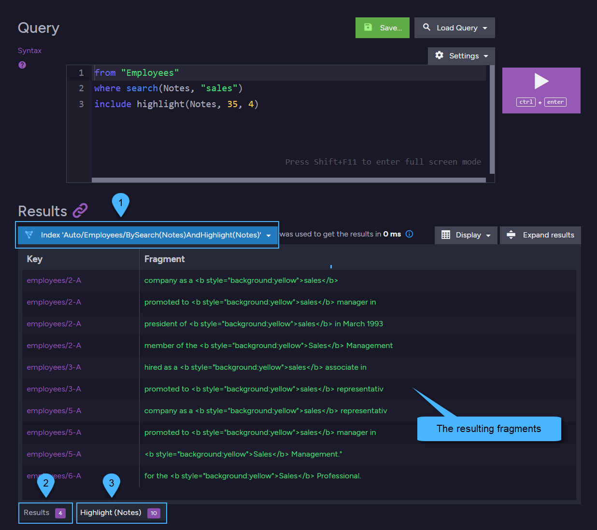

import Admonition from '@theme/Admonition';
import Tabs from '@theme/Tabs';
import TabItem from '@theme/TabItem';
import CodeBlock from '@theme/CodeBlock';

<Admonition type="note" title="">

* When making a [Full-Text Search query](../../../../../client-api/session/querying/text-search/full-text-search.mdx),  
  in addition to retrieving documents that contain the searched terms in the results,  
  you can also request to get a **list of text fragments that highlight the searched terms**.

* The highlighted terms can enhance user experience when searching for documents with specific content.

* This article shows highlighting search results when making a **dynamic-query**.  
  For highlighting search results when querying a **static-index** see [highlight index search results](../../../../../indexes/querying/highlighting.mdx).
* In this page:
  * [Highlight - basic example](../../../../../client-api/session/querying/text-search/highlight-query-results.mdx#highlight---basic-example)
      * [Highlight tags](../../../../../client-api/session/querying/text-search/highlight-query-results.mdx#highlight-tags)
      * [Highlight results in Studio](../../../../../client-api/session/querying/text-search/highlight-query-results.mdx#highlight-results-in-studio)
  * [Highlight - customize tags](../../../../../client-api/session/querying/text-search/highlight-query-results.mdx#highlight---customize-tags)
  * [Highlight - projected results](../../../../../client-api/session/querying/text-search/highlight-query-results.mdx#highlight---projected-results)
  * [Syntax](../../../../../client-api/session/querying/text-search/highlight-query-results.mdx#syntax)
  
</Admonition>
## Highlight - basic example

<Tabs groupId='languageSyntax'>
<TabItem value="Query" label="Query">
<CodeBlock language="csharp">
{`// Make a full-text search dynamic query:
// ======================================
List<Employee> employeesResults = session
     // Make a dynamic query on 'Employees' collection
    .Query<Employee>()
     // Search for documents containing the term 'sales' in their 'Notes' field
    .Search(x => x.Notes, "sales")
     // Request to highlight the searched term by calling 'Highlight'
    .Highlight(
        x => x.Notes, // The document-field name in which we search
        35,           // Max length of each text fragment
        4,            // Max number of fragments to return per document
        out Highlightings salesHighlights) // An out param for getting the highlighted text fragments
     // Execute the query
    .ToList();
`}
</CodeBlock>
</TabItem>
<TabItem value="Query_async" label="Query_async">
<CodeBlock language="csharp">
{`// Make a full-text search dynamic query:
// ======================================
List<Employee> employeesResults = await asyncSession
     // Make a dynamic query on 'Employees' collection
    .Query<Employee>()
     // Search for documents containing the term 'sales' in their 'Notes' field
    .Search(x => x.Notes, "sales")
     // Request to highlight the searched term by calling 'Highlight'
    .Highlight(
        x => x.Notes, // The document-field name in which we search
        35,           // Max length of each text fragment
        4,            // Max number of fragments to return per document
        out Highlightings salesHighlights) // An out param for getting the highlighted text fragments
     // Execute the query
    .ToListAsync();
`}
</CodeBlock>
</TabItem>
<TabItem value="DocumentQuery" label="DocumentQuery">
<CodeBlock language="csharp">
{`// Make a full-text search dynamic DocumentQuery:
// ==============================================
List<Employee> employeesResults = session.Advanced
     // Make a dynamic documentQuery on 'Employees' collection
    .DocumentQuery<Employee>()
     // Search for documents containing the term 'sales' in their 'Notes' field
    .Search(x => x.Notes, "sales")
     // Request to highlight the searched term by calling 'Highlight'
    .Highlight(
        x => x.Notes, // The document-field name in which we search
        35,           // Max length of each text fragment
        4,            // Max number of fragments to return per document
        out Highlightings salesHighlights) // An out param for getting the highlighted text fragments
     // Execute the documentQuery
    .ToList();
`}
</CodeBlock>
</TabItem>
<TabItem value="RQL" label="RQL">
<CodeBlock language="sql">
{`from "Employees"
where search(Notes, "sales")
include highlight(Notes, 35, 4)
`}
</CodeBlock>
</TabItem>
</Tabs>

<TabItem value="fragments_1" label="fragments_1">
<CodeBlock language="csharp">
{`// Process results:
// ================

// 'employeesResults' contains all Employee DOCUMENTS that have 'sales' in their 'Notes' field.
// 'salesHighlights' contains the text FRAGMENTS that highlight the 'sales' term.

StringBuilder builder = new StringBuilder().AppendLine("<ul>");

foreach (var employee in employeesResults)
\{
    // Call 'GetFragments' to get all fragments for the specified employee Id
    string[] fragments = salesHighlights.GetFragments(employee.Id);
    foreach (var fragment in fragments)
    \{
        builder.AppendLine(
            $"<li>Doc: \{employee.Id\} Fragment: \{fragment\}</li>");
    \}
\}

string fragmentsHtml = builder.AppendLine("</ul>").ToString();

// The resulting fragmentsHtml:
// ============================

// <ul>
//   <li>Doc: employees/2-A Fragment: company as a <b style="background:yellow">sales</b></li>
//   <li>Doc: employees/2-A Fragment: promoted to <b style="background:yellow">sales</b> manager in</li>
//   <li>Doc: employees/2-A Fragment: president of <b style="background:yellow">sales</b> in March 1993</li>
//   <li>Doc: employees/2-A Fragment: member of the <b style="background:yellow">Sales</b> Management</li>
//   <li>Doc: employees/3-A Fragment: hired as a <b style="background:yellow">sales</b> associate in</li>
//   <li>Doc: employees/3-A Fragment: promoted to <b style="background:yellow">sales</b> representativ</li>
//   <li>Doc: employees/5-A Fragment: company as a <b style="background:yellow">sales</b> representativ</li>
//   <li>Doc: employees/5-A Fragment: promoted to <b style="background:yellow">sales</b> manager in</li>
//   <li>Doc: employees/5-A Fragment: <b style="background:yellow">Sales</b> Management." </li>
//   <li>Doc: employees/6-A Fragment: for the <b style="background:yellow">Sales</b> Professional.</li>
// </ul>
`}
</CodeBlock>
</TabItem>

<Admonition type="note" title="">

#### Highlight tags
* By default, the highlighted term is wrapped with the following html:  
  `<b style="background:yellow">term</b>`  

* When requesting to highlight multiple terms,  
  the background color returned for each different term will be in the following order:

  - &lt;span style="border-left: 10px solid yellow"&gt;&nbsp;&lt;/span&gt;yellow,
  - &lt;span style="border-left: 10px solid lawngreen"&gt;&nbsp;&lt;/span&gt;lawngreen,
  - &lt;span style="border-left: 10px solid aquamarine"&gt;&nbsp;&lt;/span&gt;aquamarine,
  - &lt;span style="border-left: 10px solid magenta"&gt;&nbsp;&lt;/span&gt;magenta,
  - &lt;span style="border-left: 10px solid palegreen"&gt;&nbsp;&lt;/span&gt;palegreen,
  - &lt;span style="border-left: 10px solid coral"&gt;&nbsp;&lt;/span&gt;coral,
  - &lt;span style="border-left: 10px solid wheat"&gt;&nbsp;&lt;/span&gt;wheat,
  - &lt;span style="border-left: 10px solid khaki"&gt;&nbsp;&lt;/span&gt;khaki,
  - &lt;span style="border-left: 10px solid lime"&gt;&nbsp;&lt;/span&gt;lime,
  - &lt;span style="border-left: 10px solid deepskyblue"&gt;&nbsp;&lt;/span&gt;deepskyblue,
  - &lt;span style="border-left: 10px solid deeppink"&gt;&nbsp;&lt;/span&gt;deeppink,
  - &lt;span style="border-left: 10px solid salmon"&gt;&nbsp;&lt;/span&gt;salmon,
  - &lt;span style="border-left: 10px solid peachpuff"&gt;&nbsp;&lt;/span&gt;peachpuff,
  - &lt;span style="border-left: 10px solid violet"&gt;&nbsp;&lt;/span&gt;violet,
  - &lt;span style="border-left: 10px solid mediumpurple"&gt;&nbsp;&lt;/span&gt;mediumpurple,
  - &lt;span style="border-left: 10px solid palegoldenrod"&gt;&nbsp;&lt;/span&gt;palegoldenrod,
  - &lt;span style="border-left: 10px solid darkkhaki"&gt;&nbsp;&lt;/span&gt;darkkhaki,
  - &lt;span style="border-left: 10px solid springgreen"&gt;&nbsp;&lt;/span&gt;springgreen,
  - &lt;span style="border-left: 10px solid turquoise"&gt;&nbsp;&lt;/span&gt;turquoise,
  - &lt;span style="border-left: 10px solid powderblue"&gt;&nbsp;&lt;/span&gt;powderblue

* The html tags that wrap the highlighted terms can be **customized** to any other tags.  
  See [customize tags](../../../../../client-api/session/querying/text-search/highlight-query-results.mdx#highlight---customize-tags) below.

</Admonition>

<Admonition type="note" title="">

#### Highlight results in Studio

1. **Auto-Index**  
   This is the auto-index that was created by the server to serve the dynamic-query.  

2. **Results tab**  
   The results tab contains the resulting **documents** that match the provided RQL query.

3. **Highlight tab**  
   The highlight tab shows the resulting **fragments** that were included in the query result.

</Admonition>

## Highlight - customize tags

* The html tags that wrap the highlighted terms can be **customized** to any other tags.

<Tabs groupId='languageSyntax'>
<TabItem value="Query" label="Query">
<CodeBlock language="csharp">
{`// Define customized tags to use for highlighting the searched terms
// =================================================================
HighlightingOptions tagsToUse = new HighlightingOptions
{
    // Provide strings of your choice to 'PreTags' & 'PostTags', e.g.:
    // the first term searched for will be wrapped with '+++'
    // the second term searched for will be wrapped with '<<<' & '>>>'
    PreTags = new[] { "+++", "<<<" },
    PostTags = new[] { "+++", ">>>" }
};

// Make a full-text search dynamic query:
// ======================================
List<Employee> employeesResults = session
    .Query<Employee>()
     // Search for:
     //   * documents containing the term 'sales' in their 'Notes' field
     //   * OR for documents containing the term 'manager' in their 'Title' field
    .Search(x => x.Notes, "sales")
    .Search(x => x.Title, "manager")
     // Call 'Highlight' for each field searched
     // Pass 'tagsToUse' to OVERRIDE the default tags used 
    .Highlight(x => x.Notes, 35, 1, tagsToUse, out Highlightings salesHighlights)
    .Highlight(x => x.Title, 35, 1, tagsToUse, out Highlightings managerHighlights)
    .ToList();
`}
</CodeBlock>
</TabItem>
<TabItem value="Query_async" label="Query_async">
<CodeBlock language="csharp">
{`// Define customized tags to use for highlighting the searched terms
// =================================================================
HighlightingOptions tagsToUse = new HighlightingOptions
{
    // Provide strings of your choice to 'PreTags' & 'PostTags', e.g.:
    // The first term searched for will be wrapped with '+++'
    // the second term searched for will be wrapped with '<<<' & '>>>'
    PreTags = new[] { "+++", "<<<" },
    PostTags = new[] { "+++", ">>>" }
};

// Make a full-text search dynamic query:
// ======================================
List<Employee> employeesResults = await asyncSession
    .Query<Employee>()
     // Search for:
     //   * documents containing the term 'sales' in their 'Notes' field
     //   * OR for documents containing the term 'manager' in their 'Title' field
    .Search(x => x.Notes, "sales")
    .Search(x => x.Title, "manager")
     // Call 'Highlight' for each field searched
     // Pass 'tagsToUse' to OVERRIDE the default tags used 
    .Highlight(x => x.Notes, 35, 1, tagsToUse, out Highlightings salesHighlights)
    .Highlight(x => x.Title, 35, 1, tagsToUse, out Highlightings managerHighlights)
    .ToListAsync();
`}
</CodeBlock>
</TabItem>
<TabItem value="RQL" label="RQL">
<CodeBlock language="sql">
{`from "Employees"
where (search(Notes, "sales") or search(Title, "manager"))
include highlight(Notes, 35, 1, $p0), highlight(Title, 35, 1, $p1)
{
"p0":{"PreTags":["+++","<<<"],"PostTags":["+++",">>>"]},
"p1":{"PreTags":["+++","<<<"],"PostTags":["+++",">>>"]}
}
`}
</CodeBlock>
</TabItem>
</Tabs>

<TabItem value="fragments_2" label="fragments_2">
<CodeBlock language="csharp">
{`// The resulting salesHighlights fragments:
// ========================================

// "for the +++Sales+++ Professional."
// "hired as a +++sales+++ associate in"
// "company as a +++sales+++"
// "company as a +++sales+++ representativ"

// The resulting managerHighlights fragments:
// ==========================================

// "Sales <<<Manager>>>"
`}
</CodeBlock>
</TabItem>

## Highlight - projected results

* Highlighting can also be used when [projecting query results](../../../../../client-api/session/querying/how-to-project-query-results.mdx).

<Tabs groupId='languageSyntax'>
<TabItem value="Query" label="Query">
<CodeBlock language="csharp">
{`// Make a full-text search dynamic query & project results:
// ========================================================
var employeesProjectedResults = session
    .Query<Employee>()
     // Search for documents containing 'sales' or 'german' in their 'Notes' field
    .Search(x => x.Notes, "manager german")
     // Request to highlight the searched terms from the 'Notes' field 
    .Highlight(x => x.Notes, 35, 2, out Highlightings termsHighlights)
     // Define the projection
    .Select(x => new
    {
        // These fields will be returned instead of the whole document
        // Note: it is Not mandatory to return the field in which we search for the highlights 
        Name = $"{x.FirstName} {x.LastName}",
        x.Title
    })
    .ToList();
`}
</CodeBlock>
</TabItem>
<TabItem value="Query_async" label="Query_async">
<CodeBlock language="csharp">
{`// Make a full-text search dynamic query & project results:
// ========================================================
var employeesProjectedResults = await asyncSession
    .Query<Employee>()
     // Search for documents containing 'sales' or 'german' in their 'Notes' field
    .Search(x => x.Notes, "manager german")
     // Request to highlight the searched terms from the 'Notes' field 
    .Highlight(x => x.Notes, 35, 2, out Highlightings termsHighlights)
     // Define the projection
    .Select(x => new
    {
        // These fields will be returned instead of the whole document
        // Note: it is Not mandatory to return the field in which we search for the highlights 
        Name = $"{x.FirstName} {x.LastName}",
        x.Title
    })
    .ToListAsync();
`}
</CodeBlock>
</TabItem>
<TabItem value="RQL" label="RQL">
<CodeBlock language="sql">
{`from "Employees" as x
where search(x.Notes, "manager german")
select { Name : "{0} {1}".format(x.FirstName, x.LastName), Title : x.Title }
include highlight(Notes, 35, 2)
`}
</CodeBlock>
</TabItem>
</Tabs>

<TabItem value="fragments_3" label="fragments_3">
<CodeBlock language="csharp">
{`// The resulting fragments from termsHighlights:
// =============================================

// "to sales <b style=\\"background:yellow\\">manager</b> in March"
// "and reads <b style=\\"background:lawngreen\\">German</b>.  He joined"
// "to sales <b style=\\"background:yellow\\">manager</b> in January"
// "in French and <b style=\\"background:lawngreen\\">German</b>."

// NOTE: each search term is wrapped with a different color
// 'manager' is wrapped with yellow
// 'german' is wrapped with lawngreen
`}
</CodeBlock>
</TabItem>

## Syntax

<TabItem value="syntax_1" label="syntax_1">
<CodeBlock language="csharp">
{`IRavenQueryable<T> Highlight(
    string fieldName,
    int fragmentLength,
    int fragmentCount,
    out Highlightings highlightings);

IRavenQueryable<T> Highlight(
    string fieldName,
    int fragmentLength,
    int fragmentCount,
    HighlightingOptions options,
    out Highlightings highlightings);

IRavenQueryable<T> Highlight(
    Expression<Func<T, object>> path,
    int fragmentLength,
    int fragmentCount,
    out Highlightings highlightings);

IRavenQueryable<T> Highlight(
    Expression<Func<T, object>> path,
    int fragmentLength,
    int fragmentCount,
    HighlightingOptions options,
    out Highlightings highlightings);
`}
</CodeBlock>
</TabItem>

| Parameter          | Type                          | Description                                                                               |
|--------------------|-------------------------------|-------------------------------------------------------------------------------------------|
| **fieldName**      | string                        | Name of the field that contains the searched terms to highlight.                          |
| **path**           | `Expression<Func<T, object>>` | Path to the field that contains the searched terms to highlight.                          |
| **fragmentLength** | int                           | Maximum length of a text fragment. Must be `>= 18`.                                       |
| **fragmentCount**  | int                           | Maximum number of text fragments that will be returned.                                   |
| **options**        | `HighlightingOptions`         | Customizing options.                                                                      |
| **highlightings**  | `Highlightings`               | An 'out' param that will contain the highlighted text fragments for each returned result. |

 

**Highlighting options**:

<TabItem value="syntax_2" label="syntax_2">
<CodeBlock language="csharp">
{`public string GroupKey \{ get; set; \}
public string[] PreTags \{ get; set; \}
public string[] PostTags \{ get; set; \}
`}
</CodeBlock>
</TabItem>

| Option       | Type      | Description                                                                                                                                                                                                                                                                                                      |
|--------------|-----------|------------------------------------------------------------------------------------------------------------------------------------------------------------------------------------------------------------------------------------------------------------------------------------------------------------------|
| **GroupKey** | string    | Grouping key for the results. Used when highlighting query results from a [Map-Reduce index](../../../../../indexes/querying/highlighting.mdx#highlight-results---map-reduce-index). If `null` results are grouped by document ID (default). Note: Highlighting is Not available for dynamic aggregation queries. |
| **PreTags**  | string[]  | Array of PRE tags used to wrap the highlighted search terms in the text fragments.                                                                                                                                                                                                                               |
| **PostTags** | string[]  | Array of POST tags used to wrap the highlighted search terms in the text fragments.                                                                                                                                                                                                                              |

 

**Highlightings object**:

<TabItem value="syntax_3" label="syntax_3">
<CodeBlock language="csharp">
{`public string FieldName \{ get; \}
public IEnumerable<string> ResultIndents;
`}
</CodeBlock>
</TabItem>

| Property          | Type                 | Description                                                      |
|-------------------|----------------------|------------------------------------------------------------------|
| **FieldName**     | string               | Name of the field that contains the searched terms to highlight. |
| **ResultIndents** | `IEumerable<string>` | The resulting keys (document IDs, or the map-reduce keys).        |

<TabItem value="syntax_4" label="syntax_4">
<CodeBlock language="csharp">
{`public string[] GetFragments(string key);
`}
</CodeBlock>
</TabItem>

| Method           | Description                                                                                           |
|------------------|-------------------------------------------------------------------------------------------------------|
| **GetFragments** | Returns the list of the highlighted text fragments for the passed document ID, or the map-reduce key. |

