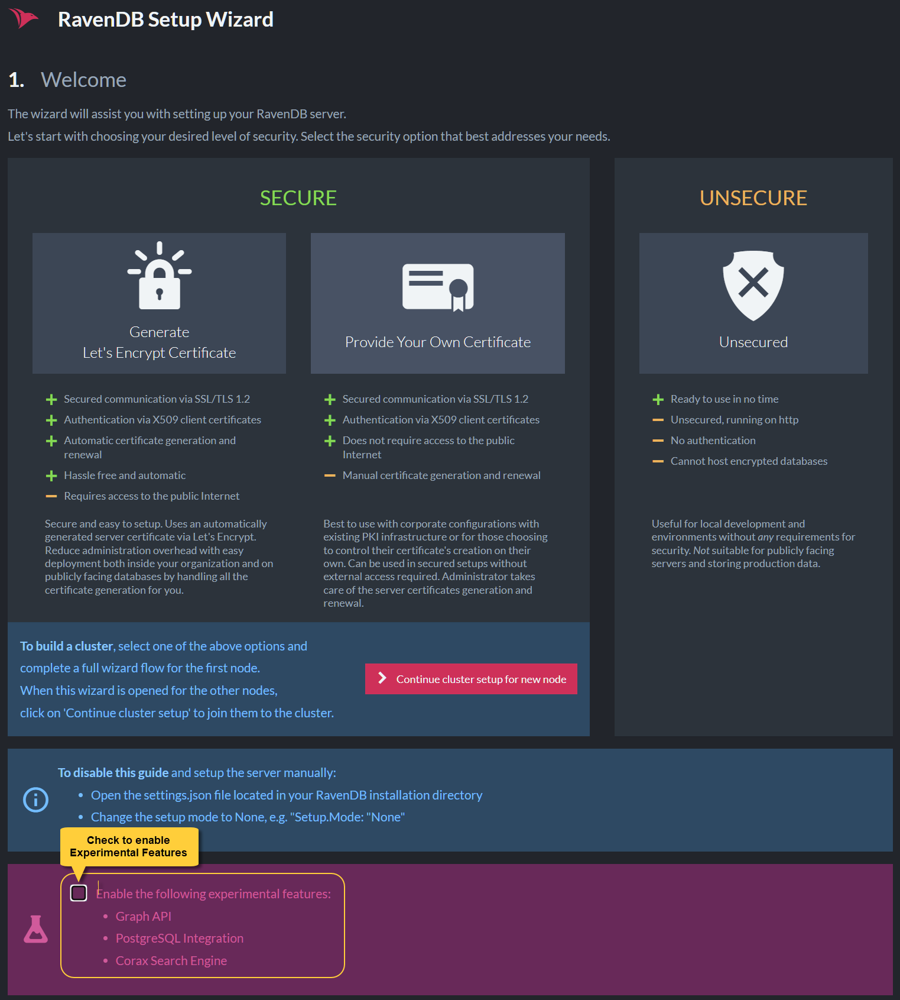
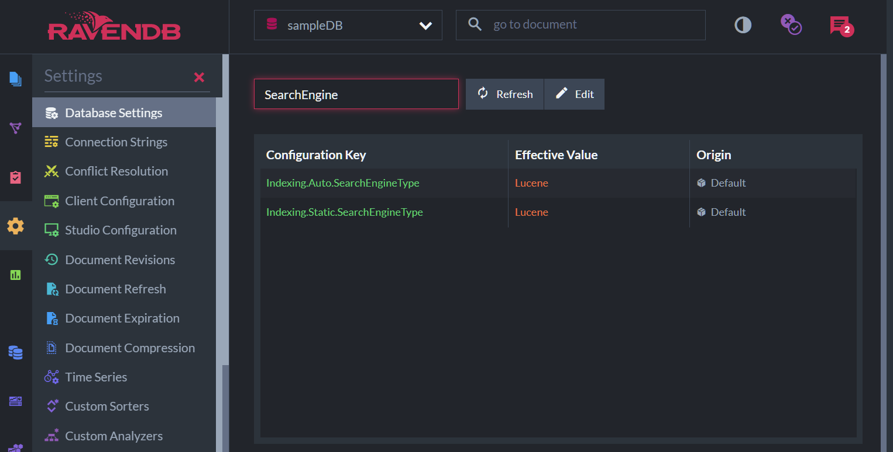
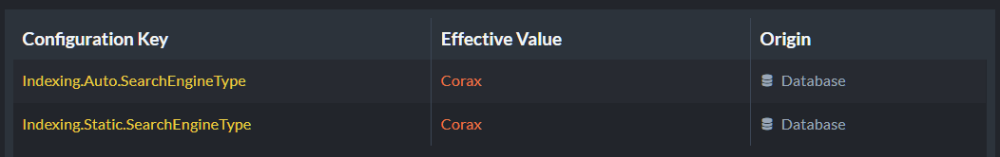
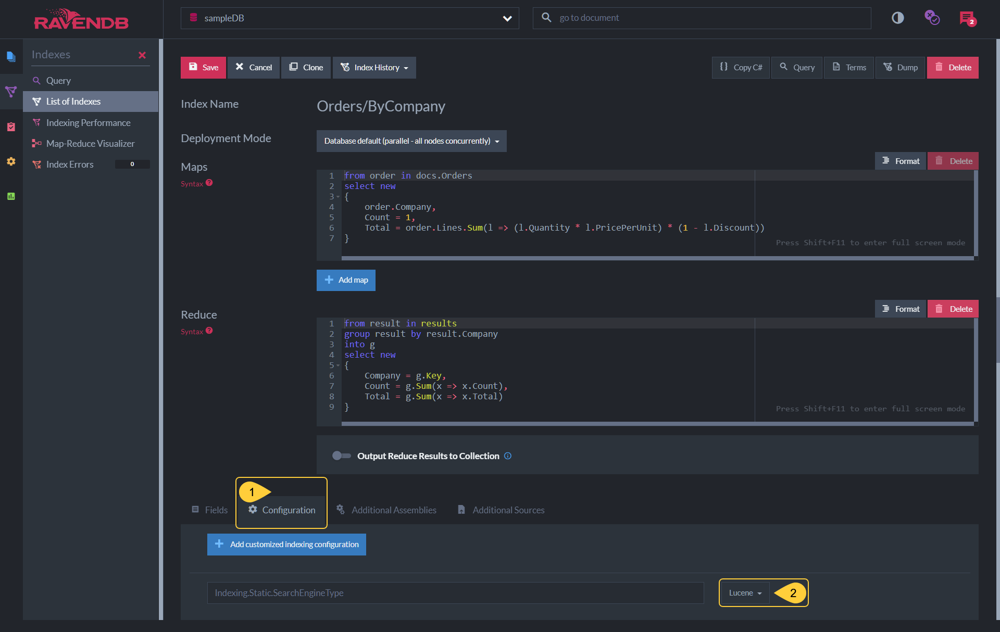
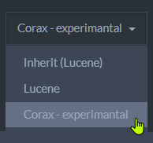
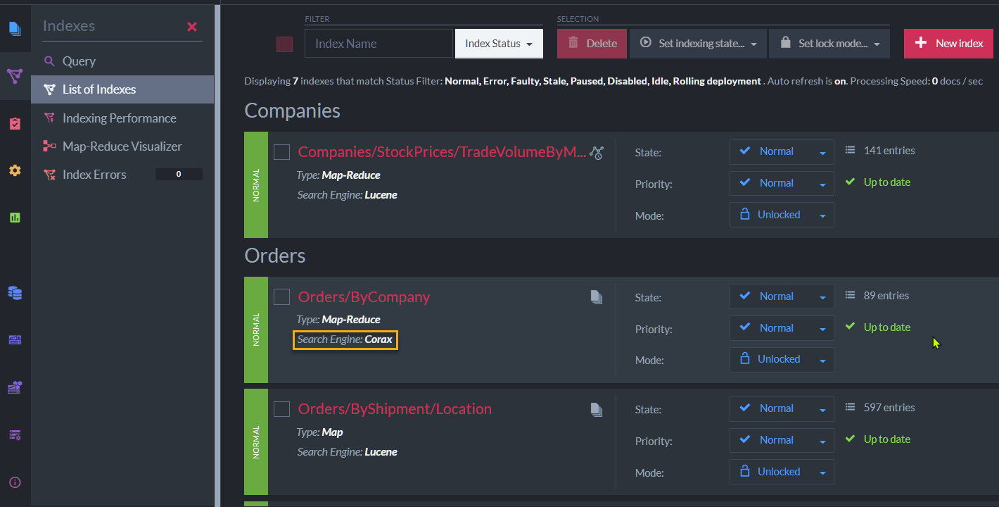
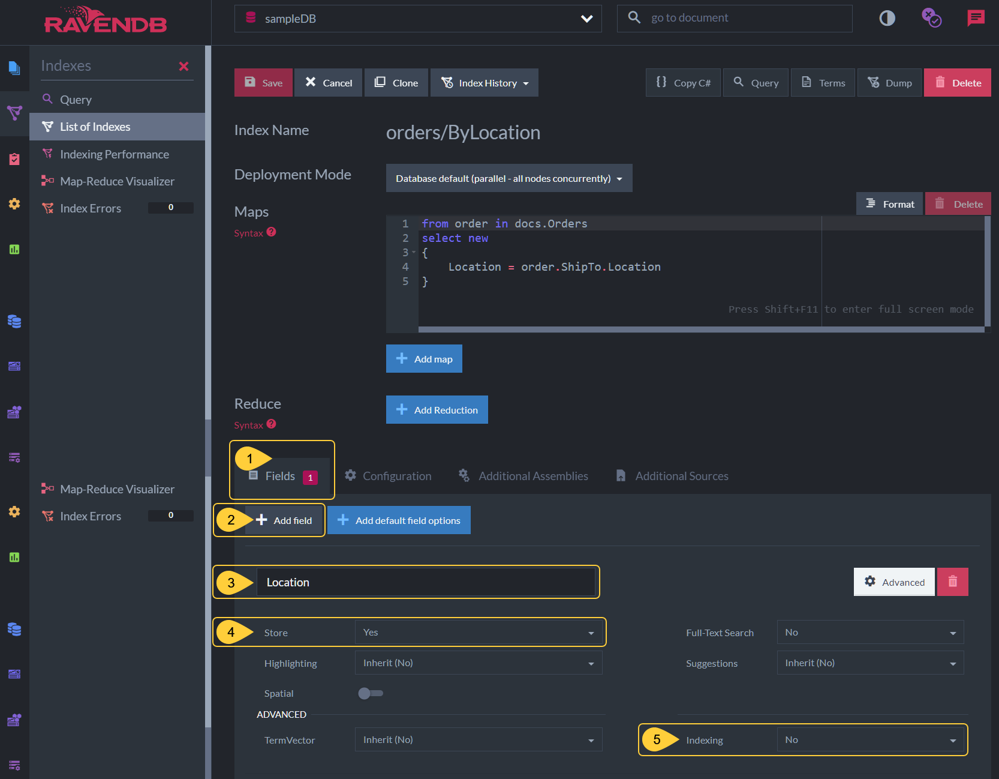

import Admonition from '@theme/Admonition';
import Tabs from '@theme/Tabs';
import TabItem from '@theme/TabItem';
import CodeBlock from '@theme/CodeBlock';
import LanguageSwitcher from "@site/src/components/LanguageSwitcher";
import LanguageContent from "@site/src/components/LanguageContent";

# Search Engine: Corax
<Admonition type="note" title="">

* **Corax** is RavenDB's native search engine, introduced in RavenDB 
  version 5.4 as an in-house searching alternative for Lucene.  
  Lucene remains available as well; you can use either Corax or 
  Lucene as your search engine, as you prefer.  

    <Admonition type="info" title="">
    Corax is still an **experimental feature**. 
    To use it, you must 
    [enable experimental features](../../indexes/search-engine/corax.mdx#enabling-corax) first.  
    </Admonition>

* The main role of the database's search engine is to **satisfy incoming queries**.  
  In RavenDB, the search engine achieves this by handling each query via an index.  
  If no relevant index exists, the search engine will create one automatically.  
  
    The search engine is the main "moving part" of the indexing mechanism, 
    that processes and indexes documents by index definitions.  

* The search engine can be selected separately for 
  [auto](../../indexes/creating-and-deploying.mdx#auto-indexes) and 
  [static](../../indexes/creating-and-deploying.mdx#static-indexes) indexes.  

* The search engine can be selected per server, per database, and per index (for static indexes only).  

* In this page:  
   * [Enabling Corax](../../indexes/search-engine/corax.mdx#enabling-corax)  
   * [Selecting the Search Engine](../../indexes/search-engine/corax.mdx#selecting-the-search-engine)  
      * [Server Wide](../../indexes/search-engine/corax.mdx#select-search-engine-server-wide)  
      * [Per Database](../../indexes/search-engine/corax.mdx#select-search-engine-per-database)  
      * [Per Index](../../indexes/search-engine/corax.mdx#select-search-engine-per-index)  
   * [Supported Features](../../indexes/search-engine/corax.mdx#supported-features)  
      * [Unimplemented Methods](../../indexes/search-engine/corax.mdx#unimplemented-methods)  
   * [Handling of Complex JSON Objects](../../indexes/search-engine/corax.mdx#handling-of-complex-json-objects)  

</Admonition>
## Enabling Corax

Corax is an experimental feature and is disabled by default.  
To use it, you must explicitly enable RavenDB's experimental features.  

* To enable experimental features **when RavenDB is already installed** -  
  Edit RavenDB's [configuration file](../../server/configuration/configuration-options.mdx#settingsjson) 
  and Enable [experimental features](../../server/configuration/core-configuration.mdx#featuresavailability).  
  
      E.g. set `settings.json` to:  
<TabItem value="csharp" label="csharp">
<CodeBlock language="csharp">
{`\{
  "ServerUrl": "http://127.0.0.1:8080",
  "Setup.Mode": "None",
  
  // enable experimental features
  "Features.Availability": "Experimental"
\}
`}
</CodeBlock>
</TabItem>

      <Admonition type="note" title="">
        You must restart the server after making these changes, 
        for the new settings to be read and applied.  
      </Admonition>

* To enable experimental features during [Setup](../../start/installation/setup-wizard.mdx) -  
  check **Enable the following experimental features** in the **Welcome** page.  

    

## Selecting the Search Engine

* You can select your preferred search engine in several scopes:  
   * [Server-wide](../../indexes/search-engine/corax.mdx#select-search-engine-server-wide), 
     selecting which search engine will be used by all the databases hosted by this server.  
   * [Per database](../../indexes/search-engine/corax.mdx#select-search-engine-per-database), 
     overriding server-wide settings for a specific database.  
   * [Per index](../../indexes/search-engine/corax.mdx#select-search-engine-per-index), 
     overriding server-wide and per-database settings.  
     Per-index settings are available only for **static** indexes.  

* Two configuration options are available:  
   * [Indexing.Auto.SearchEngineType](../../server/configuration/indexing-configuration.mdx#indexingautosearchenginetype)  
     Use this option to select the search engine (either `Lucene` or `Corax`) for **auto** indexes.  
     The search engine can be selected **server-wide** or **per database**.  
   * [Indexing.Static.SearchEngineType](../../server/configuration/indexing-configuration.mdx#indexingstaticsearchenginetype)  
     Use this option to select the search engine (either `Lucene` or `Corax`) for **static** indexes.  
     The search engine can be selected **server-wide**, **per database**, or **per index**.  
### Select Search Engine: Server Wide

Select the search engine for all the databases hosted by a server 
by modifying the server's [settings.json](../../server/configuration/configuration-options.mdx#settingsjson) file.  
E.g. -  
<TabItem value="csharp" label="csharp">
<CodeBlock language="csharp">
{`\{
    "Indexing.Auto.SearchEngineType": "Corax"
    "Indexing.Static.SearchEngineType": "Corax"
\}
`}
</CodeBlock>
</TabItem>

<Admonition type="note" title="">
You must restart the server for the new settings to be read and applied.  
</Admonition>
### Select Search Engine: Per Database

To select the search engine that the database would use, modify the 
relevant Database Record settings. You can easily do this via Studio:  

* Open Studio's [Database Settings](../../studio/database/settings/database-settings.mdx) 
  page, and enter `SearchEngine` in the search bar to find the search engine settings.  
  Click `Edit` to modify the default search engine.  

     

* Select your preferred search engine for Auto and Static indexes.  

     

* To apply the new settings either **disable and re-enable the database** or **restart the server**.  

     
### Select Search Engine: Per index 

You can also select the search engine that would be used by a specific index, 
overriding any per-database and per-server settings.  

#### Select Index Search Engine via Studio:  

* **Indexes-List-View** &gt; **Edit Index Definition**  
  Open Studio's [Index List](../../studio/database/indexes/indexes-list-view.mdx) 
  view and select the index whose search engine you want to set.  

    
    1. Open the index' **Configuration** tab.  
    2. Select the search engine you prefer for this index.  
       

* The indexes list view will show the changed configuration.  

    
#### Select Index Search Engine using Code

While defining an index using the API, use the `SearchEngineType` 
property to select the search engine that would run the index.  
Available values: `SearchEngineType.Lucene`, `SearchEngineType.Corax`.  

* You can pass the search engine type you prefer:  
<TabItem value="index-definition_select-while-creating-index" label="index-definition_select-while-creating-index">
<CodeBlock language="csharp">
{`// Set search engine type while creating the index
new Product_ByAvailability(SearchEngineType.Corax).Execute(store);
`}
</CodeBlock>
</TabItem>  
* And set it in the index definition:  
<TabItem value="index-definition_set-search-engine-type" label="index-definition_set-search-engine-type">
<CodeBlock language="csharp">
{`private class Product_ByAvailability : AbstractIndexCreationTask<Product>
\{
    public Product_ByAvailability(SearchEngineType type)
    \{
        // Any Map/Reduce segments here
        Map = products => from p in products
                          select new
                          \{
                              p.Name,
                              p.Brand
                          \};

        // The preferred search engine type
        SearchEngineType = type;
    \}
\}
`}
</CodeBlock>
</TabItem>  

## Supported Features

Corax supports [Auto](../../indexes/creating-and-deploying.mdx#auto-indexes) 
and [Static](../../indexes/creating-and-deploying.mdx#static-indexes) indexing.  

The feature is currently under construction, please find its full list 
of supported and yet-unsupported features below.  

* **While indexing**, Corax does **not** support:  
   * [Boosting](../../indexes/boosting.mdx)  
   * [WKT shapes](../../indexes/indexing-spatial-data.mdx)  
     (when spatial data is indexed, **spatial points** Are indexed while **WKT shapes** are Not indexed.)  
* **While querying**, Corax does **not** support:  
   * [MoreLikeThis](../../indexes/querying/morelikethis.mdx)  
   * [Facets](../../indexes/querying/faceted-search.mdx)  
   * [Fuzzy Search](../../client-api/session/querying/text-search/fuzzy-search.mdx)  
   * Searching by [Regex](../../client-api/session/querying/text-search/using-regex.mdx)  
* Corax does **not** support [Dynamic Fields](../../indexes/using-dynamic-fields.mdx) yet.  
  As a result, the many Javascript indexes that use dynamic fields are not supported.  

| Query Term                                                   | Method / Keyword                                                                                                                                                                                                                   | Supported by Corax                     |
|--------------------------------------------------------------|------------------------------------------------------------------------------------------------------------------------------------------------------------------------------------------------------------------------------------|----------------------------------------|
| [WHERE](../../client-api/session/querying/what-is-rql.mdx#where) |                                                                                                                                                                                                                                    |                                        |
|                                                              | id()                                                                                                                                                                                                                               | `yes`                                  |
|                                                              | [search()](../../client-api/session/querying/text-search/full-text-search.mdx)                                                                                                                                                         | `yes`                                  |
|                                                              | cmpxchg()                                                                                                                                                                                                                          | **no**                                 |
|                                                              | [boost()](../../client-api/session/querying/text-search/boost-search-results.mdx)                                                                                                                                                      | `yes`                                  |
|                                                              | [regex()](../../client-api/session/querying/text-search/using-regex.mdx)                                                                                                                                                               | **no**                                 |
|                                                              | [startsWith()](../../client-api/session/querying/text-search/starts-with-query.mdx)                                                                                                                                                    | `yes`                                  |
|                                                              | [endsWith()](../../client-api/session/querying/text-search/ends-with-query.mdx)                                                                                                                                                        | `yes`                                  |
|                                                              | [lucene()](../../client-api/session/querying/document-query/how-to-use-lucene.mdx)                                                                                                                                                     | **no**                                 |
|                                                              | [exists()](../../client-api/session/querying/how-to-filter-by-field.mdx)                                                                                                                                                               | `yes`                                  |
|                                                              | [exact()](../../client-api/session/querying/text-search/exact-match-query.mdx)                                                                                                                                                         | `yes`                                  |
|                                                              | [intersect()](../../indexes/querying/intersection.mdx)                                                                                                                                                                                 | **no**                                 |
|                                                              | [spatial.within()](../../indexes/querying/spatial.mdx)   [spatial.contains()](../../indexes/querying/spatial.mdx)   [spatial.disjoint()](../../indexes/querying/spatial.mdx)   [spatial.intersects()](../../indexes/querying/spatial.mdx) | `yes`   `yes`   `yes`   `yes` |
|                                                              | [moreLikeThis()](../../client-api/session/querying/how-to-use-morelikethis.mdx)                                                                                                                                                        | **no**                                 |

| Query Term | Method / Keyword | Supported by Corax |
| ---------- | ---------------- | ------------------ |
| [ORDER BY](../../client-api/session/querying/what-is-rql.mdx#order-by) | | |
| | [ASC / ASCENDING](../../indexes/querying/sorting.mdx#basics) | `yes` |
| | [DESC / DESCENDING](../../indexes/querying/sorting.mdx#basics) | `yes` |
| | [AS](../../indexes/querying/sorting.mdx#basics) | `yes` |
| | [string](../../indexes/querying/sorting.mdx#basics) | `yes` |
| | [long](../../indexes/querying/sorting.mdx#basics) | `yes` |
| | [double](../../indexes/querying/sorting.mdx#basics) | `yes` |
| | [alphaNumeric](../../indexes/querying/sorting.mdx#alphanumeric-ordering) | `yes` |
| | [random()](../../indexes/querying/sorting.mdx#random-ordering) | **no** |
| | [score()](../../indexes/querying/sorting.mdx#ordering-by-score) | `yes` |
| | [spatial.distance()](../../client-api/session/querying/how-to-make-a-spatial-query.mdx#spatial-sorting) | `yes` |
### Unimplemented Methods

Trying to use Corax with an unimplemented method (see 
[Supported Features](../../indexes/search-engine/corax.mdx#supported-features) above) 
will generate a `System.NotImplementedException` exception and end the search.  

<Admonition type="info" title="">
E.g. -  
the following query uses the `intersect` method, which is currently not supported by Corax.  
<TabItem value="sql" label="sql">
<CodeBlock language="sql">
{`from index 'Orders/ByCompany'
where intersect(Count > 10, Total > 3)
`}
</CodeBlock>
</TabItem>

If you set Corax as the search engine for the `Orders/ByCompany` index 
used by the above query, running the query will generate the following 
exception and the search will stop.  
  
</Admonition>

## Handling of Complex JSON Objects

Complex JSON properties **cannot currently be indexed and searched by Corax**.  
Consider, for example, the following `orders` document:  
<TabItem value="json" label="json">
<CodeBlock language="json">
{`\{
    "Company": "companies/27-A",
    "Employee": "employees/2-A",
    "ShipTo": \{
        "City": "Torino",
        "Country": "Italy",
        "Location": \{
            "Latitude": 45.0907661,
            "Longitude": 7.687425699999999
        \}
    \}
\}
`}
</CodeBlock>
</TabItem>

As the `Location` property of the document above contains not a simple numeric value 
or string but a list of key/value pairs, attempting to index this field using Corax 
[would fail](../../indexes/search-engine/corax.mdx#if-corax-encounters-a-complex-property-while-indexing).  

There are several ways to handle the indexing of complex JSON objects:  

#### 1. Index a Simple Property Contained in the Complex Field

Index one of the simple key/value properties stored within the nested object.  
In the `Location` field, for example, Location's `Latitude` and `Longitude`.  
can serve us this way:  

<TabItem value="json" label="json">
<CodeBlock language="json">
{`from order in docs.Orders
select new
\{
    Latitude = order.ShipTo.Location.Latitude,
    Longitude = order.ShipTo.Location.Longitude
\}
`}
</CodeBlock>
</TabItem>
#### 2. Index the Document Using Lucene

As long as Corax doesn't index complex JSON objects, you can always 
select Lucene as your search engine when you need to index nested properties.  
#### 3. Disable the Indexing of the Complex Field

You can use Corax as your search engine, but explicitly disable the indexing 
of complex objects.  
When you disable the **indexing** of a field this way, the field's contents 
can still be **stored and projected**.  

* To disable indexing for a specified field **via Studio**:  
  
   1. Open the index definition's **Fields** tab.  
   2. Click **Add Field** to specify what field Corax shouldn't index.  
   3. Enter the name of the field Corax should not index.  
   4. Can only be set to **Yes** when Corax is used since Corax always stores fields.  
   5. Select **No** to disable indexing for the specified field.  

* To disable indexing for a specified field **using Code**:  
<TabItem value="index-definition_disable-indexing-for-specified-field" label="index-definition_disable-indexing-for-specified-field">
<CodeBlock language="csharp">
{`private class Order_ByLocation : AbstractIndexCreationTask<Order>
\{
    public Order_ByLocation(SearchEngineType type)
    \{
        Map = orders => from o in orders
                        select new
                        \{
                            o.ShipTo.Location
                        \};

        SearchEngineType = type;

        // Disable indexing for this field
        Index("Location", FieldIndexing.No);

        // Store the field's content
        // (this is mandatory if the field's indexing is disabled)
        Store("Location", FieldStorage.Yes);
    \}
\}
`}
</CodeBlock>
</TabItem>  
#### 4. Turn the complex property into a string

You can use `ToString()` to index the complex property as a string.  

<Tabs groupId='languageSyntax'>
<TabItem value="Not_Supported_By_Corax" label="Not_Supported_By_Corax">
<CodeBlock language="sql">
{`from order in docs.Orders
select new
{
    // this will fail for the above document when using Corax
    Location = order.ShipTo.Location
}
`}
</CodeBlock>
</TabItem>
<TabItem value="Use_ToString()" label="Use_ToString()">
<CodeBlock language="sql">
{`from order in docs.Orders
select new
{
    // handling the field as string will allow Corax to index it
    Location = order.ShipTo.Location.ToString()
}
`}
</CodeBlock>
</TabItem>
</Tabs>

<Admonition type="note" title="">
Using `ToString` will serialize all the properties of the complex property into 
a single string, including names, values, brackets, and so on.  
The produced string is **not** a good feed for analyzers and is not commonly used for searches.  
It does, however, make sense in some cases to **project** such a string.  
</Admonition>
#### If Corax Encounters a Complex Property While Indexing:  

* If an auto index exists for the document, Corax will throw 
  `System.NotSupportedException` to notify the user that a search 
  that makes no sense has been attempted.  

* If a static index is used and it doesn't explicitly relate 
  to the complex field, Corax will automatically exempt the 
  field from indexing (by defining **Indexing: No** for this 
  field as shown [above](../../indexes/search-engine/corax.mdx#disable-the-indexing-of-the-complex-field)).  
  
     If the static index explicitly sets the Indexing flag in 
     any other way but "no", Corax **will** throw the exception.  

