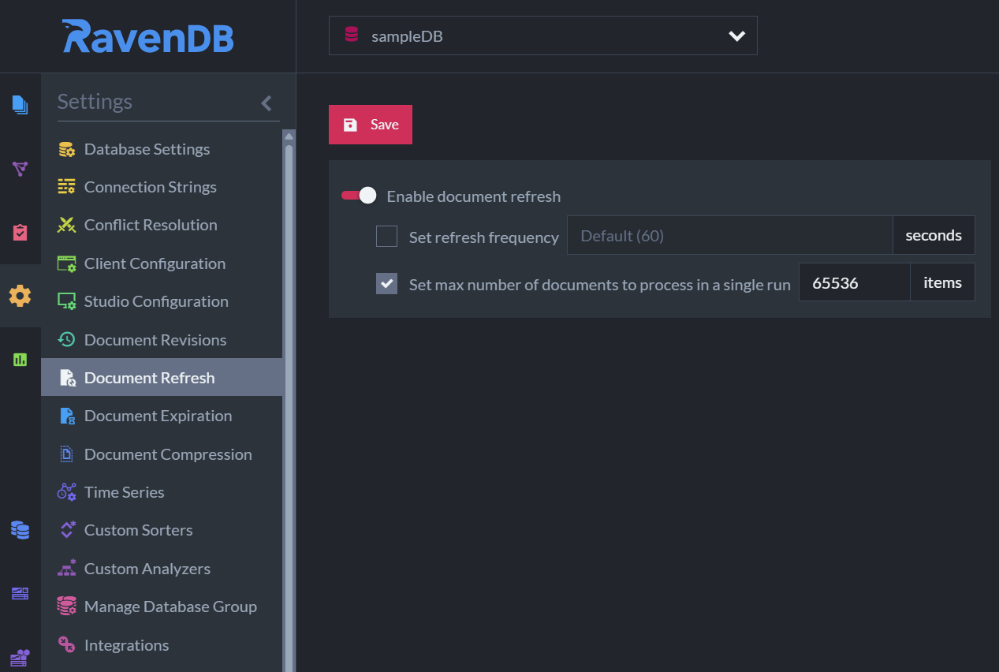

import Admonition from '@theme/Admonition';
import Tabs from '@theme/Tabs';
import TabItem from '@theme/TabItem';
import CodeBlock from '@theme/CodeBlock';

<Admonition type="note" title="">

* The Refresh feature increments a document's [change vector](../../server/clustering/replication/change-vector.mdx), 
  triggering its re-indexation as well as other features that react to document updates.  

* Refresh is scheduled using the `@refresh` flag in a document's [metadata](../../client-api/session/how-to/get-and-modify-entity-metadata.mdx).  

* In this page:  
  * [Overview](../../server/extensions/refresh.mdx#overview)  
  * [Examples](../../server/extensions/refresh.mdx#examples)
  * [Syntax](../../server/extensions/refresh.mdx#syntax)
  * [Configure from Studio](../../server/extensions/refresh.mdx#configure-from-studio)

</Admonition>
## Overview

To refresh a document, add a `@refresh` flag to the document's metadata specifying datetime in UTC format.  
This indicates when the document should be refreshed.  

This will cause the document to refresh **_only once_**! The refresh operation removes 
the `@refresh` flag.  

The exact time that the document refreshes is not determined by the value of `@refresh` 
- rather, the server refreshes documents at regular intervals determined by the Refresh 
Configuration. The default interval is 60 seconds.  

Refreshing a document causes its [change vector](../../server/clustering/replication/change-vector.mdx) 
to increment the same way it would after any other kind of update to the document. 
This triggers any features that react to documents updating, including but not limited 
to:  

* The document is re-indexed by any indexes that cover it.  
* [Replication](../../server/ongoing-tasks/external-replication.mdx), 
  [Subscriptions](../../client-api/data-subscriptions/what-are-data-subscriptions.mdx), 
  and [ETL](../../server/ongoing-tasks/etl/basics.mdx) are triggered.
* A [revision](../../document-extensions/revisions/overview.mdx) of the document is created.  

## Examples

#### Setting the refresh configuration for a database:

To activate and/or configure document refreshing, the server needs to be sent a configuration object using the `ConfigureRefreshOperation` operation.  

<TabItem value="configure_refresh" label="configure_refresh">
<CodeBlock language="js">
{`// Enable document refreshing and set the refresh interval to 5 minutes:
// =====================================================================

// Define the refresh configuration object 
const refreshConfiguration = \{
    disabled: false,           // Enable refreshing
    refreshFrequencyInSec: 300 // Set interval to 5 minutes
\};

// Define the configure refresh operation, pass the configuration to set
const configureRefreshOp = new ConfigureRefreshOperation(refreshConfiguration);

// Execute the operation by passing it to maintenance.send
await documentStore.maintenance.send(configureRefreshOp);
`}
</CodeBlock>
</TabItem>
#### Set a document to refresh 1 hour from now:

<TabItem value="refresh_example" label="refresh_example">
<CodeBlock language="js">
{`// Setting a document to refresh after 1 hour:
// ==========================================+ 

// Load a document
const session = documentStore.openSession();
const employee = await session.load("employees/1-A");

// Get the metadata of the document
const metadata = session.advanced.getMetadataFor(employee);

// Set the "@refresh" metadata property with the refresh date in UTC format
const refreshAt = new Date(new Date().getTime() + (60_000 * 60))
metadata[CONSTANTS.Documents.Metadata.REFRESH] = refreshAt.toISOString();

// Save the document
await session.saveChanges();
`}
</CodeBlock>
</TabItem>

## Syntax

<TabItem value="syntax_1" label="syntax_1">
<CodeBlock language="js">
{`const configureRefreshOp = new ConfigureRefreshOperation(refreshConfiguration);
`}
</CodeBlock>
</TabItem>

[//]: # (| Parameter                 | Type     | Description                                                                                   |)
[//]: # (|---------------------------|----------|-----------------------------------------------------------------------------------------------|)
[//]: # (| **configuration**         | `object` | Refresh configuration that will be set on the server &#40;for the database&#41;                       |)
[//]: # (| **disabled**              | `object` | If set to true, document refreshing is disabled for the entire database. Default: `true`      |)
[//]: # (| **refreshFrequencyInSec** | `number` | Determines how often the server checks for documents that need to be refreshed. Default: `60` |)

<TabItem value="syntax_2" label="syntax_2">
<CodeBlock language="js">
{`// The refreshConfiguration object
\{
    disabled,
    refreshFrequencyInSec
\}
`}
</CodeBlock>
</TabItem>

| Parameter                 | Type      | Description                                                                                                              |
|---------------------------|-----------|--------------------------------------------------------------------------------------------------------------------------|
| **disabled**              | `boolean` | `true` - document refreshing is disabled for the entire database (Default). `false` - document refreshing is enabled. |
| **refreshFrequencyInSec** | `number`  | Set how often the server checks for documents that need to be refreshed. Default: `60`                                |

## Configure from Studio

Alternatively, document refreshing can also be configured via Studio, under **Settings &gt; Document Refresh**.

