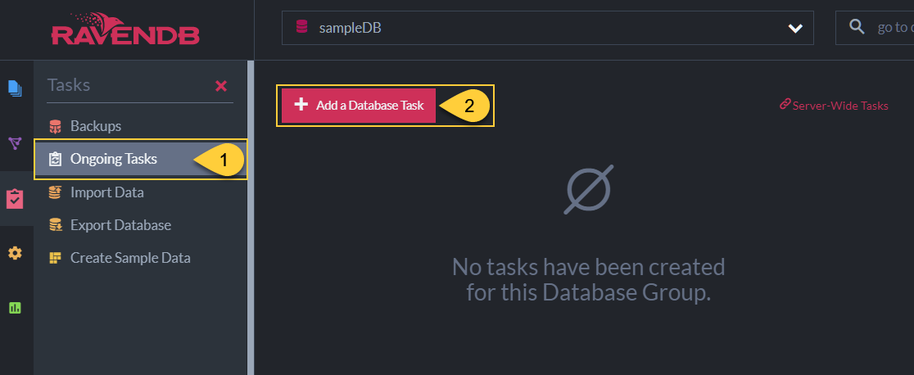
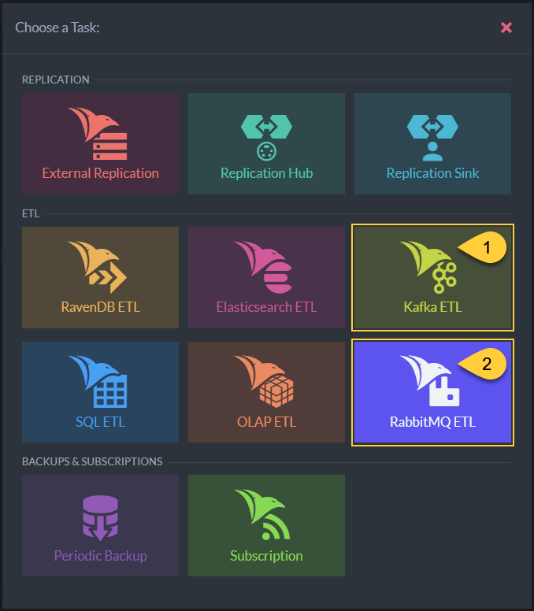

import Admonition from '@theme/Admonition';
import Tabs from '@theme/Tabs';
import TabItem from '@theme/TabItem';
import CodeBlock from '@theme/CodeBlock';
import LanguageSwitcher from "@site/src/components/LanguageSwitcher";
import LanguageContent from "@site/src/components/LanguageContent";

# Ongoing Tasks: Queue ETL Overview
<Admonition type="note" title="">

* Message brokers are high-throughput, distributed messaging services that 
  host data they receive from **producer** applications and serve it to 
  **consumer** clients via FIFO data queue/s. 
* RavenDB takes the role of a Producer in this architecture, via ETL tasks that -  
   * Extract data from specified document collections.  
   * Transform the data to new JSON objects.  
   * Load the JSON objects to the message broker.  
* RavenDB wraps JSON objects as CloudEvents messages prior to loading them 
  to the designated broker, using the [CloudEvents Library](https://cloudevents.io).  
* Supported message brokers currently include **Apache Kafka** and **RabbitMQ**.  

* In this page:  
   * [Supported Message Brokers](../../../../server/ongoing-tasks/etl/queue-etl/overview.mdx#supported-message-brokers)  
   * [CloudEvents](../../../../server/ongoing-tasks/etl/queue-etl/overview.mdx#cloudevents)  
   * [Task Statistics](../../../../server/ongoing-tasks/etl/queue-etl/overview.mdx#task-statistics)  

</Admonition>
## Supported Message Brokers

Queue applications that RavenDB can currently produce data for include **Apache Kafka** and **RabbitMQ**.  

1. **Ongoing Tasks**  
   Click to open the ongoing tasks view.  
2. **Add a Database Task**  
   Click to create a new ongoing task.  

1. **Kafka ETL**  
   Click to define a Kafka ETL task.  
2. **RabbitMQ ETL**  
   Click to define a RabbitMQ ETL task.  

## CloudEvents

After preparing a JSON object that needs to be sent to a message broker, 
the ETL task wraps it as a CloudEvents message using the [CloudEvents Library](https://cloudevents.io).  

To do that, the JSON object is provided with additional 
[required attributes](https://github.com/cloudevents/spec/blob/main/cloudevents/spec.md#required-attributes), 
added as headers to the message, including:  

| Attribute | Type | Description | Default Value |
|:-------------|:-------------|:-------------:|:-------------|
| **Id** | `string` | [Event Identifier](https://github.com/cloudevents/spec/blob/main/cloudevents/spec.md#id) | Document **Change Vector** |
| **Type** | `string` | [Event Type](https://github.com/cloudevents/spec/blob/main/cloudevents/spec.md#type) | **"ravendb.etl.put"** |
| **Source** | `string` | [Event Context](https://github.com/cloudevents/spec/blob/main/cloudevents/spec.md#source-1) | `<ravendb-node-url>/<database-name>/<etl-task-name>` |
#### Optional Attributes

The optional **partitionkey** attribute can also be added. 
It is currently only implemented by [Kafka](../../../../server/ongoing-tasks/etl/queue-etl/kafka.mdx).  

| Optional Attribute | Type | Description | Default Value |
|:-------------|:-------------|:-------------:|:-------------|
| **partitionkey** | `string` | [events relationship/grouping definition](https://github.com/cloudevents/spec/blob/main/cloudevents/extensions/partitioning.md#partitionkey) | **Document ID** |

## Task Statistics

Use Studio's [ongoing tasks stats](../../../../studio/database/stats/ongoing-tasks-stats/overview.mdx) view 
to see various statistics related to data extraction, transformation, and loading to the target broker.  

