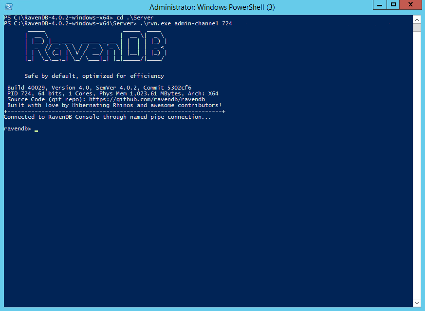

import Admonition from '@theme/Admonition';
import Tabs from '@theme/Tabs';
import TabItem from '@theme/TabItem';
import CodeBlock from '@theme/CodeBlock';
import LanguageSwitcher from "@site/src/components/LanguageSwitcher";
import LanguageContent from "@site/src/components/LanguageContent";

# Setup Examples: AWS Windows VM

In this walkthrough we will setup RavenDB on an AWS EC2 t2.micro Windows virtual machine.

We will go through the necessary steps that are required for RavenDB to run securely including how to configure RavenDB 
with the correct IP addresses and ports.

It's recommended to read the [Setup Wizard](../../../start/installation/setup-wizard.mdx) section where you can find a detailed 
explanation about the RavenDB setup process.

## Create the VM

Access the EC2 Dashboard and click on Launch Instance.

Select your operating system. In our example we choose "Microsoft Windows Server 2012 R2 Base".

Select the machine type. We chose the t2.micro with 1 core and 1 GB of memory.

We stick with the basic default settings of the machine and configure just the minimal requirements for RavenDB. 
You would probably want to go over the entire set of options and customize your VM. 

<Admonition type="warning" title="Security Concerns" id="security-concerns" href="#security-concerns">
The following settings are fine if you just want to experiment with RavenDB. However, when security is needed you should set 
proper firewall rules and restrict access by IP. Please visit the [AWS security documentation](https://docs.aws.amazon.com/AWSEC2/latest/UserGuide/ec2-security.html)
for more information about securing your VM.
</Admonition>

<Admonition type="note" title="Elastic IP address" id="elastic-ip-address" href="#elastic-ip-address">
By default, in AWS, an instance is assigned an IP addresses through DHCP. When the DHCP lease expires, or you restart the instance, this IP is released back to the pool and you will have to re-configure the RavenDB IP address.
To solve this problem, use an [Elastic IP address](https://docs.aws.amazon.com/AWSEC2/latest/UserGuide/elastic-ip-addresses-eip.html) which doesn't change, and can even be dynamically re-assigned to other instances as you wish.
</Admonition>

Let's open ports 443 and 38888 for use by RavenDB. You may choose other port numbers of course and restrict access by IP.
RavenDB will use port 443 for HTTPS requests and port 38888 for TCP connections. We allow all incoming traffic on these ports by using 0.0.0.0.

Review your settings and launch the VM.

You will have to download a key pair which will be used later to set the Windows password.

Wait a couple minutes for the machine to initialize and click connect. 

Get your password and download the Remote Desktop File.

Connect to the VM. Use the username "Administrator" and the password you just received.

## Configure the VM

Open the "Windows Defender Firewall with Advanced Security" and go to the "Inbound Rules" tab. 

Create a new rule for TCP ports 443 and 38888 (or the ones you choose).

Now let's setup RavenDB. 

First we need to download it. 

Dowload Chrome. You will need to allow it in the Internet Explorer firewall.

Install the [Visual C++ 2015 Redistributable Package](https://support.microsoft.com/en-us/help/2977003/the-latest-supported-visual-c-downloads) (or newer).

## Run the RavenDB Setup Wizard

Download RavenDB and extract it to a path of your choice (e.g. C:\Raven4\).

<Admonition type="note" title="Write Permissions" id="write-permissions" href="#write-permissions">

RavenDB requires write permissions to the following locations:

- The folder where RavenDB server is running
- The data folder
- The logs folder

If you intend to run as a service, the write permissions should be granted to the user running the service (e.g. "Local Service").
</Admonition>

You have a few choices on how to run the RavenDB server. 
We will use the [Setup Wizard](../../../start/installation/setup-wizard.mdx), but you can also configure things [manually](../../../start/installation/manual.mdx).

Open PowerShell and navigate to the extracted RavenDB folder. 

You can run the server as a console application by running `run.ps1`. In this example we will run it as a service by running `setup-as-service.ps1`.
When running the ps1 script you will have to confirm that you trust it.

The service will be registered. The server will start and you will be redirected to the Setup Wizard.

Accept the agreement and choose the setup type you want to do. In the example we choose to setup securely with a Let's Encrypt certificate.

You will need to claim your domain, read more [here](../../../start/installation/setup-wizard.mdx#secure-setup-with-a-let).

When you reach the point where you have to enter the IP addresses, you can go to the EC2 management console and check the machine's IP addresses.

Choose the Private IP address here.

Check the External IP box and enter the public IP address. Then start the installation.

If you encounter errors during the process, please visit the [FAQ section](../../../server/security/common-errors-and-faq.mdx).

When the setup is finished you will receive a configuration ZIP file which contains an admin client certificate which will allow you to connect using the browser. Keep the file safe.

Restart the server. 

## Access the Studio

Some environments (like this one) don't allow you to set the client certificate automatically in the setup wizard so if you are not redirected to the Studio and you get an authentication error, please **close all instances of Chrome** and install the admin client certificate manually. Double click on the certificate (from the extracted configuration ZIP file) and click next all the way through. It will add it to the OS user certificates store.

Now you can access the Studio. Open Chrome and enter your new domain (e.g. https://a.tutorial.ravendb.community).

Chrome will let you select the certificate. 

Access the certificate view to see both the loaded server certificate and the admin client certificate. Make sure to read the [security section](../../../server/security/overview.mdx) for better understanding of certificates and security issues.

If you want to access the RavenDB CLI, first find out the RavenDB process number in the Task Manager and then open PowerShell and navigate to the server folder. Run the following command using the `rvn tool`.

<TabItem value="powershell" label="powershell">
<CodeBlock language="powershell">
{`./rvn.exe admin-channel <pid>
`}
</CodeBlock>
</TabItem>

 
Congratulations! You have a secure RavenDB server running on a simple EC2 machine. 

Connecting a few servers in a cluster is easy. Follow [these instructions](../../../start/installation/setup-wizard.mdx) to construct a cluster during setup.

