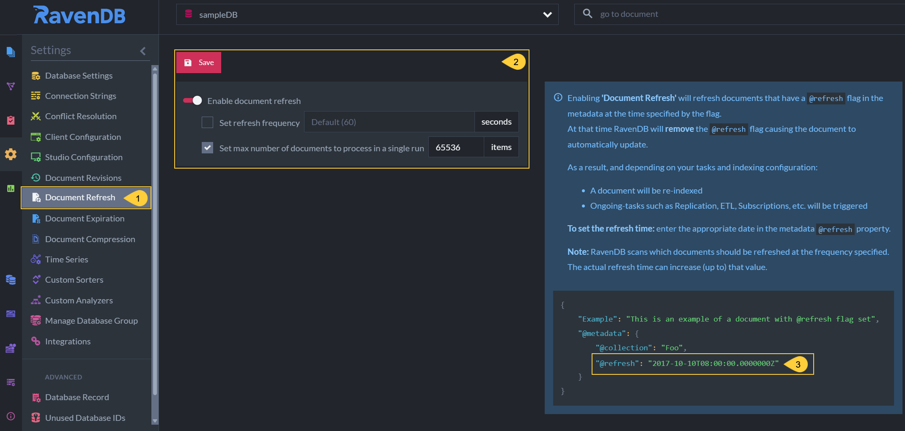

import Admonition from '@theme/Admonition';
import Tabs from '@theme/Tabs';
import TabItem from '@theme/TabItem';
import CodeBlock from '@theme/CodeBlock';
import LanguageSwitcher from "@site/src/components/LanguageSwitcher";
import LanguageContent from "@site/src/components/LanguageContent";

# Document Refresh
<Admonition type="note" title="">

* Use this view to configure the **Document Refresh** feature.  
* Documents can be scheduled for refresh by a `@refresh` property in their `@metadata`.  
* When the document refresh feature is enabled, it routinely checks for documents that 
  include the `@refresh` property and refreshes them on the scheduled time.  
  When a document is refreshed its [change vector](../../server/clustering/replication/change-vector.mdx) 
  is incremented, triggering its re-indexation and other features that react to document updates.  
* Documents are refreshed only once: after refreshing a document, the refresh feature removes 
  the `@refresh` property from its `@metadata`.  
* Learn more about this option [here](../../../server/extensions/refresh.mdx).  

</Admonition>
## Document Refresh View

1. **Document Refresh**  
   Click to configure document refresh.

2. **Document Refresh Configuration**  
    * **Enable Document Refresh**  
      Toggle this option to enable or disable the refresh feature for the selected database.  
    * **Set refresh frequency**  
      Set the frequency at which the server scans for documents scheduled for refresh.  
      Default value: _60 seconds_
    * **Set max number of documents to process in a single run**  
      Set the maximal number of documents the feature is allowed to refresh in one run.  
    * **Save**  
      Changes in the configuration will apply only after saving them.  

3. **Set the `@refresh` property**  
   * Add a `@refresh` property to the `@metadata` of each document that you want to schedule refresh for.  
   * Set the refresh time in UTC format, e.g. - `"@refresh": "2025-04-22T08:00:00.0000000Z"`  

