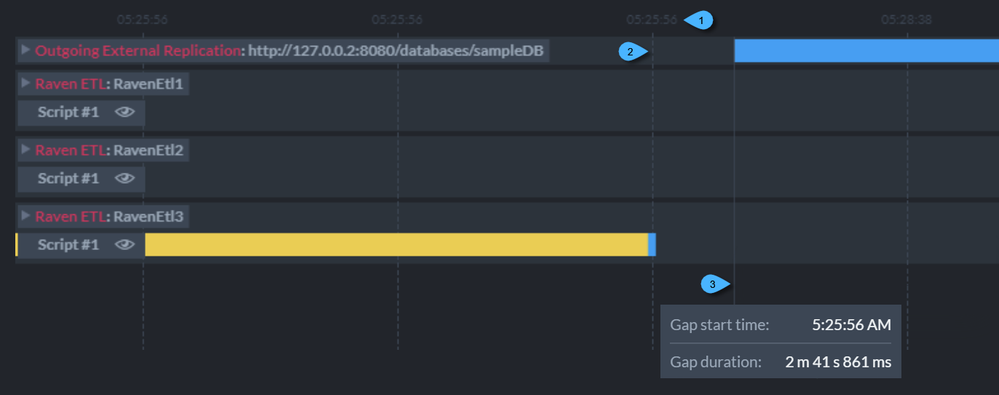

import Admonition from '@theme/Admonition';
import Tabs from '@theme/Tabs';
import TabItem from '@theme/TabItem';
import CodeBlock from '@theme/CodeBlock';
import LanguageSwitcher from "@site/src/components/LanguageSwitcher";
import LanguageContent from "@site/src/components/LanguageContent";

# Ongoing Tasks Stats: Overview
<Admonition type="note" title="Note">

* The **Ongoing Tasks Stats** view monitors the following ongoing tasks:  
   * External Replication  
   * RavenDB ETL  
   * SQL ETL  
   * OLAP ETL
   * Subscription  
* Tasks activities are graphically displayed for selected time frames.  

* In this page:  
   * [Ongoing Tasks Stats View](../../../../studio/database/stats/ongoing-tasks-stats/overview.mdx#ongoing-tasks-stats-view)  
   * [The Timeline Ruler](../../../../studio/database/stats/ongoing-tasks-stats/overview.mdx#the-timeline-ruler)  
   * [Task Rulers](../../../../studio/database/stats/ongoing-tasks-stats/overview.mdx#task-rulers)  
      * [Closed View](../../../../studio/database/stats/ongoing-tasks-stats/overview.mdx#task-ruler-closed-view)  
      * [Expanded View](../../../../studio/database/stats/ongoing-tasks-stats/overview.mdx#task-ruler-expanded-view)  
      * [Time Grid](../../../../studio/database/stats/ongoing-tasks-stats/overview.mdx#task-rulers-time-grid)  
      * [Active and Inactive Display](../../../../studio/database/stats/ongoing-tasks-stats/overview.mdx#active-and-inactive-display)  

</Admonition>
## Ongoing Tasks Stats View

1. **Ongoing Tasks Stats**  
   Click to open the Ongoing Tasks Stats View.  

2. **Database**  
   Select the database whose ongoing tasks you want to monitor.  
   Data for this database's ongoing tasks will be collected and presented in the graph.  

3. **Filter**  
   Filter the displayed tasks by the task's name (Subscription, RavenDB ETL, SQL ETL, OLAP ETL) 
   or by the target URL (External Replication).  

4. **Export**  
   The currently viewed graph data can be exported to a *.json file.  

5. **Import**  
   Import file to view a previously exported graph data.  
   No new data is collected & displayed when showing imported data.  

## Stats Graph

* The graph is added to the view once data is collected from at least one of the monitored tasks.  

## The Timeline Ruler

1. **Selected Time Frame**  
   Select any timeline segment to explore the displayed tasks' activities during this time frame.  
   Click & drag or resize this frame to select different time frames for which the data will be shown in the graph.  
2. **Timeline Ruler Line**  
   The timeline ruler `Line` depicts the activity for all tasks presented in the graph.  
3. **Timeline Grid**  
   A grid of timestamp-labled vertical time lines provides points of reference by which 
   time frames can be selected.  
4. **Clear Selection**  
   Click to clear the selected frame.  
5. **Clear Graph**  
   Click to clear all the collected data from the graph.  
   <Admonition type="info" title="Info">
   Recently collected statistics are kept by RavenDB in memory, allowing you to 
   refresh the stats view without losing its entire history.  
   Using the `Clear Graph` button will clear all historical data.  
   </Admonition>

* 6. **Monitoring (tail -f)**  
  When this option is checked, the selected time frame will be continuously reallocated at the end of the data stream.  

## Task Rulers

Each monitored task has its dedicated ruler that displays the task's activities 
during the time specified by the timeline ruler above.  

### Task Ruler Closed View

1. **Selected Time Frame**  
2. **Task Ruler: Closed View**  
     * Information summary is shown in a single bar.  
3. **Task Bar**  
     * Hover over the bar to popup task information.  
     * Click and drag the bar to slide the graph.  
     * Zoom in & out using the mouse wheel.  
     * Click the bar for an expanded view that details task events in multiple bars.  
### Task Ruler Expanded View

1. **Selected Time Frame**  
2. **Task Ruler: Expanded View**  
   Detailed information is shown in multiple bars.  
3. **Task Bars**  
    * Bars are split into frames that depict particular statistics related to the task.  
    * Hover over each bar frame to popup related information.  
      See the dedicated tasks stats articles for task-specific information.  
    * Click and drag to slide the graph.  
    * Zoom in & out using the mouse wheel.  
### Task Rulers Time Grid

A grid of vertical time lines allows you to easily relate task events to their time of occurence.  

<Admonition type="info" title="Info">
Note that the [stats graph](../../../../studio/database/stats/ongoing-tasks-stats/overview.mdx#stats-graph) 
displays **two different time grids**.  

* The [Timeline ruler time grid](../../../../studio/database/stats/ongoing-tasks-stats/overview.mdx#the-timeline-ruler) 
  shows time points across the entire timeline ruler line.  
* The Task rulers time grid, discussed here, shows points of time 
  **within the selected time frame**.  
</Admonition>

1. **Grid Line Timestamp**  
   Time-grid lines are labled with timestamps.  
2. **Grid Line**  
   Time grid lines are displayed as *vertical dotted lines*.  
3. **Gap Line**  
   Gap lines, displayed as *vertical continuous lines*, indicate the renewal 
   of task activity after a period in which all tasks were idle.  
    * Hover over the gap line to show a tooltip that details the idle period 
      start time and duration.  
### Active and Inactive Display

**Active** tasks (e.g. a subscription task that a client is currently connected to) 
and **Inactive** tasks are shown in different styles.  

* An active task:  
  
* An inactive task:  
  

