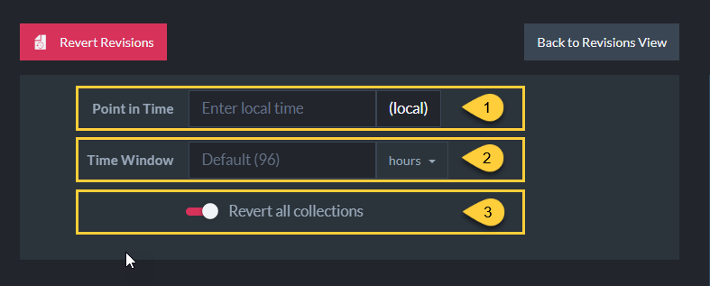

import Admonition from '@theme/Admonition';
import Tabs from '@theme/Tabs';
import TabItem from '@theme/TabItem';
import CodeBlock from '@theme/CodeBlock';
import LanguageSwitcher from "@site/src/components/LanguageSwitcher";
import LanguageContent from "@site/src/components/LanguageContent";

# Revert Revisions
<Admonition type="note" title="Note">

* Use Revert Revisions to __revert the database to its state at a specified point in time__.   

* Being able to restore the database to a previous state can simplify auditing,  
  enhance understanding of changes made over time,  
  and facilitate instant recovery without the need to search and retrieve a stored backup.

* You can select whether to revert specific collections or revert all collections.
 
* In this page:  
   * [The document revisions view](../../document-extensions/revisions/revert-revisions.mdx#the-document-revisions-view)
   * [Revert](../../document-extensions/revisions/revert-revisions.mdx#revert)
     * [Point in time](../../document-extensions/revisions/revert-revisions.mdx#point-in-time)
     * [Time Window](../../document-extensions/revisions/revert-revisions.mdx#time-window)
     * [Content reverted](../../document-extensions/revisions/revert-revisions.mdx#content-reverted)

</Admonition>
## The Document Revisions view

1. __Document Revisions view__  
   In the Studio, go to _Settings &gt; Document Revisions_. From this view you can:
   * [Set](../../studio/database/settings/document-revisions.mdx#revisions-configuration) revision configurations
   * [Enforce](../../studio/database/settings/document-revisions.mdx#enforce-configuration) revision configurations
   * [Revert](../../document-extensions/revisions/revert-revisions.mdx#revert) revisions

2. __Revision Configurations__  
   * The ability to revert documents to their past revisions depends on revisions being created.  
   * When no default configuration or collection-specific configurations are defined and enabled,  
     no revisions will be created for any document.  
   * Make sure that a configuration that suits your needs is defined.  

3. __Revert Revisions__  
   Click to revert revisions. See more [below](../../document-extensions/revisions/revert-revisions.mdx#revert).

## Revert

1. Enter the __Point in Time__ to which you would like to revert the documents. Learn more [below](../../document-extensions/revisions/revert-revisions.mdx#point-in-time).  

2. Enter the __Time Window__. Learn more [below](../../document-extensions/revisions/revert-revisions.mdx#time-window).  

3. Revert __All collections__ in the database, or toggle off to select __Specific collections__ to revert.

## Point in time

* Select or enter the point in time (LOCAL) to revert documents to.   
  The information text on the right will display the expected behavior in [UTC](https://en.wikipedia.org/wiki/Coordinated_Universal_Time).
* When the revert process is executed:

    <Admonition type="note" title="Note">
    
    Documents created __AFTER__ the specified Point in Time will be __moved to the Revision Bin__.
    
    </Admonition>  

    <Admonition type="note" title="Note">

    Documents created __BEFORE__ this time and that were modified after this time:
    
     * Any of these documents that own revisions will be __reverted__  
       to the revision created at the specified Point in Time or to the latest revision preceding this time.  
    
     * When [setting a limit](../../studio/database/settings/document-revisions.mdx#limit-revisions) on the number of revisions that are kept (by number or by age)  
       then only the most recent revisions are kept for the document.  
       If all of these revisions were created AFTER the Point in Time then the oldest revision will be  
       the one we revert to, even though that revision is newer than the specified time.  
       By doing so we make sure that all the documents that existed before the specified Point in Time  
       still exist after the revert process.

    </Admonition>

    <Admonition type="note" title="Note">

    Documents created __BEFORE__ this time that were Not modified after this Time are __not reverted__.

    </Admonition>

## Time window

* Revisions are ordered in the _revisions storage_ by their change-vector, and Not by creation time.

* When reverting the database (or selected collections) to some previous date,  
  RavenDB will iterate through the revisions, starting from the most recent revision,  
  and search for revisions that should be restored.  
  For each revision found - its matching document will be reverted to that revision.  

* To avoid conducting unnecessarily long searches or revert to revisions that are too old  
  RavenDB sets a limit to this search.  
  The search will stop once we hit a revision that was created prior to: `Point in Time - Time Window`

* The default Time Window value is 96 hours (4 days).

<Admonition type="note" title="Note">

__Example__:  

* __Point in Time__ to revert to: `15.2.2023 02:00`  
  Documents will be reverted to their latest revision that was created prior to this Point in Time.  

* __Time Window__: `4 days`  
  We will stop searching the revisions once we hit a revision with creation time prior to:  
  `11.2.2023 02:00`  

* __Sample revisions__:  
   * The list below contains revisions of all documents, it is not just revisions of a single document.
   * The revisions are Not ordered by creation time, the order is set by their change-vector.

| Revision | Creation time | |
| - | - | - |
| 1)  `Users/1` | 20.2.2023 01:00 | |
| 2)  `Users/5` | 19.2.2023 01:00 | |
| 3)  `Users/3` | 14.2.2023 01:00 | =&gt; Document Users/3 stays with this revision content |
| 4)  `Users/4` | 17.2.2023 01:00 | =&gt; Document Users/4 will be moved to Revisions Bin |
| 5)  `Users/1` | 18.2.2023 01:00 | |
| 6)  `Users/1` | 13.2.2023 01:00 | =&gt; Document Users/1 will be reverted to this revision |
| 7)  `Users/5` | 11.2.2023 01:00 | =&gt; Document Users/5 will be reverted to this revision +  STOP the search for more Users/5 revisions |
| 8) `Users/5` | 11.2.2023 03:00 | |
| 9) `Users/9` | 10.2.2023 01:00 | =&gt; Document Users/9 will Not be reverted to this revision +  STOP the search in this list |
| 10) `Users/6` | 11.2.2023 01:00 | |
| . . . | | |

* (line 1)  
  We iterate on the revisions starting from `Users/1` revision created on `20.2.2023 01:00`.  
  We search for a relevant revision for document `Users/1` by iterating on all `Users/1` revisions.   
  The revision that will be restored for `Users/1` is the one from `13.2.2023 01:00` (line 6)   
  since it is the latest one prior to `15.2.2023 02:00`.

* (line 2)  
  Next, we search for a relevant revision for document `Users/5` by iterating on all `Users/5` revisions,  
  and we reach line 7.  
  Here the search for `Users/5` revisions will STOP since this revision was created prior to `11.2.2023 02:00`.  
  We will revert the document to this revision since it is the latest one prior to `15.2.2023 02:00`.  
  The following revision for `Users/5` from `11.2.2023 03:00` (line 8) is Not restored.  

* (line 3)  
  Next, document `Users/3` is Not modified, since it wasn't modified after `15.2.2023 02:00`.

* (line 4)   
  Next, `Users/4` has NO revisions prior to `15.2.2023 02:00`,  
  which means it was created AFTER this Point in Time,  
  so this document is moved to the Revisions Bin.

* (line 9)   
  Next, we reach `Users/9` revision created on `10.2.2023 01:00`, which is PRIOR to `11.2.2023 02:00`.  
  The search on this list will now STOP.  
  No further revisions will be taken into account, not even `Users/6` revision created on `11.2.2023 01:00`.

</Admonition>

## Content reverted

<Admonition type="info" title="Info">

* When reverting a document to one of its revisions, RavenDB actually creates a new revision for the document.  
  The content of this new revision is a copy of the historical revision content, and it becomes the current version of the document.

* Database items other than documents, such as ongoing tasks, indexes, and compare-exchange,  
  are Not reverted by this process.

* Document extensions:  
  * __Time series__  
    Time series data is Not reverted. Learn more [here](../../document-extensions/revisions/revisions-and-other-features.mdx#reverted-data-1).  
  * __Attachments__   
    When a document is reverted to a revision that owns attachments,  
    the attachments are restored to their state when the revision was created.  
  * __Counters__  
    When a document is reverted to a revision that owns counters,  
    the counters are restored to functionality along with their values from that revision.

</Admonition>

