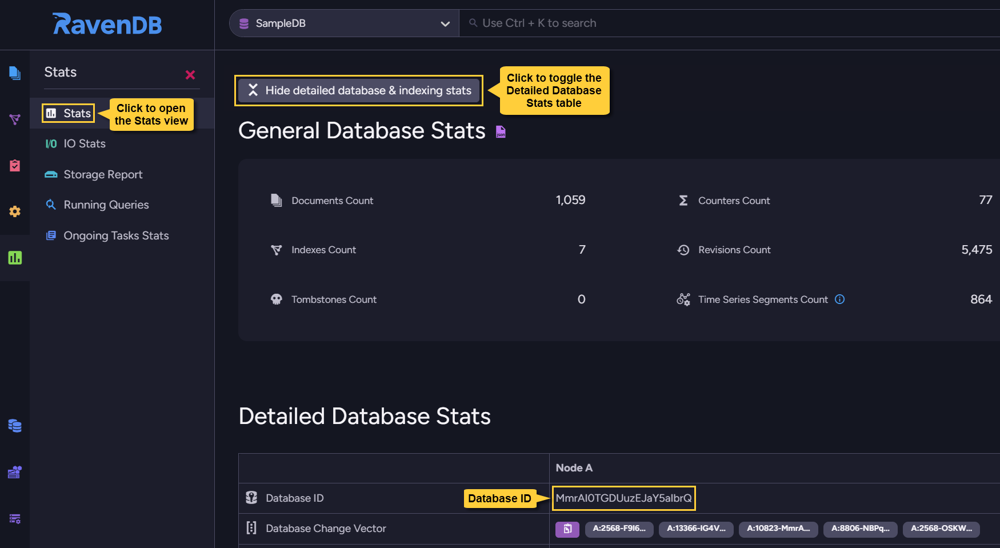

import Admonition from '@theme/Admonition';
import Tabs from '@theme/Tabs';
import TabItem from '@theme/TabItem';
import CodeBlock from '@theme/CodeBlock';
import LanguageSwitcher from "@site/src/components/LanguageSwitcher";
import LanguageContent from "@site/src/components/LanguageContent";

# Revisions Troubleshooting
<Admonition type="note" title="">

* In this page:  
  * [`ThrowRevisionKeyTooBig` exception](../../document-extensions/revisions/troubleshooting.mdx#throwrevisionkeytoobig-exception)  

</Admonition>
## `ThrowRevisionKeyTooBig` exception

RavenDB allows **document revisions** and their **tombstones** to have IDs of up to **1,536 bytes**.  
A `ThrowRevisionKeyTooBig` exception will be thrown when an attempt is made to store a revision or a revision tombstone 
whose ID length exceeds this limit.  

* **How does a revision ID become too long?**  
   * RavenDB servers base the IDs they give revisions (and their tombstones) 
     on the revisions' [change vectors](../../server/clustering/replication/change-vector.mdx).  
   * Change vectors, on their part, are not limited and may grow [beyond the 1,536 bytes limit](../../client-api/operations/maintenance/clean-change-vector.mdx).  
   * It may therefore happen that a server would try to give a revision an ID, find its 
     change vector longer than 1,536 bytes, and fail with a `ThrowRevisionKeyTooBig` exception.  
* **How are Change Vectors bloated?**  
   * A revision's change vector is comprised of the IDs of databases that have handled the revision 
     over time.  
   * In some cases, such as transferring a revision via [import](../../studio/database/tasks/import-data/import-from-ravendb.mdx) 
     or [external replication](../../server/ongoing-tasks/external-replication.mdx), the ID of the 
     revision's Source database is no longer needed but is still added to the revision's change 
     vector on the Destination database.  
   * Repeatedly transferring a revision this way may bloat its change vector beyond the 1,536 bytes 
     limit. When the destination database attempts to give such a revision an ID to store it by, 
     it will fail with a `ThrowRevisionKeyTooBig` exception.  
* **What to do?**  
   * Revision **IDs** can be shortened by minimizing revision **change vectors**.  
   * To shorten revision change vectors, register IDs of databases that are irrelevant to this 
     server via Studio's **Unused Database IDs** view, as shown below. IDs listed in this view 
     will be omitted from revision change vectors.  

        

        1. **Unused Database IDs**  
           Click to open the **Unused Database IDs** view.  
        2. **Save**  
           Click to save the current list of unused IDs.  
        3. **Used IDs**  
           IDs of databases that are currently used by this database.  
        4. **Enter database ID to add**  
           Use this bar to manually enter an unused ID.  
           Click the **Add ID** button to add the ID to the list.  
        5. **List of unused IDs.**  
           To remove an ID from the list, click the trash bin to its right.  
        6. **IDs that may be added to the list**  
           A. an ID that was already added to the list.  
           B. an ID that hasn't been added to the list yet. Click it to add the ID to the list.  

* **What to be aware of:**  
  When adding a database ID to the **Unused Database IDs** list via studio:  
   * **Do not** add IDs of databases that are currently in use.  
     The ID of a RavenDB database can be found in the Studio &gt; **Stats** view.  

         

   * If an external replication task is running:  
     **Do not** add the IDs of databases that are used by the destination database.  
     **Add** the unused IDs on the **destination** database first, to prevent conflicts.  

   * **Do not** use the IDs indicated by the database record `DatabaseTopologyIdBase64` and 
     `ClusterTransactionIdBase64` properties.  
     Find these IDs using the Studio &gt; Settings &gt; **Database Record** view.  

         
#### When is this check Enabled:

* **New databases only**  
  Checking revisions ID length is enabled only for **new databases**.  
   * A database is regarded as **new**, and its revisions ID length **will** be checked, if 
     its version is not defined in the database record or the version is `6.0.107` or newer.  
   * Revisions ID length will **not** be checked for databases older than `6.0.107`.  
* **Imported databases**  
  Importing a database is always regarded as the creation of a new database.  
  An exception **will** therefore be thrown if the ID of an imported revision 
  exceeds 1,536 bytes, regardless of the imported revision's database version.  
* **Restoring database from backup**  
   * Revisions ID length **will** be checked if the database version is not defined in its 
     restored database record or if the version is `6.0.107` or newer.  
   * Revision ID lengths will **not** be checked when restoring databases older than `6.0.107`.  
* **Restoring database from a snapshot**  
  Revisions ID length will not be checked while restoring a snapshot, since snapshots are 
  restored as an image. If revision IDs longer than 1,536 bytes exist in the restored database, 
  they are in it because the database is of an older version than `6.0.107` and doesn't perform 
  this check.  
* **Receiving a revision via replication**  
  The check is not performed when receiving a revision or a revision tombstone via replication.  

