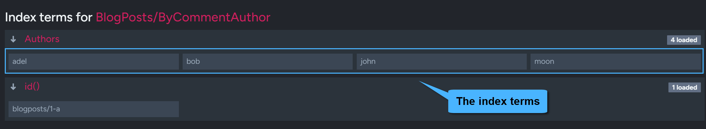

import Admonition from '@theme/Admonition';
import Tabs from '@theme/Tabs';
import TabItem from '@theme/TabItem';
import CodeBlock from '@theme/CodeBlock';
import LanguageSwitcher from "@site/src/components/LanguageSwitcher";
import LanguageContent from "@site/src/components/LanguageContent";

export const supportedLanguages = ["java", "csharp", "python", "php", "nodejs"];

# Indexing Hierarchical Data
<LanguageSwitcher supportedLanguages={supportedLanguages} />
<LanguageContent language="java">

One of the greatest advantages of a document database is that we have very few limits on how we structure our data.   
One very common scenario is the usage of hierarchical data structures.   
The most trivial of them is the comment thread:

<TabItem value="indexes_1" label="indexes_1">
<CodeBlock language="java">
{`public static class BlogPost \{
    private String author;
    private String title;
    private String text;
    private List<BlogPostComment> comments;

    public String getAuthor() \{
        return author;
    \}

    public void setAuthor(String author) \{
        this.author = author;
    \}

    public String getTitle() \{
        return title;
    \}

    public void setTitle(String title) \{
        this.title = title;
    \}

    public String getText() \{
        return text;
    \}

    public void setText(String text) \{
        this.text = text;
    \}

    public List<BlogPostComment> getComments() \{
        return comments;
    \}

    public void setComments(List<BlogPostComment> comments) \{
        this.comments = comments;
    \}
\}

public static class BlogPostComment \{
    private String author;
    private String text;
    private List<BlogPostComment> comments;

    public String getAuthor() \{
        return author;
    \}

    public void setAuthor(String author) \{
        this.author = author;
    \}

    public String getText() \{
        return text;
    \}

    public void setText(String text) \{
        this.text = text;
    \}

    public List<BlogPostComment> getComments() \{
        return comments;
    \}

    public void setComments(List<BlogPostComment> comments) \{
        this.comments = comments;
    \}
\}
`}
</CodeBlock>
</TabItem>

While it is very easy to work with such a structure in all respects, it does bring up an interesting question,
namely how can we search for all blog posts that were commented by specified author?

The answer to that is that RavenDB contains built-in support for indexing hierarchies,
and you can take advantage of the `Recurse` method to define an index using the following syntax:

<Tabs groupId='languageSyntax'>
<TabItem value="AbstractIndexCreationTask" label="AbstractIndexCreationTask">
<CodeBlock language="java">
{`public static class BlogPosts_ByCommentAuthor extends AbstractIndexCreationTask {
    public BlogPosts_ByCommentAuthor() {
        map = "docs.BlogPosts.Select(post => new { " +
            "    authors = this.Recurse(post, x => x.comments).Select(x0 => x0.author) " +
            "})";
    }
}
`}
</CodeBlock>
</TabItem>
<TabItem value="Operation" label="Operation">
<CodeBlock language="java">
{`IndexDefinition indexDefinition = new IndexDefinition();
indexDefinition.setName("BlogPosts/ByCommentAuthor");
indexDefinition.setMaps(Collections.singleton(
    "from post in docs.Posts" +
        "  from comment in Recurse(post, (Func<dynamic, dynamic>)(x => x.comments)) " +
        "  select new " +
        "  { " +
        "      author = comment.author " +
        "  }"
));
store.maintenance().send(new PutIndexesOperation(indexDefinition));
`}
</CodeBlock>
</TabItem>
<TabItem value="JavaScript" label="JavaScript">
<CodeBlock language="java">
{`public static class BlogPosts_ByCommentAuthor extends AbstractJavaScriptIndexCreationTask {
    public BlogPosts_ByCommentAuthor() {
        setMaps(Sets.newHashSet("map('BlogPosts', function(b){\\n" +
            "            var names = [];\\n" +
            "            b.comments.forEach(x => getNames(x, names));\\n" +
            "                return {\\n" +
            "                   authors : names\\n" +
            "                };" +
            "            })"));

        java.util.Map<String, String> additionalSources = new HashMap<>();
        additionalSources.put("The Script", "function getNames(x, names){\\n" +
            "        names.push(x.author);\\n" +
            "        x.comments.forEach(x => getNames(x, names));\\n" +
            "    }");

        setAdditionalSources(additionalSources);
    }
}
`}
</CodeBlock>
</TabItem>
</Tabs>

This will index all the comments in the thread, regardless of their location in the hierarchy.

<TabItem value="indexes_4" label="indexes_4">
<CodeBlock language="java">
{`List<BlogPost> results = session
    .query(BlogPost.class, BlogPosts_ByCommentAuthor.class)
    .whereEquals("authors", "Ayende Rahien")
    .toList();
`}
</CodeBlock>
</TabItem>

</LanguageContent>
<LanguageContent language="csharp">

<Admonition type="note" title="">

* Use the `Recurse` method to traverse the layers of a hierarchical document and index its fields.

* In this Page:  
   * [Hierarchical data](../indexes/indexing-hierarchical-data.mdx#hierarchical-data)  
   * [Index hierarchical data](../indexes/indexing-hierarchical-data.mdx#index-hierarchical-data)
   * [Query the index](../indexes/indexing-hierarchical-data.mdx#query-the-index)

</Admonition>
## Hierarchical data

One significant advantage of document databases is their tendency not to impose limits on data structuring.
**Hierarchical data structures** exemplify this quality well; for example, consider the commonly used comment thread, implemented using objects such as:

<TabItem value="classes_1" label="classes_1">
<CodeBlock language="csharp">
{`public class BlogPost
\{
    public string Author \{ get; set; \}
    public string Title \{ get; set; \}
    public string Text \{ get; set; \}

    // Blog post readers can leave comments
    public List<BlogPostComment> Comments \{ get; set; \}
\}

public class BlogPostComment
\{
    public string Author \{ get; set; \}
    public string Text \{ get; set; \}

    // Allow nested comments, enabling replies to existing comments
    public List<BlogPostComment> Comments \{ get; set; \}
\}
`}
</CodeBlock>
</TabItem>

Readers of a post created using the above `BlogPost` structure can add `BlogPostComment` entries to the post's _Comments_ field,
and readers of these comments can reply with comments of their own, creating a recursive hierarchical structure.

For example, the following document, `BlogPosts/1-A`, represents a blog post by John that contains multiple layers of comments from various authors.

`BlogPosts/1-A`:  

<TabItem value="json" label="json">
<CodeBlock language="json">
{`\{
    "Author": "John",
    "Title": "Post title..",
    "Text": "Post text..",
    "Comments": [
        \{
            "Author": "Moon",
            "Text": "Comment text..", 
            "Comments": [
                \{
                    "Author": "Bob",
                    "Text": "Comment text.."
                \},
                \{
                    "Author": "Adel",
                    "Text": "Comment text..", 
                    "Comments": \{
                        "Author": "Moon",
                        "Text": "Comment text.."
                    \}
                \}
            ]
        \}
    ],
    "@metadata": \{
        "@collection": "BlogPosts"
    \}
\}
`}
</CodeBlock>
</TabItem>

## Index hierarchical data

To index the elements of a hierarchical structure like the one above, use RavenDB's `Recurse` method.  

The sample index below shows how to use `Recurse` to traverse the comments in the post thread and index them by their authors.
We can then [query the index](../indexes/indexing-hierarchical-data.mdx#query-the-index) for all blog posts that contain comments by specific authors.

<Tabs groupId='languageSyntax'>
<TabItem value="Index" label="Index">
<CodeBlock language="csharp">
{`public class BlogPosts_ByCommentAuthor : 
    AbstractIndexCreationTask<BlogPost, BlogPosts_ByCommentAuthor.IndexEntry>
{
    public class IndexEntry
    {
        public IEnumerable<string> Authors { get; set; }
    }

    public BlogPosts_ByCommentAuthor()
    {
        Map = blogposts => 
            from blogpost in blogposts
            let authors = Recurse(blogpost, x => x.Comments)
            select new IndexEntry
            {
                Authors = authors.Select(x => x.Author)
            };
    }
}
`}
</CodeBlock>
</TabItem>
<TabItem value="JavaScript_index" label="JavaScript_index">
<CodeBlock language="csharp">
{`public class BlogPosts_ByCommentAuthor_JS : AbstractJavaScriptIndexCreationTask
{
    public class Result
    {
        public string[] Authors { get; set; }
    }

    public BlogPosts_ByCommentAuthor_JS()
    {
        Maps = new HashSet<string>
        {
            @"map('BlogPosts', function (blogpost) {

                  var authors =
                       recurse(blogpost.Comments, function(x) {
                           return x.Comments;
                       })
                      .filter(function(comment) { 
                           return comment.Author != null;
                       })
                      .map(function(comment) { 
                          return comment.Author;
                       });

                  return {
                     Authors: authors
                  };
            });"
        };
    }
}
`}
</CodeBlock>
</TabItem>
<TabItem value="Put_indexes_operation" label="Put_indexes_operation">
<CodeBlock language="csharp">
{`store.Maintenance.Send(new PutIndexesOperation(
    new IndexDefinition
    {
        Name = "BlogPosts/ByCommentAuthor",
        Maps =
        {
            @"from blogpost in docs.BlogPosts
              let authors = Recurse(blogpost, (Func<dynamic, dynamic>)(x => x.Comments))
              let authorNames = authors.Select(x => x.Author)
              select new
              {
                  Authors = authorNames
              }"
        }
    }));
`}
</CodeBlock>
</TabItem>
</Tabs>

## Query the index

The index can be queried for all blog posts that contain comments made by specific authors.

**Query the index using code**:  

<Tabs groupId='languageSyntax'>
<TabItem value="Query" label="Query">
<CodeBlock language="csharp">
{`List<BlogPost> results = session
    .Query<BlogPosts_ByCommentAuthor.IndexEntry, BlogPosts_ByCommentAuthor>()
     // Query for all blog posts that contain comments by 'Moon':
    .Where(x => x.Authors.Any(a => a == "Moon"))
    .OfType<BlogPost>()
    .ToList();
`}
</CodeBlock>
</TabItem>
<TabItem value="Query_async" label="Query_async">
<CodeBlock language="csharp">
{`List<BlogPost> results = await asyncSession
    .Query<BlogPosts_ByCommentAuthor.IndexEntry, BlogPosts_ByCommentAuthor>()
     // Query for all blog posts that contain comments by 'Moon':
    .Where(x => x.Authors.Any(a => a == "Moon"))
    .OfType<BlogPost>()
    .ToListAsync();
`}
</CodeBlock>
</TabItem>
<TabItem value="DocumentQuery" label="DocumentQuery">
<CodeBlock language="csharp">
{`List<BlogPost> results = session
    .Advanced
    .DocumentQuery<BlogPost, BlogPosts_ByCommentAuthor>()
     // Query for all blog posts that contain comments by 'Moon':
    .WhereEquals("Authors", "Moon")
    .ToList();
`}
</CodeBlock>
</TabItem>
<TabItem value="RQL" label="RQL">
<CodeBlock language="sql">
{`from index "BlogPosts/ByCommentAuthor"
where Authors == "Moon"
`}
</CodeBlock>
</TabItem>
</Tabs>

**Query the index using Studio**:

  * Query the index from the Studio's [List of Indexes](../studio/database/indexes/indexes-list-view.mdx#indexes-list-view) view:

      

  * View the query results in the [Query](../studio/database/queries/query-view.mdx) view:

      

  * View the list of terms indexed by the `Recurse` method:

      

      

</LanguageContent>
<LanguageContent language="python">

<Admonition type="note" title="">

* Use the `Recurse` method to traverse the layers of a hierarchical document and index its fields.

* In this Page:  
   * [Hierarchical data](../indexes/indexing-hierarchical-data.mdx#hierarchical-data)  
   * [Index hierarchical data](../indexes/indexing-hierarchical-data.mdx#index-hierarchical-data)  
   * [Query the index](../indexes/indexing-hierarchical-data.mdx#query-the-index)  

</Admonition>
## Hierarchical data

One significant advantage of document databases is their tendency not to impose limits on data structuring.
**Hierarchical data structures** exemplify this quality well; for example, consider the commonly used comment thread, implemented using objects such as:

<TabItem value="indexes_1" label="indexes_1">
<CodeBlock language="python">
{`class BlogPost:
    def __init__(self, author: str = None, title: str = None, text: str = None, comments: List[BlogPostComment] = None):
        self.author = author
        self.title = title
        self.text = text
        
        # Blog post readers can leave comments
        self.comments = comments

class BlogPostComment:
    def __init__(self, author: str = None, text: str = None, comments: List[BlogPostComment] = None):
        self.author = author
        self.text = text

        # Allow nested comments, enabling replies to existing comments
        self.comments = comments
`}
</CodeBlock>
</TabItem>

Readers of a post created using the above `BlogPost` structure can add `BlogPostComment` entries to the post's _comments_ field,
and readers of these comments can reply with comments of their own, creating a recursive hierarchical structure. 

For example, the following document, `BlogPosts/1-A`, represents a blog post by John that contains multiple layers of comments from various authors.  

`BlogPosts/1-A`:  

<TabItem value="json" label="json">
<CodeBlock language="json">
{`\{
    "Author": "John",
    "Title": "Post title..",
    "Text": "Post text..",
    "Comments": [
        \{
            "Author": "Moon",
            "Text": "Comment text..",
            "Comments": [
                \{
                    "Author": "Bob",
                    "Text": "Comment text.."
                \},
                \{
                    "Author": "Adel",
                    "Text": "Comment text..",
                    "Comments": \{
                        "Author": "Moon",
                        "Text": "Comment text.."
                    \}
                \}
            ]
        \}
    ],
    "@metadata": \{
        "@collection": "BlogPosts"
    \}
\}
`}
</CodeBlock>
</TabItem>

## Index hierarchical data

To index the elements of a hierarchical structure like the one above, use RavenDB's `Recurse` method.

The sample index below shows how to use `Recurse` to traverse the comments in the post thread and index them by their authors.
We can then [query the index](../indexes/indexing-hierarchical-data.mdx#query-the-index) for all blog posts that contain comments by specific authors.

<Tabs groupId='languageSyntax'>
<TabItem value="AbstractIndexCreationTask" label="AbstractIndexCreationTask">
<CodeBlock language="python">
{`class BlogPosts_ByCommentAuthor(AbstractIndexCreationTask):
    class Result:
        def __init__(self, authors: List[str] = None):
            self.authors = authors

    def __init__(self):
        super().__init__()
        self.map = "from blogpost in docs.Blogposts let authors = Recurse(blogpost, x => x.comments) select new { authors = authors.Select(x => x.author) }"
`}
</CodeBlock>
</TabItem>
<TabItem value="Operation" label="Operation">
<CodeBlock language="python">
{`store.maintenance.send(
    PutIndexesOperation(
        IndexDefinition(
            name="BlogPosts/ByCommentAuthor",
            maps={
                """from blogpost in docs.BlogPosts
 in Recurse(blogpost, (Func<dynamic, dynamic>)(x => x.comments))
select new
{
 comment.author
}"""
            },
        )
    )
)
`}
</CodeBlock>
</TabItem>
</Tabs>

## Query the index

The index can be queried for all blog posts that contain comments made by specific authors.

**Query the index using code**:  

<Tabs groupId='languageSyntax'>
<TabItem value="Query" label="Query">
<CodeBlock language="python">
{`results = list(
    session.query_index_type(BlogPosts_ByCommentAuthor, BlogPosts_ByCommentAuthor.Result).where_equals(
        "authors", "Moon"
    )
)
`}
</CodeBlock>
</TabItem>
<TabItem value="RQL" label="RQL">
<CodeBlock language="sql">
{`from index "BlogPosts/ByCommentAuthor"
where Authors == "Moon"
`}
</CodeBlock>
</TabItem>
</Tabs>

**Query the index using Studio**:

  * Query the index from Studio's [List of Indexes](../studio/database/indexes/indexes-list-view.mdx#indexes-list-view) view:  
     
      

  * View the query results in the [Query](../studio/database/queries/query-view.mdx) view:  
    
      
    
  * View the list of terms indexed by the `Recurse` method:

      

      

</LanguageContent>
<LanguageContent language="php">

<Admonition type="note" title="">

* Use the `Recurse` method to traverse the layers of a hierarchical document and index its fields.

* In this Page:  
   * [Hierarchical data](../indexes/indexing-hierarchical-data.mdx#hierarchical-data)  
   * [Index hierarchical data](../indexes/indexing-hierarchical-data.mdx#index-hierarchical-data)  
   * [Query the index](../indexes/indexing-hierarchical-data.mdx#query-the-index)  

</Admonition>
## Hierarchical data

One significant advantage of document databases is their tendency not to impose limits on data structuring.
**Hierarchical data structures** exemplify this quality well; for example, consider the commonly used comment thread, implemented using objects such as:

<TabItem value="indexes_1" label="indexes_1">
<CodeBlock language="php">
{`class BlogPost
\{
    private ?string $author = null;
    private ?string $title = null;
    private ?string $text = null;

    // Blog post readers can leave comments
    public ?BlogPostCommentList $comments = null;

    public function getAuthor(): ?string
    \{
        return $this->author;
    \}

    public function setAuthor(?string $author): void
    \{
        $this->author = $author;
    \}

    public function getTitle(): ?string
    \{
        return $this->title;
    \}

    public function setTitle(?string $title): void
    \{
        $this->title = $title;
    \}

    public function getText(): ?string
    \{
        return $this->text;
    \}

    public function setText(?string $text): void
    \{
        $this->text = $text;
    \}

    public function getComments(): ?BlogPostCommentList
    \{
        return $this->comments;
    \}

    public function setComments(?BlogPostCommentList $comments): void
    \{
        $this->comments = $comments;
    \}
\}

class BlogPostComment
\{
    private ?string $author = null;
    private ?string $text = null;

    // Comments can be left recursively
    private ?BlogPostCommentList $comments = null;

    public function getAuthor(): ?string
    \{
        return $this->author;
    \}

    public function setAuthor(?string $author): void
    \{
        $this->author = $author;
    \}

    public function getText(): ?string
    \{
        return $this->text;
    \}

    public function setText(?string $text): void
    \{
        $this->text = $text;
    \}

    public function getComments(): ?BlogPostCommentList
    \{
        return $this->comments;
    \}

    public function setComments(?BlogPostCommentList $comments): void
    \{
        $this->comments = $comments;
    \}
\}

class BlogPostCommentList extends TypedList
\{
    public function __construct()
    \{
        parent::__construct(BlogPost::class);
    \}
\}
`}
</CodeBlock>
</TabItem>

Readers of a post created using the above `BlogPost` structure can add `BlogPostComment` entries to the post's _comments_ field,
and readers of these comments can reply with comments of their own, creating a recursive hierarchical structure. 

For example, the following document, `BlogPosts/1-A`, represents a blog post by John that contains multiple layers of comments from various authors.  

`BlogPosts/1-A`:  

<TabItem value="json" label="json">
<CodeBlock language="json">
{`\{
    "Author": "John",
    "Title": "Post title..",
    "Text": "Post text..",
    "Comments": [
        \{
            "Author": "Moon",
            "Text": "Comment text..",
            "Comments": [
                \{
                    "Author": "Bob",
                    "Text": "Comment text.."
                \},
                \{
                    "Author": "Adel",
                    "Text": "Comment text..",
                    "Comments": \{
                        "Author": "Moon",
                        "Text": "Comment text.."
                    \}
                \}
            ]
        \}
    ],
    "@metadata": \{
        "@collection": "BlogPosts"
    \}
\}
`}
</CodeBlock>
</TabItem>

## Index hierarchical data

To index the elements of a hierarchical structure like the one above, use RavenDB's `Recurse` method.

The sample index below shows how to use `Recurse` to traverse the comments in the post thread and index them by their authors.
We can then [query the index](../indexes/indexing-hierarchical-data.mdx#query-the-index) for all blog posts that contain comments by specific authors.

<Tabs groupId='languageSyntax'>
<TabItem value="AbstractIndexCreationTask" label="AbstractIndexCreationTask">
<CodeBlock language="php">
{`class BlogPosts_ByCommentAuthor_Result
{
    private ?StringArray $authors = null;

    public function getAuthors(): ?StringArray
    {
        return $this->authors;
    }

    public function setAuthors(?StringArray $authors): void
    {
        $this->authors = $authors;
    }
}

class BlogPosts_ByCommentAuthor extends AbstractIndexCreationTask
{
    public function __construct()
    {
        parent::__construct();

        $this->map = "from blogpost in docs.Blogposts let authors = Recurse(blogpost, x => x.comments) select new { authors = authors.Select(x => x.author) }";
    }
}
`}
</CodeBlock>
</TabItem>
<TabItem value="Operation" label="Operation">
<CodeBlock language="php">
{`$indexDefinition = new IndexDefinition();
$indexDefinition->setName("BlogPosts/ByCommentAuthor");
$indexDefinition->setMaps([
    "from blogpost in docs.BlogPosts
    from comment in Recurse(blogpost, (Func<dynamic, dynamic>)(x => x.Comments))
    select new
    {
        Author = comment.Author
    }"
]);

$store->maintenance()->send(new PutIndexesOperation($indexDefinition));
`}
</CodeBlock>
</TabItem>
</Tabs>

## Query the index

The index can be queried for all blog posts that contain comments made by specific authors.

**Query the index using code**:  

<Tabs groupId='languageSyntax'>
<TabItem value="Query" label="Query">
<CodeBlock language="php">
{`/** @var array<BlogPost> $results */
$results = $session
    ->query(BlogPosts_ByCommentAuthor_Result::class, BlogPosts_ByCommentAuthor::class)
    ->whereEquals("authors", "john")
    ->ofType(BlogPost::class)
    ->toList();
`}
</CodeBlock>
</TabItem>
<TabItem value="documentQuery" label="documentQuery">
<CodeBlock language="php">
{`/** @var array<BlogPost> $results */
$results = $session
        ->advanced()
        ->documentQuery(BlogPost::class, BlogPosts_ByCommentAuthor::class)
        ->whereEquals("authors", "John")
        ->toList();
`}
</CodeBlock>
</TabItem>
<TabItem value="RQL" label="RQL">
<CodeBlock language="sql">
{`from index "BlogPosts/ByCommentAuthor"
where Authors == "Moon"
`}
</CodeBlock>
</TabItem>
</Tabs>

**Query the index using Studio**:

  * Query the index from Studio's [List of Indexes](../studio/database/indexes/indexes-list-view.mdx#indexes-list-view) view:  
     
      

  * View the query results in the [Query](../studio/database/queries/query-view.mdx) view:  
    
      
    
  * View the list of terms indexed by the `Recurse` method:

      

      

</LanguageContent>
<LanguageContent language="nodejs">

<Admonition type="note" title="">

* Use the `Recurse` method to traverse the layers of a hierarchical document and index its fields.

* In this Page:
    * [Hierarchical data](../indexes/indexing-hierarchical-data.mdx#hierarchical-data)
    * [Index hierarchical data](../indexes/indexing-hierarchical-data.mdx#index-hierarchical-data)
    * [Query the index](../indexes/indexing-hierarchical-data.mdx#query-the-index)

</Admonition>
## Hierarchical data

One significant advantage of document databases is their tendency not to impose limits on data structuring.
**Hierarchical data structures** exemplify this quality well; for example, consider the commonly used comment thread, implemented using objects such as:

<TabItem value="class_1" label="class_1">
<CodeBlock language="js">
{`class BlogPost \{
    constructor(title, author, text, comments) \{
        this.title = title;
        this.author = author;
        this.text = text;

        // Blog post readers can leave comments
        this.comments = comments;
    \}
\}

class BlogPostComment \{
    constructor(author, text, comments) \{
        this.author = author;
        this.text = text;

        // Allow nested comments, enabling replies to existing comments
        this.comments = comments;
    \}
\}
`}
</CodeBlock>
</TabItem>

Readers of a post created using the above `BlogPost` structure can add `BlogPostComment` entries to the post's _comments_ field,
and readers of these comments can reply with comments of their own, creating a recursive hierarchical structure.

For example, the following document, `BlogPosts/1-A`, represents a blog post by John that contains multiple layers of comments from various authors.

`BlogPosts/1-A`:

<TabItem value="json" label="json">
<CodeBlock language="json">
{`\{
    "author": "John",
    "title": "Post title..",
    "text": "Post text..",
    "comments": [
        \{
            "author": "Moon",
            "text": "Comment text..",
            "comments": [
                \{
                    "author": "Bob",
                    "text": "Comment text.."
                \},
                \{
                    "author": "Adel",
                    "text": "Comment text..",
                    "comments": \{
                        "author": "Moon",
                        "text": "Comment text.."
                    \}
                \}
            ]
        \}
    ],
    "@metadata": \{
    "@collection": "BlogPosts"
    \}
\}
`}
</CodeBlock>
</TabItem>

## Index hierarchical data

To index the elements of a hierarchical structure like the one above, use RavenDB's `Recurse` method.

The sample index below shows how to use `Recurse` to traverse the comments in the post thread and index them by their authors.
We can then [query the index](../indexes/indexing-hierarchical-data.mdx#query-the-index) for all blog posts that contain comments by specific authors.

<Tabs groupId='languageSyntax'>
<TabItem value="Index" label="Index">
<CodeBlock language="js">
{`class BlogPosts_ByCommentAuthor extends AbstractCsharpIndexCreationTask {
    constructor() {
        super();

        this.map = \`
            docs.BlogPosts.Select(post => new { 
                authors = this.Recurse(post, x => x.comments).Select(x0 => x0.author)
            })\`;
    }
}
`}
</CodeBlock>
</TabItem>
<TabItem value="Put_indexes_operation" label="Put_indexes_operation">
<CodeBlock language="js">
{`const indexDefinition = new IndexDefinition();

indexDefinition.name = "BlogPosts/ByCommentAuthor";
indexDefinition.maps = new Set([
    \`from blogpost in docs.BlogPosts
     let authors = Recurse(blogpost, (Func<dynamic, dynamic>)(x => x.comments))
     let authorNames = authors.Select(x => x.author)
     select new
     {
         Authors = authorNames
     }\`
]);

await store.maintenance.send(new PutIndexesOperation(indexDefinition));
`}
</CodeBlock>
</TabItem>
</Tabs>

## Query the index

The index can be queried for all blog posts that contain comments made by specific authors.

**Query the index using code**:  

<Tabs groupId='languageSyntax'>
<TabItem value="Query" label="Query">
<CodeBlock language="js">
{`const results = await session
    .query({ indexName: "BlogPosts/ByCommentAuthor" })
     // Query for all blog posts that contain comments by 'Moon':
    .whereEquals("authors", "Moon")
    .all();
`}
</CodeBlock>
</TabItem>
<TabItem value="RQL" label="RQL">
<CodeBlock language="sql">
{`from index "BlogPosts/ByCommentAuthor"
where authors == "Moon"
`}
</CodeBlock>
</TabItem>
</Tabs>

**Query the index using Studio**:  

  * Query the index from the Studio's [List of Indexes](../studio/database/indexes/indexes-list-view.mdx#indexes-list-view) view:

      

  * View the query results in the [Query](../studio/database/queries/query-view.mdx) view:

      

  * View the list of terms indexed by the `Recurse` method:

      

      

</LanguageContent>

<!---
### Indexes
- [Indexing Basics](../indexes/indexing-basics)
- [Indexing Related Documents](../indexes/indexing-related-documents)
- [Indexing Spatial Data](../indexes/indexing-spatial-data)
- [Indexing Polymorphic Data](../indexes/indexing-polymorphic-data)

### Querying
- [Basics](../indexes/querying/query-index)
- [Query Overview](../client-api/session/querying/how-to-query)

-->