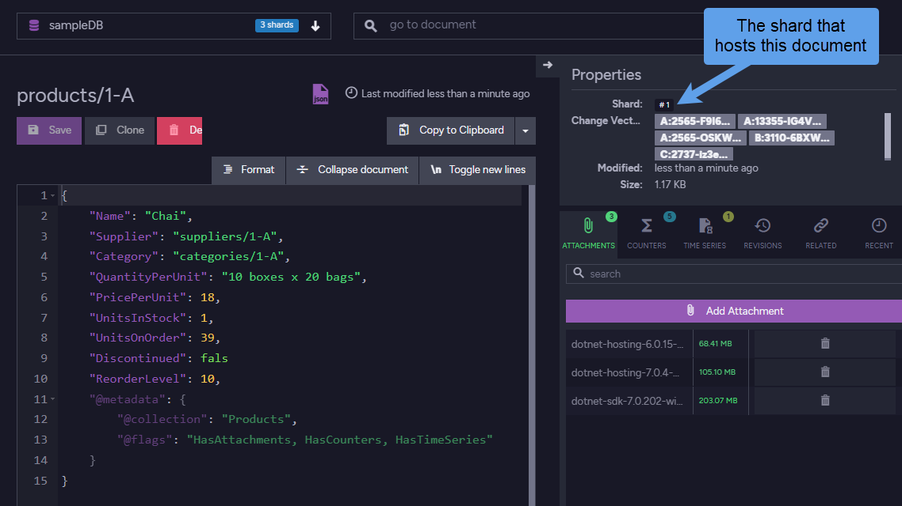

import Admonition from '@theme/Admonition';
import Tabs from '@theme/Tabs';
import TabItem from '@theme/TabItem';
import CodeBlock from '@theme/CodeBlock';
import LanguageSwitcher from "@site/src/components/LanguageSwitcher";
import LanguageContent from "@site/src/components/LanguageContent";

# Sharding: Overview
<Admonition type="note" title="Note">

* **Sharding**, supported by RavenDB from version 6.0 and on, 
  is the distribution of a database's content between autonomous 
  **Shards**.  

* In most cases, sharding is implemented to allow efficient usage 
  and management of exceptionally large databases (i.e. a 10-terabyte DB).  

* Sharding is managed by the RavenDB server, no special adaptation 
  is required from clients when accessing a sharding-capable server 
  or a sharded database.  
    * The client API is **unchanged** under a sharded database.  
      Clients of RavenDB versions older than 6.0 (that provided 
      no sharding support) can seamlessly connect a sharded database,
      without making any adaptations or even knowing that the 
      database they connect is sharded.  
    * Particular modifications in RavenDB features under a sharded 
      database are documented in detail in feature-specific articles.  

* Each [Shard](../sharding/overview.mdx#shards) hosts and manages 
  a **unique subset** of the database content.  
  Documents are sorted between shards by their **document ID**.  

* Each RavenDB shard is hosted by at least one cluster node.  
  Shards can be replicated over multiple nodes to increase data 
  accessibility.  

* In this page:  
  * [Sharding](../sharding/overview.mdx#sharding)  
     * [Licensing](../sharding/overview.mdx#licensing)
     * [Client-Server Communication](../sharding/overview.mdx#client-server-communication)  
     * [When Should Sharding Be Used?](../sharding/overview.mdx#when-should-sharding-be-used)  
  * [Shards](../sharding/overview.mdx#shards)  
     * [Shard Replication](../sharding/overview.mdx#shard-replication)  
  * [Buckets](../sharding/overview.mdx#buckets)  
     * [Buckets Allocation](../sharding/overview.mdx#buckets-allocation)  
     * [Buckets Population](../sharding/overview.mdx#buckets-population)  
     * [Document Extensions Storage](../sharding/overview.mdx#document-extensions-storage)  
     * [Anchoring Documents to a Bucket](../sharding/overview.mdx#anchoring-documents-to-a-bucket)  
  * [Resharding](../sharding/overview.mdx#resharding)  
  * [Paging](../sharding/overview.mdx#paging)  
  * [Using Local IP Addresses](../sharding/overview.mdx#using-local-ip-addresses)  
  * [Creating a Sharded Database](../sharding/overview.mdx#creating-a-sharded-database)  

</Admonition>
## Sharding

As a database grows [very large](https://en.wikipedia.org/wiki/Very_large_database), 
storing and managing it may become too demanding for any single node.  
System performance may suffer as resources like RAM, CPU, and storage are 
exhausted, routine chores like indexing and backup become massive tasks, 
responsiveness to client requests and queries slows down, and the system's 
throughput spreads thin serving an ever-growing number of clients.  

As the volume of stored data grows, the database can be scaled out by 
splitting it into [shards](../sharding/overview.mdx#shards), allowing it to be 
handled by multiple nodes and presenting practically no limit to its growth.  
The size of the overall database, comprised of all shards, can reach in 
this fashion dozens of terabytes and more while keeping the resources 
of each shard in check and maintaining its high performance and throughput.  
### Licensing

<Admonition type="info" title="Info">
Sharding is **Fully Available** on an **Enterprise** license.  
</Admonition>

* On a **Developer** license, the replication factor is restricted to 1.  
* On **Community** and **Professional** licenses, all shards need to be on the same node.  

Learn more about licensing [here](../start/licensing/licensing-overview.mdx).  
### Client-Server Communication

As a client connects a sharded database, it is appointed a RavenDB server 
that functions as an **orchestrator** and mediates all the communication 
between the client and the database shards.  
The client remains unaware of this process and uses the same API used by 
non-sharded databases to load documents, query, and so on.  
The additional communication between the client and the orchestrator and 
between the orchestrator and the shards does, however, present an overhead 
over the usage of a non-sharded database.  
### When Should Sharding Be Used?

While sharding solves many issues related to the storage and management 
of high-volume databases, the overhead it presents outweighs its benefits 
when the database size still poses no problem. We can postpone the transit 
to a sharded database when, for example, the database size is 100 GB, the 
server is well equipped and would comfortably handle a much larger volume, 
and no dramatic increase is expected in the number of potential users 
any time soon.  

<Admonition type="note" title="Note">
We recommend that you plan ahead for a transition to a sharded database when 
your database size is in the vicinity of 250 GB, so the transition is already well 
established when it reaches 500 GB.  
</Admonition>

<Admonition type="note" title="Note">
RavenDB 6.0 and above can **migrate** its database to a sharded database 
via [external replication](../server/ongoing-tasks/external-replication.mdx) 
or [export & import](../studio/database/tasks/export-database.mdx) operations.  

You cannot, however, upgrade a non-sharded database into a sharded one.  
To upgrade RavenDB to 6.0 and migrate the database data you will need 
to upgrade the server, create a new, sharded database, and replicate or 
export the data into it.  
</Admonition>

## Shards

While each cluster node of a non-sharded database handles a full replica 
of the entire database, each **shard** is assigned a **subset** of the 
entire database content.  
<Admonition type="note" title="Note">
Take, for example, a 3-shards database, in which shard **1** is populated with 
documents `Users/1`..`Users/2000`, shard **2** with documents `Users/2001`..`Users/4000`, 
and shard **3** with documents `Users/4001`..`Users/6000`.  
A client that connects this database to retrieve `Users/3000` and `Users/5000` 
would be served by an automatically-appointed [orchestrator node](../sharding/overview.mdx#client-server-communication) 
that would seamlessly retrieve `Users/3000` from shard **2** and `Users/5000` from 
shard **3** and hand them to the client.  
</Admonition>

As much as clients are concerned a sharded database is still a single entity: 
the clients are not required to detect whether the database is sharded or not, 
and clients of RavenDB versions prior to 6.0, which had no sharding support, 
can access a sharded database unaltered.  

Shard-specific operations are, however, available: a client can, for example, 
track the shard that a document is stored at and query this shard, and Studio 
can be used to relocate ([reshard](../sharding/resharding.mdx)) documents from one 
shard to another.  

### Shard Replication 

Similarly to non-sharded databases, shards can be **replicated** by cluster nodes 
to ensure the continuous availability of all shards in case of a node failure, 
provide multiple access points, and load-balance the traffic between shard replicas.  

The number of nodes a shard is replicated to is determined by 
the **Shard Replication Factor**.  

* In the image above, a 3-shards database is hosted by a 5-nodes cluster (where 
  two of the nodes, **D** and **E**, are unused by this database).  
  The Shard Replication Factor is set to 2, maintaining two replicas of each shard.  

## Buckets

Documents are stored in a sharded database within virtual containers named **Buckets**.  
The number of documents and the amount of data stored in each bucket may vary.  
### Buckets Allocation

The number of buckets allocated for the whole database is fixed, always remaining 
**1,048,576** (1024 times 1024).  
Each shard is assigned a range of buckets from this overall portion, in which 
documents can be stored.  

### Buckets Population

Buckets are populated with documents automatically by the cluster.  
A hash algorithm is executed over each document ID. The resulting 
hash code, a number between 0 and 1,048,576, is the number of the 
bucket in which the document is stored.  

As buckets are spread among different shards, the bucket number 
allocated for a document also determines which shard the document 
will reside on.  
### Document Extensions Storage

Document extensions (i.e. Attachments, Time series, Counters, and 
Revisions) are stored in the same bucket as the document they belong to.  
To make this happen, the bucket number (hash code) they are given 
is calculated by the ID of the document that owns them.  
### Anchoring Documents to a Bucket

You can make documents share a bucket (and therefore a shard) by 
adding their ID a suffix by which RavenDB will calculate their bucket number.  
Learn [here](../sharding/administration/anchoring-documents.mdx) why and how to do this.  

## Resharding

[Resharding](../sharding/resharding.mdx) is the relocation of data placed 
on one shard, on another shard, to maintain a balanced database in which 
all shards handle about the same volume of data.  

The resharding process moves all the data related to a certain 
bucket, including documents, document extensions, tombstones, etc., 
to a different shard, and then associates the bucket with the new shard.  
<Admonition type="note" title="Note">
  E.g.,

  1. Bucket `100,000` was initially associated with shard **1**.  
     Therefore, all data added to this bucket has been stored in shard **1**.  
  2. Resharding bucket `100,000` to shard **2** will:  
      * Move all the data that belongs to this bucket to shard **2**.  
      * Associate bucket `100,000` with shard **2**.  
        From now on, any data added to this bucket will be stored in shard **2**.  
</Admonition>

## Paging

From a user's perspective [paging](../indexes/querying/paging.mdx) 
is conducted similarly in sharded and non-sharded databases, using 
the same API.  
Paging is more costly in a sharded database, however, since the 
orchestrator must load data **from each shard** and sort the retrieved 
results before handing the selected page to the user.  
Read more about this subject [here](../sharding/querying.mdx#paging).  

## Using Local IP Addresses

The local IP address of a cluster node can be exposed, so other cluster 
nodes would prioritize it when they access the node. Using a node's local 
IP address rather than a public one for inter cluster communications can 
speed up the service and offer substantial savings over time.  

Using this method can be particularly helpful in a sharded cluster, since 
each client request is handled by an orchestrator, that may communicate the 
request and its results with all other shards.  

Use [this configuration option](../server/configuration/core-configuration.mdx#serverurlcluster) 
to expose a node's local IP address to other nodes.  

## Creating a Sharded Database

* A sharded database can be created via [Studio](../sharding/administration/studio-admin.mdx#creating-a-sharded-database) 
  or the [API](../sharding/administration/api-admin.mdx).  

* A RavenDB cluster can run sharded and non-sharded databases in parallel.  

* When a database is created, The user can choose whether it would be sharded 
  or not. The ability to make this choice is provided by RavenDB (6.0 and on) 
  by default, no further steps are required to enable the feature.  

