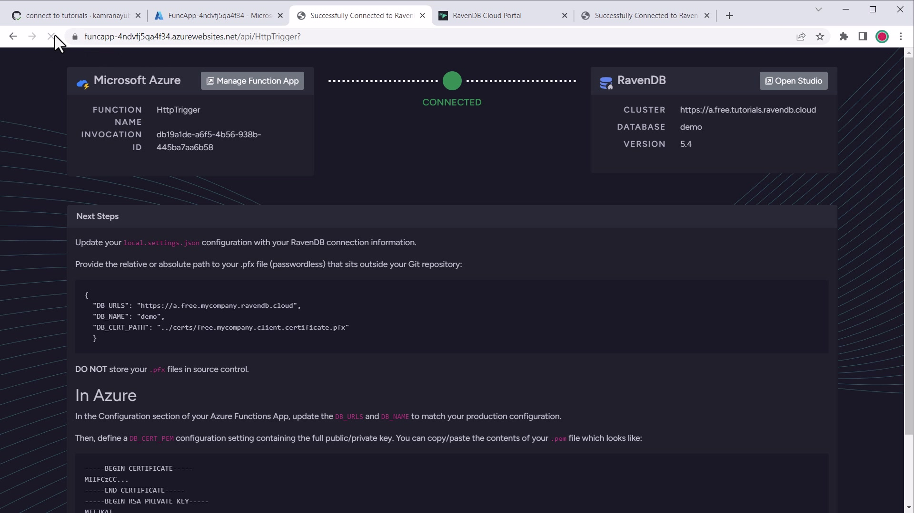

import Admonition from '@theme/Admonition';
import Tabs from '@theme/Tabs';
import TabItem from '@theme/TabItem';
import CodeBlock from '@theme/CodeBlock';
import LanguageSwitcher from "@site/src/components/LanguageSwitcher";
import LanguageContent from "@site/src/components/LanguageContent";

export const supportedLanguages = ["csharp", "nodejs"];

# Guides: Azure Functions (.NET C#)
<LanguageSwitcher supportedLanguages={supportedLanguages} />
<LanguageContent language="csharp">

<Admonition type="note" title="">

* Microsoft **Azure Functions** are a serverless platform that supports multiple 
  languages and frameworks that let you deploy workloads that scale without managing 
  any infrastructure.  
  Learn more about operating Microsoft Azure Functions [here][az-funcs].

* In this guide, you will learn how to deploy a C# Azure Function using the 
  [RavenDB Azure Functions C# template][template] that is connected to your 
  RavenDB database.  
  <Admonition type="info" title="">
  This guide assumes you are familiar with .NET development techniques and the 
  basics of Azure Function apps.
  </Admonition>

* Watch our tutorial video [below](../../../start/guides/azure-functions/overview.mdx#tutorial-video) 
  or [on YouTube](https://www.youtube.com/watch?v=1vnpfsD3bSE&).  

* In this page: 
    * [Before We Get Started](../../../start/guides/azure-functions/overview.mdx#before-we-get-started)  
    * [Create a Local Azure Function App](../../../start/guides/azure-functions/overview.mdx#create-a-local-azure-function-app)  
    * [Configuring Local Connection to RavenDB](../../../start/guides/azure-functions/overview.mdx#configuring-local-connection-to-ravendb)  
    * [Creating Function App Resources in Azure](../../../start/guides/azure-functions/overview.mdx#creating-function-app-resources-in-azure)  
    * [Deploying to Azure](../../../start/guides/azure-functions/overview.mdx#deploying-to-azure)  
    * [Verify the Connection Works](../../../start/guides/azure-functions/overview.mdx#verify-the-connection-works)  
    * [Using RavenDB in the Azure Functions App](../../../start/guides/azure-functions/overview.mdx#using-ravendb-in-the-azure-functions-app)  
    * [Tutorial Video](../../../start/guides/azure-functions/overview.mdx#tutorial-video)  

</Admonition>

## Before We Get Started

You will need the following before continuing:  

- A [RavenDB Cloud][cloud-signup] account or self-hosted client certificate  
- [Azure Function Core Tools][az-core-tools] 4.x+  
- [Git](https://git-scm.org)  
- [.NET 6.x][download-dotnet]  

If you are new to Azure Function local development, see the [Getting started guide][az-funcs] 
for how to get up and running with your toolchain of choice.  

## Create a Local Azure Function App

The [RavenDB Azure Function template][template] is a template repository on GitHub which means 
you can either create a new repository derived from the template or clone and push it to a new repository.  

This will set up a local Azure Function app that we will deploy to your Azure account at the end of the guide.  

### Creating a New Repository from the Template

Depending on your environment, there are several ways to clone the template and initialize a new Git repository.  
The template repository lists each clone method you can copy & paste directly.  

**Using `npx` and the [degit][tool-degit] tool if you have Node.js installed:**  

<TabItem value="bash" label="bash">
<CodeBlock language="bash">
{`npx degit ravendb/templates/azure-functions/csharp-http my-project
cd my-project
git init
`}
</CodeBlock>
</TabItem>

**Using Bash or PowerShell:**

<TabItem value="bash" label="bash">
<CodeBlock language="bash">
{`git clone https://github.com/ravendb/templates my-project
cd my-project
git filter-branch --subdirectory-filter azure-functions/csharp-http
rm -rf .git       # Bash
rm -r -force .git # PowerShell
git init
`}
</CodeBlock>
</TabItem>

### Install Dependencies

After cloning the repository locally, restore .NET dependencies with `dotnet`:  

<TabItem value="bash" label="bash">
<CodeBlock language="bash">
{`dotnet restore
`}
</CodeBlock>
</TabItem>

By default, the template is configured to connect to the Live Test instance of RavenDB.  
Since this is only for testing purposes, next you will configure the app to connect to your existing RavenDB database.  

### Starting the Function

You can start the Azure Function locally using:  

<TabItem value="bash" label="bash">
<CodeBlock language="bash">
{`func start
`}
</CodeBlock>
</TabItem>

If you are using Visual Studio Code, you can also debug the function with F5 debugging.  

You will see the welcome screen if the template is set up correctly:  

## Configuring Local Connection to RavenDB

To configure the local version of your Azure Functions app to connect to RavenDB, you will need to update 
the `appsettings.json` file with the `RavenSettings:Urls` value and `RavenSettings:DatabaseName` value.  
The default is:  

<TabItem value="json" label="json">
<CodeBlock language="json">
{`\{
  "RavenSettings": \{
    "Urls": ["http://live-test.ravendb.net"],
    "DatabaseName": "Northwind"
  \}
\}
`}
</CodeBlock>
</TabItem>

If using an authenticated RavenDB URL, you will need a local client certificate installed.  
Learn more about configuring client authentication for RavenDB [here][docs-client-certs].  

### Certificate Path and Password (Windows and Linux)

To specify the path to a `.pfx` file, specify a relative or absolute file path using `RavenSettings:CertFilePath`.  

To specify a PFX password, use the .NET User Secrets tool to add a secret locally:  

<TabItem value="bash" label="bash">
<CodeBlock language="bash">
{`dotnet user-secrets init
dotnet user-secrets set RavenSettings:CertPassword "<CERT_PASSWORD>"
`}
</CodeBlock>
</TabItem>

Replace `<CERT_PASSWORD>` with your PFX password.  

Example `appsettings.json`:  

<TabItem value="json" label="json">
<CodeBlock language="json">
{`\{
  "RavenSettings": \{
    "Urls": ["https://a.free.mycompany.ravendb.cloud"],
    "DatabaseName": "company_db",
    "CertFilePath": "a.free.mycompany.ravendb.cloud.with.password.pfx"
  \}
\}
`}
</CodeBlock>
</TabItem>

### Certificate Thumbprint (Windows Only)

You can also specify a certificate to use from the `CurrentUser\My` Windows certificate store by setting 
`RavenSettings:CertThumbprint`.  

Example `appsettings.json`:  

<TabItem value="json" label="json">
<CodeBlock language="json">
{`\{
  "RavenSettings": \{
    "Urls": ["https://a.free.mycompany.ravendb.cloud"],
    "DatabaseName": "company_db",
    "CertThumbprint": "<CERT_THUMBPRINT>"
  \}
\}
`}
</CodeBlock>
</TabItem>

## Creating Function App Resources in Azure

At this point, the local Function app is ready to be deployed. Before you can do that, 
you need to set up the Function App resources in Azure.  

The template includes an ARM deployment option using the **Deploy to Azure** button. 
This will open the Azure Portal and walkthrough creating a default Function App with 
the required resources and app settings.  

Follow the guide of your choice in the Microsoft docs. Once the app is created, come 
back here to finish configuring your database connection.  

### Upload Your Client Certificate (.pfx)

Once the app is created in the portal, follow these steps to upload the client certificate and make 
it accessible to your Function.  

1. Go to your Azure Functions dashboard in the Portal
1. Click "Certificates"
1. Click the "Bring Your Own Certificate" tab
1. Click "+ Add Certificate" button
1. Upload the RavenDB client certificate (PFX) file
1. Enter the certificate password
1. Once uploaded, click the certificate to view details
1. Copy the "Thumbprint" for the next step

<Admonition type="warning" title="Do not store certificate password" id="do-not-store-certificate-password" href="#do-not-store-certificate-password">
The Azure portal will only use the certificate password once on upload. You will not need the password 
in your Functions App, only the public thumbprint.  
You can safely delete the password from your device once the certificate is uploaded in the Portal so 
as not to risk it being discovered.  
</Admonition>

### Configure Application Settings

1. Go to your Azure Functions dashboard in the Portal  
1. Click the Application Settings menu  
1. Modify or add app setting for `WEBSITE_LOAD_CERTIFICATES` to the certificate thumbprint you copied
    
      

1. Modify or add app setting for `RavenSettings__CertThumbprint` with the certificate thumbprint you copied
    
      

1. Modify or add app setting for `RavenSettings__Urls` with the comma-separated list of RavenDB node URLs to connect to  
1. Modify or add an app setting for `RavenSettings__DatabaseName` with the database name to connect to  

These values will override `appsettings.json` once deployed on Azure.  

<Admonition type="note" title="Loading multiple certificates" id="loading-multiple-certificates" href="#loading-multiple-certificates">
`WEBSITE_LOAD_CERTIFICATES` makes any specified certificates available in the Windows 
Certificate Store under the `CurrentUser\My` location. You can use the wildcard value 
`*` for `WEBSITE_LOAD_CERTIFICATES` to load ALL uploaded certificates for your Function App.  
However, it's recommended to be specific and use comma-separated thumbprints so that only 
allowed certificates are made available. This avoids accidentally exposing a certificate 
to the application that isn't explicitly used.
</Admonition>

## Deploying to Azure

Once the Azure app is set up in the portal, you are ready to deploy your app. 
There are 3 main ways to deploy your new Azure Function app: GitHub actions, command-line, and an extension.  

The template has already been set up to use continuous deployment using GitHub Actions.  
For the other methods, see [Deploying Azure Function apps][az-deploy].

### Configure GitHub Secrets

The GitHub actions rely on having a secret environment variable `AZURE_FUNCTIONAPP_PUBLISH_PROFILE` 
in your repository secrets.  

1. Go to your Azure Functions dashboard in the Azure Portal  
1. Click "Get Publish Profile"
    
      

1. Download the publish profile  
1. Open it and copy the full XML  
1. Go to your [GitHub repository's secrets settings][gh-secrets]

      

1. Add a new secret: `AZURE_FUNCTIONAPP_PUBLISH_PROFILE`  
1. Paste in the value of the publish profile  

### Trigger a Deployment

Your repository and GitHub action is now set up. To test the deployment, you can push a commit to the repository.  

If you have already committed and pushed, it is likely that the Action failed and you can re-run the job using 
the new secret variable.  

## Verify the Connection Works

If the deployment succeeds, the `HttpTrigger` endpoint should now be available at your Function URL.  

Once you open the URL in the browser, you should see a welcome screen like this with the connection information:  

This means your Azure Functions app is correctly configured and ready to work with RavenDB.  

## Using RavenDB in the Azure Functions App

The template sets up a singleton `DocumentStore` and dependency injection for the `IAsyncDocumentStore` per function 
invocation which you can inject into Function classes.  

### Example: Injecting `IAsyncDocumentSession`

Pass the `IAsyncDocumentSession` in a function class constructor to make it available to trigger functions:  

<TabItem value="HttpTrigger1" label="HttpTrigger1">
<CodeBlock language="csharp">
{`private readonly IAsyncDocumentSession session;

public HttpTrigger_1(IAsyncDocumentSession session)
\{
    this.session = session;
\}

[FunctionName("HttpTrigger_1")]
public async Task<IActionResult> Run(
[HttpTrigger(AuthorizationLevel.Function, "get", "post", Route = null)] HttpRequest req,
ILogger log)
\{
    // Access \`session\` within the body of the function

    var user = await session.LoadAsync<object>("users/100");

    return new OkObjectResult(user);
\}
`}
</CodeBlock>
</TabItem>  

You can also inject an `IDocumentStore` to get a reference to the current store instance.  

### Example: Loading a user

<TabItem value="HttpTrigger2" label="HttpTrigger2">
<CodeBlock language="csharp">
{`private readonly IAsyncDocumentSession session;

public HttpTrigger_2(IAsyncDocumentSession session)
\{
    this.session = session;
\}

[FunctionName("HttpTrigger_2")]
public async Task<IActionResult> Run(
    [HttpTrigger(AuthorizationLevel.Function, "get", "post", Route = "\{id:int\}")] int id,
    ILogger log)
\{
    log.LogInformation("C# HTTP trigger function processed a request.");

    var user = await session.LoadAsync<object>("users/" + id);

    return new OkObjectResult(user);
\}
`}
</CodeBlock>
</TabItem>  

Learn more about using the RavenDB .NET client SDK [here][ravendb-dotnet].

## Tutorial Video

Watch our _Using Azure Functions with RavenDB .NET_ tutorial:  
&lt;iframe width="560" height="315" src="https://www.youtube.com/embed/1vnpfsD3bSE?si=X6hyNiwfzEH5wR8w" title="YouTube video player" frameborder="0" allow="accelerometer; autoplay; clipboard-write; encrypted-media; gyroscope; picture-in-picture; web-share" referrerpolicy="strict-origin-when-cross-origin" allowfullscreen&gt;&lt;/iframe&gt;

[download-dotnet]: https://dotnet.microsoft.com/en-us/download/dotnet/6.0
[az-funcs]: https://learn.microsoft.com/en-us/azure/azure-functions/functions-get-started
[az-core-tools]: https://learn.microsoft.com/en-us/azure/azure-functions/functions-run-local
[az-deploy]: https://learn.microsoft.com/en-us/azure/azure-functions/functions-deployment-technologies
[template]: https://github.com/ravendb/templates/tree/main/azure-functions/csharp-http
[gh-secrets]: https://docs.github.com/en/actions/security-guides/encrypted-secrets
[cloud-signup]: https://cloud.ravendb.net?utm_source=ravendb_docs&utm_medium=web&utm_campaign=howto_template_azurefns_dotnet&utm_content=cloud_signup
[docs-get-started]: ../../../start/getting-started
[docs-client-certs]: ../../../client-api/setting-up-authentication-and-authorization
[ravendb-dotnet]: ../../../client-api/session/what-is-a-session-and-how-does-it-work
[tool-degit]: https://npmjs.com/package/degit

</LanguageContent>
<LanguageContent language="nodejs">

<Admonition type="note" title="">

* Microsoft **Azure Functions** are a serverless platform that supports multiple 
  languages and frameworks that let you deploy workloads that scale without managing 
  any infrastructure.  
  Learn more about operating Microsoft Azure Functions [here][az-funcs].

* In this guide, you will learn how to deploy a Node.js Azure Function using the 
  [RavenDB Azure Functions Node.js template][template] that is connected to your 
  RavenDB database.  
  <Admonition type="info" title="">
  This guide assumes you are familiar with Node.js development techniques 
  and the basics of Azure Function apps.
  </Admonition>

* Watch our tutorial video [below](../../../start/guides/azure-functions/overview.mdx#tutorial-video) 
  or [on YouTube](https://www.youtube.com/watch?v=TJdJ3TJK-Sg).  

* In this page: 
    * [Before We Get Started](../../../start/guides/azure-functions/overview.mdx#before-we-get-started)  
    * [Create a Local Azure Function App](../../../start/guides/azure-functions/overview.mdx#create-a-local-azure-function-app)  
    * [Connecting to RavenDB](../../../start/guides/azure-functions/overview.mdx#connecting-to-ravendb)
    * [Creating a Function App in Azure](../../../start/guides/azure-functions/overview.mdx#creating-a-function-app-in-azure)
    * [Deploying to Azure](../../../start/guides/azure-functions/overview.mdx#deploying-to-azure)  
    * [Verify the Connection Works](../../../start/guides/azure-functions/overview.mdx#verify-the-connection-works)  
    * [Using RavenDB in the Azure Functions App](../../../start/guides/azure-functions/overview.mdx#using-ravendb-in-the-azure-functions-app)  
    * [Tutorial Video](../../../start/guides/azure-functions/overview.mdx#tutorial-video)  

</Admonition>

## Before We Get Started

You will need the following before continuing:

- A [RavenDB Cloud][cloud-signup] account or self-hosted client certificate
- [Azure Function Core Tools][az-core-tools] 4.x+
- [Git](https://git-scm.org)
- [Node.js][nodejs] 18+

If you are new to Azure Function local development, see the [Getting started guide][az-funcs] 
for how to get up and running with your toolchain of choice.  

## Create a Local Azure Function App

The [RavenDB Azure Function template][template] is a template repository on GitHub which means 
you can either create a new repository derived from the template or clone and push it to a new repository.  

This will set up a local Azure Function app that we will deploy to your Azure account at the end of the guide.  

### Creating a New Repository from the Template

Depending on your environment, there are several ways to clone the template and initialize 
a new Git repository.  
The template repository lists each clone method you can copy & paste directly, but the fastest 
way is by using [degit][tool-degit].

<TabItem value="bash" label="bash">
<CodeBlock language="bash">
{`npx degit ravendb/templates/azure-functions/node-http my-project
cd my-project
git init
`}
</CodeBlock>
</TabItem>

### Install Dependencies

After cloning the repository locally, install the Node.js dependencies with `npm`:  

<TabItem value="bash" label="bash">
<CodeBlock language="bash">
{`npm install
`}
</CodeBlock>
</TabItem>

By default, the template is configured to connect to the Live Test instance of RavenDB.  
Since this is only for testing purposes, next you will configure the app to connect to your existing 
RavenDB database.  

### Starting the Function

You can start the Azure Function locally using:  

`npm start`

If you are using Visual Studio Code, you can also debug the function with F5 debugging.  

You will see the welcome screen if the template is set up correctly:  

Since this is only for testing purposes, next you will configure the connection to your existing RavenDB database.  

## Connecting to RavenDB

To configure the local version of your Azure Functions app to connect to RavenDB, 
you will need to update the `local.settings.json` file with the `DB_URLS` value and `DB_NAME` value.  
The default is:  

<TabItem value="json" label="json">
<CodeBlock language="json">
{`\{
  "IsEncrypted": false,
  "Values": \{
    "AzureWebJobsStorage": "",
    "FUNCTIONS_WORKER_RUNTIME": "node",
    "DB_URLS": "",
    "DB_NAME": ""
  \}
\}
`}
</CodeBlock>
</TabItem>

### Configure Local Database Certificate

RavenDB is secured using client-certificate authentication (or Mutual TLS).  

The template supports loading certificate through physical `.pfx` files (X.509 certificates) locally.  

Specify the following app settings:  

- `DB_CERT_PATH`: the absolute path or relative path from the project root to your `.pfx` file, e.g. `../certs/db.pfx`  
- `DB_PASSWORD`: the password that is protecting your PFX file  

<Admonition type="warning" title="Do not store DB_PASSWORD in source control" id="do-not-store-db_password-in-source-control" href="#do-not-store-db_password-in-source-control">
You are not required to use the password-protected PFX locally.  
If you do intend to use the password-protected PFX file, you will 
need to set `DB_PASSWORD` as an environment variable in your terminal 
session (e.g. `export DB_PASSWORD=abc`) or through your terminal 
profile (e.g. `.bashrc`).  
Do not store the `.pfx` files to source control.  
</Admonition>

## Creating a Function App in Azure
At this point, the local Function app is ready to be deployed. There are multiple ways to create 
and deploy Function apps using tools like Visual Studio Code or the portal itself.  

Follow the guide of your choice in the Microsoft docs. Once the app is created, come back here 
to finish configuring your database connection.  

### Configuring Application Settings

1. Go to your Azure Functions dashboard in the Portal  
1. Click the Application Settings menu  
1. Add an app setting for `DB_URLS` with the comma-separated list of RavenDB node URLs to connect to  
1. Add an app setting for `DB_NAME` with the database name to connect to  

These values will override `local.settings.json` once deployed on Azure.  

### Configuring PEM Certificate in Azure

Azure Functions supports client certificates on both the Consumption or App Service Plans.  

Specify the `DB_CERT_PEM` app settings:  

The value should be the contents of the PEM-encoded certificate (`.pem` file) downloaded from RavenDB.  

You can safely copy/paste the contents of the file into the environment variable in the Azure Portal 
without preserving newlines. If you are setting the value in the `local.settings.json` file, you will 
need to format the value for JSON using [a stringify tool][tool-stringify].  

<Admonition type="note" title="What about uploading certificates to the portal?" id="what-about-uploading-certificates-to-the-portal" href="#what-about-uploading-certificates-to-the-portal">

Azure allows you to upload PFX certificates to the portal and load them using the 
`WEBSITE_LOAD_CERTIFICATES` app setting. However, this is much more difficult to use 
for Node.js functions. That method is better suited for .NET or Java functions.  
**Regardless, this is not yet supported on Linux Consumption-based plans.** For 
a discussion on this, reference [this issue on the Azure Functions repository][ms-issue-linux-certs-unsupported].  

The template is configured to use the PEM certificate method for ease of use across plan types and platforms.  

</Admonition>

## Deploying to Azure

Once the Azure app is set up in the portal, you are ready to deploy your app. There are 3 main 
ways to deploy your new Azure Function app: GitHub actions, command-line, and an extension.  

The template has already been set up to use continuous deployment using GitHub Actions. 
For the other methods, see [Deploying Azure Function apps][az-deploy].  

### Configure GitHub Secrets

The GitHub actions rely on having a secret environment variable `AZURE_FUNCTIONAPP_PUBLISH_PROFILE` 
in your repository secrets.  

1. Go to your Azure Functions dashboard in the Azure Portal  
1. Click "Get Publish Profile"
      
      

1. Download the publish profile  
1. Open it and copy the full XML  
1. Go to your [GitHub repository's secrets settings][gh-secrets]
      
      

1. Add a new secret: `AZURE_FUNCTIONAPP_PUBLISH_PROFILE`  
1. Paste in the value of the publish profile  

### Trigger a Deployment

Your repository and GitHub action is now set up. To test the deployment, you can push 
a commit to the repository.  

If you have already committed and pushed, it is likely that the Action failed and you 
can re-run the job using the new secret variable.  

## Verify the Connection Works

If the deployment succeeds, the `HttpTrigger` endpoint should now be available at your Function URL.  

Once you open the URL in the browser, you should see a welcome screen like this with the connection information:  

This means your Azure Functions app is correctly configured and ready to work with RavenDB.  

## Using RavenDB in the Azure Functions App

The template uses the [@senacor/azure-function-middleware][npm-middleware] npm package to provide 
a `middleware` helper function that can wrap Azure function handlers. The template includes a database 
middleware that opens a new session per request and ensures the document store is initialized once.  

### Exporting an Azure Function trigger with middleware

By default, Azure Function handlers are exported like `export default httpTrigger;`.  

You will need to change this to export with the `middleware` helper function for any new triggers 
being added. Import the `createDbMiddleware` function and pass it as the second parameter to `middleware`, like this:  

`export default middleware(httpTrigger, [createDbMiddleware]);`  

### Example: Passing the database middleware to an Azure function handler

<TabItem value="javascript" label="javascript">
<CodeBlock language="javascript">
{`import \{ Context, HttpRequest \} from "@azure/functions";

// Import the middleware helpers
import \{ middleware \} from "@senacor/azure-function-middleware";
import \{ createDbMiddleware \} from "../db/middleware";

const httpTrigger = async function (
  context: Context,
  req: HttpRequest
): Promise<void> \{
  context.log("HTTP trigger function processed a request.");

  context.res = \{
    // status: 200, /* Defaults to 200 */
    body: 'success'
  \};
\};

// Export default trigger wrapped with middleware
export default middleware(httpTrigger, [createDbMiddleware]);
`}
</CodeBlock>
</TabItem>

The middleware injects a `db` parameter on the `context` object of type `IDocumentSession`. You can access the document session using `context.db` in the function handler.

### Example: Loading a user

<TabItem value="javascript" label="javascript">
<CodeBlock language="javascript">
{`const httpTrigger = async function (
  context: Context,
  req: HttpRequest
): Promise<void> \{
  context.log("HTTP trigger function processed a request.");

  const user = await context.db.load("users/" + req.params.id);

  context.res = \{
    body: JSON.stringify(\{ user \})
  \};
\};
`}
</CodeBlock>
</TabItem>

Learn more about using the RavenDB Node.js client SDK [here][ravendb-nodejs].  

## Tutorial Video

Watch our _Using Azure Functions with RavenDB Node.js_ tutorial:  
&lt;iframe width="560" height="315" src="https://www.youtube.com/embed/TJdJ3TJK-Sg?si=m1cSrn2k7EF6z6bW" title="YouTube video player" frameborder="0" allow="accelerometer; autoplay; clipboard-write; encrypted-media; gyroscope; picture-in-picture; web-share" referrerpolicy="strict-origin-when-cross-origin" allowfullscreen&gt;&lt;/iframe&gt;

[az-funcs]: https://learn.microsoft.com/en-us/azure/azure-functions/functions-get-started
[az-core-tools]: https://learn.microsoft.com/en-us/azure/azure-functions/functions-run-local
[az-deploy]: https://learn.microsoft.com/en-us/azure/azure-functions/functions-deployment-technologies
[nodejs]: https://nodejs.org
[template]: https://github.com/ravendb/templates/tree/main/azure-functions/node-http
[gh-secrets]: https://docs.github.com/en/actions/security-guides/encrypted-secrets
[cloud-signup]: https://cloud.ravendb.net?utm_source=ravendb_docs&utm_medium=web&utm_campaign=howto_template_azurefns_nodejs&utm_content=cloud_signup
[docs-get-started]: ../../../start/getting-started
[ravendb-nodejs]: ../../..//client-api/session/what-is-a-session-and-how-does-it-work
[npm-middleware]: https://npmjs.com/package/@senacor/azure-function-middleware
[tool-stringify]: https://onlinestringtools.com/json-stringify-string
[tool-degit]: https://npmjs.com/package/degit
[ms-issue-linux-certs-unsupported]: https://github.com/Azure/Azure-Functions/issues/1644

</LanguageContent>

<!---
### Azure
- [Functions](https://learn.microsoft.com/en-us/azure/azure-functions/functions-get-started)
- [Core Tools](https://learn.microsoft.com/en-us/azure/azure-functions/functions-run-local)
- [Deploy](https://learn.microsoft.com/en-us/azure/azure-functions/functions-deployment-technologies)
- [Function Middleware](https://npmjs.com/package/@senacor/azure-function-middleware)
- [Function Template](https://github.com/ravendb/templates/tree/main/azure-functions/node-http)

### RavenDB
- [Get Started](../../../start/getting-started)
- [Client Certificates](../../../client-api/setting-up-authentication-and-authorization)
- [Session](../../../client-api/session/what-is-a-session-and-how-does-it-work)
- [Cloud Signup](https://cloud.ravendb.net?utm_source=ravendb_docs&amp;utm_medium=web&amp;utm_campaign=howto_template_azurefns_dotnet&amp;utm_content=cloud_signup)

### Node.js
- [nodejs](https://nodejs.org)

-->