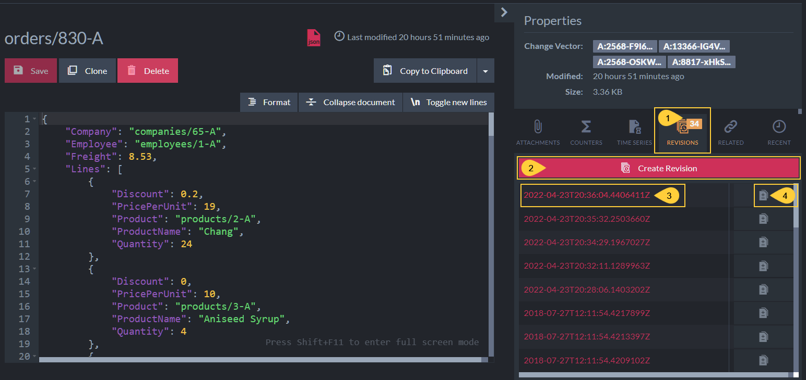
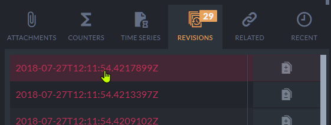

import Admonition from '@theme/Admonition';
import Tabs from '@theme/Tabs';
import TabItem from '@theme/TabItem';
import CodeBlock from '@theme/CodeBlock';
import LanguageSwitcher from "@site/src/components/LanguageSwitcher";
import LanguageContent from "@site/src/components/LanguageContent";

# Document Extensions: Revisions
<Admonition type="note" title="Note">

* **Document Revisions** are snapshots of documents that can be created manually or automatically when a document is created, modified, or deleted.
  Revisions can be used for data auditing, instant restoration after document corruption, and other purposes.

* Learn more about document revisions in this [document revisions overview](../../../document-extensions/revisions/overview.mdx):  
  * To define and enable revisions creation, see [revisions configuration](../../../document-extensions/revisions/overview.mdx#revisions-configuration).  
  * A dynamic walkthrough demonstrating revisions management is available [here](../../../document-extensions/revisions/overview.mdx#how-it-works).  

* This article provides an overview of the Studio views related to working with revisions, including:  
  * Viewing revisions
  * Comparing revisions
  * Viewing revisions for deleted documents (Revisions Bin)
* In this page:
  * [Revisions Tab](../../../studio/database/document-extensions/revisions.mdx#revisions-tab)  
  * [Revision inspection](../../../studio/database/document-extensions/revisions.mdx#revision-inspection)  
  * [Revisions comparison](../../../studio/database/document-extensions/revisions.mdx#revisions-comparison)  
  * [Revisions Bin](../../../studio/database/document-extensions/revisions.mdx#revisions-bin)  
     * [Restoring revisions](../../../studio/database/document-extensions/revisions.mdx#restoring-revisions)  

</Admonition>
## Revisions Tab

* Located within the Document View,  
  the Revisions Tab displays the full trail of all revisions created for the document.
* From this tab, you can inspect each revision, manually force the creation of a new revision,  
  and compare revisions to the live document version and to other revisions.

1. [Document View](../../../studio/database/documents/document-view.mdx) &gt; **Revisions tab**  
   Click to display the document's revisions tab.  
   Revisions are listed in the revisions tab by their creation time signatures.  
   The current number of revisions is displayed in the tab header.  
2. **Create revision**  
   Click to manually create a new revision for this document from the Studio.  
   A new revision will be created if the document doesn't already have a revision for the latest content.  
   [Learn here](../../../document-extensions/revisions/overview.mdx#force-revision-creation-via-the-client-api) about forcing the creation of a new revision via the Client API.  
3. **Revision timestamp**  
   Click to inspect this revision.  
4. **Compare revision**  
   Click to compare this revision with the current live version of the document and with other revisions.  

## Revision inspection

Click the revision timestamp to inspect the revision's contents:

The revision will be visible in the Document View,  
but file editing will Not be available since revisions cannot be modified.

1. **Revision**  
   The REVISION label indicates that you are viewing a revision and not 
   the parent document.  
2. **Clone**  
   Click to create a document that copies the revision's contents.  
   <Admonition type="info" title="Info">
   * Cloning the revision will open the 'new document view' with this revision's contents.  
   * You can then save the clone under a new name to create a new document.  
   * Saving the clone with the exact same ID as the revision's parent document will revert the document to this revision.  
   </Admonition>
3. **See the current document**  
   Click to return to the revision's parent document view.  
4. **Revision contents**  
   The content of the revision is displayed in read-only mode.

## Revisions comparison

Click the revision's comparison button to compare it with other revisions:

1. **Exit revisions compare mode**  
   Click to exit the comparison window and return to the revisions tab in the Document View.  
2. **Compare with**  
   Click to select a revision to compare with.  
   
3. **Left-hand revision**  
   The left-hand view displays the revision selected in the revisions tab.  
4. **Right-hand revision**  
  The right-hand view displays the revision selected using the "Compare with" drop-down list.  
5. **Summary line**  
  This line summarizes the differences found between the two revisions.  

## Revisions Bin

* This view displays the revisions of deleted documents.

* When a document is deleted:  
  * A "delete-revision" is created for the document, marking its deletion.
  * The "delete-revision" and all the document's revisions - whether automatically created due to the defined revisions configuration or manually created - are moved to the Revisions Bin.
  * This applies regardless of whether a [revisions configuration](../../../document-extensions/revisions/overview.mdx#revisions-configuration) is enabled or disabled.

1. **Revisions Bin**  
   Click to open the Revisions Bin view.  
   Each item listed in the Revisions Bin view references all the revisions created for a deleted document.  
2. **Selection boxes**  
   Check to select items.  
3. **Delete**  
   Click to remove selected items.  
   Deleting revisions from the Revisions Bin will permanently dispose of these revisions,  
   making them irrecoverable.
4. **Deleted document ID**  
   This is the ID of the document that was deleted.  
   Click it to inspect the revisions created for this document.
   
     * Revisions stored in the revisions bin can be [inspected](../../../studio/database/document-extensions/revisions.mdx#revision-inspection)
       and cloned just like the revisions of a live document.  
5. **Change vector**  
   The change vector of the revision that was created for the document when it was deleted.  
6. **Deletion date**  
   The date/time when the document was deleted.  
### Restoring revisions

Giving a **new document** the ID of a deleted document whose revisions are kept in the Revisions Bin,  
will restore the revisions from the bin and add them to the new document.  

Opening the document's revisions tab will display the whole audit trail,
including the delete-revision created when the old document was deleted and the revision created when the new document was created.  

