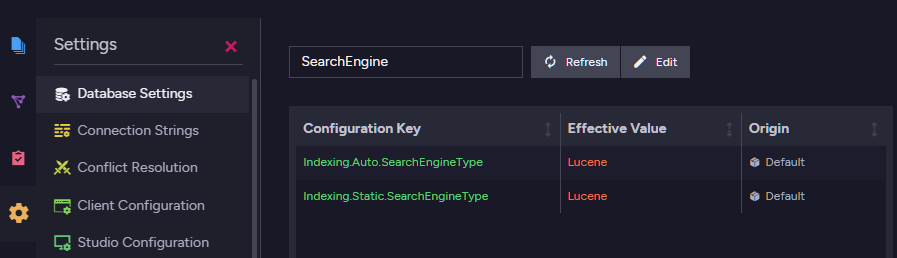
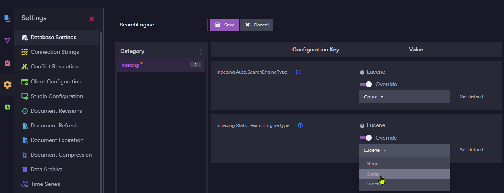
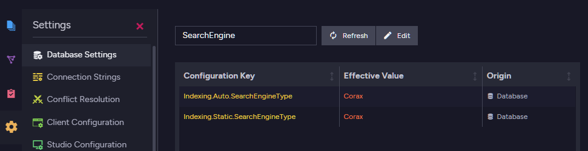
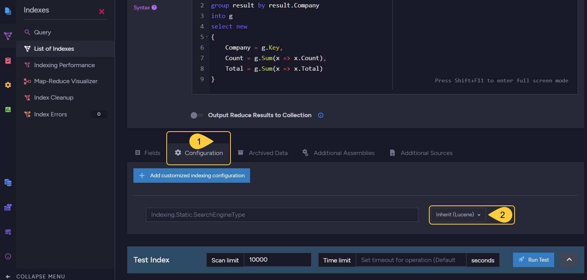
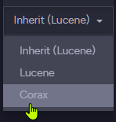
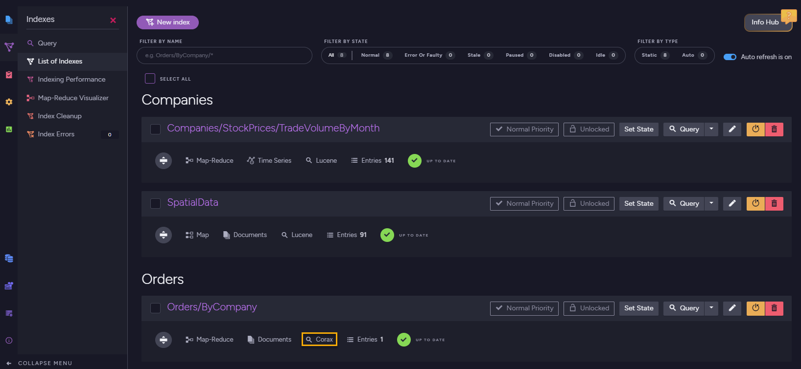
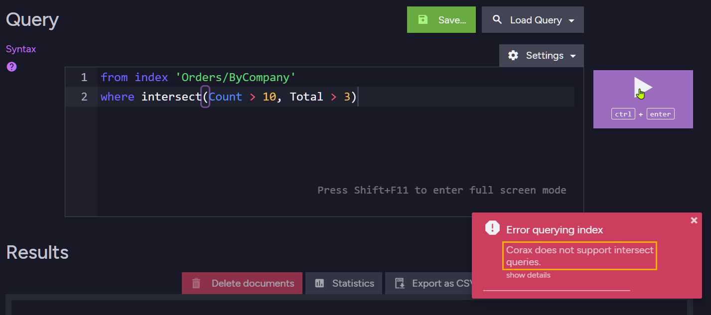
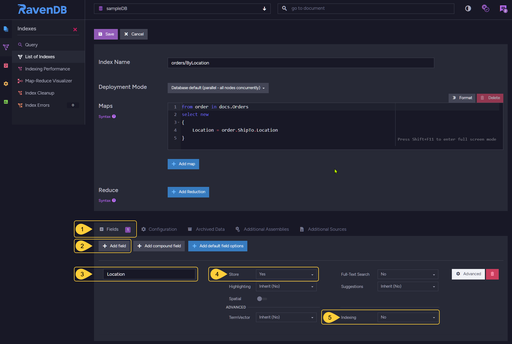
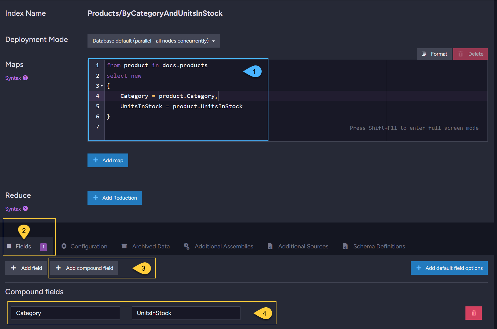
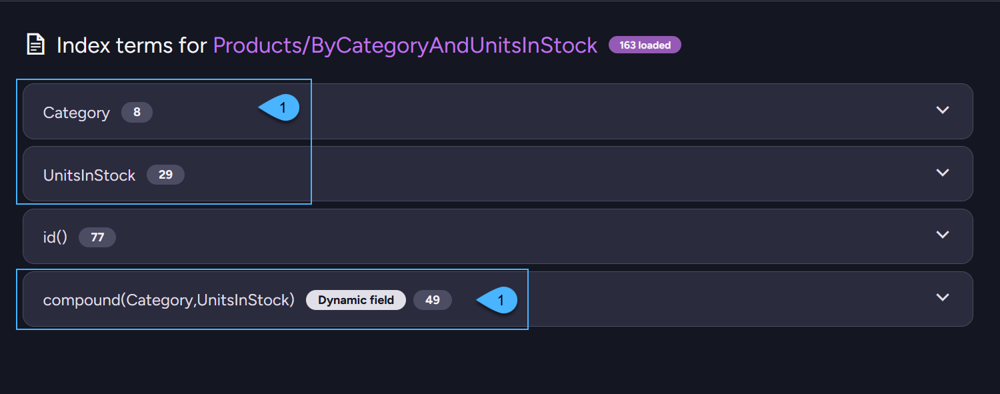

import Admonition from '@theme/Admonition';
import Tabs from '@theme/Tabs';
import TabItem from '@theme/TabItem';
import CodeBlock from '@theme/CodeBlock';
import LanguageSwitcher from "@site/src/components/LanguageSwitcher";
import LanguageContent from "@site/src/components/LanguageContent";
import ContentFrame from '@site/src/components/ContentFrame';
import Panel from '@site/src/components/Panel';

<Admonition type="note" title="">

* **Corax** is RavenDB's native search engine.   
  It is used by RavenDB indexes to handle queries and provides an in-house alternative to the Lucene search engine.

* **Lucene** remains available, and you can choose whether RavenDB uses Corax or Lucene for new indexes.  
  The search engine can be configured server-wide, per database, and per index (static indexes only).

* RavenDB queries are handled through indexes.  
  When a query does not match an existing index, RavenDB can create an [auto-index](../../indexes/creating-and-deploying.mdx#auto-indexes) for it.  
  The selected search engine determines which engine is used when new auto or [static indexes](../../indexes/creating-and-deploying.mdx#static-indexes) are created.
    
* **The default search engine depends on your license.**  
  If the search engine is not explicitly configured, RavenDB uses a license-based default:  
  *  _Community_, _Developer_, and servers without a license default to **Corax**.  
  * All other license types, such as  _Professional_ and _Enterprise_, default to **Lucene**.    
    
  Explicitly [selecting the search engine](../../indexes/search-engine/corax.mdx#selecting-the-search-engine) overrides this license-based default.
    
---
    
* In this article:  
   * [Selecting the search engine](../../indexes/search-engine/corax.mdx#selecting-the-search-engine)  
      * [Server wide](../../indexes/search-engine/corax.mdx#select-search-engine-server-wide)  
      * [Per database](../../indexes/search-engine/corax.mdx#select-search-engine-per-database)  
      * [Per static index](../../indexes/search-engine/corax.mdx#select-search-engine-per-static-index)  
   * [Unsupported features](../../indexes/search-engine/corax.mdx#unsupported-features)  
   * [Handling complex JSON objects](../../indexes/search-engine/corax.mdx#handling-complex-json-objects)  
   * [Compound fields](../../indexes/search-engine/corax.mdx#compound-fields)  
   * [Limits](../../indexes/search-engine/corax.mdx#limits)  
   * [Index training: Compression dictionaries](../../indexes/search-engine/corax.mdx#index-training-compression-dictionaries)
   * [Configuration options](../../indexes/search-engine/corax.mdx#configuration-options)  
    
</Admonition>

<Panel heading="Selecting the search engine">

You can select the search engine at the following scopes:

   * [Server-wide](../../indexes/search-engine/corax.mdx#select-search-engine-server-wide), 
     for all databases hosted by the server.
   * [Per database](../../indexes/search-engine/corax.mdx#select-search-engine-per-database), 
     overriding the server-wide setting for a specific database.
   * [Per static index](../../indexes/search-engine/corax.mdx#select-search-engine-per-static-index), 
     overriding the server-wide and database-level settings for a specific static index.  
     Per-index search engine selection is available only for **static** indexes.

Use these configuration options to select the search engine:

   * [Indexing.Auto.SearchEngineType](../../server/configuration/indexing-configuration.mdx#indexingautosearchenginetype)  
     Selects either `Lucene` or `Corax` for **auto indexes**.  
     This option can be set **server-wide** or **per database**.
   * [Indexing.Static.SearchEngineType](../../server/configuration/indexing-configuration.mdx#indexingstaticsearchenginetype)  
     Selects either `Lucene` or `Corax` for **static indexes**.  
     This option can be set **server-wide**, **per database**, or **per index**.
   * For additional Corax configuration options, see [Configuration options](../../indexes/search-engine/corax.mdx#configuration-options).
    
---
    
<Admonition type="note" title="">
    
**The selected search engine applies only to NEW indexes**      
    
* Existing indexes keep using the search engine they were created with even if you later change the server-wide or database-level setting.
  For example, if `Indexing.Static.SearchEngineType` was set to `Corax` and you later change it to `Lucene`,
  new static indexes will use Lucene.
  Existing static indexes that were created while Corax was selected will continue using Corax.
    
* To make an existing index use a different engine, [reset the index](../../studio/database/indexes/indexes-list-view#indexes-list-view---actions) after changing the relevant search engine setting.
    
</Admonition>

<Admonition type="note" title="">
    
**Corax-only cases**      
Some features require Corax regardless of the default search engine configuration:

* **Vector search**  
  [Vector search](../../ai-integration/vector-search/overview) is supported only by Corax.  
  Auto-indexes created for vector search queries use Corax automatically,  
  even if the configured default engine is Lucene.

* **Static indexes with vector fields**  
  Static indexes that define vector fields must use Corax.  
  If such an index is configured to use Lucene, RavenDB rejects the index.

* **Auto-index to static-index conversion**  
  When RavenDB converts an auto-index with vector fields to a static index definition,  
  the resulting static index is set to Corax as well.

</Admonition>    

---
    
### Select search engine: Server-wide

To select the search engine for all databases hosted by the server, modify the server's [settings.json](../../server/configuration/configuration-options.mdx#settingsjson) file.  
For example:

```json
{
    "Indexing.Auto.SearchEngineType": "Corax",
    "Indexing.Static.SearchEngineType": "Corax"
}
```
<br/>    

<Admonition type="note" title="Restart required">
You must restart the server for the new settings to be read and applied.
</Admonition>
    
---    
    
### Select search engine: Per database

To select the search engine for a specific database, modify the database's search engine settings.  
You can do this from Studio or from the Client API:

* **From Studio**:   
  Open the Studio's [Database Settings](../../studio/database/settings/database-settings.mdx) view and enter `SearchEngine` in the search bar to find the search engine settings.
  Click `Edit` to modify the default search engine.

     

* Select your preferred search engine for Auto and Static indexes.

     

* To apply the new settings, either **disable and re-enable the database** or **restart the server**.

         
    
* **From the Client API**:  
  You can also set these database-level search engine settings via the Client API using
  [PutDatabaseSettingsOperation](../../client-api/operations/maintenance/configuration/database-settings-operation.mdx#put-database-settings-operation).  
  This operation updates settings on an existing database and replaces the database settings dictionary, 
  so include any existing settings you want to keep. Reload the database for the changes to take effect.    

---
    
### Select search engine: Per static index 

You can select the search engine for a specific **static index**, overriding the server-wide and database-level settings.    

#### Select index search engine via Studio:  

* Open Studio's [Index List](../../studio/database/indexes/indexes-list-view.mdx) view,
  and select the static index whose search engine you want to set.  
    
        
    1. Open the index **Configuration** tab.  
    2. Select the search engine for this index.
    
       

* The indexes list view will show the changed configuration.
    
    
    
---
    
#### Select index search engine using code:

When defining a static index using the API, set the `SearchEngineType` property.  
Available values are `SearchEngineType.Lucene` and `SearchEngineType.Corax`.  
    
    ```csharp
    // The index definition:
    private class Products_ByAvailability : AbstractIndexCreationTask<Product>
    {
        public Products_ByAvailability()
        {
            Map = products => from product in products
                              select new
                              {
                                  product.Name,
                                  product.UnitsInStock,
                                  product.Discontinued
                              };
    
            // Set the search engine type 
            SearchEngineType = SearchEngineType.Corax;
        }
    }
    
    // Deploy the index:
    new Products_ByAvailability().Execute(store);
    ```

</Panel>

<Panel heading="Unsupported features">

The following Corax limitations currently apply.

#### Unsupported during indexing:

* Setting a [boost factor on an index-field](../../indexes/boosting.mdx#assign-a-boost-factor-to-an-index-field) is not supported.  
  Note that [boosting the whole index-entry](../../indexes/boosting.mdx#assign-a-boost-factor-to-the-index-entry)
  and [query-time boosting](../../client-api/session/querying/text-search/boost-search-results) with `boost()` **are supported**.
* Indexing spatial shapes that are not points is not supported.  
  Note that spatial points **are supported**, including WKT values that represent points.

#### Unsupported while querying:

* [Fuzzy search](../../client-api/session/querying/text-search/fuzzy-search.mdx) is not supported.  
* [Proximity search](../../client-api/session/querying/text-search/proximity-search.mdx) is not supported.  
* [Including query explanations](../../client-api/session/querying/debugging/include-explanations.mdx) is not supported  
* [Custom sorters](../../indexes/querying/sorting.mdx.mdx) are not supported.  
    
#### Complex JSON properties:

Complex JSON properties cannot currently be indexed and searched by Corax.  
Read more about this in [Handling complex JSON objects](../../indexes/search-engine/corax.mdx#handling-complex-json-objects) below.  

#### Unsupported `where` methods:

* [lucene()](../../client-api/session/querying/document-query/how-to-use-lucene.mdx) is not supported.  
* [intersect()](../../indexes/querying/intersection.mdx) is not supported.  

Using an unsupported feature with Corax will fail the relevant indexing or query operation.  
The exception type and message depend on the unsupported feature.

<Admonition type="info" title="">

For example, the following query uses the `intersect()` method, which is currently not supported by Corax.
    
```sql
from index 'Orders/ByCompany'
where intersect(Count > 10, Total > 3)
```    
<br/>
    
If the `Orders/ByCompany` index uses Corax, running this query will fail.
    
  
    
</Admonition>

</Panel>

<Panel heading="Handling complex JSON objects">

<Admonition type="note" title="">
    
#### What is a complex JSON object
    
Consider the following `Orders` document:

```json
{
    "Company": "companies/27-A",
    "Employee": "employees/2-A",
    "ShipTo": {
        "City": "Torino",
        "Country": "Italy",
        "Location": {
            "Latitude": 45.0907661,
            "Longitude": 7.687425699999999
        }
    }
}
```
<br/>
    
The `Location` property is a complex JSON object.  
It contains simple properties, such as `Latitude` and `Longitude`,  
but `Location` itself is not a simple searchable value.

</Admonition>    
    
---
    
* **Lucene** can index a complex field as a JSON string.
    
* **Corax** does not support indexing the whole complex JSON object as a single text value,
  because indexing an entire object as text is usually not useful for search.
  The exact behavior depends on whether the index is an auto-index or a static index;
  see [How Corax handles complex fields while indexing](../../indexes/search-engine/corax.mdx#how-corax-handles-complex-fields-while-indexing) below.

    To work with complex objects, use one of the following approaches:
    
    1. [Index simple properties from the object](../../indexes/search-engine/corax.mdx#1-index-simple-properties-from-the-object)
    2. [Store the complex field for projection only](../../indexes/search-engine/corax.mdx#2-store-the-complex-field-for-projection-only)
    3. [Serialize the complex object explicitly](../../indexes/search-engine/corax.mdx#3-serialize-the-complex-object-explicitly)
    4. [Use Lucene to index the whole object as JSON text](../../indexes/search-engine/corax.mdx#4-use-lucene-to-index-the-whole-object-as-json-text)   

---
    
#### 1. Index simple properties from the object

Index the specific values that you need to query.

```csharp
from order in docs.Orders
select new
{
    Latitude = order.ShipTo.Location.Latitude,
    Longitude = order.ShipTo.Location.Longitude
}
```

---
    
#### 2. Store the complex field for projection only

If queries need to project the whole object but do not need to search inside it, 
[disable indexing for the field](../../indexes/using-analyzers.mdx#disabling-indexing-for-index-field) and store it.
[Projection queries](../../indexes/querying/projections.mdx#projections-and-stored-fields) would be able to project it.

If you do not need to project the whole object from the index, do not map the complex object as an index-field.  
Index only the simple properties you need.    

<Admonition type="note" title="">
A stored field can be projected directly from the index.  
This can make projections faster, but increases index storage size.
</Admonition>

* To store a field's content and disable its indexing **via Studio**:

     

     1. Open the index definition's **Fields** tab.
     2. Click **Add Field**.
     3. Enter the complex field name, for example `Location`.
     4. Set **Store** to **Yes**.
     5. Set **Indexing** to **No**.

* To store a field's content and disable its indexing **using code**:

    ```csharp
    private class Orders_ByLocation : AbstractIndexCreationTask<Order>
    {
        public Orders_ByLocation()
        {
            Map = orders => from order in orders
                            select new
                            {
                                order.ShipTo.Location
                            };

            SearchEngineType = SearchEngineType.Corax;

            // Disable indexing for the field
            // Do not index the complex object as a searchable field
            Index("Location", FieldIndexing.No);

            // Store the field if you want to project it from the index.
            // (storing is the only way to retrieve a complex field from the index
            // when its indexing is disabled, since it won't be indexed)    
            Store("Location", FieldStorage.Yes);
        }
    }
    ```

---
    
#### 3. Serialize the complex object explicitly

You can explicitly serialize the complex object to a string.

<Tabs groupId='languageSyntax'>
<TabItem value="Use_ToString" label="Use ToString()">

```csharp
from order in docs.Orders
select new
{
    // Convert the complex object to JSON text
    Location = order.ShipTo.Location.ToString()
}
```

</TabItem>
<TabItem value="Not_Supported_By_Corax" label="Not supported by Corax">

```csharp
from order in docs.Orders
select new
{
    // This will fail when using Corax
    Location = order.ShipTo.Location
}
```

</TabItem>
</Tabs>
    
<Admonition type="note" title="">
Serializing a complex object to a single string can make it indexable by Corax,
but the result is usually poor input for analyzers and is not commonly used for searches.
It can still make sense when you only need to project the serialized string.
</Admonition>    

---
    
#### 4. Use Lucene to index the whole object as JSON text
    
If you specifically need the whole complex object to be indexed as a single string value, use Lucene as the index's search engine.
Lucene supports this behavior directly, while Corax does not.  
With Corax, prefer indexing the specific simple properties you need to query.
  
---
    
<Admonition type="note" title="">
    
### How Corax handles complex fields while indexing    

* **Auto indexes**  
  If an auto-index maps a complex field, Corax indexes a placeholder value (`JSON_VALUE`) for that field  
  and raises a complex-field **alert**.

  This allows basic existence or non-null checks, such as `exists(Field)` or  `Field != null`,  
  but the object's inner values are not searchable through that field.
    
  Consider querying on individual fields of that object or using a static index.

* **New static indexes** (created or reset in RavenDB 6.2 or later)      
  Static Corax indexes behave according to the
  [Indexing.Corax.Static.ComplexFieldIndexingBehavior](../../server/configuration/indexing-configuration.mdx#indexingcoraxstaticcomplexfieldindexingbehavior) configuration option.

  * If `ComplexFieldIndexingBehavior` is set to **`Throw`**:  
    Corax throws a `NotSupportedInCoraxException` when the index attempts to index a complex object as a whole. This is the default behavior.

  * If `ComplexFieldIndexingBehavior` is set to **`Skip`**:  
    Corax skips indexing terms for the complex field without throwing an exception.   
    If the field is stored, it can still be used for projection.

* **Old static indexes** (created using RavenDB `6.0.x` or older)      
  Older static Corax indexes use legacy behavior for backward compatibility.

  If the index maps a complex field but the field has no explicit indexing option,  
  RavenDB disables indexing for that field.

  If the field was explicitly configured with indexing other than `No`,  
  Corax throws once and then disables indexing for that field to avoid repeated indexing errors.
    
  After the index is reset, it no longer uses the legacy behavior.
  It behaves like a new static index, and complex-field indexing is controlled by `Indexing.Corax.Static.ComplexFieldIndexingBehavior`.

</Admonition>
    
</Panel>

<Panel heading="Compound fields">
 
<ContentFrame>
    
### What are compound fields?

* Compound fields are an expert-level Corax optimization intended for very large datasets and specific query patterns.  

* A compound field is an internal Corax index-field that combines two index-field values into a single order-preserving key.
  Corax can use this key to optimize queries that **filter by one field** and **order by another field**.

  The regular index-fields remain separate and queryable.  
  The compound field is added in addition to them for Corax's internal optimization and is not queried directly.    

* For example, an index definition that includes `CompoundField("Category", "UnitsInStock")`  
  adds an internal index-field named `compound(Category,UnitsInStock)`.  
  Corax can use this compound field to optimize a query that **filters by `Category`** and **orders by `UnitsInStock`**,  
  without executing a separate sorting pass.

* Use compound fields when the same filter-then-sort query pattern is run repeatedly over a large dataset.    

</ContentFrame>    
<ContentFrame>
    
### When is optimization applied?

The compound-field optimization applies only when the query has a single equality filter on the first compound-field component and orders by the second component.
    
Assume a Corax index defines this compound field: `CompoundField("Category", "UnitsInStock")`  
In this case, Corax can optimize a query that filters by equality on `Category` and orders by `UnitsInStock`.    
    
---
    
The optimization is NOT applied to the query when:

* **The filter on the first field is not an equality comparison** 

  ```sql
  from index 'Products/ByCategoryAndUnitsInStock'
  where Category != "categories/1-A" // not an equality filter
  order by UnitsInStock    
  ```  
    
* **The query has additional `where` conditions**  
    
  ```sql
  from index 'Products/ByCategoryAndUnitsInStock'
  where Category == "categories/1-A" and Name == "Chai" // extra where condition
  order by UnitsInStock
  ```    
    
* **The field order is reversed**  
  ```sql
  from index 'Products/ByCategoryAndUnitsInStock'
  where UntisInStock == 25  // filter by the second field
  order by Category         // order by the first field
  ```  

* **The query has additional order by clauses**  
    
  ```sql  
  from index 'Products/ByCategoryAndUnitsInStock'
  where Category = "categories/1-A"
  order by UnitsInStock, Name // extra order by field
    
  // The additional order by field requires another sorting step, 
  // so the query does not get the full skip-sort optimization.        
  ``` 
    
</ContentFrame>    
<ContentFrame>
    
### Constraints and value limits
    
* A compound field can currently be composed of exactly **2 fields**.

* Each of the two values in the compound field must be **255 bytes or less** after Corax converts the value to the encoded form stored in the compound term.  
  This limit applies to each field value separately, not to the full compound field.

  Corax stores the two encoded values together and appends one byte that records the length of the first value.  
  The full compound term must fit within Corax's general 512-byte term limit, but the per-value 255-byte limit is the practical constraint to consider when defining compound fields.
    
* The limit is checked at **indexing time**.  
  RavenDB can accept and deploy the index definition, but indexing will fail when a document produces a compound-field value of 256 bytes or more,
  and an `ArgumentOutOfRangeException` will be thrown.

* The 255-byte limit is checked after Corax converts each value to the encoded form stored in the compound key.
    
  * For string values, this includes running the field analyzer.
    The limit is based on the byte length of the analyzed term, not on the number of characters in the original string.
    Long text values, URLs, descriptions, or analyzer output can exceed the 255-byte limit, so avoid using long free-text fields in compound fields.

  * Non-string scalar values (numbers, dates and times, and booleans) are encoded in just a few bytes and never approach this limit. 
    `null` and empty values produce no bytes and sort before non-empty values.    

* When choosing fields for a compound field, prefer short string values or fixed-size scalar values.    
    
</ContentFrame>   

---

### Example
    
#### The index:
    
In the index definition, call `CompoundField` with the two index-fields that match the query pattern you want Corax to optimize.
Pass the equality-filter field first and the order by field second.    

The following index defines a compound field from `Category` and `UnitsInStock`:    
    
```csharp
private class Products_ByCategoryAndUnitsInStock :
    AbstractIndexCreationTask<Product, Products_ByCategoryAndUnitsInStock.IndexEntry>
{
    public class IndexEntry
    {
        // the 'regular' index-fields
        public string Category { get; set; }
        public long UnitsInStock { get; set; }
    }

    public Products_ByCategoryAndUnitsInStock()
    {
        Map = products =>
            from product in products
            select new IndexEntry
            {
                Category = product.Category,
                UnitsInStock = product.UnitsInStock
            };

           SearchEngineType = Raven.Client.Documents.Indexes.SearchEngineType.Corax;

        // Add a compound index-field to optimize queries
        // that filter by Category and order by UnitsInStock.
        CompoundField(x => x.Category, x => x.UnitsInStock);
    }
}
```
<br/>
    
The index-fields include:

* The regular `Category` index-field.
* The regular `UnitsInStock` index-field.
* The internal compound index-field `compound(Category,UnitsInStock)`.    
    
---
    
#### The query:    
    
The query does not reference the compound field directly.  
Corax uses it internally when a query filters by `Category` and orders by `UnitsInStock`.     

<Tabs groupId='languageSyntax'>
<TabItem value="Query" label="Query">

```csharp
using (var session = store.OpenSession())
{
    var products = session
        .Query<Products_ByCategoryAndUnitsInStock.IndexEntry, 
            Products_ByCategoryAndUnitsInStock>()
        .Where(x => x.Category == "categories/1-A")  // Filter by Category
        .OrderBy(x => x.UnitsInStock)                // Order by UnitsInStock
        .OfType<Product>()
        .ToList();
}
```

</TabItem>
<TabItem value="RQL" label="RQL">

```sql
from index 'Products/ByCategoryAndUnitsInStock'
where Category = "categories/1-A"
order by UnitsInStock
```

</TabItem>
</Tabs>
    
---
 
You can also define a compound field from Studio when editing an index:    
    
 
    
  1. Define the 'regular' index-fields in the **Maps** section.
  2. To define a compound field, open the **Fields** tab.
  3. Click **Add compound field**.
  4. Enter the two index-fields that compose the compound field.
    
---    
    
The index-fields and their terms are visible in the "Terms view":    
    
 
    
  1. The 'regular' index-fields.
  2. The internal compound index-field.  
    
  > Expand an index-field to view its terms.

</Panel>

<Panel heading="Limits">

* Corax indexes can contain more than `int.MaxValue` (`2,147,483,647`) entries.

* [Query paging](../../indexes/querying/paging.mdx) over Corax indexes supports skipping more than `int.MaxValue` results.  
  This allows a query to skip beyond the 32-bit range and then take results from that position.

* The number of results that a single query can take and return is still limited to `int.MaxValue` (`2,147,483,647`).  
  This limit applies to both Corax and Lucene, including projected results.
    
* Compound fields have additional constraints, including exactly **2 fields** per compound field
  and a **255-byte limit** per participating field value.  
  Learn more in [Compound fields: Constraints and value limits](../../indexes/search-engine/corax.mdx#constraints-and-value-limits).

</Panel>

<Panel heading="Index training: Compression dictionaries">

<ContentFrame>
    
### Compression dictionary training   
    
When a Corax index is created over a document collection, RavenDB samples the indexed content and trains a 
[compression dictionary](https://en.wikibooks.org/wiki/Data_Compression/Dictionary_compression) for the index.
The dictionary lets Corax encode index terms more compactly, reducing index storage size and improving the efficiency of subsequent indexing and querying operations.

Training happens before the index starts its regular indexing work, and only when the index does not already have a dictionary.
It is performed only for Corax indexes over document collections, and is skipped for non-document source types, such as time series and counters.

Once trained, the dictionary is stored with the index and used for all subsequent indexing and querying operations.    

</ContentFrame>    
<ContentFrame>
    
### Training limits

Training is bounded by two limits:
    
* **The number of documents sampled from the indexed collections**.  
  By default, RavenDB samples up to `100,000` documents.  
  This limit is configured by [Indexing.Corax.DocumentsLimitForCompressionDictionaryCreation](../../server/configuration/indexing-configuration.mdx#indexingcoraxdocumentslimitforcompressiondictionarycreation).

* **The memory budget for training.**  
  The default budget scales with the server's platform and total available memory,  
  ranging from `128 MB` on ≤1 GB RAM or 32-bit servers up to `2 GB` on servers with more than 64 GB of RAM.  
  The actual memory used for sampling is a fraction of this budget.  
  This budget can be customized by [Indexing.Corax.MaxAllocationsAtDictionaryTrainingInMb](../../server/configuration/indexing-configuration.mdx#indexingcoraxmaxallocationsatdictionarytraininginmb).

</ContentFrame>    
<ContentFrame>
    
### Training impact    
    
The larger the indexed collections, the more useful the trained dictionary can be,
and the more efficient the index becomes in terms of resource usage.  
    
Training may take longer on large datasets or slower storage, because RavenDB needs to read the sample documents before regular indexing begins - 
both collection size and the storage system's IO speed affect how long training takes.

</ContentFrame>    
<ContentFrame>
    
### Resetting an index to retrain the dictionary    
    
If an index was created while the relevant collections were still very small,
the trained dictionary may not be representative (or RavenDB may fall back to the default dictionary).   
Once the collections hold a representative amount of data,
you can [reset the index](../../studio/database/indexes/indexes-list-view#indexes-list-view---actions) to train a new dictionary.

<Admonition type="note" title="">
Whether a reset rebuilds the index in place or side-by-side depends on the configured [reset mode](../../server/configuration/indexing-configuration.mdx#indexingresetmode).  
The default reset mode is `InPlace`. When a side-by-side reset is used, the existing index continues serving queries until its replacement has been built.
</Admonition>

</ContentFrame>    
<ContentFrame>
    
### Corax and the Test Index interface

Corax indexes created through Studio's [Test Index](../../studio/database/indexes/create-map-index.mdx#test-index) interface do not train compression dictionaries.  
The Test Index interface is intended for prototyping an index definition, and dictionary training would add unnecessary overhead to that workflow.

</ContentFrame>    
</Panel>

<Panel heading="Configuration options">

Common Corax configuration options include:  

#### Search engine selection
    
* [Indexing.Auto.SearchEngineType](../../server/configuration/indexing-configuration.mdx#indexingautosearchenginetype)  
  Set the search engine used by **auto-indexes**.

* [Indexing.Static.SearchEngineType](../../server/configuration/indexing-configuration.mdx#indexingstaticsearchenginetype)  
  Set the search engine used by **static indexes**. 

#### General Corax options
    
* [Indexing.Corax.IncludeDocumentScore](../../server/configuration/indexing-configuration.mdx#indexingcoraxincludedocumentscore)  
  Choose whether to include the score value in document metadata when sorting by score.  
  Disabling this option can improve query performance.  

* [Indexing.Corax.IncludeSpatialDistance](../../server/configuration/indexing-configuration.mdx#indexingcoraxincludespatialdistance)  
  Choose whether to include spatial information in document metadata when sorting by distance.  
  Disabling this option can improve query performance.  

* [Indexing.Corax.MaxMemoizationSizeInMb](../../server/configuration/indexing-configuration.mdx#indexingcoraxmaxmemoizationsizeinmb)  
  The maximum amount of memory that Corax can use for a memoization clause during query processing.  
  This configuration is an EXPERT level. Configure this option only if you are an expert.

* [Indexing.Corax.DocumentsLimitForCompressionDictionaryCreation](../../server/configuration/indexing-configuration.mdx#indexingcoraxdocumentslimitforcompressiondictionarycreation)  
  Set the maximum number of documents used to train the compression dictionary for a Corax index.    
  Training will stop when it reaches this limit.  

* [Indexing.Corax.MaxAllocationsAtDictionaryTrainingInMb](../../server/configuration/indexing-configuration.mdx#indexingcoraxmaxallocationsatdictionarytraininginmb)  
  Set the maximum amount of memory allocated while training Corax compression dictionaries.    
  Training will stop when it reaches this limit.  

* [Indexing.Corax.Static.ComplexFieldIndexingBehavior](../../server/configuration/indexing-configuration.mdx#indexingcoraxstaticcomplexfieldindexingbehavior)  
  Set how static Corax indexes handle complex JSON objects.    
    
* [Indexing.Corax.UnmanagedAllocationsBatchSizeLimitInMb](../../server/configuration/indexing-configuration.mdx#indexingcoraxunmanagedallocationsbatchsizelimitinmb)  
  Set the unmanaged memory allocation limit for a single Corax indexing batch.    
    
For the full list of indexing configuration options, see [Indexing configuration](../../server/configuration/indexing-configuration.mdx).    

</Panel>