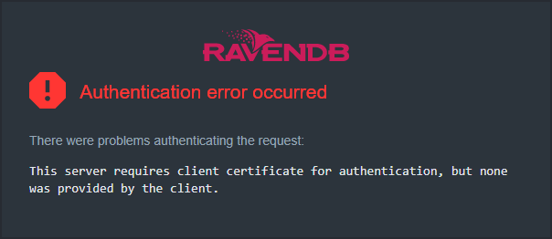
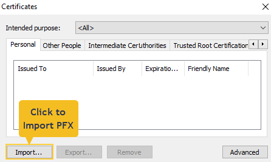
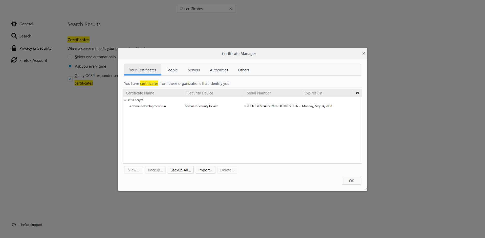
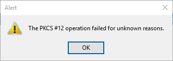

import Admonition from '@theme/Admonition';
import Tabs from '@theme/Tabs';
import TabItem from '@theme/TabItem';
import CodeBlock from '@theme/CodeBlock';
import LanguageSwitcher from "@site/src/components/LanguageSwitcher";
import LanguageContent from "@site/src/components/LanguageContent";
import Panel from "@site/src/components/Panel";
import ContentFrame from "@site/src/components/ContentFrame";

# Security: Common Errors & FAQ
<Admonition type="note" title="">

* This article explains some of the common security configuration errors and how to handle them.

* In this article:
   * [Setup Wizard Issues](../../server/security/common-errors-and-faq.mdx#setup-wizard-issues)  
   * [Changing Configurations and Renewals Issues](../../server/security/common-errors-and-faq.mdx#changing-configurations-and-renewals-issues)  
   * [Authentication Issues](../../server/security/common-errors-and-faq.mdx#authentication-issues)  
   * [Encryption Issues](../../server/security/common-errors-and-faq.mdx#encryption-issues)  

</Admonition>

<Panel heading="Setup Wizard Issues">

* [Server cannot bind to the provided private IP address](../../server/security/common-errors-and-faq.mdx#server-cannot-bind-to-the-provided-private-ip-address)
* [Ports are blocked by the firewall](../../server/security/common-errors-and-faq.mdx#ports-are-blocked-by-the-firewall)
* [DNS is cached locally](../../server/security/common-errors-and-faq.mdx#dns-is-cached-locally)
* [Long DNS propagation time](../../server/security/common-errors-and-faq.mdx#long-dns-propagation-time)
* [If I already have the Zip file, can I avoid repeating the setup process?](../../server/security/common-errors-and-faq.mdx#if-i-already-have-the-zip-file-can-i-avoid-repeating-the-setup-process)

<ContentFrame>

### Server cannot bind to the provided private IP address

If the IP/port is not accessible on your machine, you'll get the following error.

```plain
System.InvalidOperationException: Setting up RavenDB in Let's Encrypt security mode failed. ---> 
System.InvalidOperationException: Validation failed. ---> 
System.InvalidOperationException: Failed to simulate running the server with the supplied settings using: https://a.example.ravendb.community:4433  ---> 
System.InvalidOperationException: Failed to start webhost on node 'A'. The specified ip address might not be reachable due to network issues. 
It can happen if the ip is external (behind a firewall, docker). If this is the case, try going back to the previous screen and add the same ip as an external ip.
Settings file: D:\temp\RavenDB-4.0.0-windows-x64\Server\settings.json.
IP addresses: 10.0.0.65:4433. 
---> Microsoft.AspNetCore.Server.Kestrel.Transport.Libuv.Internal.Networking.UvException: Error -4092 EACCES permission denied
```
<br />

This can be caused by two different reasons:

1. Your private IP address is not reachable inside the machine or you provided the wrong IP/port.
2. You are running behind a firewall (VM, docker...) and accidentally provided the external IP address during setup.

Make sure you provide the private IP address in the "IP Address / Hostname" field as seen in [this example](../../start/installation/setup-wizard/configure-node-addresses.mdx#behind-a-firewall-or-load-balancer).

</ContentFrame>

<ContentFrame>

### Ports are blocked by the firewall

When configuring a VM in Azure, [AWS](../../start/installation/setup-examples/aws-windows-vm.mdx) or any other provider, you should define firewall rules to allow both the **HTTP** and **TCP** ports you have chosen during setup.
This should be done both inside the VM operating system **and** in the web dashboard or management console.

If ports are blocked you'll get the following error.

```plain
Setting up RavenDB in Let's Encrypt security mode failed.
System.InvalidOperationException: Setting up RavenDB in Let's Encrypt security mode failed. ---> 
System.InvalidOperationException: Validation failed. ---> 
System.InvalidOperationException: Failed to simulate running the server with the supplied settings using: https://a.example.development.run:443 ---> 
System.InvalidOperationException: Client failed to contact webhost listening to 'https://a.example.development.run:443'.
Are you blocked by a firewall? Make sure the port is open.
Settings file: D:\RavenDB-4.0.0-windows-x64\Server\settings.json.
IP addresses: 10.0.1.4:443.
```

</ContentFrame>

<ContentFrame>

### DNS is cached locally

Most networks cache DNS records. In some environments you can get an error such as this:

```plain
Setting up RavenDB in Let's Encrypt security mode failed.
System.InvalidOperationException: Setting up RavenDB in Let's Encrypt security mode failed. ---> 
System.InvalidOperationException: Validation failed. ---> 
System.InvalidOperationException: Failed to simulate running the server with the supplied settings using: https://a.onenode.development.run ---> 
System.InvalidOperationException: Tried to resolve 'a.onenode.development.run' locally but got an outdated result.
Expected to get these ips: 127.0.0.1 while the actual result was: 10.0.0.65
If we try resolving through google's api (https://dns.google.com), it works well.
Try to clear your local/network DNS cache or wait a few minutes and try again.
Another temporary solution is to configure your local network connection to use google's DNS server (8.8.8.8).
```
<br />

This error probably means that the DNS is cached. You can wait a few minutes or reset the network DNS cache, 
but in many cases, the easiest solution is to [temporarily switch your DNS server to 8.8.8.8](https://developers.google.com/speed/public-dns/docs/using) 
You can click the Try Again button to restart the validation process of the Setup Wizard.

</ContentFrame>

<ContentFrame>

### Long DNS propagation time

If you are trying to modify existing DNS records, for example running the Setup Wizard again for the same domain name, you may encounter errors such as this:

```plain
Setting up RavenDB in Let's Encrypt security mode failed.  

System.InvalidOperationException: Setting up RavenDB in Let's Encrypt security mode failed. ---> 
System.InvalidOperationException: Validation failed. ---> 
System.InvalidOperationException: Failed to simulate running the server with the supplied settings using: https://a.example.development.run ---> 
System.InvalidOperationException: Tried to resolve 'a.example.development.run' using google's api (https://dns.google.com). 
Expected to get these ips: 127.0.0.1 while google's actual result was: 10.0.0.65 
Please wait a while until DNS propagation is finished and try again. If you are trying to update existing DNS records, 
it might take hours to update because of DNS caching. If the issue persists, contact RavenDB's support.
```
<br />

If this happens, there is nothing you can do except wait for DNS propagation. When it's updated on dns.google.com click the `Try Again` button.  
You can keep track of your RavenDB clusters and their associated DNS records at the [Customer's Portal](https://customers.ravendb.net).

</ContentFrame>

<ContentFrame>

### If I already have the Zip file, can I avoid repeating the setup process?

Yes.  
You can use the Zip file to re-install or deploy the server/cluster elsewhere.  
Download a fresh copy of RavenDB and run the setup wizard. Then choose `Continue Cluster Setup` and select node A.
This will use the existing Zip file and the same configuration and certificate which were previously chosen.  
When building a cluster, repeat this step with nodes B, C, and so on.

</ContentFrame>

</Panel>

<Panel heading="Changing Configurations and Renewals Issues">

* [After installing with Let's Encrypt, can I change the DNS records?](../../server/security/common-errors-and-faq.mdx#after-installing-with-lets-encrypt-can-i-change-the-dns-records)
* [Can I change the (private) IP address RavenDB binds to?](../../server/security/common-errors-and-faq.mdx#can-i-change-the-private-ip-address-ravendb-binds-to)
* [The Let's Encrypt certificate is about to expire but doesn't renew automatically](../../server/security/common-errors-and-faq.mdx#the-lets-encrypt-certificate-is-about-to-expire-but-doesnt-renew-automatically)
* [What should I do when my license expires?](../../server/security/common-errors-and-faq.mdx#what-should-i-do-when-my-license-expires)
* [Let's Encrypt certificate permission errors after renewal](../../server/security/common-errors-and-faq.mdx#lets-encrypt-certificate-permission-errors-after-renewal)

<ContentFrame>

### After installing with Let's Encrypt, can I change the DNS records?

Yes.  

1. The [Customers Portal](https://customers.ravendb.net) allows you to easily edit DNS records that are associated with your license.
2. You can run the setup wizard again.

If you supply different IP addresses then the wizard will update the DNS records of your domain.  
If you use a new domain or if you add/remove nodes in the new configuration then the wizard will also fetch a new certificate.

</ContentFrame>

<ContentFrame>

### Can I change the (private) IP address RavenDB binds to?

Yes.  
Open the [settings.json](../configuration/configuration-options.mdx#json) file located in the RavenDB Server installation folder, 
change the `ServerUrl` setting and restart the server.

</ContentFrame>

<ContentFrame>

### The Let's Encrypt certificate is about to expire but doesn't renew automatically

If you are getting the following error you must update the RavenDB server. 

```plain
Failed to update certificate from Lets Encrypt, EXCEPTION: System.InvalidOperationException: 
Your license is associated with the following domains: ravendb.community but the PublicServerUrl 
configuration setting is: Raven.Server.Config.Settings.UriSetting.There is a mismatch, therefore 
cannot automatically renew the Lets Encrypt certificate. Please contact support.
```
<br />

If it's not the same error as above, please open [settings.json](../configuration/configuration-options.mdx#json) in your Server installation 
and make sure you have all of the fields defined properly. Take a look at the following example:

```json
{
  "DataDir": "RavenData",
  "License.Eula.Accepted": true,
  "Security.Certificate.LetsEncrypt.Email": "your-email@example.com",
  "Setup.Mode": "LetsEncrypt",
  "Security.Certificate.Path": "cluster.server.certificate.aws.pfx",
  "ServerUrl": "https://172.31.30.163",
  "ServerUrl.Tcp": "tcp://172.31.30.163:38888",
  "ExternalIp": "35.130.249.162",
  "PublicServerUrl": "https://a.aws.development.run",
  "PublicServerUrl.Tcp": "tcp://a.aws.development.run:38888"
}
```
<br />

Things to check:

* **"Setup.Mode" must be "LetsEncrypt"**  
  The automatic renewal process only works if you acquired your certificate through the RavenDB setup wizard and used LetsEncrypt.  
  If you did not set up your cluster with the setup wizard and with LetsEncrypt, you are responsible to renew your certificate periodically.  
  * To enable RavenDB's automatic certificate renewal, set up a new cluster with the setup wizard, create parallel databases, 
    reconfigure the [document store](../../client-api/creating-document-store.mdx) to connect to the new databases, 
    and [import the data](../../studio/database/tasks/import-data/import-from-ravendb.mdx).  
* **Security.Certificate.LetsEncrypt.Email**  
  must be identical to the e-mail which is associated with your license.  
* **PublicServerUrl and PublicServerUrl.Tcp**  
  must contain the same domain as the one chosen during the setup wizard and is associated with your license.  
* **ExternalIp**  
  should be defined only if you are running behind a firewall (cloud VM, docker, etc...).  

* If all of this looks right, and the certificate still doesn't renew automatically and there are no alerts telling you what's wrong, 
  you can contact support.  
  * Make sure to supply the server logs with your ticket. When running in a cluster, please provide the logs from all nodes.
  * If your logs are turned off, open `Manage Server`-&gt;`Admin Logs` in the Studio, and keep them open while you click the `Renew` button in the certificate view.

</ContentFrame>

<ContentFrame>

### What should I do when my license expires?

* When your license expires the Studio is blocked.  
  Client API operations and other RavenDB features will continue to work.  
  However, any usage of expired RavenDB licenses is outside the license agreement  
  and doesn't comply with the [EULA terms](https://ravendb.net/terms).

* __Renew your license__ as described in this [Renew License](../../start/licensing/renew-license.mdx) tutorial.

</ContentFrame>

<ContentFrame>

### Let's Encrypt certificate permission errors after renewal

If you have External Replication or ETL to another cluster,  
or if you use your own Let's Encrypt certificates as client certificates,  
the next certificate renewal may cause permission issues that need to be handled manually.  

Learn how to handle this issue [here](../../server/security/authentication/solve-cluster-certificate-renewal-issue.mdx).  

</ContentFrame>

</Panel>

<Panel heading="Authentication Issues">

* [Authentication Error Occurred using Edge](../../server/security/common-errors-and-faq.mdx#authentication-error-occurred-using-edge)  
* [Authentication Error Occurred using Chrome](../../server/security/common-errors-and-faq.mdx#authentication-error-occurred-using-chrome)  
* [RavenDB is running as a service in Windows and Chrome doesn't use the client certificate from the OS store](../../server/security/common-errors-and-faq.mdx#ravendb-is-running-as-a-service-in-windows-and-chrome-doesnt-use-the-client-certificate-from-the-os-store)  
* [Authentication Error Occurred in Firefox](../../server/security/common-errors-and-faq.mdx#authentication-error-occurred-in-firefox)  
* [Cannot Import the Client Certificate to Firefox](../../server/security/common-errors-and-faq.mdx#cannot-import-the-client-certificate-to-firefox)  
* [Getting the full error using PowerShell](../../server/security/common-errors-and-faq.mdx#getting-the-full-error-using-powershell)  
* [Not using TLS](../../server/security/common-errors-and-faq.mdx#not-using-tls)  
* [How to regain access to a server when you have physical access but no client certificate](../../server/security/common-errors-and-faq.mdx#how-to-regain-access-to-a-server-when-you-have-physical-access-but-no-client-certificate)  
* ["Could not create SSL/TLS secure channel" error under an IIS webhost](../../server/security/common-errors-and-faq.mdx#could-not-create-ssltls-secure-channel-error-under-an-iis-webhost)  
* [Certificate is not recognized when setting up on Azure App Services](../../server/security/common-errors-and-faq.mdx#certificate-is-not-recognized-when-setting-up-on-azure-app-services)  
* [Automatic cluster certificate renewal following migration to 4.2](../../server/security/common-errors-and-faq.mdx#automatic-cluster-certificate-renewal-following-migration-to-42)  

<ContentFrame>

### Authentication Error Occurred using Edge

You cannot access Studio using Edge, though during 
[setup](../../start/installation/setup-wizard/configure-node-addresses.mdx) you checked 
the "Automatically register the admin client certificate in this (local) OS" checkbox 
and the setup wizard ended successfully.  



```plain
There were problems authenticating the request:
This server requires client certificate for authentication, but none was provided by the client.
```
<br />

1. Try closing **all instances** of the browser and restarting it,  
   or opening an incognito tab and pasting the server URL into the address bar.  
2. If clearing the cache didn't help, manually register the client certificate in the OS store.  
    * Under Windows:  
      Double-click the .pfx certificate.  
      Repeat clicking `next` for the default settings or provide your own settings.  
    * Under Linux:  
      Import the certificate directly to the browser.  
3. If the browser has presented several certificates and you selected the wrong one, you can -  
    * Remove the certificate from the browser's cache and reinstall the .pfx certificate as described above  
    * Or open an Incognito tab and paste the server URL into the address bar.  
4. In case none of the above works, you can use your own certificate and have RavenDB trust it. 
   You can use any client certificate that works under your OS and browser, even if it wasn't generated by RavenDB.  
   See [trusting an existing certificate](../../server/administration/cli.mdx#trustclientcert).  

---

#### If your browser runs under Windows 7 or Windows Server 2008 or older:  

The first thing to try would be installing the **ADMIN** certificate to the OS
where your server is running, closing **all instances** of the browser and restarting it.  

If the issue persists, please also visit the 
[Trusted Issuers List](https://support.microsoft.com/en-us/topic/failed-tls-connection-between-unified-communications-peers-generates-an-schannel-warning-9079a7df-1756-bf4d-20c7-42981a50f8df) 
and follow method 3 (**Configure Schannel to no longer send the list of trusted root certification authorities during the TLS/SSL handshake process**) 
to set the following registry entry to false:

```plain
HKEY_LOCAL_MACHINE\SYSTEM\CurrentControlSet\Control\SecurityProviders\SCHANNEL
Value name: SendTrustedIssuerList  
Value type: REG_DWORD  
Value data: 0 (False)  
```

</ContentFrame>

<ContentFrame>

### Authentication Error Occurred using Chrome

You cannot access Studio using Chrome, though during 
[setup](../../start/installation/setup-wizard/configure-node-addresses.mdx) you checked 
the "Automatically register the admin client certificate in this (local) OS" checkbox 
and the setup wizard ended successfully.  


```plain
There were problems authenticating the request:
This server requires client certificate for authentication, but none was provided by the client.
```
<br />

1. Try closing **all instances** of the browser and restarting it,  
   or open an incognito tab (Ctrl+Shift+N) and paste the server URL into the address bar.  
2. If clearing the cache didn't help, manually register the client certificate.  
   * Chrome versions **earlier than 105** look for certificates registered **with the OS**.  
     Windows users can register a certificate with the OS by double-clicking its .pfx file and repeatedly clicking `next` 
     for the default settings (or providing custom settings).  
     Linux users can import the certificate directly to the browser.  
   * Chrome versions **105 and on** look for certificates registered with the browser's [root store](https://blog.chromium.org/2022/09/announcing-launch-of-chrome-root-program.html).  
     A failure to locate the certificate may be the result of registering it with the OS rather than with the browser.  
       <Admonition type="note" title="">
       This failure typically occurs when [self-signed certificates](../../server/security/authentication/certificate-configuration.mdx) 
       are used rather than with Let's Encrypt certificates issued during setup, since 
       Let's Encrypt certificates are automatically installed in the Chrome root store. 
       </Admonition>
     To import a certificate to Chrome's root store use the browser's settings:  
     **Settings** &gt; **Privacy and Security** &gt; **Security** &gt; **Manage device certificates**  
     When a "Certificates" window opens, click **Import** and select your PFX certificate.  
       
3. If the browser has presented several certificates and you selected the wrong one, you can -  
    * Either remove the certificate from the browser (Settings -&gt; Privacy and security -&gt; Security &gt; Manage device certificates) 
      and reinstall the .pfx certificate as described above,  
    * Or open an incognito tab (Ctrl+Shift+N) and paste the server URL into the address bar.  
4. In case none of the above works, you can use your own certificate and have RavenDB trust it. 
   You can use any client certificate that works under your OS and browser, even if it wasn't generated by RavenDB.  
   See [trusting an existing certificate](../../server/administration/cli.mdx#trustclientcert).  

</ContentFrame>

<ContentFrame>

### RavenDB is running as a service in Windows and Chrome doesn't use the client certificate from the OS store

Your RavenDB service may run under a certain user, for which the certificate was installed, while you 
are currently using a different user for which no certificate was installed.  
Or you may have registered the certificate with the OS, but are using a Chrome version higher than 105 that 
looks for the certificate not at the OS root but at the Chrome root store.  

To solve these issues:
Using a user that the service is available for, install or import the certificate PFX 
[as described above](../../server/security/common-errors-and-faq.mdx#authentication-error-occurred-using-chrome).  

</ContentFrame>

<ContentFrame>

### Authentication Error Occurred in Firefox

You cannot access the Studio using Firefox even though you have finished the setup wizard successfully and you also checked the box saying "Automatically register the admin client certificate in this (local) OS".


```plain
There were problems authenticating the request:
This server requires client certificate for authentication, but none was provided by the client.
```
<br />

Firefox doesn't use the OS certificate store like Chrome or Edge. Please import the certificate manually (In Firefox, "Settings" -&gt; "Privacy and Security" -&gt; scroll down to Security and click "View Certificates" -&gt; "Import").  
Then close **all instances** of the browser and restart it.



</ContentFrame>

<ContentFrame>

### Cannot Import the Client Certificate to Firefox

You're trying to import the client certificate received from RavenDB to Firefox but get the following error:



```plain
The PKCS#12 operation failed for unknown reasons.
```
<br />

Firefox fails to import a certificate that is not password protected.
To overcome this issue, use the RavenDB CLI to [generate a password protected certificate](../../server/administration/cli.mdx#generateclientcert). 
You can also add a password to the current certificate by using OpenSSL or by importing it to the OS store and exporting it back with a password.

Firefox **sometimes** fails to import a perfectly good certificate for no apparent reason and without a proper error message.

You can try to generate a new password-protected certificate using the RavenDB CLI and import that instead.

If it didn't help, you can use any other client certificate you have that works with Firefox (even if it wasn't generated by RavenDB) and have RavenDB trust it. See [trusting an existing certificate](../../server/administration/cli.mdx#trustclientcert).

You can also generate your own self-signed client certificate by using OpenSSL or PowerShell. 

This is a known issue which has been reported many times to Mozilla.  

Some references:

[Bugzilla: #1049435](https://bugzilla.mozilla.org/show_bug.cgi?id=1049435)  
[Bugzilla: #458161](https://bugzilla.mozilla.org/show_bug.cgi?id=458161)  
[mozilla.dev.tech.crypto issue](https://groups.google.com/forum/?fromgroups=#!topic/mozilla.dev.tech.crypto/RiIeY-R5Q4Y)  

</ContentFrame>

<ContentFrame>

### Getting the full error using PowerShell

You can use PowerShell to make requests using the REST API.

If you are having trouble using certificates, take a look at this example which prints the full error (replace the server URL and the `/certificates/whoami` endpoint with yours).

```powershell
[Net.ServicePointManager]::SecurityProtocol = [Net.SecurityProtocolType]::Tls12
$cert = Get-PfxCertificate -FilePath C:\secrets\admin.client.certificate.example.pfx

try {
    $response = Invoke-WebRequest https://a.example.development.run:8080/certificates/whoami -Certificate $cert 
}
catch {
    if ($_.Exception.Response -ne $null) {
        Write-Host $_.Exception.Message

        $stream = $_.Exception.Response.GetResponseStream()
        $reader = New-Object System.IO.StreamReader($stream)
        Write-Host $reader.ReadToEnd()
    }
    Write-Error $_.Exception
}
```

</ContentFrame>

<ContentFrame>

### Not using TLS

The RavenDB clients use TLS 1.2 by default. If you want to use other clients please make sure to use the TLS security protocol version 1.2 or 1.3.

Bad Request (400) sample response:

```json
{  
   "Url":"/admin/secrets/generate",
   "Type":"Raven.Client.Exceptions.Security.InsufficientTransportLayerProtectionException",
   "Message":"RavenDB requires clients to connect using TLS 1.2, but the client used: 'Tls'.",
   "Error":"Raven.Client.Exceptions.Security.InsufficientTransportLayerProtectionException: RavenDB requires clients to connect using TLS 1.2, but the client used: 'Tls'.
       at Raven.Server.RavenServer.AuthenticateConnection.ThrowException() in C:\\Builds\\RavenDB-Stable-4.0\\src\\Raven.Server\\RavenServer.cs:line 570
       at Raven.Server.Routing.RequestRouter.TryAuthorize(RouteInformation route, HttpContext context, DocumentDatabase database) in C:\\Builds\\RavenDB-Stable-4.0\\src\\Raven.Server\\Routing\\RequestRouter.cs:line 168
       at Raven.Server.Routing.RequestRouter.<HandlePath>d__6.MoveNext() in C:\\Builds\\RavenDB-Stable-4.0\\src\\Raven.Server\\Routing\\RequestRouter.cs:line 89
       --- End of stack trace from previous location where exception was thrown ---
       at System.Runtime.ExceptionServices.ExceptionDispatchInfo.Throw()
       at System.Runtime.CompilerServices.TaskAwaiter.HandleNonSuccessAndDebuggerNotification(Task task)
       at System.Runtime.CompilerServices.TaskAwaiter`1.GetResult()
       at System.Runtime.CompilerServices.ValueTaskAwaiter`1.GetResult()
       at Raven.Server.RavenServerStartup.<RequestHandler>d__11.MoveNext() in C:\\Builds\\RavenDB-Stable-4.0\\src\\Raven.Server\\RavenServerStartup.cs:line 159"
}
```
<br />

In PowerShell it can be solved like this:

```powershell
[Net.ServicePointManager]::SecurityProtocol = [Net.SecurityProtocolType]::Tls12
```

</ContentFrame>

<ContentFrame>

### How to regain access to a server when you have physical access but no client certificate

An admin client certificate can be generated through the [RavenDB CLI](../../server/administration/cli.mdx#generateclientcert). If RavenDB runs as a console application, the CLI is just there. When running as a service, please use the `rvn admin-channel`.  
Use either the [generateClientCert](../../server/administration/cli.mdx#generateclientcert) command, or (if you already have a certificate) the [trustClientCert](../../server/administration/cli.mdx#trustclientcert) command.

Another way to gain access for an existing certificate is to add the [Security.WellKnownCertificates.Admin](../../server/configuration/security-configuration.mdx#securitywellknowncertificatesadmin) configuration to `settings.json` with your existing certificate's thumbprint.
In this case, a server restart is required.

</ContentFrame>

<ContentFrame>

### "Could not create SSL/TLS secure channel" error under an IIS webhost

Custom code that connects to RavenDB from an IIS-hosted application can fail with the
following error, even though the same code works when run directly (for example, from a
unit test):

```
The request was aborted: Could not create SSL/TLS secure channel.
```
<br />

This message is generic and does not reveal the real cause.  
The underlying error is `Keyset does not exist`: the IIS worker process runs under a
restricted identity (`IIS_IUSRS`, or the application pool identity `IIS AppPool\<PoolName>`)
that has no read access to the private key of the client certificate.  
Run directly, the same code loads the certificate under your own user account, which does
have that access.

To fix this, grant the IIS identity read access to the certificate's private key:

1. Open the Local Computer certificate store by running `certlm.msc` as an administrator.
2. Under `Personal` > `Certificates`, right-click your client certificate and select
   `All Tasks` > `Manage Private Keys`.
3. Add the IIS identity (`IIS_IUSRS`, or `IIS AppPool\<PoolName>` when the pool uses its own
   identity) and grant it `Read` permission.

<Admonition type="info" title="">

Microsoft documents the same `Manage Private Keys` dialog, in the context of a SQL Server
service account, in [Encrypt connections to SQL Server by importing a certificate](https://learn.microsoft.com/en-us/sql/database-engine/configure-windows/configure-sql-server-encryption).

As an alternative, you can load the certificate into the machine key store programmatically
with the `MachineKeySet` flag, as shown for [Azure App Services](../../server/security/common-errors-and-faq.mdx#certificate-is-not-recognized-when-setting-up-on-azure-app-services).

</Admonition>

</ContentFrame>

<ContentFrame>

### Certificate is not recognized when setting up on Azure App Services

You may have gotten an error message like:

```
The credentials supplied to the package were not recognized (The SSL connection could not be established, see inner exception.)
```
<br />

1) In the app settings of your Azure App Services application, add the `WEBSITE_LOAD_USER_PROFILE = 1` option.  

2) Another solution is to use the `MachineKeySet` flag during certificate creation:  

```csharp
[DocumentStore].Certificate = new X509Certificate2("[path to your pfx file]", 
                                                  (string)null, X509KeyStorageFlags.MachineKeySet);  
```

</ContentFrame>

<ContentFrame>

### Automatic cluster certificate renewal following migration to 4.2

`Security.Certificate.Exec` was deprecated in 4.2 and replaced by `Security.Certificate.Load.Exec`. You can use your old `Security.Certificate.Exec` 
executable by simply moving it to this new path. The settings `Security.Certificate.Renew.Exec` and `Security.Certificate.Change.Exec` have been added 
for automatically persisting the certificate to the whole cluster. If you have your own mechanism for doing this, or are using a single node cluster, 
you still need to place empty scripts in the `Security.Certificate.Renew.Exec` and `Security.Certificate.Change.Exec` paths or an exception will be 
thrown.  

</ContentFrame>

</Panel>

<Panel heading="Encryption Issues">

### Insufficient Memory Exception

```plain
Memory exception occurred: System.InsufficientMemoryException:  
Failed to increase the min working set size so we can lock 4,294,967,296 for  
D:\stackoverflow\RavenData\Databases\SO\Indexes\Auto_Questions_ByBody\Temp\compression.0000000000.buffers.  
With encrypted databases we lock some memory in order to avoid leaking secrets to disk.  
Treating this as a catastrophic error and aborting the current operation.
```
<br />

When encryption is turned on, RavenDB locks memory in order to avoid leaking secrets to disk. Read more [here](../../server/security/encryption/encryption-at-rest.mdx#locking-memory).

By default, RavenDB treats this error as catastrophic and will not continue the operation.
You can change this behavior but it's not recommended and should be done only after a proper security analysis is performed, see the [Security Configuration Section](../../server/configuration/security-configuration.mdx#securitydonotconsidermemorylockfailureascatastrophicerror).

If such a catastrophic error occurs in **Windows**, RavenDB will try to recover automatically by increasing the size of the minimum working set and retrying the operation.   
In **Linux**, it is the admin's responsibility to configure higher limits manually using:

```bash
sudo prlimit --pid [process-id] --memlock=[new-limit-in-bytes]
```
<br />

To figure out what the new limit should be, look at the exception thrown by RavenDB, which includes this size.  
For persistent and service-level configuration, see [Linux: Setting memlock when using encrypted database](../kb/linux-setting-memlock.mdx).

</Panel>
