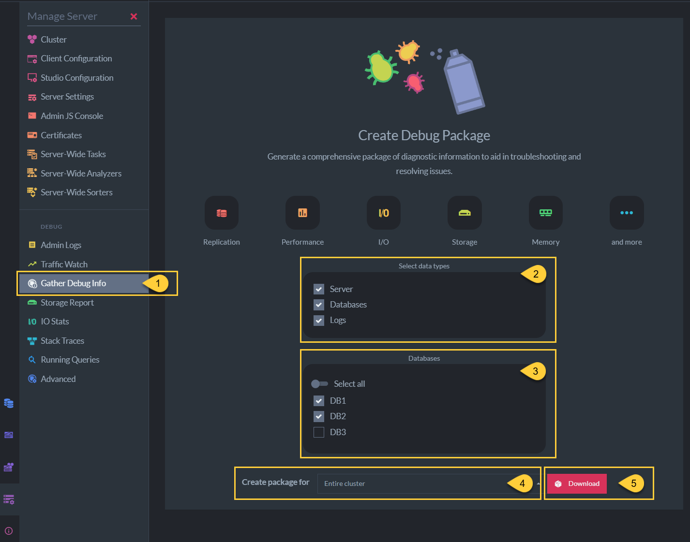
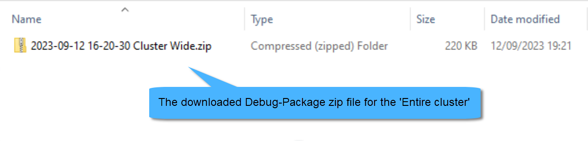
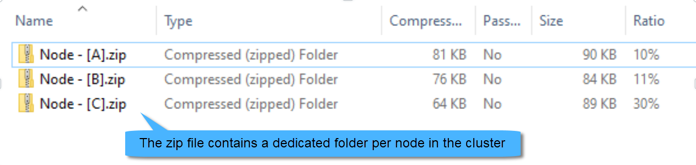

import Admonition from '@theme/Admonition';
import Tabs from '@theme/Tabs';
import TabItem from '@theme/TabItem';
import CodeBlock from '@theme/CodeBlock';
import LanguageSwitcher from "@site/src/components/language-switcher";
import LanguageContent from "@site/src/components/language-content";

# Collecting Information on Incidents for Support

<Admonition type="note" title="Note">

* When encountering incidents or issues with RavenDB, it is essential to gather as much information as possible 
  to help the support team diagnose and resolve the problem effectively.

* Follow the steps in this article for collecting the relevant information for RavenDB support.

* In this page:

  * [Provide incident description](../../server/troubleshooting/collect-info#provide-incident-description)
  * [Create debug package](../../server/troubleshooting/collect-info#create-debug-package)
  * [Enable logs for ongoing issues](../../server/troubleshooting/collect-info#enable-logs-for-ongoing-issues)
  * [Download logs](../../server/troubleshooting/collect-info#download-logs)
  * [Reproduce scenario](../../server/troubleshooting/collect-info#reproduce-scenario)
  * [Create failing test](../../server/troubleshooting/collect-info#create-failing-test)

</Admonition>

## Provide incident description

* __Description__:  
  * Provide a detailed description of the incident you are experiencing.  
  * Include any error messages, warnings, or unexpected behavior you have encountered.

* __Exceptions__:  
  * If applicable, attach the __full-stack exception__ including the error message as plain text.
  * Specify the origin of the exception  
    (e.g. from RavenDB Studio, from the client, from server logs, etc.).

* __Versions__:  
  * Specify the RavenDB Server, Studio, and the client __versions__ that you are using.  

## Create debug package

<Admonition type="note" title="Note">

1. Navigate to __Manage Server &gt; Gather Debug Info__

2. Select the data source(s) to retrieve. It is recommended to check all options.

3. Select all databases or choose specific databases to gather information from.

4. Select whether to create the package for the entire cluster or the current server.

5. Click 'Download'.  
   A zip file containing the debug package will be downloaded.

</Admonition>

<Admonition type="info" title="Info">

__If the Studio is unavailable__:

* Try to download the debug package by issuing an HTTP GET request to the following endpoint:  
  `{SERVER_URL}/admin/debug/info-package`.

* Execute this request for each node in the cluster, replacing `{SERVER_URL}` with the relevant node's URL.

</Admonition>

<Admonition type="note" title="Note">

__Before sending the debug package zip file__, perform the following checks:  

  * Verify that the zip file can be successfully extracted.
  * Verify that the content is similar to the following sample images.

</Admonition>

## Enable logs for ongoing issues

If the issue you encounter is still __ongoing__,  
then enable the following logs (if not enabled yet) before downloading existing log files:  

1. Navigate to __Manage Server &gt; Admin Logs__ and click 'Settings'.

2. __Server logs - Log Mode__:  
   * Set the RavenDB server logs level to 'Information'.  

3. __Traffic Watch log__:  
   * Click 'Configure' to enable Traffic Watch logging to the server logs.  
   * Keep the default values shown in the popup dialog.  

4. __Microsoft logs__:  
   * This is an advanced option, set it only if requested by the support team.
   * Click 'Configure' to enable the logging of Microsoft logs to the server logs.
   * Use the following suggested log configuration: 

<TabItem value="something" label="json">
<CodeBlock language="json">
{`\{
   "Microsoft.AspNetCore":"Debug"
   // Available levels: Trace, Debug, Information, Warning, Error, Critical, None 
\}
`}
</CodeBlock>
</TabItem>

<Admonition type="warning" title="Warning">

* Be aware that all logs settings will reset to their default values after a server restart.  

* To maintain a specific setting after a server restart, set the following configuration keys  
  in your [default configuration](../../server/configuration/configuration-options):
  * Server logs - set [Logs.Mode](../../server/configuration/logs-configuration#logs.mode)
  * Microsoft logs - set [Logs.Microsoft.Disable](../../server/configuration/logs-configuration#logs.microsoft.disable)
  * Traffic Watch log - set [TrafficWatch.Mode](../../server/configuration/traffic-watch-configuration#trafficwatch.mode)

</Admonition>

## Download logs

Perform the following for each node in your cluster:

<Admonition type="note" title="Note">

1. Navigate to __Manage Server &gt; Admin Logs__ and click 'Download Logs'.

2. Either check 'Use minimum' to retrieve logs information from the time the server was started,  
   or enter a specific (local) time.

3. Either check 'Use maximum' to retrieve logs information up to the current time,  
   or enter a specific (local) time.

4. Click 'Download'.  
   A zip file containing the logs will be downloaded.

</Admonition>

<Admonition type="info" title="Info">

__If the Studio is unavailable__, or if the logs downloaded via the Studio appear problematic,  
then copy the log files directly from the disk to another location to ensure that you keep them,  
avoiding potential loss due to the retention configuration.

* The location of the log files is determined by the [Logs.Path](../../server/configuration/logs-configuration#logs.path) configuration.

* Logs deletion time is controlled by the following configurations:
  * [Retention time in hours](../../server/configuration/logs-configuration#logs.retentiontimeinhrs)
  * [Retention time in megabytes](../../server/configuration/logs-configuration#logs.retentionsizeinmb)

</Admonition> 

<Admonition type="note" title="Note">

__Before sending the log files__, perform the following checks:

* Verify that the zip files can be successfully extracted.  
* Confirm that the logs correspond to the time of the incident.  
* Verify that the content is similar to the following sample images.

</Admonition>

## Reproduce scenario

* If the incident is over and you can reproduce it, then first verify logging level is set to 'Information'.  

* See how to enable the logs in [Enable logs](../../server/troubleshooting/collect-info#enable-logs-for-ongoing-issues).

## Create failing test

* If possible, it is advised to create a unit test that showcases the failure in your client code.

* Refer to [Writing your unit test](../../start/test-driver) to learn how to use __RavenDB's TestDriver__.

