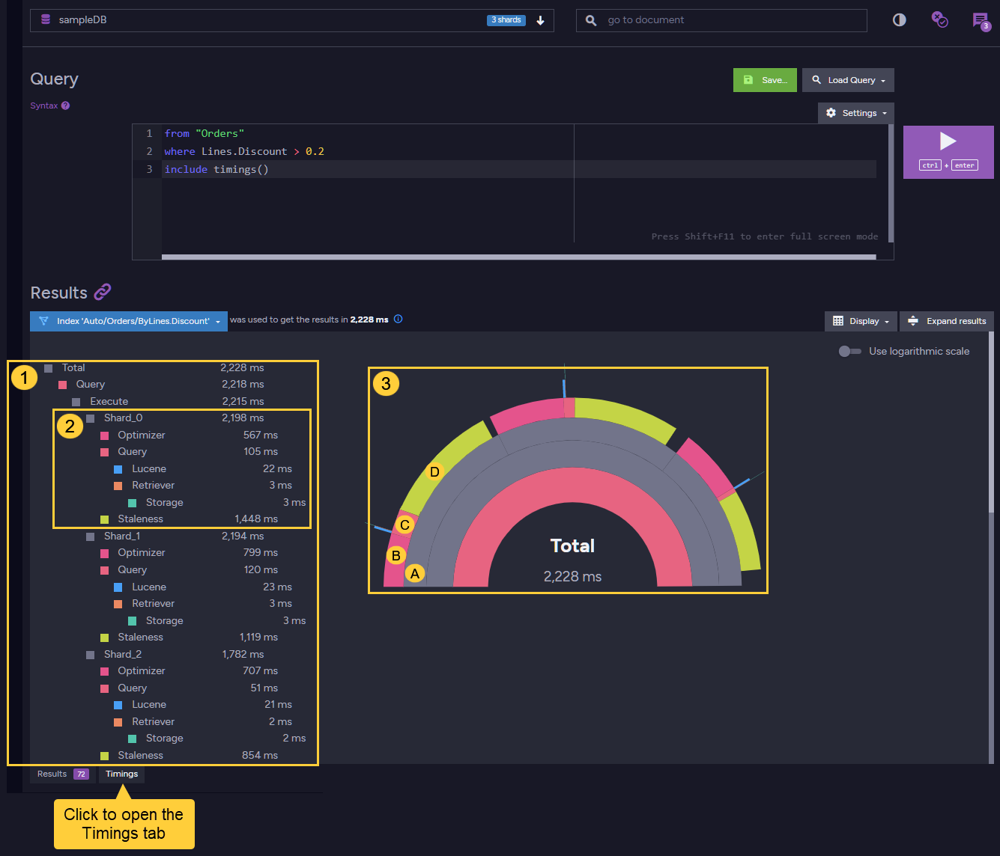

import Admonition from '@theme/Admonition';
import Tabs from '@theme/Tabs';
import TabItem from '@theme/TabItem';
import CodeBlock from '@theme/CodeBlock';
import LanguageSwitcher from "@site/src/components/LanguageSwitcher";
import LanguageContent from "@site/src/components/LanguageContent";
import Panel from "@site/src/components/Panel";
import ContentFrame from "@site/src/components/ContentFrame";

<Admonition type="note" title="">

* A sharded database supports the same querying features as a non-sharded database,  
  so queries written for a non-sharded database can usually be used without modification.
    
* Some querying features are not yet implemented.
  Others, such as [filter](../sharding/querying.mdx#filter), behave a little differently in a sharded database.
  These cases are described below.  

* In this article:  
  * [Querying a sharded database](../sharding/querying.mdx#querying-a-sharded-database)
  * [Querying selected shards](../sharding/querying.mdx#querying-selected-shards)
  * [Including items in a query](../sharding/querying.mdx#including-items-in-a-query)
  * [Paging query results](../sharding/querying.mdx#paging-query-results)
  * [Streaming query results](../sharding/querying.mdx#streaming-query-results)    
  * [Filtering query results](../sharding/querying.mdx#filtering-query-results)
      * [`where`](../sharding/querying.mdx#where)
      * [`filter`](../sharding/querying.mdx#filter)
      * [`where` vs `filter` recommendations](../sharding/querying.mdx#wherevsfilterrecommendations)
  * [Loading a document within a projection](../sharding/querying.mdx#loading-a-document-within-a-projection)  
  * [`order by` and `limit` in a Map-Reduce index query](../sharding/querying.mdx#order-by-and-limit-in-a-map-reduce-index-query)  
  * [Timing queries](../sharding/querying.mdx#timing-queries)
  * [Unsupported querying features](../sharding/querying.mdx#unsupported-querying-features)  
  
</Admonition>

<Panel heading="Querying a sharded database">
    
* From a user's point of view, querying a sharded RavenDB database is similar to querying a non-sharded database:  
  the query syntax is the same, and the results are returned in the same format.

* To allow this, the database performs the following steps when a client sends a query to a sharded database:  
    * The query is received by a RavenDB server that was appointed as an [Orchestrator](../sharding/overview.mdx#client-server-communication).  
      The orchestrator mediates all communication between the client and the database shards.
    * The orchestrator distributes the query to the shards.  
    * Each shard runs the query over its own data, using its own indexes.  
      Once the data is retrieved, the shard transfers it to the orchestrator.
    * The orchestrator combines the data it receives from all shards into a single dataset and may perform additional operations on it.
      For example, when querying a [Map-Reduce index](../sharding/indexing.mdx#map-reduce-indexes-on-a-sharded-database), each shard returns results that were already reduced locally.
      After receiving all shard results, the orchestrator reduces the full dataset once again.    
    * Finally, the orchestrator returns the combined dataset to the client.
    
* The client remains unaware that it communicated with a sharded database.    
  Note, however, that this process is more costly than the simpler retrieval performed by a non-sharded database.    
  Sharding is therefore recommended only when the database has grown to substantial size and complexity.  
  Learn more in [When should sharding be used](../sharding/overview.mdx#when-should-sharding-be-used).   

</Panel>

<Panel heading="Querying selected shards">

* A query is normally executed over all shards. However, you can also query only selected shards.  
  Querying a specific shard directly avoids unnecessary orchestrator requests to other shards.  
  This can be useful, for example, when documents are intentionally stored on the same shard using [Anchoring documents](../sharding/administration/anchoring-documents.mdx).

* **You can query specific shards in either of the following ways**:
  * Using a pre-defined sharding prefix, as explained in: [Querying selected shards by prefix](../sharding/administration/sharding-by-prefix.mdx#querying-selected-shards-by-prefix).
  * Using a document ID, as explained below.
    
* To query specific shards using a document ID, use method `ShardContext` together with `ByDocumentId` or `ByDocumentIds`.
  RavenDB passes the document ID provided in the _ByDocumentId/s_ methods to a hashing algorithm, which determines the bucket ID and therefore the shard to query.  
  Learn about the hashing method and bucket population in [How documents are distributed among shards](../sharding/overview.mdx#how-documents-are-distributed-among-shards).  

* The document ID parameter is not required to be one of the documents you are querying for;  
  it is used only to determine the target shard to query. See the following examples:  

<Admonition type="note" title="">

**Query a selected shard**:  

Query only the shard containing document `companies/1`:

<Tabs groupId='languageSyntax'>
<TabItem value="Query" label="Query">
```csharp
// Query for 'User' documents from a specific shard:
// =================================================
var userDocuments = session.Query<User>()
     // Call 'ShardContext' to select which shard to query
     // RavenDB will query only the shard containing document "companies/1"
    .Customize(x => x.ShardContext(s => s.ByDocumentId("companies/1")))
     // The query predicate
    .Where(x => x.Name == "Joe")
    .ToList();

// Variable 'userDocuments' will include all documents of type 'User'
// that match the query predicate and reside on the shard containing document 'companies/1'.

// Query for ALL documents from a specific shard:
// ==============================================
var allDocuments = session.Query<object>() // query with <object>
    .Customize(x => x.ShardContext(s => s.ByDocumentId("companies/1")))
    .ToList();

// Variable 'allDocuments' will include ALL documents
// that reside on the shard containing document 'companies/1'.
```
</TabItem>
<TabItem value="Query_async" label="Query_async">
```csharp
// Query for 'User' documents from a specific shard:
// =================================================
var userDocuments = await asyncSession.Query<User>()
     // Call 'ShardContext' to select which shard to query
    .Customize(x => x.ShardContext(s => s.ByDocumentId("companies/1")))
     // The query predicate
    .Where(x => x.Name == "Joe")
    .ToListAsync();

// Query for ALL documents from a specific shard:
// ==============================================
var allDocuments = await asyncSession.Query<object>()
    .Customize(x => x.ShardContext(s => s.ByDocumentId("companies/1")))
    .ToListAsync();
```
</TabItem>
<TabItem value="DocumentQuery" label="DocumentQuery">
```csharp
// Query for 'User' documents from a specific shard:
// =================================================
var userDocuments = session.Advanced.DocumentQuery<User>()
    // Call 'ShardContext' to select which shard to query
    .ShardContext(s => s.ByDocumentId("companies/1"))
    // The query predicate
    .Where(x => x.Name == "Joe")
    .ToList();

// Query for ALL documents from a specific shard:
// ==============================================
var allDocuments = session.Advanced.DocumentQuery<object>()
    .ShardContext(s => s.ByDocumentId("companies/1"))
    .ToList();
```
</TabItem>
<TabItem value="DocumentQuery_async" label="DocumentQuery_async">
```csharp
// Query for 'User' documents from a specific shard:
// =================================================
var userDocuments = await asyncSession.Advanced.AsyncDocumentQuery<User>()
    // Call 'ShardContext' to select which shard to query
    .ShardContext(s => s.ByDocumentId("companies/1"))
    // The query predicate
    .WhereEquals(x => x.Name, "Joe")
    .ToListAsync();

// Query for ALL documents from a specific shard:
// ==============================================
var allDocuments = await asyncSession.Advanced.AsyncDocumentQuery<object>()
    .ShardContext(s => s.ByDocumentId("companies/1"))
    .ToListAsync();
```
</TabItem>
<TabItem value="RQL" label="RQL">
```sql
// Query for 'User' documents from a specific shard:
// ================================================
from "Users"
where Name == "Joe"
{ "__shardContext": "companies/1" }

// Query for ALL documents from a specific shard:
// ==============================================
from @all_docs
where Name == "Joe"
{ "__shardContext": "companies/1" }
```
</TabItem>
</Tabs>

</Admonition>
    
<Admonition type="note" title="">

**Query selected shards**:  

Query only the shards containing documents `companies/2` and `companies/3`:  

<Tabs groupId='languageSyntax'>
<TabItem value="Query" label="Query">
```csharp
// Query for 'User' documents from the specified shards:
// =====================================================
var userDocuments = session.Query<User>()
     // Call 'ShardContext' to select which shards to query
     // RavenDB will query only the shards containing documents "companies/2" & "companies/3"
    .Customize(x => x.ShardContext(s => s.ByDocumentIds(new[] { "companies/2", "companies/3" })))
     // The query predicate
    .Where(x => x.Name == "Joe")
    .ToList();

// Variable 'userDocuments' will include all documents of type 'User' that match the query predicate
// and reside on either the shard containing document 'companies/2'
// or the shard containing document 'companies/3'.

// To get ALL documents from the designated shards instead of just 'User' documents,
// query with `session.Query<object>`.
```
</TabItem>
<TabItem value="Query_async" label="Query_async">
```csharp
// Query for 'User' documents from the specified shards:
// =====================================================
var userDocuments = await asyncSession.Query<User>()
     // Call 'ShardContext' to select which shards to query
    .Customize(x => x.ShardContext(s => s.ByDocumentIds(new[] { "companies/2", "companies/3" })))
     // The query predicate
    .Where(x => x.Name == "Joe")
    .ToListAsync();
```
</TabItem>
<TabItem value="DocumentQuery" label="DocumentQuery">
```csharp
// Query for 'User' documents from the specified shards:
// =====================================================
var userDocuments = session.Advanced.DocumentQuery<User>()
     // Call 'ShardContext' to select which shards to query
    .ShardContext(s => s.ByDocumentIds(new[] {"companies/2", "companies/3"}))
     // The query predicate
    .Where(x => x.Name == "Joe")
    .ToList();
```
</TabItem>
<TabItem value="DocumentQuery_async" label="DocumentQuery_async">
```csharp
// Query for 'User' documents from the specified shards:
// =====================================================
var userDocuments = await asyncSession.Advanced.AsyncDocumentQuery<User>()
     // Call 'ShardContext' to select which shards to query
    .ShardContext(s => s.ByDocumentIds(new[] {"companies/2", "companies/3"}))
     // The query predicate
    .WhereEquals(x => x.Name, "Joe")
    .ToListAsync();
```
</TabItem>
<TabItem value="RQL" label="RQL">
```sql
// Query for 'User' documents from the specified shards:
// =====================================================
from "Users"
where Name == "Joe"
{ "__shardContext" : ["companies/2", "companies/3"] }

// Query for ALL documents from the specified shards:
// ==================================================
from @all_docs
where Name == "Joe"
{ "__shardContext" : ["companies/2", "companies/3"] }
```
</TabItem>
</Tabs>

</Admonition>

</Panel>

<Panel heading="Including items in a query">

* [Including items](../client-api/how-to/handle-document-relationships.mdx#includes) in a query will work even if the included item resides on another shard.
    
* If the requested item is not located on the queried shard, the orchestrator will fetch it from the shard where it is located.
  Note that this process incurs an additional request to the shard that hosts the included item.
    
* Although includes are supported in regular sharded queries,  
  they are **not** supported when query results are **streamed**.  
  Learn more in [Streaming query results](../sharding/querying.mdx#streaming-query-results).

</Panel>

<Panel heading="Paging query results"> 

From the client's point of view, [paging](../indexes/querying/paging.mdx) is performed similarly in sharded and non-sharded databases,  
and the same API is used to define page size and retrieve selected pages.

Under the hood, however, paging in a sharded database involves additional overhead because the orchestrator must retrieve the relevant results
from each shard and sort them before returning the requested page to the client.    

For example, let's compare what happens when the `8th` page is loaded (with a page size of `100`) from a non-sharded and a sharded database:  

<Tabs groupId='languageSyntax'>
<TabItem value="Query" label="Query">
```csharp
IList<Product> results = session
    .Query<Product, Products_ByUnitsInStock>()
    .Statistics(out QueryStatistics stats) // fill query statistics
    .Where(x => x.UnitsInStock > 10)
    .Skip(700) // skip the first 7 pages (700 results)
    .Take(100) // get pages 701-800
    .ToList();

long totalResults = stats.TotalResults;
```
</TabItem>
<TabItem value="DocumentQuery" label="DocumentQuery">
```csharp
IList<Product> results = session
    .Advanced
    .DocumentQuery<Product, Products_ByUnitsInStock>()
    .Statistics(out QueryStatistics stats) // fill query statistics
    .WhereGreaterThan(x => x.UnitsInStock, 10)
    .Skip(700) // skip the first 7 pages (700 results)
    .Take(100) // get pages 701-800
    .ToList();

long totalResults = stats.TotalResults;
```
</TabItem>
<TabItem value="Index" label="Index">
```csharp
public class Products_ByUnitsInStock : AbstractIndexCreationTask<Product>
{
    public Products_ByUnitsInStock()
    {
        Map = products => from product in products
                          select new
                          {
                              UnitsInStock = product.UnitsInStock
                          };
    }
}
```
</TabItem>
</Tabs>

* When the database is **Not sharded** the server would:  
  * Skip the first 7 pages.  
  * Return page 8 to the client (results 701 to 800).

* When the database is **Sharded** the orchestrator would:  
  * Retrieve 8 pages (sorted by modification order) from each shard.  
  * Sort the retrieved results (in a 3-shard database, for example, the orchestrator would sort up to 2400 results).  
  * Skip the first 7 pages in the merged result set.  
  * Hand page 8 to the client (results 701 to 800).

<Admonition type="note" title="">
The shards sort the reults by modification order before sending them to the orchestrator.  
For example, if a shard needs to send 800 results to the orchestrator,
the first result will be the most recently modified document, and the last result will be the ealiest document modified.
</Admonition>

</Panel>

<Panel heading="Streaming query results">    

[Streaming query results](../client-api/session/querying/how-to-stream-query-results.mdx#stream-an-index-query) is supported in a sharded database for both **Map** index queries and **Map-Reduce** index queries.  
Both static index queries and dynamic queries (auto-indexes) are supported.

---    
    
### How streaming Map-Reduce results in a sharded database work:
    
  * The orchestrator sends the query to all shards.
  * The shard results are streamed in `reduce-key` order from each shard.  
    (The `reduce-key` is the field specified in the _group by_ clause).  
  * The orchestrator merges the shard streams by _reduce-key_.
  * Results that belong to the same _reduce-key_ are collected and re-reduced on the orchestrator.
  * If the query uses `filter`, the filter is applied to the final reduced result.
  * If the query projects the results, the projection is applied before the result is streamed to the client.
    
---    
    
### Limitations when streaming query results in a sharded database:
    
  * When streaming query results in a sharded database, `include` and `load` are not supported.  
    Attempting to use them will throw a _NotSupportedInShardingException_.
    
    <Tabs groupId='languageSyntax'>
    <TabItem value="Dynamic_query_with_include" label="Dynamic_query_with_include">
    ```csharp
    // Define a query that 'includes' a related document in the results
    IRawDocumentQuery<Order> query = session.Advanced.RawQuery<Order>(@"
        from 'Orders' as o
        include o.Company
    ");
    
    // Stream the query results
    // This will throw NotSupportedInShardingException
    // 'include' is not supported when streaming a sharded query
    using (IEnumerator<StreamResult<Order>> stream = session.Advanced.Stream(query))
    {
        while (stream.MoveNext())
        {
            StreamResult<Order> result = stream.Current;
            // Process result...
        }
    }
    ```
    </TabItem>
    <TabItem value="Dynamic_query_with_load" label="Dynamic_query_with_load">
    ```csharp
    // Define a query with 'load' that retrieves data from a related document
    IRawDocumentQuery<Order> query = session.Advanced.RawQuery<Order>(@"
        from 'Orders' as o
        load o.Company as c
        select { Company : c.Name }
    ");
    
    // Stream the query results
    // This will throw NotSupportedInShardingException
    // 'load' is not supported when streaming a sharded query
    using (IEnumerator<StreamResult<Order>> stream = session.Advanced.Stream(query))
    {
        while (stream.MoveNext())
        {
            StreamResult<Order> result = stream.Current;
            // Process result...
        }
    }
    ```
    </TabItem>
    </Tabs>
    
  * When streaming **Map-Reduce** results in a sharded database, `order by` is **supported only on the _reduce-key_ fields**.  
    If _order by_ uses a field that is not part of the _reduce-key_, RavenDB will throw a _NotSupportedInShardingException_.  
    For example, if the query groups by _Company_, then ordering by _Company_ is supported, but ordering by a computed aggregation field such as _Count_, _Total_, or _Sum_ is not supported.   
    
    <Tabs groupId='languageSyntax'>
    <TabItem value="Supported_query" label="Supported_query">
    ```csharp
    // SUPPORTED: order by the reduce-key field 'Company'
    // ==================================================
        
    IRawDocumentQuery<OrdersByCompany.IndexEntry> query1 = session.Advanced
        .RawQuery<OrdersByCompany.IndexEntry>(@"
            from index 'OrdersByCompany'
            order by Company    
        ");
    
    using (IEnumerator<StreamResult<OrdersByCompany.IndexEntry>> stream =
           session.Advanced.Stream(query1))
    {
        while (stream.MoveNext())
        {
            StreamResult<OrdersByCompany.IndexEntry> result = stream.Current;
            // Process result...
        }
    }
    ```
    </TabItem>
    <TabItem value="Not_supported_query" label="Not_supported_query">
    ```csharp
    // NOT SUPPORTED: order by the aggregation field 'Total'
    // ====================================================
        
    // This will throw NotSupportedInShardingException
    // 'order by' in a Map-Reduce streaming query must use a reduce-key field
    IRawDocumentQuery<OrdersByCompany.IndexEntry> query2 = session.Advanced
        .RawQuery<OrdersByCompany.IndexEntry>(@"
            from index 'OrdersByCompany'    
            order by Total
        ");
    
    using (IEnumerator<StreamResult<OrdersByCompany.IndexEntry>> stream =
           session.Advanced.Stream(query2))
    {
        while (stream.MoveNext())
        {
            StreamResult<OrdersByCompany.IndexEntry> result = stream.Current;
            // Process result...
        }
    }                
    ```
    </TabItem>
    <TabItem value="Index_OrdersByComapny" label="Index_OrdersByComapny">
    ```csharp
    // Map-Reduce index definition
    public class OrdersByCompany : AbstractIndexCreationTask<Order, OrdersByCompany.IndexEntry>
    {
        public class IndexEntry
        {
            // The group-by field (the reduce-key)
            public string Company { get; set; }
        
            // Computation fields
            public int Count { get; set; }
            public float Total { get; set; }
        }
    
        public OrdersByCompany()
        {
            Map = orders => from order in orders
                            select new IndexEntry
                            {
                                Company = order.Company,
                                Count = 1,
                                Total = order.Lines.Sum(l => l.PricePerUnit * l.Quantity)
                            };
    
            Reduce = results => from result in results
                                group result by result.Company
                                into g
                                select new IndexEntry
                                {
                                    Company = g.Key,
                                    Count = g.Sum(x => x.Count),
                                    Total = g.Sum(x => x.Total)
                                };
        }
    }
    ```
    </TabItem>
    </Tabs>

</Panel>

<Panel heading="Filtering query results"> 

Data can be filtered using the [where](../sharding/querying.mdx#where) and [filter](../sharding/querying.mdx#filter) keywords on both non-sharded and sharded databases.  
    
However, in a sharded database,  
**when filtering results from a Map-Reduce index query or a dynamic aggregation query**, these commands behave differently.
This is because each shard sees only its own partial results until the shard results are gathered and re-reduced on the orchestrator.
These differences are explained below.    
    
<ContentFrame>

## `where`

[where](../indexes/querying/filtering.mdx#where) is RavenDB's basic filtering command.  
The server uses it to retrieve only items that match the specified conditions.  

* **NON-SHARDED database**:  
  When querying a map-reduce index or a dynamic aggregation query with the `where` condition,  
  the filtering is applied to the **entire** database.
    
      For example, to find only the most successful products, you can run a query such as:
    
      <TabItem>
      ```sql
      // Query a Map-Reduce index, filter on the computed field 'TotalSales'
      // Retrieve only products that were sold at least 5000 times    
      from index 'Products/Sales'
      where TotalSales >= 5000
      ```
      </TabItem>

* **SHARDED database**:  
  When querying a map-reduce index or a dynamic aggregation query with the `where` condition,  
  the filtering is applied **per-shard**, on each shard's local data.

      This creates the following problem:
      * Each shard evaluates the `where` condition using only the data stored on that shard.  
      * If a product was sold 4000 times on each shard, the query shown above will filter it out 
        on every shard — even though its total sales across the database far exceed 5000.
      * To address this, use the [filter](../sharding/querying.mdx#filter) keyword instead,  
        whose behavior on sharded databases is designed for exactly this case.  
      * Note: using `where` does **not** cause this problem when filtering on a `GroupBy` field (the reduce-key),  
        and is actually the recommended approach in that case.  
        Learn more in [`where` vs `filter` recommendations](../sharding/querying.mdx#wherevsfilterrecommendations) below.
    
</ContentFrame>  
    
<ContentFrame>
    
## `filter`

The [filter](../indexes/querying/exploration-queries.mdx#filter) command scans data that has already been retrieved from the database by the server  
before the results are sent to the client.

* **NON-SHARDED database**:  
  When a query includes a `filter` clause, it is mainly used as an [exploration query](../indexes/querying/exploration-queries.mdx):
  an additional filtering layer that scans the entire retrieved dataset without creating an index that would then need to be maintained.

    Exploration queries are typically one-time operations and should be used cautiously,  
    because scanning the entire retrieved dataset may consume significant resources.

* **SHARDED database**:  
  The behavior of `filter` on a sharded database depends on whether the query is a Map-Reduce query  
  (a static Map-Reduce index query or a dynamic `group by` query) or not.

   * **Non-Map-Reduce queries** (static map index or dynamic auto-map query):  
     The query is sent to each shard as-is, and each shard applies the `filter` clause locally to its own results.  
     This is the same behavior as on a non-sharded database.

   * **Map-Reduce queries**:  
     * The `filter` clause is **omitted** from the query sent to the shards,  
       regardless of which fields the filter references. 
     * All matching data is retrieved from the shards to the orchestrator, gathered, and re-reduced.  
     * The `filter` clause is then executed on the orchestrator over the combined result set.

     For example, the following query will return all products that were sold at least 5000 times,  
     **regardless** of how those sales are distributed across the shards:

     <TabItem>
     ```sql
     // Query a Map-Reduce index, filter on the computed field 'TotalSales'
     // Retrieve only products that were sold at least 5000 times    
     from index 'Products/Sales'
     filter TotalSales >= 5000
     ```
     </TabItem>

     **On the downside**,  
     a large volume of data may be transferred from the shards to the orchestrator and then scanned by the filter condition.
     Applying `where` **before** `filter` can reduce the volume retrieved from the shards (when it makes sense as part of the query).
    
     **On the upside**,  
     this mechanism allows filtering on computed fields after results from all shards have been gathered,  
     as in a non-sharded database.

---
    
#### Summary across all scenarios  
 
| Scenario                                        | filter behavior   |
| ----------------------------------------------- | ----------------- |
| **Non-sharded database**<br/>(All query types)  | The `filter` clause is applied on the server after the data has been retrieved from the database, before the results are sent to the client. |
| **Sharded database**<br/>(Non-Map-Reduce query) | The query is sent to each shard as-is,<br/>and each shard applies the `filter` clause locally to its own results. |
| **Sharded database**<br/>(Map-Reduce query)     | The `filter` clause is **removed** from the queries sent to the shards.<br/>The shard results are gathered and re-reduced on the orchestrator,<br/>and the `filter` clause is then applied to the combined result set. |
    
</ContentFrame>    
  
<ContentFrame>
    
## `where`&nbsp;vs&nbsp;`filter`&nbsp;recommendations

Because `filter` (unless combined with `where`) can cause RavenDB to retrieve and scan a substantial amount of data,
use `filter` cautiously and restrict its scope whenever possible.

* **Prefer `where` over `filter`** when filtering on a `GroupBy` field (the reduce-key).  
  Each shard already holds the correct value for this field, so filtering can be applied at the shard level without transferring extra data to the orchestrator.

* **Prefer `filter` over `where`** when filtering on a computed aggregation field (e.g., `Sum`, `Count`, `Total`).  
  Only the orchestrator sees the combined totals across shards, so filtering must be applied there to produce correct results.

* **Combine `where` and `filter` when possible**.  
  Use `where` first to narrow the dataset transferred from the shards, then apply `filter` on the orchestrator.  
  For example:

    <TabItem>
     ```sql
    from index 'Products/Sales'
    where Category = 'categories/7-A' // apply 'where' first to narrow the dataset
    filter TotalSales >= 5000         // then 'filter' on the computed field
    ```
    </TabItem>

* **Set a [limit](../indexes/querying/exploration-queries.mdx#usage) on `filter` when possible** to bound how much data the orchestrator scans.    

</ContentFrame>    
    
</Panel>

<Panel heading="Loading a document within a projection">

In a sharded database, loading a document inside a projection is **not supported** in queries against a Map-Reduce index or in dynamic aggregation (`group by`) queries. 
Attempting to do so throws a `NotSupportedInShardingException`.

Loading inside a projection **is supported** for [collection queries](../querying/overview.mdx#3-query-a-collection---query-full-collection--query-by-id) and for Map index queries,  
provided that the loaded document resides on the same shard the document being projected.

| Projection Type                              | Can Load | Condition                                         |
|----------------------------------------------|----------|---------------------------------------------------|
| Collection query projection                  | ✅ Yes   | The loaded document must reside on the same shard |
| Map index projection                         | ✅ Yes   | The loaded document must reside on the same shard |
| Map-Reduce index projection                  | ❌ No    | —                                                 |
| Dynamic aggregation (`group by`) projection  | ❌ No    | —                                                 |

#### Example

Given the following **Map-Reduce index**:

<TabItem>
```csharp
public class Orders_ByCompany : AbstractIndexCreationTask<Order, Orders_ByCompany.IndexEntry>
{
    public class IndexEntry
    {
        public string Company { get; set; }
        public int Count { get; set; }
        public float Total { get; set; }
    }

    public Orders_ByCompany()
    {
        Map = orders => from order in orders
                        select new IndexEntry
                        {
                            Company = order.Company,
                            Count = 1,
                            Total = order.Lines.Sum(l => (l.Quantity * l.PricePerUnit) * (1 - l.Discount))
                        };

        Reduce = results => from result in results
                            group result by result.Company
                            into g
                            select new IndexEntry
                            {
                                Company = g.Key,
                                Count = g.Sum(x => x.Count),
                                Total = g.Sum(x => x.Total)
                            };
    }
}
```
</TabItem>

The following query projects the _CompanyName_ field from the loaded _Company_ document.  
On a sharded database, this query will throw `NotSupportedInShardingException`.

<TabItem>
```sql
// On a sharded database, this query throws a `NotSupportedInShardingException`    
from index 'Orders/ByCompany'
load Company as c
select { 
    CompanyName: c.Name,
    Count: Count 
}
```
</TabItem>

</Panel>

<Panel heading="order by and limit in a Map-Reduce index query">

When a **Map-Reduce** index is queried in a sharded database, each shard first returns its locally reduced results to the orchestrator, 
which then merges and re-reduces them to produce the final result set.  
    
Because of this two-stage process, `order by` and `limit` may behave differently than they do in a non-sharded database.
This depends on whether `limit` is used, and on which field `order by` is applied to.      

The following rules apply to **Map-Reduce** queries only - both static Map-Reduce index queries and dynamic auto-Map-Reduce (`group by`) queries.  
    
For Map index queries, `order by` and `limit` behave as they do on a non-sharded database.    

---
    
The examples below use this Map-Reduce index:

<TabItem>
```csharp
public class Users_ByCity : AbstractIndexCreationTask<User, Users_ByCity.IndexEntry>
{
    public class IndexEntry
    {
        // The Group-by field (reduce key)
        public string City { get; set; }
    
        // The computed field
        public int Sum { get; set; }
    }

    public Users_ByCity()
    {
        Map = users => from user in users
                       select new IndexEntry
                       {
                           City = user.City,
                           Sum = 1
                       };

        Reduce = results => from result in results
                            group result by result.City
                            into g
                            select new IndexEntry
                            {
                                City = g.Key,
                                Sum = g.Sum(x => x.Sum)
                            };
    }
}
```
</TabItem>
    
<ContentFrame>    

### `order by` &nbsp; without &nbsp; `limit`
    
---    

When the query orders the results but does not limit their number,    
ALL matching results are retrieved from all shards, just as in a non-sharded database.

<Tabs groupId='languageSyntax'>  
<TabItem value="Query" label="Query">
```csharp
var queryResult = session.Query<Users_ByCity.IndexEntry, Users_ByCity>()
    .OrderBy(x => x.City)
    .ToList();
```
</TabItem>
<TabItem value="RQL" label="RQL">
```sql
from index "Users/ByCity"
order by City
```
</TabItem>   
</Tabs>    

</ContentFrame>
    
<ContentFrame>
    
### `limit` &nbsp; without &nbsp; `OrderBy`
    
---    
    
When the query uses `limit` but does not specify `order by`, 
the orchestrator internally **adds an `order by`** on the `group by` fields (the reduce-key fields, `City` in this example) before sending the query to the shards.  
    
This is done because applying a limit without a consistent ordering can otherwise return incorrect results in a sharded Map-Reduce query.
    
When paging (using `skip`), the orchestrator adjusts the limit sent to each shard to `skip + take`. 
    
<Tabs groupId='languageSyntax'>  
<TabItem value="Query" label="Query">
```csharp
var queryResult = session.Query<Users_ByCity.IndexEntry, Users_ByCity>()
    .Take(5)
    .ToList();
```
</TabItem>
<TabItem value="RQL" label="RQL">
```sql
from index "Users/ByCity"
limit 5
```
</TabItem>   
</Tabs>

</ContentFrame>
    
<ContentFrame>
    
### `limit` &nbsp; with &nbsp; `OrderBy` &nbsp; on a reduce-key field

---    
    
When `order by` is applied to a `group by` field (the reduce-key field, `City` in this example) AND the query uses `limit`,
the limit is applied on each shard as results are retrieved.
    
Each shard returns at most the requested number of results (the limit) in the requested order,  
and the orchestrator merges them.
    
When paging (using `skip`), the orchestrator adjusts the limit sent to each shard to `skip + take`.    

<Tabs groupId='languageSyntax'>  
<TabItem value="Query" label="Query">
```csharp
var queryResult = session.Query<Users_ByCity.IndexEntry, Users_ByCity>()
    .OrderBy(x => x.City) // order by on the reduce-key field 'City'
    .Take(3) // applied per-shard as results are retrieved
    .ToList();
```
</TabItem>
<TabItem value="RQL" label="RQL">
```sql
from index "Users/ByCity"
order by City
limit 3
```
</TabItem>
</Tabs>    

</ContentFrame>
    
<ContentFrame>
    
### `limit` &nbsp; with &nbsp; `OrderBy` &nbsp; on a non-reduce-key field
    
---    

When `order by` is applied to a computed reduce value (e.g., `Sum`, `Count`, `Total`) rather than to a reduce-key field,  
the limit cannot be applied on each shard because the computed value for any group is known only after results from all shards are merged and re-reduced.  
    
In this case, the query sent to the shards is **rewritten to omit** both `order by` and `limit`.  
ALL matching results are retrieved from all shards, re-reduced, sorted, and only then is the requested page returned.

<Tabs groupId='languageSyntax'>  
<TabItem value="Query" label="Query">
```csharp
var queryResult = session.Query<Users_ByCity.IndexEntry, Users_ByCity>()
    .OrderBy(x => x.Sum) // order by a computed field (not a reduce-key field)
    .Take(3) // applied on the orchestrator after re-reduction
    .ToList();
```
</TabItem>
<TabItem value="RQL" label="RQL">
```sql
from index "Users/ByCity"
order by Sum
limit 3
```
</TabItem>
</Tabs>

</ContentFrame>    

<Admonition type="note" title="">
Retrieving all results from all shards - either because no `limit` is set, or because `limit` is combined with `OrderBy` on a computed field - 
may transfer a large amount of data and increase memory, CPU, and bandwidth usage.
</Admonition>

</Panel>

<Panel heading="Timing queries">    

* The duration of queries and query parts (e.g. optimization or execution time) can be measured using API or Studio.

* In a sharded database, the timings for each part will be provided __per shard__.

* Timing is disabled by default, to avoid the measuring overhead.  
  It can be enabled per query by adding `include timings()` to an RQL query or calling [`Timings()`](../client-api/session/querying/debugging/query-timings.mdx#syntax) 
  in your query code, as explained in [include query timings](../client-api/session/querying/debugging/query-timings.mdx).

* To view the query timings in the Studio, open the [Query View](../studio/database/queries/query-view.mdx),  
  run an RQL query with `include timings()`, and open the __Timings tab__.



1. **Textual view** of query parts and their duration.  
   Point the mouse cursor at captions to display timing properties in the graphical view on the right.  
2. **Per-shard Timings**  
3. **Graphical View**  
   Point the mouse cursor at graph sections to display query parts duration:  
    **A**. Shard #0 overall query time  
    **B**. Shard #0 optimization period  
    **C**. Shard #0 query period  
    **D**. Shard #0 staleness period  

</Panel>

<Panel heading="Unsupported querying features"> 

Querying features that are not supported or not yet implemented in sharded databases include:  

* **Loading a document that resides on another shard**  
  A query can only load a document if it resides on the same shard.  
  Loading a document that resides on a different shard will return _null_ instead of the loaded document.  

* **Querying with a limit is not supported in _patch/delete_ by query operations**  
  Attempting to set a [limit](../client-api/session/querying/what-is-rql.mdx#limit) when executing 
  [PatchByQueryOperation](../client-api/operations/patching/set-based.mdx#sending-a-patch-request) or [DeleteByQueryOperation](../client-api/operations/common/delete-by-query.mdx)  
  will throw a `NotSupportedInShardingException`.  

* **Loading a document within a Map-Reduce projection**  
  Read more about this topic in [Loading a document within a projection](../sharding/querying.mdx#loading-a-document-within-a-projection) above.      
    
* **Ordering streamed Map-Reduce results by _non-reduce-key_ fields**  
  Read more about this topic in [Streaming results](../sharding/querying.mdx#streaming-results) above.
    
* **_Includes_ and _loads_ are not supported in sharded streaming queries**  
  Read more about this topic in [Streaming results](../sharding/querying.mdx#streaming-results) above.
    
* **Querying for similar documents with _MoreLikeThis_**  
  [MoreLikeThis](../client-api/session/querying/how-to-use-morelikethis.mdx) is not supported in a sharded database.
    
* **Highlighting search results**    
  [Highlighting search results](../indexes/querying/highlighting.mdx) is not supported in a sharded database. 
    
* **Intersect queries on the server-side**  
  [Intersection](../indexes/querying/intersection.mdx) is not supported in a sharded database.
    
* **Order by distance**  
  [OrderByDistance](../client-api/session/querying/how-to-make-a-spatial-query.mdx#spatial-sorting) is not supported for map-reduce indexes in sharded databases.  
  Only supported for regular (map) indexes in a sharded database.
    
* **Order by score**   
  [OrderByScore](../indexes/querying/sorting.mdx#ordering-by-score) is not supported in a sharded database.     

</Panel>