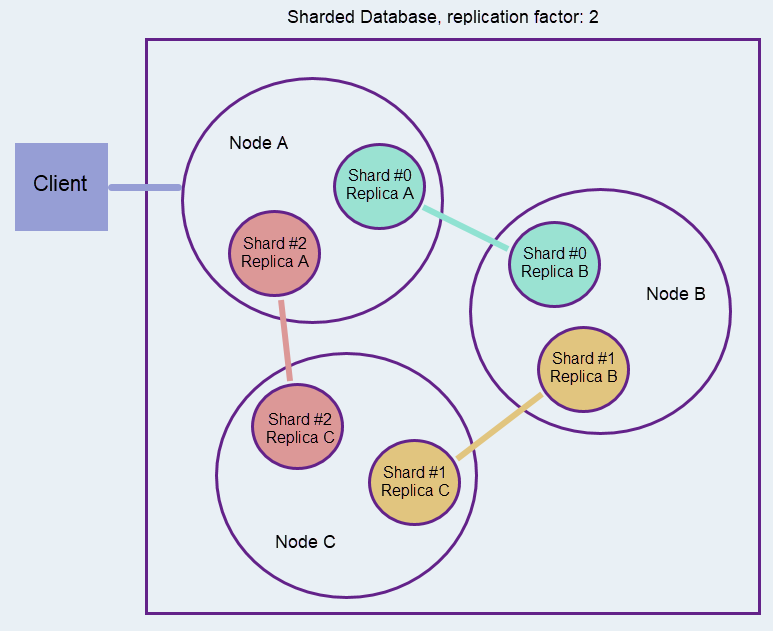

import Admonition from '@theme/Admonition';
import Tabs from '@theme/Tabs';
import TabItem from '@theme/TabItem';
import CodeBlock from '@theme/CodeBlock';
import LanguageSwitcher from "@site/src/components/LanguageSwitcher";
import LanguageContent from "@site/src/components/LanguageContent";

# Sharding: Resharding
<Admonition type="note" title="Note">

* **Resharding** is the relocation of data stored on one [shard](../sharding/overview.mdx#shards) 
  to another shard, to maintain an overall balanced database in which all 
  shards handle about the same volume of data.  
* The resharding process moves all the data related to a certain [bucket](../sharding/overview.mdx#buckets) 
  (including documents, document extensions, tombstones, etc.), to a different 
  shard, and then associates the bucket with the new shard.  
* An even distribution of data and workload between all shards maintains 
  a steadier overall usage of resources like disk space, memory, and bandwidth, 
  improves availability, and eases database management.  
* Resharding can currently be initiated only manually, via Studio.  
  A user can reshard a range of buckets as well as a single bucket.  
* When resharding is initiated, RavenDB implements it gradually, one bucket 
  at a time, to avoid resource overuse.  

* In this page:  
  * [Resharding](../sharding/resharding.mdx#resharding)  
  * [The Resharding Process](../sharding/resharding.mdx#the-resharding-process)  
      * [Following Resharding Progress](../sharding/resharding.mdx#following-resharding-progress)  
      * [Racing](../sharding/resharding.mdx#racing)  
  * [Change Vector on a Sharded Database](../sharding/resharding.mdx#change-vector-on-a-sharded-database)  
  * [Resharding and Other Features](../sharding/resharding.mdx#resharding-and-other-features)  
  * [Executing Resharding](../sharding/resharding.mdx#executing-resharding)  
      * [Bucket Ownership](../sharding/resharding.mdx#bucket-ownership)  

</Admonition>
## Resharding

Over time, data may be distributed unevenly between the database's shards, until 
some shards may host and handle a much bigger portion of the overall load than others.  

Resharding is the process of re-distributing stored data between the shards.  

Keeping about the same amount of data on all shards helps maintain an equal 
level of resource usage and improves the database's overall availability and 
querying speed.  

**Resharding is currently manual**.  
Resharding can currently be initiated manually, via Studio. 
RavenDB provides a comfortable resharding interface and does alert 
its users when disk space and other resources are exhausted, but it 
is up to you to commence the resharding process when it is needed.  

**Resharding is carried out one bucket at a time**.  
The smallest unit that can be resharded is a single bucket with all its contents.  
It is also possible to reshard ranges of buckets, but resharding is always done 
one bucket at a time to keep the process light, avoiding any additional burden to 
shards that may already be preoccupied.  

## The Resharding Process

Let's follow the resharding of a range of buckets from shard #0 to shard #2, 
using a database like the one shown below:  

1. The client requests to reshard buckets from shard `#0` to shard `#2`.  
2. Shard `#0` connects shard `#2` and transfers to it all the content of the first bucket.  
3. Shard `#0` remains the owner of the bucket until all data has been propagated to 
   all shard `#2` [replicas](../sharding/overview.mdx#shard-replication).  
4. The ownership is transferred, the bucket is remapped to shard `#2`.  
5. Shard `#0` starts purging all the entities whose ownership is now held by shard `#2`.  
   If there are still buckets to shift, shard `#0` can start transferring content from the next bucket.  

## Following Resharding Progress

You can follow the progress of the resharding progress using -  

* **Studio Popup Messages**  
  When [Studio is used for resharding](../sharding/resharding.mdx#executing-resharding) 
  the user interface produces popup messages to keep users 
  informed of its progress.  

* **The [Database Record](../studio/database/settings/database-record.mdx)**  
  All sharding-related info is stored in the database record `Sharding` 
  property, where this info can be accessed by all shards.  
  During resharding, migrating buckets details like status, source shard, 
  and destination shard, are updated in related `Sharding` sub-properties.   
   * Via [Studio](../studio/database/settings/database-record.mdx#the-database-record)  
     Open Studio's Database Record view and the Sharding property.   
     The details of currently-migrating buckets are recorded in 
     the `BucketMigration` property.  
     
       **1**. Click to open the Settings  
       **2**. Click to view or edit the database record  

    * Via API  
      To get the database record via API, pass `GetDatabaseRecordOperation` the 
      database name.  
      Open the database record `BucketMigration` property to check migrating buckets 
      status, source and destination shards.  

## Racing

It may happen that a file (like a time series, due to the addition 
of a time series entry) would find its way into a bucket after the 
ownership of this bucket has already been shifted to another shard 
and before RavenDB managed to delete it.  
To handle such occurences, a **periodic documents migrator** task 
routinely checks the system.  
Upon locating a file in a bucket that is already owned by another shard, 
the documents migrator task immediately initiates a new resharding process 
for the related bucket.  

## Change Vector on a Sharded Database

On a non-sharded database, a document's [change vector](../server/clustering/replication/change-vector.mdx) 
indicates both the document's **version** (so we can tell which version of it 
to replicate, for example) and its **order** on the database (so we can tell, 
for example, whether to replicate or skip it).  

On a sharded database, the latter (order) property may turn meaningless, because 
resharding may change the order of documents: an old document may be moved to a shard 
that contains newer documents, and get a change vector newer than theirs.  

To resolve this issue, resharded documents are given an altered change vector 
that explicitly defines both their version and their order, using this format:  
`<order>|<version>`

* E.g. `Users/1 A:3|B:7`  
  In the example above `A:3|B:7` is `Users/1`'s change vector.  
    * `A:3` indicates the document's **order**.  
    * The `|` symbol separates the two parts.  
    * `B:7` inidcates the document's **version**.  

<Admonition type="note" title="Note">
The change vector is altered this way only for documents that have been resharded.  
</Admonition>

## Resharding and Other Features

### Resharding and External Replication

During [external replication](../sharding/external-replication.mdx):  

* The **order** (left-hand) part of the document's change vector 
  is checked on the **source** side, to determine whether the document 
  should be replicated.  
* The **version** (right-hand) part of the document's change vector 
  is checked on the **destination** side, to determine whether this 
  version of the document already resides on it.  
### Resharding and ETL

[ETL tasks](../sharding/etl.mdx) cannot determine whether a document that 
was resharded does or doesn't exist on their target.  
Therefore ETL tasks consider **all** resharded documents (that match the 
transform script) new/modified and transfer them all to the destination.  
### Resharding and Data Subscriptions

Our promise to [data subscription](../sharding/subscriptions.mdx) workers is that we 
send all data **at least once**.  
As in a non-sharded database, we do our best not to send documents twice, but it 
is the responsibility of the worker to check whether a document is duplicated or not.  
### Resharding and Querying

Since documents are stored in their buckets along with all the data 
related to them, including revisions, time series, attachments, and 
so on, resharding a large document's bucket may take a considerable 
amount of time.  
During this time, checking which shard the bucket belongs to 
[may show](../sharding/resharding.mdx#bucket-ownership) 
both the bucket's source and destination shards.  
However, if documents stored in this bucket are [queried](../sharding/querying.mdx) 
during this time, RavenDB will add them to the retrieved dataset 
**only once** and prevent results duplication due to resharding.  

## Executing Resharding

Resharding can currently be initiated only via Studio.  
To reshard selected buckets, open the **Stats** view.

Open the **Buckets Report** view.  

Selecting a range of buckets will present the selected range.  
You can reshard a whole range of buckets, or continue increasing the 
resolution until you present a single bucket and the files it contains.  

Select the shard you want to transfer the bucket/s to and confirm the transfer  

Studio will indicate its progress in resharding the requested 
buckets range using popup messages until the process ends.  

### Bucket Ownership

For a while, as long as there are still entities to transfer to the new 
shard's replicas or delete from the old shard, transferred buckets are 
presented as if they reside on both their old and new shards.  

Eventually, the bucket/s reside on their new shard.  

