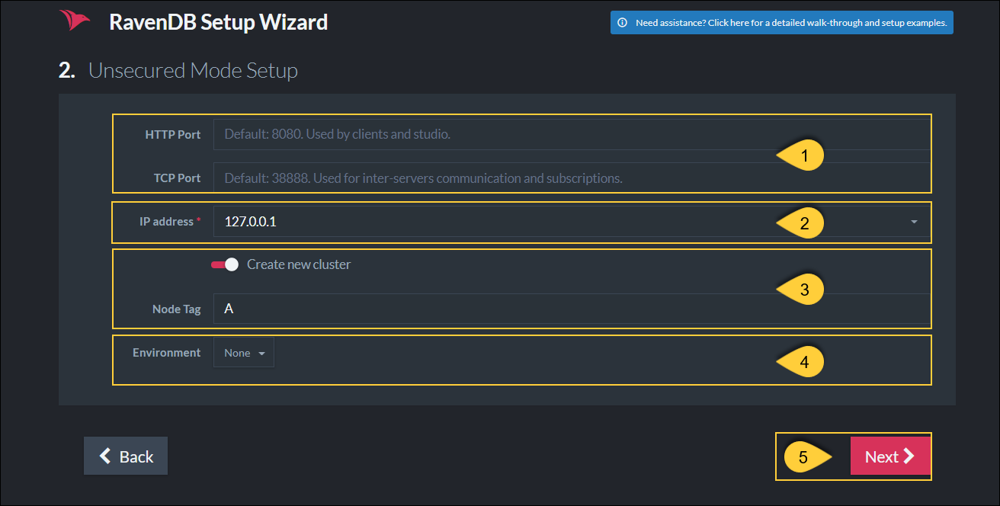

import Admonition from '@theme/Admonition';
import Tabs from '@theme/Tabs';
import TabItem from '@theme/TabItem';
import CodeBlock from '@theme/CodeBlock';
import LanguageSwitcher from "@site/src/components/language-switcher";
import LanguageContent from "@site/src/components/language-content";

# Installation: Setup Wizard Walkthrough

* We want to make it as easy as possible for you to start RavenDB with a valid, trusted server certificate from the beginning. 
  This will ensure that your servers are secure throughout your application lifecycle.  
  
  * Setting up securely will create a development environment that includes security related features such as encryption and client certificates. 
   This way, such features won't be missing when you launch, and there will be less bugs caused by code that needs to be adapted to 
   security features that must be added later.  

* To make the setup process as smooth as possible, we have introduced the **Setup Wizard**,  
  a step-by-step guide to help you configure the desired security level and easily deploy a secure cluster.  

* Using the Setup Wizard you can set up a secure cluster with:  
  * **Let's Encrypt certificate** - Using the Wizard with "Let's Encrypt" will enable RavenDB's automatic certificate renewals. 
  * **Self-obtained certificate** - You are responsible for periodic certificate renewals. 
  * Or choose to continue in an **unsecure mode**.  

* Note: The RavenDB server can also be **set up manually** if choosing not to use the wizard.  
  See [Manual Setup](../../start/installation/manual).  

* Note: this page explains how to follow the Setup Wizard, without going into security concerns details.  
  To learn more about how _Authentication_ and _Authorization_ are implemented with RavenDB, and about _Security_ in general, 
  go to [Security Overview](../../server/security/overview).  

* If you are having trouble using the wizard, or with security in general, please visit the [Security Common Errors & FAQ](../../server/security/common-errors-and-faq) section.

* In this page:
   * [Select Setup Mode](../../start/installation/setup-wizard#select-setup-mode)  
   * [Secure Setup with a Free Let's Encrypt Certificate](../../start/installation/setup-wizard#secure-setup-with-a-free-let)  
      * [Configuring The Server Addresses](../../start/installation/setup-wizard#configuring-the-server-addresses)  
      * [Installing The Certificate](../../start/installation/setup-wizard#installing-the-certificate)  
      * [Setting Up Other Nodes](../../start/installation/setup-wizard#setting-up-other-nodes)  
      * [Next Steps](../../start/installation/setup-wizard#next-steps)
   * [Secure Setup with Your Own Certificate](../../start/installation/setup-wizard#secure-setup-with-your-own-certificate)  
      * [Configuring The Server Addresses](../../start/installation/setup-wizard#configuring-the-server-addresses-1)  
      * [Setting Up Other Nodes](../../start/installation/setup-wizard#setting-up-other-nodes-1)  
      * [Next Steps](../../start/installation/setup-wizard#next-steps)
   * [Unsecure Setup](../../start/installation/setup-wizard#unsecure-setup)  

<Admonition type="info" title="Help Us Improve Prompt" id="help-us-improve-prompt" href="#help-us-improve-prompt">
When you first launch RavenDB, you will see this prompt asking if you'd be willing to 
anonymously share some Studio usage data with us in order to help us improve RavenDB:  

Once you respond to this prompt, it should not appear again. However, in some scenarios, 
such as running RavenDB embedded, or working without browser cookies, the prompt may 
appear again.  

If necessary, you can add this flag to the Studio URL to prevent the prompt from 
appearing:  

`<Studio URL>#dashboard?disableAnalytics=true`

</Admonition>
## Select Setup Mode

When running the RavenDB server for the first time, you will be redirected 
to the setup wizard welcome page where you can choose your preferred option.  

## Secure Setup with a Free Let's Encrypt Certificate

[Let's Encrypt](https://letsencrypt.org/) is a free, automated, and non-profit certificate authority.  
It will generate a certificate for your domain as long as you can prove that you own it.  

During the wizard, RavenDB will give you a free subdomain. This will let you configure the DNS records for 
this subdomain to point to the IP addresses your server will listen to. The subdomain is owned by RavenDB, and you can manage it 
through our [Customer Portal](https://customers.ravendb.net). Login with your license key, and you can add/remove/update DNS 
records for your cluster.

The free subdomain is given to you only for the purpose of proving ownership to Let's Encrypt. If you wish to use your own domain, 
you are welcome to acquire your own certificate and use that instead.

<Admonition type="warning" title="Security consideration and ownership of certificates and domains" id="security-consideration-and-ownership-of-certificates-and-domains" href="#security-consideration-and-ownership-of-certificates-and-domains"> 

The automatic setup is designed to be as convenient and as easy as possible. It takes care of all the details of setting up DNS 
records, generating certificates, and performing their renewals. Because of these requirements, the ownership of the certificates 
and DNS records needs to stay within the Hibernating Rhinos company. This gives us the ability to generate valid certificates and 
modify DNS settings for your registered domains and should be a consideration to keep in mind while reviewing the security of your system.  

Hibernating Rhinos will **never** exploit these abilities and will never perform any modifications to the certificates and DNS 
records unless explicitly requested by the client.

The purpose of this feature is to make it easy for users to get set up and running with a minimum of fuss. We recommend that 
**for actual production deployments** and for the highest level of security and control, you'll 
[use your own certificates and domains](../../start/installation/setup-wizard#secure-setup-with-your-own-certificate), 
avoiding the need to rely on a third party for such a critical part of your security.

</Admonition>

After choosing the Let's Encrypt Secure Setup option, you are required to enter your license key which was sent to the email 
address you provided. This process will associate your license with the chosen subdomain to ensure that valid certificates can 
only be generated by a single license holder.

The next step is to name and claim your subdomain.

### Configuring The Server Addresses

In the next screen, you will choose the IP address and port that your server will bind to.

If you wish to setup a cluster of servers/nodes (for a more stable, robust, and available database), this is the place to add 
nodes to the cluster and choose their IP addresses.

For a smooth setup experience, please **make sure that the IP address and port are available in each machine**. The wizard will 
validate this and throw an error if they are being used. When using port 443, you need to ensure that it hasn't already been 
taken by other applications like Skype, IIS, Apache, etc. On Linux, you might need to [allow port 443 for non-root processes](https://superuser.com/questions/710253/allow-non-root-process-to-bind-to-port-80-and-443).  

For a list of IPs and ports already in use on your machine, run `netstat -a` in the command line.  

**IP addresses and ports may be changed at a later time** by running the setup wizard again which will update the DNS records. 
Another way is to configure the `settings.json` file in each node's server folder.  This process requires you to restart your 
server after configuring.  

### Example I - On one machine

In the following screenshot, we show an example of constructing a cluster for local development on one machine:

All 3 nodes will run on the local machine:

- Node A (https://a.raven.development.run) will listen to 127.0.0.1 on port 8080.
- Node B (https://b.raven.development.run) will listen to 127.0.0.2 on port 8080.
- Node C (https://c.raven.development.run) will listen to 127.0.0.3 on port 8080.

Each node will run in its own process and have its own data directory and [settings.json](../../server/configuration/configuration-options#settings.json) file. 
You should have 3 separate RavenDB node folders.

### Example II - On separate machines for higher availability

Each node will run on its own machine in a network.

A common scenario for running an internal cluster will be:  

- Node A (https://a.raven.development.run) will listen to 10.0.0.84 on port 443.
- Node B (https://b.raven.development.run) will listen to 10.0.0.75 on port 443.
- Node C (https://c.raven.development.run) will listen to 10.0.0.91 on port 443.

You can deploy a cluster that is completely internal to your network and still gain all the benefits of using certificates and SSL with 
full trust and complete support from all the standard tooling. 

<Admonition type="info" title="A cluster of nodes on separate machines" id="a-cluster-of-nodes-on-separate-machines" href="#a-cluster-of-nodes-on-separate-machines"> 
To enable the nodes to communicate between machines, use the 10.0... IP addresses instead of the 127.0...
</Admonition>

### Example III - Behind a firewall

A RavenDB server can run behind a firewall (in cloud environments for example).

RavenDB will bind to the **private** IP address. However, the DNS records must be updated to the **external** IP address which is reachable 
from the outside world. Requests made to the external IP address will be forwarded to the private IP address (which RavenDB listens on).

Check the box "Customize external IP and Ports" and supply the external IP address.  

### Example IV - In a Docker container

In Docker, if you choose to use port mapping with the `-p` flag, You need to check the box "Customize external IP and Ports" 
and supply the external IP address as well as the exposed ports.  

So if a container was created using:

    sudo docker run -t -p 38889:38888 -p 443:8080 ravendb/ravendb

Then the following configuration should be applied:  

### Installing The Certificate

When you click next, the wizard will establish a connection with Let's Encrypt to obtain a valid certificate for the entire cluster. 

It usually takes this process a couple of minutes to complete. The wizard validates that the DNS records updated successfully and that 
the server can run with the supplied addresses and certificate and is reachable using the new domain name.

<Admonition type="warning" title="Caching of Let's Encrypt Certificates" id="caching-of-let-s-encrypt-certificates" href="#caching-of-let-s-encrypt-certificates"> 
In some scenarios you will run the setup wizard again. In that case, if none of the cluster domains changed, the wizard will use the 
cached certificate and not request a new one from Let's Encrypt.
</Admonition>

<Admonition type="info" title="Configuration Failure" id="configuration-failure" href="#configuration-failure">

If the validation fails, you will receive a detailed error. You can go back in the wizard, change the settings and try again.

A [common DNS error](../../server/security/common-errors-and-faq) is that **DNS records didn't yet update** locally.  
Usually, the solution is to wait a few minutes and try again. If you do not want to wait, you can configure your network card 
(just for the setup) to use Google's DNS server (8.8.8.8), to bypass caching of DNS (Domain Name System) records.

Tip:  use dns.google.com to see the DNS record of your domain.

</Admonition>

When finished you will receive a .zip file containing all of the cluster configuration files and certificates.  
Save this .zip file in each of your server folders. It has the security certificate and settings and for each node.  
You may need it in the future, so make sure it is saved in a permanent location.
If you are setting up a cluster, you will use this Zip file to set up the other nodes.

Copy the downloaded `<YourDomainName>.Cluster.Settings.zip` folder into the Cluster Parent folder(s) to use it later. 
It contains the certificate and configurations of the server that you set up in the wizard.  

When you will run the .pfx installation wizard, 
it will set a file path for the certificate in the `settings.json` file.  
**Make sure not to relocate these files after installation** without also changing the `settings.json` because relocating them will 
cause a 'System.InvalidOperationException: Unable to start the server.' error. 
If you must move your folder at a later time, you can [reconfigure the certificate file path](../../server/security/authentication/certificate-configuration#standard-manual-setup-with-certificate-stored-locally) 
in the `settings.json` file.

If you left the "Automatically register the admin client..." box in the IP setup stage checked (it is checked by default), 
a client certificate is registered in the OS trusted store during setup. The Chrome and Edge browsers use the OS store, 
so they will let you choose your certificate right before you are redirected.  

Firefox users will have to manually import the certificate 
to the browser via Tools &gt; Options &gt; Advanced &gt; Certificates &gt; View Certificates.

If you unchecked the box, before you continue, please [register the client certificate](../../server/security/authentication/client-certificate-usage) 
in the OS store or import it to the browser.
### Install client certificate - Run Certificate Import Wizard

A.  Extract the downloaded configuration .zip file `<YourDomainName>.Cluster.Settings.zip` to the parent folder.

B.  Run the `admin.client...pfx` file to start the client certificate import wizard.  Make sure you use the `admin.client...pfx` and not the 
  `cluster.server...pfx`.  
    Unless you want to set a client certificate password or 
    define a different file path, you can use the default settings by clicking **next** every time.  

       

C.  In the main installation wizard on your browser, there should be a screen with a **restart** button.  
     
       

D.  After clicking restart, the wizard checks if you've run the certificate Import Wizard, which you've just done.

       

E.  You should see a window that asks which certificate you want to use.  

       
If you are setting up a only single node, the setup is complete and you can start working on your secure server.  

  
### Setting Up Other Nodes

When you access the Studio (automatically opens when starting a RavenDB server) check that Node A is running by clicking the 
**Manage Server** tab on the left side &gt; select **Cluster**. 
You will see something similar to this:

Nodes B and C are not running yet. As soon as we start them, Node A will detect and add them to the cluster.

**Now, let's bring Node B up.**

1. Extract the downloaded server `RavenDB...zip` folder into the Node B folder.  
2. In **Windows**, start the RavenDB setup wizard using the `run.ps1` script via PowerShell. In **Linux**, use the `start.sh` script.  
3. **Continue the cluster setup for new node**  
   This time we will scroll down and click the "Continue the cluster setup for new node" button to connect other servers to this cluster.  

      

4. If on separate machines, run the `admin.cluster...pfx` file on the new machine to register the certificate in the OS.  
5. **Configuration package**  
   In the Setup Wizard (image below), **Browse** for and select the `<YourDomainName>.Cluster.Settings.zip` file from setup folder.  
6. **Node Tag**  
   Select node tag (B in this case) to designate which node in the cluster this server will be.  
7. Then click **next**.  

      

8. Click **Restart**.  A new tab with the Studio should open in your browser and when you navigate to: Manage Server -&gt; Cluster you should 
   see two green nodes with a green line between them.  
9. Repeat the process for the remaining nodes. When all the nodes are up, you can view the updated topology in the Studio.  

<Admonition type="note" title="A Healthy Cluster" id="a-healthy-cluster" href="#a-healthy-cluster"> 

* All of the nodes in a healthy cluster should be green with green lines between them.  
* If one of the nodes disconnects at any time, the RavenDB studio will show that it is red with a red line showing the disconnect.  

</Admonition> 

You have successfully finished setting up a secure cluster of RavenDB servers using a Let's Encrypt certificate.  
By default, the server certificate will renew automatically because you set up the cluster with Let's Encrypt and RavenDB's Setup Wizard.
  
<Admonition type="info" title="Registering as a service to increase server availability" id="registering-as-a-service-to-increase-server-availability" href="#registering-as-a-service-to-increase-server-availability">

You can now [register the cluster as a service](../../start/installation/running-as-service) in your OS (it will run in the background 
every time your machine starts).

</Admonition>

## Next Steps

Learning how to work with RavenDB correctly with the following resources will make your job easier and save time 
handling technical problems later.  

* **To learn how to fly with RavenDB**, here are a few options:
  * [Demo](https://demo.ravendb.net/) - Step-by-step code walkthrough  
  * [Bootcamp](https://ravendb.net/learn/bootcamp) - Lessons mailed to your inbox 
  * [Documentation Guide](https://ravendb.net/learn/docs-guide) - In addition to this guide and the [First Steps](../../start/installation/setup-wizard#first-steps-from-our-documentation) 
    section below, RavenDB's extensive documentation also has detailed explanations of server related operations, external replication, 
    cloud-based servers, and much more. Navigate to related articles on the left and right sides of your screen.  
  * [Workshops](https://workshops.ravendb.net/winter-2022)
  * [Webinars](https://ravendb.net/learn/webinars)

#### First Steps from our documentation:

* **Importing from Other Databases**
  * [From SQL Databases](../../studio/database/tasks/import-data/import-from-sql)
  * [From NoSQL Databases](../../studio/database/tasks/import-data/import-from-other)
  * [From CSV](../../studio/database/tasks/import-data/import-from-csv)
  * [From RavenDB file](../../studio/database/tasks/import-data/import-data-file) or from a [live RavenDB server](../../studio/database/tasks/import-data/import-from-ravendb)
* [Configure Client Certificates](../../server/security/authentication/certificate-management) to customize security access 
  permissions for each client.  
* [APIs to Integrate With Your Client](../../client-api/what-is-a-document-store) starting with the Document Store.  
* [Studio GUI Overview](../../studio/overview) to learn how the built-in RavenDB studio features can save you time and help you 
  keep things running smoothly.  
* [RavenDB Indexing](../../indexes/indexing-basics) is very sophisticated.  Auto-indexing is default and with agility in mind, it adjusts to changes immediately, 
  but you can set up static indexes manually as well.  
* [Backup Securely](../../studio/database/tasks/backup-task)  
* **Document Extensions**  
  * [Time Series](../../document-extensions/timeseries/overview)  
  * [Attachments](../../document-extensions/attachments/what-are-attachments)  
  * [Counters](../../document-extensions/counters/overview)  

## Secure Setup with Your Own Certificate

In RavenDB, users can provide their own server certificate. The certificate can be issued by a trusted SSL vendor or it can be 
a self-signed certificate. In the latter case, it's the user's responsibility to have the self-signed CA registered in the OS 
stores on all the relevant machines.

RavenDB will accept PFX server certificates which contain the private key, are not expired, and have the following fields:

- KeyUsage: DigitalSignature, KeyEncipherment
- ExtendedKeyUsage: Client Authentication, Server Authentication

If you wish to use the setup wizard to construct a cluster, you must use the same certificate for all nodes. If you wish to use 
a different certificate for each node, it's possible only through [manual setup](../../start/installation/manual). A wildcard 
certificate is probably the easiest way to go. Another option is to issue a certificate which contains all the domains of all the 
cluster nodes as "Subject Alternative Names" (SANs). 

After choosing the Secure Setup with your own certificate option, you are required to upload the certificate and click next. 
In the example, we will use the *.ravendb.example.com wildcard certificate.  

### Configuring The Server Addresses

In the next screen, you will choose the IP address and port that your server will bind to.

If you wish to setup a cluster of servers/nodes (for a more stable, robust, and available database), this is the place to add 
nodes to the cluster and choose their IP addresses.

For a smooth setup experience, please **make sure that the IP addresses and ports are available in each machine**. The wizard 
will validate this and throw an error if they are being used. When using port 443, you need to ensure that it hasn't already 
been taken by other applications like Skype, IIS, Apache, etc. On Linux, you might need to [allow port 443 for non-root processes](https://superuser.com/questions/710253/allow-non-root-process-to-bind-to-port-80-and-443).  
For a list of IPs and ports already in use, run `netstat -a` in the command line.

<Admonition type="warning" title="Important" id="important" href="#important"> 
If you bring your own certificate, you must also take care of the DNS records. If you choose to bind to 127.0.0.1, and provide a 
certificate with CN=my.domain, then the DNS record of my.domain must point to 127.0.0.1.

If you are running behind a firewall, the DNS records must point to the **external** IP address.
</Admonition>

### Example I - On one machine

In the following screenshot, we show an example of constructing a cluster for local development on one machine:

All 3 nodes will run on the local machine:

- Node A (https://a.ravendb.example.com) will listen to 127.0.0.1 on port 8080.
- Node B (https://b.ravendb.example.com) will listen to 127.0.0.2 on port 8080.
- Node C (https://c.ravendb.example.com) will listen to 127.0.0.3 on port 8080.

Each node will run in its own process and have its own data directory and [settings.json](../../server/configuration/configuration-options#settings.json) file. 

### Example II - On separate machines

Each node will run on its own machine in a network.

A common scenario for running an internal cluster will be:  

- Node A (https://a.ravendb.example.com) will listen to 10.0.0.84 on port 443.
- Node B (https://b.ravendb.example.com) will listen to 10.0.0.75 on port 443.
- Node C (https://c.ravendb.example.com) will listen to 10.0.0.91 on port 443.

You can deploy a cluster that is completely internal to your network and still gain all the benefits of using certificates and SSL with 
full trust and complete support from all the standard tooling. 

<Admonition type="info" title="A cluster of nodes on separate machines" id="a-cluster-of-nodes-on-separate-machines" href="#a-cluster-of-nodes-on-separate-machines"> 
To enable the nodes to communicate between machines, use the 10.0... IP addresses instead of the 127.0...
</Admonition>

### Example III - Behind a firewall

A RavenDB server can run behind a firewall (in cloud environments for example).

RavenDB will bind to the **private** IP address. However, the DNS records must be updated to the **external** IP address which is reachable 
from the outside world. Requests made to the external IP address will be forwarded to the private IP address (which RavenDB listens on).

It is your responsibility to update the DNS record of your domain to point to your external IP address.  

### Example IV - In a Docker container

In Docker, if you choose to use port mapping with the -p flag, You need to check the box "Customize external ports" and 
supply the exposed ports.  

It is your responsibility to update the DNS record of your domain to point to your external IP address. 

So if a container was created using:

    sudo docker run -t -p 38889:38888 -p 443:8080 ravendb/ravendb

Then the following configuration should be applied:  

<Admonition type="note" title="Note">

A [common DNS error](../../server/security/common-errors-and-faq) is that **DNS records didn't yet update** locally.  
Usually, the solution is to wait a few minutes and try again. If you do not want to wait, you can configure your network card 
(just for the setup) to use Google's DNS server (8.8.8.8), to bypass caching of DNS (Domain Name System) records.

When finished, you will receive a Zip file containing all of the cluster configuration settings files.  
If you are setting up a cluster, you will use this Zip file to set up each of your nodes.

</Admonition>

### Installing Your Certificate and Setting the File Path

RavenDB will accept `.pfx` server certificates which contain the private key, are not expired, and have the following fields:

**KeyUsage**: DigitalSignature, KeyEncipherment  
**ExtendedKeyUsage**: Client Authentication, Server Authentication

1. Place the `.pfx` file in a permanent location in each server/node folder.  
  <Admonition type="warning" title="Warning">
  If this location changes without adjusting your `settings.json` file, the server won't find the certificate and will not run 
  unless you also reconfigure the settings.json.  
  </Admonition>
2. Run the `.pfx` file and click next each time for default settings, or configure the path and optional certificate password.  
3. At this point, click the "Restart Server" button, and wait until the browser redirects you to the new URL 
  (in the example it's "https://a.ravendb.example.com").
4. If you left the "Automatically register the admin client..." box in the IP setup stage checked (it is checked by default), 
  a client certificate is registered in the OS trusted store during setup. The Chrome and Edge browsers use the OS store, 
  so they will let you choose your certificate right before you are redirected.  
   * Firefox users will have to manually import the certificate to the browser via Tools &gt; Options &gt; Advanced &gt; Certificates &gt; View Certificates.
   * If you unchecked the box, before you continue please [register the client certificate](../../server/security/authentication/client-certificate-usage) 
     in the OS store or import it to the browser.

If you are setting up a single node, the setup is complete and you can start working.  

### Setting Up Other Nodes

When you access the Studio (automatically opens when starting a RavenDB server) check that Node A is running by clicking the 
**Manage Server** tab on the left side &gt; select **Cluster**. 

Nodes B and C are not running yet. As soon as we start them, node A will detect it and add them to the cluster.

**Now, let's bring Node B up.**

1. Extract the downloaded server `RavenDB...zip` folder into the Node B folder.  
2. In **Windows**, start the RavenDB setup wizard using the `run.ps1` script via PowerShell. In **Linux**, use the `start.sh` script.  
3. **Continue the cluster setup for new node**  
   This time we will scroll down and click the "Continue the cluster setup for new node" button to connect other servers to this cluster.  
 
      

4. If on separate machines, run the `admin.cluster...pfx` file on the new machine to register the certificate in the OS.  
5. **Configuration package**  
   In the Setup Wizard (image below), **Browse** for and select the `<YourDomainName>.Cluster.Settings.zip` file from setup folder.  
6. **Node Tag**  
   Select node tag (B in this case) to designate which node in the cluster this server will be.  
7. Then click **next**.  

      
 
8. Click **Restart**.  A new tab with the Studio should open in your browser and when you navigate to: Manage Server -&gt; Cluster you should 
   see two green nodes with a green line between them.  
9. Repeat the process for the remaining nodes. When all the nodes are up, you can view the updated topology in the Studio.  

<Admonition type="note" title="A Healthy Cluster" id="a-healthy-cluster" href="#a-healthy-cluster"> 

* All of the nodes in a healthy cluster should be green with green lines between them.  
* If one of the nodes disconnects at any time, the RavenDB studio will show that it is red with a red line showing the disconnect.  

</Admonition> 

You have successfully finished setting up a secure cluster of RavenDB servers using your own wildcard certificate.

<Admonition type="warning" title="Warning">

You are responsible to periodically renew your server certificate.

</Admonition>  

<Admonition type="info" title="Registering as a service to increase server availability" id="registering-as-a-service-to-increase-server-availability" href="#registering-as-a-service-to-increase-server-availability">

You can now [register the cluster as a service](../../start/installation/running-as-service) in your OS (it will run in the background 
every time your machine starts).

</Admonition>

## Next Steps

Learning how to work with RavenDB correctly with the following resources will make your job easier and save time 
handling technical problems later.  

* **To learn how to fly with RavenDB**, here are a few options:
  * [Demo](https://demo.ravendb.net/) - Step-by-step code walkthrough  
  * [Bootcamp](https://ravendb.net/learn/bootcamp) - Lessons mailed to your inbox 
  * [Documentation Guide](https://ravendb.net/learn/docs-guide) - In addition to this guide and the [First Steps](../../start/installation/setup-wizard#first-steps-from-our-documentation) 
    section below, RavenDB's extensive documentation also has detailed explanations of server related operations, external replication, 
    cloud-based servers, and much more. Navigate to related articles on the left and right sides of your screen.  
  * [Workshops](https://workshops.ravendb.net/winter-2022)
  * [Webinars](https://ravendb.net/learn/webinars)

#### First Steps from our documentation:

* **Importing from Other Databases**
  * [From SQL Databases](../../studio/database/tasks/import-data/import-from-sql)
  * [From NoSQL Databases](../../studio/database/tasks/import-data/import-from-other)
  * [From CSV](../../studio/database/tasks/import-data/import-from-csv)
  * [From RavenDB file](../../studio/database/tasks/import-data/import-data-file) or from a [live RavenDB server](../../studio/database/tasks/import-data/import-from-ravendb)
* [Configure Client Certificates](../../server/security/authentication/certificate-management) to customize security access 
  permissions for each client.  
* [APIs to Integrate With Your Client](../../client-api/what-is-a-document-store) starting with the Document Store.  
* [Studio GUI Overview](../../studio/overview) to learn how the built-in RavenDB studio features can save you time and help you 
  keep things running smoothly.  
* [RavenDB Indexing](../../indexes/indexing-basics) is very sophisticated.  Auto-indexing is default and with agility in mind, it adjusts to changes immediately, 
  but you can set up static indexes manually as well.  
* [Backup Securely](../../studio/database/tasks/backup-task)  
* **Document Extensions**  
  * [Time Series](../../document-extensions/timeseries/overview)  
  * [Attachments](../../document-extensions/attachments/what-are-attachments)  
  * [Counters](../../document-extensions/counters/overview)  

## Unsecure Setup

In the **Unsecure Mode**, all you need to do is specify the **IP address** and **ports** that the server will listen to.  
<Admonition type="danger" title="Danger" id="danger" href="#danger">

* We strongly recommend [setting up securely](../../start/installation/setup-wizard#secure-setup-with-a-free-let) from the 
  start to prevent potential future vulnerability.  The process takes a few minutes and is free.  

* All security features (authentication, authorization and encryption) are **disabled** in the Unsecure Mode.  

* When choosing to listen to an outside network, the RavenDB server does not provide any security since Authentication is off.  

* Anyone who can access the server using the configured IP address will be granted **administrative privileges**.  
</Admonition>

1. **Http Port** - Enter the port that will be used by the clients and the Studio. Default is 8080.  
   **TCP Port** - Enter the port that will be used for inter-server communication and for subscriptions. Default is 38888.  

2. **IP Address**: Enter the server's IP address.  

3. **Create new cluster**  
   * **Checked** - The server will be created within a cluster with the specified Node Tag.  
                   This new cluster will only contain this node.  
   * **Unchecked** - The server will Not be created in a cluster.  
                     The server will be created in a 
                     [Passive State](../../studio/cluster/cluster-view#cluster-nodes-states-&-types-flow) 
                     and can later be added to an already existing cluster.  

4. **Environment**  
   This option only shows when creating a new cluster.  
   Select the label that will be shown in the Studio UI for this server.     
   If you select 'None' now, you can still configure this later from the Studio.  

5. **Next** - Click Next when done configuring.  

      

      Once the configuration is completed, restart the server.  
      After a few seconds, the server will be ready and accessible.  
      Access the Studio by entering the URL in the browser: "http://127.0.0.1:8080" or "http://localhost:8080".  

      

### Continuing The Cluster Setup

To construct a cluster, unzip the downloaded RavenDB package to more machines (or local folders), 
as many as the number of nodes you want.  
In each node, start the RavenDB server and complete the Setup Wizard, entering a different IP address per server.

Once all the servers are up and running, building the cluster is simple.  
Access the studio, go to _Manage Server &gt; Cluster_, and add nodes to the cluster by their URL.  
Learn more in [Adding a Node to a Cluster](../../studio/cluster/setting-a-cluster#add-another-node-to-the-cluster).  

