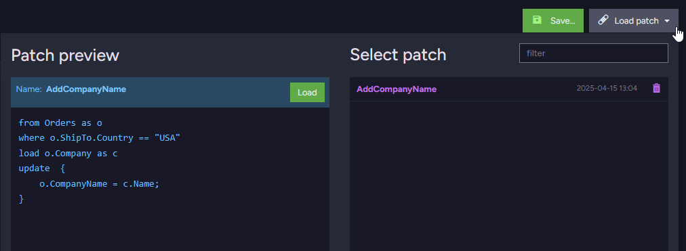
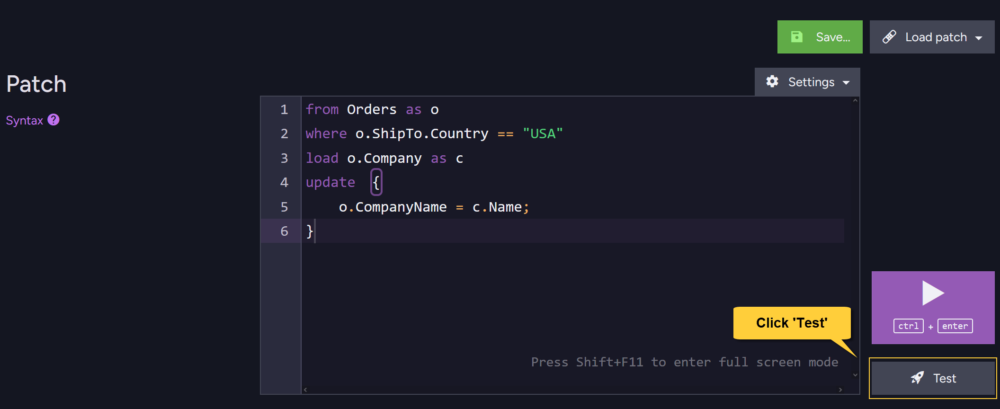

import Admonition from '@theme/Admonition';
import Tabs from '@theme/Tabs';
import TabItem from '@theme/TabItem';
import CodeBlock from '@theme/CodeBlock';
import LanguageSwitcher from "@site/src/components/LanguageSwitcher";
import LanguageContent from "@site/src/components/LanguageContent";

# Patch View
<Admonition type="note" title="Note">

* Patching lets you modify existing documents by applying scripted updates directly on the server,  
  either to a single document or to a set of documents.

* You can apply such updates to multiple documents in a single operation from the **Patch View** in the Studio.

* To perform patching from the Client API, see:
    * [Patching a single document](../../../client-api/operations/patching/single-document.mdx)
    * [Set-based patch operations](../../../client-api/operations/patching/set-based.mdx)
* In this article:  
  * [The patch view](../../../studio/database/documents/patch-view.mdx#the-patch-view)  
  * [The patch script](../../../studio/database/documents/patch-view.mdx#the-patch-script)  
  * [Patch configuration](../../../studio/database/documents/patch-view.mdx#patch-configuration)
  * [Test patch](../../../studio/database/documents/patch-view.mdx#test-patch)
  * [Apply patch](../../../studio/database/documents/patch-view.mdx#apply-patch)  

</Admonition>
## The patch view

1. **Open the patch view**  
   Go to _Documents &gt; Patch_ to open the patch view.
2. **View sample scripts**  
   Click to view sample patch script syntax.  
   More examples are available [here](../../../client-api/operations/patching/set-based.mdx#examples).
3. **Enter the patch script**  
   Enter your [Patch script](../../../studio/database/documents/patch-view.mdx#the-patch-script) in this input box.  
4. **Apply the patch**  
   Click to apply the patch to the documents selected by the query section of the patch script.  
   See [Apply patch](../../../studio/database/documents/patch-view.mdx#apply-patch) below.
5. **Test the patch**  
   Click to test your patch without actually applying it to your documents.  
   See [Test patch](../../../studio/database/documents/patch-view.mdx#test-patch) below.  

## The patch script

* The patch script consists of two parts:
 
  1. **The `query`**:  
  An [RQL](../../../client-api/session/querying/what-is-rql.mdx) query that defines the set of documents to update.  
  Use the same syntax you would use when querying the database or indexes for data retrieval.

  2. **The `update`**:  
  A JavaScript clause that defines the updates to apply to the documents returned by the query.

* When running a patch operation, the server executes the query and applies the specified update to the resulting documents. 

* For example, the following patch script retrieves all documents from the _Orders_ collection where the order is shipped to the _USA_,
  and adds a new field, `CompanyName`, to each order.  
  The value is taken from the related _Company_ document.

<TabItem value="sql" label="sql">
<CodeBlock language="sql">
{`// Update a set of documents from the Orders collection:
// =====================================================

// The RQL part:
from Orders as o
where o.ShipTo.Country == "USA"
load o.Company as c

// The UPDATE part:
update  \{
    o.CompanyName = c.Name;
\}
`}
</CodeBlock>
</TabItem>

## Patch configuration

1. **Save Patch**  
   Click to save the currently displayed patch in the local browser storage.  
   Enter a name and click the _Save_ button again to save the patch.  
     
2. **Load Patch**  
   Click to load a stored patch.  
   Recent (unsaved) patches will also be shown/listed here.  
     
   Hover over a patch name to display its preview.  
   Click the patch name or the preview **Load** button to load the patch.  
3. <a id="patch-settings"/> **Patch Settings**  
     

    * a. **Patch immediately**  
         When this option is selected, clicking the **Apply Patch** button executes the patch immediately.  

    * b. **Define timeout to wait for index to become non-stale**  
         When selected, clicking **Apply Patch** applies the patch 
         only after the index used by the patch has become [non-stale](../../../indexes/indexing-basics.mdx#stale-indexes).  
         If the index remains stale for the duration of the defined timeout, the operation is canceled and an exception is thrown.  
           

    * c. **Don't create a new Auto-Index**  
         * When toggled ON, the patch command will not create an auto-index if there is no existing index that serves the patch.
           In that case, an exception will be thrown.   
         * Toggling this ON will not affect Auto-Index creation in future Studio patch requests.
           To disable all future Auto-Index creation from Studio patches,
           change the default setting in the [Studio Configuration](../../../studio/database/settings/studio-configuration.mdx#disabling-auto-index-creation-on-studio-queries-or-patches).
    
    * d. **Ignore maximum number of steps for script**  
          By default, a patch script can execute up to a maximum number of steps before throwing an exception.  
          This limit is set by the [Patching.MaxStepsForScript](../../../server/configuration/patching-configuration.mdx#patchingmaxstepsforscript) configuration key (default: 10,000).  
          Toggle this option ON to ignore the limit.

    * e. **Limit number of operations**  
         Toggle this option ON to set the maximum number of patch operations per second.  
           

## Test patch

* Before applying the patch to your documents, you can **test the patch script**
  and preview its effect on a selected document, without saving any changes made by the script.  
  This lets you verify that the script behaves as expected before applying it to the actual documents.

* Only the script under the `update` section is executed during testing - the query is ignored.  
  This means you can test the patch using any document, even if it doesn’t match the query defined in the patch script.
Click **Test** to open the "test panel":

  

The **"test panel"** will be displayed:

1. **Document ID**  
   Enter the ID of the document you want to test the patch on, then click **Load Document**.  
   A preview of the original document will show in the 'Before' area on the left.
2. **Before**  
   View the document before the patch is applied.  
3. **Test**  
   Click 'Test' to apply the patch to a copy of the loaded document.  
   The original document remains unchanged.  
   A preview of the patched result will show in the 'After' area on the right.  
4. **After**  
   View the document after the patch has been applied.  
   Note the new `ComapanyName` property that was added to the order document in the result  
   (see line 198 in the 'After' area above).
5. **Done**  
   Click 'Done' to close the "test panel" and return to the patch view.  

## Apply patch

While the patch is executing, a runtime dialog is displayed showing the progress of the operation:

1. **Time Elapsed**  
   Time since the patch operation started.
2. **Index**  
   Either the index that was explicitly used by the patch,  
   or the internal RavenDB index that is used for [collection queries](../../../client-api/faq/what-is-a-collection.mdx#collection-usages).
3. **Processed**  
   Number of documents already processed / Number of documents yet to be processed.
4. **Processing Speed**  
   Number of documents processed per second.
5. **Estimated Time Left**
6. **Query**  
   The patch script currently being executed.
7. **Progress Bar**
8. **Close**  
   Click to **close this dialog**.  
   The operation will proceed in the background.  
   The dialog can be re-opened from the Studio's Notification Center.
9. **Abort**  
   Click to **stop the patch operation**.  
   Any documents already modified before the abort will not be reverted.  
   The operation will stop processing further documents.

