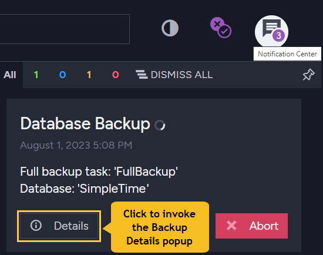

import Admonition from '@theme/Admonition';
import Tabs from '@theme/Tabs';
import TabItem from '@theme/TabItem';
import CodeBlock from '@theme/CodeBlock';
import LanguageSwitcher from "@site/src/components/LanguageSwitcher";
import LanguageContent from "@site/src/components/LanguageContent";

# Backups
<Admonition type="note" title="Note">

* Backups save your data at a specific point in time and allow you to 
  [restore](../../../studio/database/create-new-database/from-backup) 
  your database from that point. Learn more in [Backup Overview](../../../server/ongoing-tasks/backup-overview).  

* This Studio view enables you to create ongoing [periodic backup tasks](../../../studio/database/tasks/backup-task#periodic-backup-creation), 
  as well as one-time 
  [manual backups](../../../studio/database/tasks/backup-task#manually-creating-one-time-backups), for a particular database.  

     It also enables **server-wide backups** which can back up all of the databases on one server/node.  
     See [Studio: Server-Wide Backups](../../../studio/server/server-wide-backup) to learn more.  

* On a [sharded](../../../sharding/overview) database, a single backup task 
  is defined by the user for all shards, and RavenDB automatically defines 
  sub-tasks that create backups per shard.  
  Read about backups on a sharded database [in the section dedicated to it](../../../sharding/backup-and-restore/backup). 

* A backup is _not equivalent_ to replicating your data, as explained below in 
  [Backup -vs- Replication](../../../studio/database/tasks/backup-task#backup-task--vs--replication-task).  

* To check what data different backup types save, see the [backup overview article](../../../server/ongoing-tasks/backup-overview).  

* In this page:  
  * [Backups View](../../../studio/database/tasks/backup-task#backups-view)  
  * [Periodic Backup Creation](../../../studio/database/tasks/backup-task#periodic-backup-creation)  
      * [Scheduling Backups](../../../studio/database/tasks/backup-task#scheduling-backups)  
      * [Retention Policy](../../../studio/database/tasks/backup-task#retention-policy)  
      * [Backup Encryption](../../../studio/database/tasks/backup-task#backup-encryption)  
      * [Destination](../../../studio/database/tasks/backup-task#destination)  
      * [Periodic Backup Details](../../../studio/database/tasks/backup-task#periodic-backup-details)  
  * [Manually Creating One-Time Backups](../../../studio/database/tasks/backup-task#manually-creating-one-time-backups)  
  * [Delaying a Running Backup Task](../../../studio/database/tasks/backup-task#delaying-a-running-backup-task)  
  * [When the Cluster or Node is Down](../../../studio/database/tasks/backup-task#when-the-cluster-or-node-is-down)  
  * [Backup Task -vs- Replication Task](../../../studio/database/tasks/backup-task#backup-task--vs--replication-task)  

</Admonition>
## Backups View

 1. **Go to Studio Backups View**  
    To back up your database or server, click on the **Tasks** tab then **Backups**.  
 2. **Create a Periodic Backup**  
    To schedule [automatic, recurrent backups](../../../studio/database/tasks/backup-task#periodic-backup-creation).  
 3. **Create a Manual Backup**  
    For a [one-time backup](../../../studio/database/tasks/backup-task#manually-creating-one-time-backups).  
 4. **Restore a database from a backup**  
    To [restore a database](../../../studio/database/create-new-database/from-backup) from a previously created backup.
 5. **Go to Server Wide Tasks View** to [back up all of the databases](../../../studio/server/server-wide-backup) on this server.  
 6. **Database Group Topology**  
    You can see all active server-wide and database-specific periodic backups.  

## Periodic Backup Creation

### Periodic Backup Tasks View

 1. **Create a periodic backup task**  
    To schedule [automatic, recurrent backups](../../../studio/database/tasks/backup-task#creating-periodic-backups).  
 2. [View Details of periodic backup](../../../studio/database/tasks/backup-task#periodic-backup-details) tasks  
    * [Backup Now](../../../studio/database/tasks/backup-task#periodic-backup-details) (e.g. before software updates) can be triggered in the 'View Details' interface.
 3. **Edit** this database backup task. To edit server/node-wide backup tasks, see button #5.  
 4. **Delete** this periodic backup task.  
 5. **Go to the server-wide backups view** to [back up all databases on the server](../../../studio/server/server-wide-backup).  
 6. **Database Group Topology**  
    This shows all active server-wide and database-specific periodic backups.  
### Creating Periodic Backups

 1. **Task Name** (Optional)  

  * Choose a name of your choice  
  * If no name is given then the RavenDB server will create one for you based on the defined destination  

 2. **Backup Task Type**:  

  * **Backup**  
     * Backed Up Data: The database data in a JSON format, including documents, indexes (definitions only) & [identities](../../../server/kb/document-identifier-generation#strategy--3) 
     (same as exported database format)  
     * Size of backup data: Smaller  
     * Backup Speed: Faster  
     * Restoring: Slower, Indexes have to be rebuilt from their definitions  
  * **Snapshot**  
     * Backed Up Data: The raw database data including the indexes (definitions and data)
     * Size of backup data: Larger  
     * Backup Speed: Slower  
     * Restoring: Faster, Indexes do not have to be rebuilt  

3. **Preferred Node** (Optional)  

   * Select a preferred mentor node from the [Database Group](../../../studio/database/settings/manage-database-group) to be the responsible node for this Backup Task  
   * If no node is selected, then the cluster will assign a responsible node (see [Members Duties](../../../studio/database/settings/manage-database-group#database-group-topology---members-duties))  
### Scheduling Backups

Select the content to back up. Note: Both incremental and full backups can be scheduled at the same time.  

 1. **Full Backup**  
    Full Backup will back up _all_ the database data every time the task is scheduled to work.  
     A Snapshot can only occur when scheduling 'Full'.  
  
 2. **Incremental Backup**  
    Incremental Backup will only back up the delta (changes made) of the data since the last backup that has occurred.  
    * If _only_ **Incremental Backup** is set, then a **Full Backup** will occur only the _first_ time that the task is triggered,  
    followed by Incremental Backups according to the scheduled time.  
    The Full Backup that is done the first time will be either a 'Backup' or a 'Snapshot', depending on the type selected.  
    * Data that is backed up in **Incremental Backup** is _always_ of type 'Backup' - even if the Backup Task Type is 'Snapshot'.  
    'Backup' types save index definitions, but not the fully built indexes.  

 Schedule the Backup Tasks to occur at regular intervals (daily, monthly, hourly, every minute) at specific times.  

<Admonition type="info" title="Save on data transfer with frequent incremental backups and recover lost data with infrequent full backups" id="save-on-data-transfer-with-frequent-incremental-backups-and-recover-lost-data-with-infrequent-full-backups" href="#save-on-data-transfer-with-frequent-incremental-backups-and-recover-lost-data-with-infrequent-full-backups">

  To save on data transfer costs you can schedule frequent 'incremental' backups, (which save any changes made since the previous backup).  
  
  To ensure that you can **recover lost data**, schedule infrequent 'full' backups.  
  
  Infrequent backups can be useful if a mistake was made and you need access to data from a few days ago.  

  **If downtime while recovering databases is a concern**, you can also set up an [external replica](../../../studio/database/tasks/ongoing-tasks/external-replication-task) and manually fail over to it while you recover the data onto the original cluster.  

</Admonition>  
### Retention Policy

To save storage space, you can set obsolete scheduled backup files to delete automatically after the time period that you define.  
Old backups are deleted after the defined time period during the next scheduled backup.  

 1. Enable / disable the retention policy. If disabled, the backups are stored indefinitely, which may use a lot of storage.  
    **We recommend enabling** it so that the deletion of obsolete backups can be scheduled.  
 2. Select the retention period.  

<Admonition type="info" title="Info">

Some organizations require backups to be stored for as long as 7 years. If this is the case, consider the issue when scheduling and setting the retention policy. 

</Admonition>
### Backup Encryption

Backups can be encrypted.  Make sure that you save the encryption key well.  

 1. Toggle Encrypt to [encrypt the backup](../../../client-api/operations/maintenance/backup/encrypted-backup) files.  
 2. Choose the current encryption key or create a new one for this backup task.  
  - Use the current encryption key. You don't need to set and save a new key with this option.  
  - Create a new encryption key for backups. You can only do this on 'Backup' type backups. 

  

  1. The new encryption key.  Click the 'refresh' arrow to randomly create a different key.
  2. Options to save the key.
  3. Check the box to acknowledge that you've saved the key.
### Destination

Select backup destinations and enter your credentials for each.  
Make sure to save the destinations and credentials information so that your team will be able to restore the database if needed.  

 1. Local machine storage  
   - Set a folder of your choice (any directory that can be accessed from your machine)  
 2. Cloud storage options  
   * [Amazon S3](https://aws.amazon.com/s3/)
     
      * a- **Use a custom S3 host**  
        Toggle to provide a custom server URL.  
      * b- **Force path style**  
        Toggle to change the default S3 bucket [path convention](https://aws.amazon.com/blogs/aws/amazon-s3-path-deprecation-plan-the-rest-of-the-story/) on your custom Amazon S3 host.  
   * [Microsoft Azure](https://azure.microsoft.com/en-us/services/storage/)  
   * [Google Cloud](https://cloud.google.com/)  
   * [Amazon Glacier](https://aws.amazon.com/glacier/)  
   * FTP - Set your FTP protocol & server address  

 More than one destination can be selected at the same time. The backup process will first write the backup to the local path (or to a temporary path if the local path is not specified).  
 
 Once that's done, the backup owner will start uploading the backup to all remote destinations in parallel.  
 
 If any of the remote destinations fail, the entire backup will be considered to have failed.

<Admonition type="info" title="For a resilient data protection strategy" id="for-a-resilient-data-protection-strategy" href="#for-a-resilient-data-protection-strategy">
 
  that protects your databases from natural disasters and theft, we recommend scheduling concurrent backups on a local machine and on the cloud. 
  This strategy is known as [the 3-2-1 Backup Rule](https://en.wikipedia.org/wiki/Backup#3-2-1_rule).  

</Admonition>
### Periodic Backup Details

1. **Backup Task Details**:  

   * **Task Status**  
     Active / Not Active / Not on Node  
   * **Destinations**  
     List of all backup destinations defined  
   * **Last Full Backup**  
     The last time a Full Backup was done 
     (Snapshot / Backup type - depending on task definition)  
   * **Last Incremental Backup**  
     The last time an Incremental Backup was done  
   * **Next Estimated Backup**  
     Time for next backup  
     (Full Backup / Incremental Backup / Snapshot - depending on task definition)  
   * **Retention Policy**  
     Backups older than this period will be deleted during the next backup.  

2. **Backup Now**:  
   In addition to the scheduled time defined, you can backup your data now.  
   This is useful before software updates or any other action where data may be lost.  
   The scheduled backup will still be triggered as defined.  
3. **Refresh**:  
   Click to refresh this panel viewed details  

## Manually Creating One-Time Backups

### Manual Backup Tasks View

 1. Create a one-time [manual backup](../../../studio/database/tasks/backup-task#manually-creating-one-time-backups).  
    This can be vital before upgrading or whenever you want an unscheduled backup.  
 2. Unscheduled backups (e.g. before upgrades) can also be done in the [periodic backup details view](../../../studio/database/tasks/backup-task#periodic-backup-details).  

If you've selected 'manual backup', the following screen will open.

1. **Backup Type**.
    * "Snapshot" saves the entire database and its indexes.
    * "Backup" saves the data, but only index definitions.
2. **Encryption** - See [Backup Encryption](../../../studio/database/tasks/backup-task#backup-encryption).
3. **Destination** for backup to be stored. 

Click **Backup Now** to finish the process.

<Admonition type="note" title="Note">

Manual backups have only some of the properties of periodic backups:  

* The backup can be _full_ or _snapshot_.  
* The backup can be encrypted or not.  
* The backup must have a [destination](../../../studio/database/tasks/backup-task#destination).  

There are also some important differences:  

* Manual backups do not have retention policies.  
  In other words, **they are not set to be automatically deleted**.  
* Manual backups do not have names, they are identified by the time they were created.  
* Manual backups are not scheduled, they occur exactly once: when the **Backup Now** button is pressed.  
* The backup cannot be modified afterward from the Studio, but you can create a new one-time backup whenever you need to.  

</Admonition>

## Delaying a Running Backup Task

The execution of a running backup task can be **delayed** for a given time period.  

* The current execution of the delayed task is cancelled immediately.  
* All scheduled executions of the task during the delay period are cancelled.  
  <Admonition type="note" title="Note">
  Delaying a running backup operation is only available for 
  [periodic backup tasks](../../../studio/database/tasks/backup-task#periodic-backup-creation).  
  A [one-time backup operation](../../../studio/database/tasks/backup-task#manually-creating-one-time-backups) 
  cannot be delayed.  
  </Admonition>
* When the delay period has passed, the backup operation is executed 
  **from scratch**, using no material from the initial delayed run, 
  and its future schedules are enabled.  

Delaying a running backup operation may be useful when, for example, 
backup creation time turns out to be much longer than anticipated, 
system resources are currently limited (e.g. on the cloud), or another 
process currently overuses resources.  
### To delay a running backup task:  

1. Open the notifications center, find the notification regarding the 
   execution of the backup task you want to delay, and click the notification's 
   **Details** button.  

      

2. When the **Backup Details** popup appears, click the **Delay backup** button.  
   
      

3. Select a delay period and confirm.  
   
      

      <Admonition type="info" title="Info">
      Backup tasks can be delayed using this Studio option for a **preset** time period, 
      e.g. an hour or a day.  
      You can also delay tasks for a **custom time period** via code, applying the 
      [DelayBackupOperation](../../../client-api/operations/maintenance/backup/backup#delay-backup-execution) 
      store operation.  
      </Admonition>

## When the Cluster or Node is Down

* **When the cluster is down** (and there is no leader):  

  * Creating a _new_ Ongoing Task is a Cluster-Wide operation,  
    thus, a new Ongoing Backup Task ***cannot*** be scheduled.  

  * If a Backup Task was _already_ defined and active when the cluster went down,  
    then the Backup Task will still ***continue to execute*** on its defined schedule (on its [responsible node](../../../server/clustering/distribution/highly-available-tasks#responsible-node)).  
    But, it will fail to be reported to the cluster and may be run again after the cluster has recovered.  

* **When the responsible node is down**  

  * If the responsible node for the Backup Task is down during the scheduled time,  
    then another node from the Database Group will take ownership of the task so that there are no gaps in your backups.  
  

  
## Backup Task -vs- Replication Task

 * RavenDB's [External Replication](../../../studio/database/tasks/ongoing-tasks/external-replication-task) provides you with an off-site live replica/copy of the data 
   ('live' meaning that any changes in the database will be duplicated into the replica immediately).  
   If one database is down, replicas (other nodes in the cluster) can continue its work, thus greatly improving **availability**.  
   Replication is also quite useful if you need to:  
    * **Shift operations** to a secondary data center  
    * **Share the workload** across more than one server.  

 *  But a replica isn't a backup. It doesn't present good solutions for many **backup scenarios**. For example, backups can:  
    * Protect you from an accidental collection delete  
    * Tell you the state of the system at, say, 9:03 AM last Friday  
    * Protect you from various cyber attacks  

 * A backup keeps an exact state of the database at a specific point in time and can be restored.  
    * A new database can be [created from a Backup](../../../studio/database/create-new-database/from-backup)  
    * This can be done with both 'Backup' & 'Snapshot' types  

